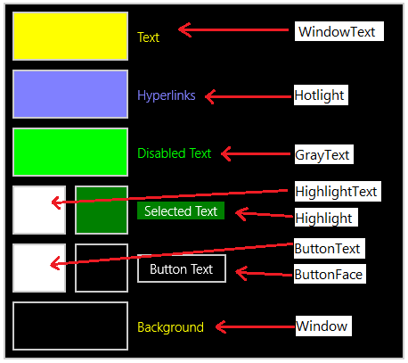

# ハイ コントラスト テーマ  

Windows では、OS やアプリでハイ コントラスト テーマがサポートされていて、必要に応じて有効にすることができます。 ハイ コントラスト テーマは、少ない数のコントラスト カラーで構成されるパレットを使い、インターフェイスを見やすくします。

**図 1:  淡色テーマと黒のハイ コントラスト テーマで表示された電卓。**


ハイ コントラスト テーマに切り替えるには、*[設定]、[簡単操作]、[ハイ コントラスト]* の順に選択します。

> [!NOTE]
> ハイ コントラスト テーマは、淡色テーマおよび濃色テーマとは異なることに注意してください。淡色テーマと濃色テーマのカラー パレットは色の種類が豊富で、ハイ コントラストとは見なされません。 淡色テーマと濃色テーマについて詳しくは、「[色](../style/color.md)」をご覧ください。

コモン コントロールでは、ハイ コントラストが無償で完全にサポートされていますが、UI をカスタマイズする場合は注意する必要があります。 ハイ コントラストに関する最も一般的なバグは、コントロールにインラインで色をハードコーディングすることで生じます。

```xaml
<!-- Don't do this! -->
<Grid Background="#E6E6E6">

<!-- Instead, create BrandedPageBackgroundBrush and do this. -->
<Grid Background="{ThemeResource BrandedPageBackgroundBrush}">
```

最初の例で `#E6E6E6` をインラインで設定すると、グリッドはすべてのテーマでその背景色を保持します。 ユーザーが黒のハイ コントラスト テーマに切り替えたら、彼らはアプリの背景が黒で表示されることを期待します。 `#E6E6E6` はほぼ白一色であるため、ユーザーによってはアプリを操作できない場合があります。

2 番目の例では、[**ResourceDictionary**](https://msdn.microsoft.com/library/windows/apps/BR208794) 要素の専用プロパティである [**ThemeDictionaries**](https://msdn.microsoft.com/library/windows/apps/windows.ui.xaml.resourcedictionary.themedictionaries.aspx) コレクション内の色を参照するために [**{ThemeResource} マークアップ拡張**](../xaml-platform/themeresource-markup-extension.md)を使っています。 ThemeDictionaries により、XAML はユーザーの現在のテーマに基づいて自動的に色を変えることができます。

## テーマ ディクショナリ

システムの既定の色を変更する必要がある場合は、アプリの ThemeDictionaries コレクションを作成します。

1. まず、適切なプラミングを作成します (プラミングがまだない場合)。 App.xaml で、少なくとも **Default** と **HighContrast** を含む ThemeDictionaries コレクションを作成します。
2. Default では、必要な種類の [Brush](http://msdn.microsoft.com/library/windows/apps/xaml/windows.ui.xaml.media.brush.aspx) を作成します。通常は SolidColorBrush です。 このクラスに対して、具体的な使用目的を示す x:Key 名を指定します。
3. 必要な Color を割り当てます。
4. この Brush を HighContrast にコピーします。

``` xaml
<Application.Resources>
    <ResourceDictionary>
        <ResourceDictionary.ThemeDictionaries>
            <!-- Default is a fallback if a more precise theme isn't called
            out below -->
            <ResourceDictionary x:Key="Default">
                <SolidColorBrush x:Key="BrandedPageBackgroundBrush" Color="#E6E6E6" />
            </ResourceDictionary>

            <!-- Optional, Light is used in light theme.
            If included, Default will be used for Dark theme -->
            <ResourceDictionary x:Key="Light">
                <SolidColorBrush x:Key="BrandedPageBackgroundBrush" Color="#E6E6E6" />
            </ResourceDictionary>

            <!-- HighContrast is used in all high contrast themes -->
            <ResourceDictionary x:Key="HighContrast">
                <SolidColorBrush x:Key="BrandedPageBackgroundBrush" Color="#E6E6E6" />
            </ResourceDictionary>
        </ResourceDictionary.ThemeDictionaries>
    </ResourceDictionary>
</Application.Resources>
```

最後に、ハイ コントラストで使用する色を決定します。これについては、次のセクションで説明します。

> [!NOTE]
> HighContrast の他に  HighContrastBlack、HighContrastWhite、HighContrastCustom というキー名も利用可能ですが、 ほとんどの場合、HighContrast だけで十分です。

## ハイ コントラストの色

*[設定]、[簡単操作]、[ハイ コントラスト]* の順に選択すると、既定の 4 つのハイ コントラスト テーマが表示されます。 

**図 2:  ユーザーがオプションを選ぶと、ページにはプレビューが表示されます。**


**図 3:  プレビューに表示される色の見本をクリックすると、その値を変更できます。 また各見本は、XAML のカラー リソースに直接マップされます。**



各 `SystemColor*Color` リソースは、ユーザーがハイ コントラスト テーマに切り替えたときに自動的に色を更新する変数です。 各リソースをいつどこで使用するかについてのガイドラインを以下に示します。

リソース | 用途
-------- | -----
SystemColorWindowTextColor | 本文、見出し、一覧など、操作できないテキスト
SystemColorHotlightColor | ハイパーリンク
SystemColorGrayTextColor | 無効な UI
SystemColorHighlightTextColor | 処理中、選択されている、または現在操作されているテキストや UI の前景色
SystemColorHighlightColor | 処理中、選択されている、または現在操作されているテキストや UI の背景色
SystemColorButtonTextColor | ボタンなど、操作可能な UI の前景色
SystemColorButtonFaceColor | ボタンなど、操作可能な UI の背景色
SystemColorWindowColor | ページ、ウィンドウ、ポップアップ、およびバーの背景
<br/>
既存のアプリ、スタート画面、またはコモン コントロールを確認すると、ハイ コントラストのデザインの参考になります。

**推奨される事項**

* 可能な限り、背景と前景の組み合わせを考慮します。
* アプリの実行中に、4 つのハイ コントラスト テーマをすべてテストします。 ユーザーがテーマを切り替えたときに、アプリを再起動しなくても良いようにします。
* 一貫性を保ちます。

**非推奨**

* `SystemColor*Color` リソースを使って HighContrast テーマの色をハードコーディングしないようにします。
* 見栄えを良くすることを目的としてカラー リソースを選ばないようにします。 カラー リソースはテーマによって変わることに注意してください。
* `SystemColorGrayTextColor` を、セカンダリ テキストの本文やヒント目的の本文に使用しないようにします。


先ほどの例を続けるには、`BrandedPageBackgroundBrush` のリソースを選択する必要があります。 背景に使用されることを名前が示しているため、`SystemColorWindowColor` が最適です。

``` xaml
<Application.Resources>
    <ResourceDictionary>
        <ResourceDictionary.ThemeDictionaries>
            <!-- Default is a fallback if a more precise theme isn't called
            out below -->
            <ResourceDictionary x:Key="Default">
                <SolidColorBrush x:Key="BrandedPageBackgroundBrush" Color="#E6E6E6" />
            </ResourceDictionary>

            <!-- Optional, Light is used in light theme.
            If included, Default will be used for Dark theme -->
            <ResourceDictionary x:Key="Light">
                <SolidColorBrush x:Key="BrandedPageBackgroundBrush" Color="#E6E6E6" />
            </ResourceDictionary>

            <!-- HighContrast is used in all high contrast themes -->
            <ResourceDictionary x:Key="HighContrast">
                <SolidColorBrush x:Key="BrandedPageBackgroundBrush" Color="{ThemeResource SystemColorWindowColor}" />
            </ResourceDictionary>
        </ResourceDictionary.ThemeDictionaries>
    </ResourceDictionary>
</Application.Resources>
```

その後、アプリで背景を設定できます。

```xaml
<Grid Background="{ThemeResource BrandedPageBackgroundBrush}">
```

`{ThemeResource}` は、`SystemColorWindowColor` の参照と `BrandedPageBackgroundBrush` の参照とで、2 回使われることに注意してください。 実行時に正しいテーマを使うためには、両方の参照がアプリに必要です。 ここで、アプリでハイ コントラストの機能をテストすると良いでしょう。 ハイ コントラスト テーマに切り替えると、グリッドの背景が自動的に更新されます。 また、別のハイ コントラスト テーマに切り替えたときにも更新されます。

## 境界線を使う状況

ページ、ウィンドウ、ポップアップ、およびバーでは、ハイ コントラストの背景に `SystemColorWindowColor` を使う必要があります。 UI で重要な境界を維持する必要がある場合、ハイ コントラストのみの境界線を追加します。

**図 4:  ナビゲーション ウィンドウとページはハイ コントラストで同じ背景色を共有するので、 分割するには、ハイ コントラストのみの境界線が不可欠です。**


## リスト項目

ハイ コントラストでは、ポイント、押下、または選択時に [ListView](https://msdn.microsoft.com/library/windows/apps/windows.ui.xaml.controls.listview.aspx) の項目の背景が `SystemColorHighlightColor` に設定されます。 複雑なリスト項目では、項目のポイント、押下、選択時に色の反転に失敗するというバグがよく生じ、 項目が読めなくなってしまいます。

**図 5:  淡色テーマ (左) と黒のハイ コントラスト テーマ (右) の簡単なリスト。 2 番目の項目が選択されています。テキストの色が、ハイ コントラストでは反転されていることに注目してください。**


### テキストに色が付いているリスト項目

問題の原因の 1 つが、ListView の [DataTemplate](https://msdn.microsoft.com/library/windows/apps/windows.ui.xaml.controls.itemscontrol.itemtemplate.aspx) で TextBlock.Foreground を設定することです。 TextBlock.Foreground は一般的に、視覚的な階層を確立するために設定します。 Foreground プロパティは [ListViewItem](https://msdn.microsoft.com/library/windows/apps/windows.ui.xaml.controls.listviewitem.aspx) で設定され、DataTemplate 内の TextBlock は、項目がポイント、押下、または選択されたときに適切な Foreground 色を継承します。 ところが、Foreground を設定すると継承が中断されてしまいます。

**図 6:  淡色テーマ (左) と黒のハイ コントラスト テーマ (右) の複雑なリスト。 ハイ コントラストでは、選択された項目の 2 行目が反転に失敗していることに注目してください。**


この問題を回避するには、ThemeDictionaries コレクションに含まれている Style を使って、条件付きで Foreground を設定します。 Foreground が、HighContrast の SecondaryBodyTextBlockStyle によって設定されていないため、色が正しく反転します。

```xaml
<!-- In App.xaml... -->
<ResourceDictionary.ThemeDictionaries>
    <ResourceDictionary x:Key="Default">
        <Style
            x:Key="SecondaryBodyTextBlockStyle"
            TargetType="TextBlock"
            BasedOn="{StaticResource BodyTextBlockStyle}">
            <Setter Property="Foreground" Value="{StaticResource SystemControlForegroundBaseMediumBrush}" />
        </Style>
    </ResourceDictionary>

    <ResourceDictionary x:Key="Light">
        <Style
            x:Key="SecondaryBodyTextBlockStyle"
            TargetType="TextBlock"
            BasedOn="{StaticResource BodyTextBlockStyle}">
            <Setter Property="Foreground" Value="{StaticResource SystemControlForegroundBaseMediumBrush}" />
        </Style>
    </ResourceDictionary>

    <ResourceDictionary x:Key="HighContrast">
        <!-- The Foreground Setter is omitted in HighContrast -->
        <Style
            x:Key="SecondaryBodyTextBlockStyle"
            TargetType="TextBlock"
            BasedOn="{StaticResource BodyTextBlockStyle}" />
    </ResourceDictionary>
</ResourceDictionary.ThemeDictionaries>

<!-- Usage in your DataTemplate... -->
<DataTemplate>
    <StackPanel>
        <TextBlock Style="{StaticResource BodyTextBlockStyle}" Text="Double line list item" />

        <!-- Note how ThemeResource is used to reference the Style -->
        <TextBlock Style="{ThemeResource SecondaryBodyTextBlockStyle}" Text="Second line of text" />
    </StackPanel>
</DataTemplate>
```

### ボタンとリンクのリスト項目

リスト項目には、[HyperlinkButton](https://msdn.microsoft.com/library/windows/apps/windows.ui.xaml.controls.hyperlinkbutton.aspx) や [Button](https://msdn.microsoft.com/library/windows/apps/windows.ui.xaml.controls.button.aspx) など、より複雑なコントロールが含まれる場合があります。 これらのコントロールは、ポイント、押下、または選択時に独自の状態になり、リスト項目上では機能しません。 ハイパーリンクは、黒のハイ コントラストでも黄色で表示されるため、リスト項目がポイント、押下、または選択されているときに読みにくくなります。

**図 7:  ハイパーリンクはハイ コントラストでは読みにくいことに注意してください。**


解決策の 1 つは、ハイ コントラストで DataTemplate の背景を `SystemColorWindowColor` に設定することです。 これにより、ハイ コントラストにおいて境界線の効果が作成されます。

```xaml
<!-- In App.xaml... -->
<ResourceDictionary.ThemeDictionaries>
    <ResourceDictionary x:Key="Default">
        <SolidColorBrush x:Key="HighContrastOnlyBackgroundBrush" Color="Transparent" />
    </ResourceDictionary>

    <ResourceDictionary x:Key="HighContrast">
        <SolidColorBrush x:Key="HighContrastOnlyBackgroundBrush" Color="{ThemeResource SystemColorWindowColor}" />
    </ResourceDictionary>
</ResourceDictionary.ThemeDictionaries>

<!-- Usage in your ListView... -->
<ListView>
    <ListView.ItemContainerStyle>
        <Style TargetType="ListViewItem">
            <!-- Causes the DataTemplate to fill the entire width and height
            of the list item -->
            <Setter Property="HorizontalContentAlignment" Value="Stretch" />
            <Setter Property="VerticalContentAlignment" Value="Stretch" />

            <!-- Padding is handled in the DataTemplate -->
            <Setter Property="Padding" Value="0" />
        </Style>
    </ListView.ItemContainerStyle>
    <ListView.ItemTemplate>
        <DataTemplate>
            <!-- Margin of 2px allows some of the ListViewItem's background
            to shine through. An additional left padding of 10px puts the
            content a total of 12px from the left edge -->
            <StackPanel
                Margin="2,2,2,2"
                Padding="10,0,0,0"
                Background="{ThemeResource HighContrastOnlyBackgroundBrush}">

                <!-- Foreground is explicitly set so that it doesn't
                disappear on hovered, pressed, or selected -->
                <TextBlock
                    Foreground="{ThemeResource SystemControlForegroundBaseHighBrush}"
                    Text="Double line list item" />

                <HyperlinkButton Content="Hyperlink" />
            </StackPanel>
        </DataTemplate>
    </ListView.ItemTemplate>
</ListView>
```
**図 8:  より複雑なコントロールがリスト項目に含まれる場合に適しているのが、境界線効果です。**


## ハイ コントラストを検出する

[**AccessibilitySettings**](https://msdn.microsoft.com/library/windows/apps/BR242237) クラスのメンバーを使えば、現在のテーマがハイ コントラストであるかどうかをプログラムで確認することができます。

> [!NOTE]
> アプリが初期化され、既にコンテンツが表示されているスコープから **AccessibilitySettings** コンストラクターを呼び出すようにします。

## 関連トピック  
* [アクセシビリティ](accessibility.md)
* [UI コントラストと設定のサンプル](http://go.microsoft.com/fwlink/p/?linkid=231539)
* [XAML アクセシビリティ サンプル](http://go.microsoft.com/fwlink/p/?linkid=238570)
* [XAML ハイ コントラスト サンプル](http://go.microsoft.com/fwlink/p/?linkid=254993)
* [**AccessibilitySettings**](https://msdn.microsoft.com/library/windows/apps/BR242237)


<!--HONumber=Aug16_HO3-->


