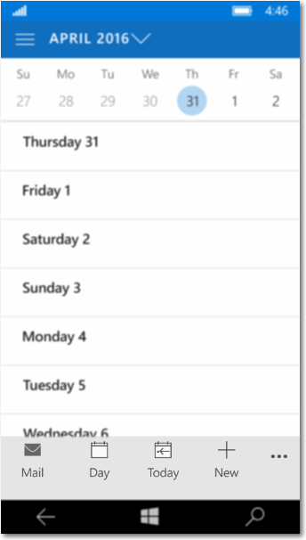

# <a name="command-bar"></a><span data-ttu-id="0177b-104">コマンド バー</span><span class="sxs-lookup"><span data-stu-id="0177b-104">Command bar</span></span>

<link rel="stylesheet" href="https://az835927.vo.msecnd.net/sites/uwp/Resources/css/custom.css">

<span data-ttu-id="0177b-105">コマンド バー ("アプリ バー" とも呼ばれます) を使うと、ユーザーはアプリの最も一般的なタスクに簡単にアクセスできます。コマンド バーは、ユーザーのコンテキストに固有のコマンドやオプション (写真の選択や描画モードなど) を表示するために使うことができます。</span><span class="sxs-lookup"><span data-stu-id="0177b-105">Command bars (also called "app bars") provide users with easy access to your app's most common tasks, and can be used to show commands or options that are specific to the user's context, such as a photo selection or drawing mode.</span></span> <span data-ttu-id="0177b-106">また、アプリのページやセクション間のナビゲーションにも使うことができます。</span><span class="sxs-lookup"><span data-stu-id="0177b-106">They can also be used for navigation among app pages or between app sections.</span></span> <span data-ttu-id="0177b-107">コマンド バーは、ナビゲーション パターンと一緒に使うことができます。</span><span class="sxs-lookup"><span data-stu-id="0177b-107">Command bars can be used with any navigation pattern.</span></span>

> <span data-ttu-id="0177b-108">**重要な API**: [CommandBar クラス](https://msdn.microsoft.com/library/windows/apps/windows.ui.xaml.controls.commandbar.aspx)、[AppBarButton クラス](https://msdn.microsoft.com/library/windows/apps/windows.ui.xaml.controls.appbarbutton.aspx)、[AppBarToggleButton クラス](https://msdn.microsoft.com/library/windows/apps/windows.ui.xaml.controls.appbartogglebutton.aspx)、[AppBarSeparator クラス](https://msdn.microsoft.com/library/windows/apps/windows.ui.xaml.controls.appbarseparator.aspx)</span><span class="sxs-lookup"><span data-stu-id="0177b-108">**Important APIs**: [CommandBar class](https://msdn.microsoft.com/library/windows/apps/windows.ui.xaml.controls.commandbar.aspx), [AppBarButton class](https://msdn.microsoft.com/library/windows/apps/windows.ui.xaml.controls.appbarbutton.aspx), [AppBarToggleButton class](https://msdn.microsoft.com/library/windows/apps/windows.ui.xaml.controls.appbartogglebutton.aspx), [AppBarSeparator class](https://msdn.microsoft.com/library/windows/apps/windows.ui.xaml.controls.appbarseparator.aspx)</span></span>


## <a name="is-this-the-right-control"></a><span data-ttu-id="0177b-110">適切なコントロールの選択</span><span class="sxs-lookup"><span data-stu-id="0177b-110">Is this the right control?</span></span>

<span data-ttu-id="0177b-111">CommandBar コントロールは、汎用的で柔軟、軽量なコントロールです。画像やテキスト ブロックなどの複雑なコンテンツも、[AppBarButton](https://msdn.microsoft.com/library/windows/apps/windows.ui.xaml.controls.appbarbutton.aspx)、[AppBarToggleButton](https://msdn.microsoft.com/library/windows/apps/windows.ui.xaml.controls.appbartogglebutton.aspx)、[AppBarSeparator](https://msdn.microsoft.com/library/windows/apps/windows.ui.xaml.controls.appbarseparator.aspx) コントロールなどの単純なコマンドも表示できます。</span><span class="sxs-lookup"><span data-stu-id="0177b-111">The CommandBar control is a general-purpose, flexible, light-weight control that can display both complex content, such as images or text blocks, as well as simple commands such as [AppBarButton](https://msdn.microsoft.com/library/windows/apps/windows.ui.xaml.controls.appbarbutton.aspx), [AppBarToggleButton](https://msdn.microsoft.com/library/windows/apps/windows.ui.xaml.controls.appbartogglebutton.aspx), and [AppBarSeparator](https://msdn.microsoft.com/library/windows/apps/windows.ui.xaml.controls.appbarseparator.aspx) controls.</span></span>

<span data-ttu-id="0177b-112">XAML では、AppBar コントロールと CommandBar コントロールの両方が提供されます。</span><span class="sxs-lookup"><span data-stu-id="0177b-112">XAML provides both the AppBar control and the CommandBar control.</span></span> <span data-ttu-id="0177b-113">AppBar を使うユニバーサル Windows 8 アプリをアップグレードする場合にのみ、AppBar を使ってください。また、変更は最小限に抑える必要があります。</span><span class="sxs-lookup"><span data-stu-id="0177b-113">You should use the AppBar only when you are upgrading a Universal Windows 8 app that uses the AppBar, and need to minimize changes.</span></span> <span data-ttu-id="0177b-114">Windows 10 の新しいアプリでは、代わりに CommandBar コントロールを使うことをお勧めします。</span><span class="sxs-lookup"><span data-stu-id="0177b-114">For new apps in Windows 10, we recommend using the CommandBar control instead.</span></span> <span data-ttu-id="0177b-115">このドキュメントでは、CommandBar コントロールを使うことを前提としています。</span><span class="sxs-lookup"><span data-stu-id="0177b-115">This document assumes you are using the CommandBar control.</span></span>

## <a name="examples"></a><span data-ttu-id="0177b-116">例</span><span class="sxs-lookup"><span data-stu-id="0177b-116">Examples</span></span>
<span data-ttu-id="0177b-117">Microsoft フォト アプリの展開されたコマンド バーです。</span><span class="sxs-lookup"><span data-stu-id="0177b-117">An expanded command bar in the Microsoft Photos app.</span></span>


<span data-ttu-id="0177b-119">Windows Phone の Outlook カレンダーのコマンド バーです。</span><span class="sxs-lookup"><span data-stu-id="0177b-119">A command bar in the Outlook Calendar on Windows Phone.</span></span>



## <a name="anatomy"></a><span data-ttu-id="0177b-121">構造</span><span class="sxs-lookup"><span data-stu-id="0177b-121">Anatomy</span></span>

<span data-ttu-id="0177b-122">既定では、コマンド バーには、一連のアイコン ボタンとオプションの [その他] ボタン (省略記号の \[•••\]) が表示されます。</span><span class="sxs-lookup"><span data-stu-id="0177b-122">By default, the command bar shows a row of icon buttons and an optional "see more" button, which is represented by an ellipsis \[•••\].</span></span> <span data-ttu-id="0177b-123">後で示すコード例を使って作成されたコマンド バーを次に示します。</span><span class="sxs-lookup"><span data-stu-id="0177b-123">Here's the command bar created by the example code shown later.</span></span> <span data-ttu-id="0177b-124">コマンド バーは、閉じたコンパクトな状態で表示されます。</span><span class="sxs-lookup"><span data-stu-id="0177b-124">It's shown in its closed compact state.</span></span>


<span data-ttu-id="0177b-126">コマンド バーは、次のように、閉じた最小の状態で表示することもできます。</span><span class="sxs-lookup"><span data-stu-id="0177b-126">The command bar can also be shown in a closed minimal state that looks like this.</span></span> <span data-ttu-id="0177b-127">詳しくは、「[開いた状態と閉じた状態](#open-and-closed-states)」をご覧ください。</span><span class="sxs-lookup"><span data-stu-id="0177b-127">See the [Open and closed states](#open-and-closed-states) section for more info.</span></span>


<span data-ttu-id="0177b-129">同じコマンド バーが開いている状態を次に示します。</span><span class="sxs-lookup"><span data-stu-id="0177b-129">Here's the same command bar in its open state.</span></span> <span data-ttu-id="0177b-130">ラベルは、コントロールのメイン部分を識別します。</span><span class="sxs-lookup"><span data-stu-id="0177b-130">The labels identify the main parts of the control.</span></span>


<span data-ttu-id="0177b-132">コマンド バーは、4 つの主な領域に分かれています。</span><span class="sxs-lookup"><span data-stu-id="0177b-132">The command bar is divided into 4 main areas:</span></span>
- <span data-ttu-id="0177b-133">[その他] （\[•••\]） ボタンはバーの右側に表示されます。</span><span class="sxs-lookup"><span data-stu-id="0177b-133">The "see more" \[•••\] button is shown on the right of the bar.</span></span> <span data-ttu-id="0177b-134">[その他] （\[•••\]） ボタンを押すと 2 つの効果があり、プライマリ コマンド ボタンのラベルが表示され、セカンダリ コマンドが存在する場合はオーバーフロー メニューが開きます。</span><span class="sxs-lookup"><span data-stu-id="0177b-134">Pressing the "see more" \[•••\] button has 2 effects: it reveals the labels on the primary command buttons, and it opens the overflow menu if any secondary commands are present.</span></span> <span data-ttu-id="0177b-135">最新の SDK では、セカンダリ コマンドも非表示のラベルもない場合、このボタンは表示されません。</span><span class="sxs-lookup"><span data-stu-id="0177b-135">In the newest SDK, the button will not be visible when no secondary commands and no hidden labels are present.</span></span> <span data-ttu-id="0177b-136">[OverflowButtonVisibility](https://msdn.microsoft.com/library/windows/apps/windows.ui.xaml.controls.commandbar.overflowbuttonvisibility.aspx) プロパティを使うと、この自動的に非表示になる既定の動作をアプリで変更することができます。</span><span class="sxs-lookup"><span data-stu-id="0177b-136">[OverflowButtonVisibility](https://msdn.microsoft.com/library/windows/apps/windows.ui.xaml.controls.commandbar.overflowbuttonvisibility.aspx) property allows apps to change this default auto-hide behavior.</span></span>
- <span data-ttu-id="0177b-137">コンテンツ領域はバーの左側に配置されます。</span><span class="sxs-lookup"><span data-stu-id="0177b-137">The content area is aligned to the left side of the bar.</span></span> <span data-ttu-id="0177b-138">これは、[Content](https://msdn.microsoft.com/library/windows/apps/xaml/windows.ui.xaml.controls.contentcontrol.content.aspx) プロパティが指定されている場合に表示されます。</span><span class="sxs-lookup"><span data-stu-id="0177b-138">It is shown if the [Content](https://msdn.microsoft.com/library/windows/apps/xaml/windows.ui.xaml.controls.contentcontrol.content.aspx) property is populated.</span></span>
- <span data-ttu-id="0177b-139">基本コマンド領域はバーの右側の [その他] （\[•••\] ） ボタンの横に配置されます。</span><span class="sxs-lookup"><span data-stu-id="0177b-139">The primary command area is aligned to the right side of the bar, next to the "see more" \[•••\] button.</span></span> <span data-ttu-id="0177b-140">これは、[PrimaryCommands](https://msdn.microsoft.com/library/windows/apps/xaml/windows.ui.xaml.controls.commandbar.primarycommands.aspx) プロパティが指定されている場合に表示されます。</span><span class="sxs-lookup"><span data-stu-id="0177b-140">It is shown if the [PrimaryCommands](https://msdn.microsoft.com/library/windows/apps/xaml/windows.ui.xaml.controls.commandbar.primarycommands.aspx) property is populated.</span></span>  
- <span data-ttu-id="0177b-141">オーバーフロー メニューは、コマンド バーが開いていて、[SecondaryCommands](https://msdn.microsoft.com/library/windows/apps/xaml/windows.ui.xaml.controls.commandbar.secondarycommands.aspx) プロパティが指定されている場合にのみ表示されます。</span><span class="sxs-lookup"><span data-stu-id="0177b-141">The overflow menu is shown only when the command bar is open and the [SecondaryCommands](https://msdn.microsoft.com/library/windows/apps/xaml/windows.ui.xaml.controls.commandbar.secondarycommands.aspx) property is populated.</span></span> <span data-ttu-id="0177b-142">新しい動的オーバーフローの動作では、スペースが限られている場合に、これまでよりも多くのプライマリ コマンドが自動的に SecondaryCommands 領域に移動されます。</span><span class="sxs-lookup"><span data-stu-id="0177b-142">The new dynamic overflow behavior will automatically move primary commands into the SecondaryCommands area when space is limited.</span></span>

<span data-ttu-id="0177b-143">[FlowDirection](https://msdn.microsoft.com/library/windows/apps/windows.ui.xaml.frameworkelement.flowdirection.aspx) が **RightToLeft** のときは、レイアウトが逆になります。</span><span class="sxs-lookup"><span data-stu-id="0177b-143">The layout is reversed when the [FlowDirection](https://msdn.microsoft.com/library/windows/apps/windows.ui.xaml.frameworkelement.flowdirection.aspx) is **RightToLeft**.</span></span>

## <a name="create-a-command-bar"></a><span data-ttu-id="0177b-144">コマンド バーの作成</span><span class="sxs-lookup"><span data-stu-id="0177b-144">Create a command bar</span></span>
<span data-ttu-id="0177b-145">次の例では、上に示したコマンド バーが作成されます。</span><span class="sxs-lookup"><span data-stu-id="0177b-145">This example creates the command bar shown previously.</span></span>

```xaml
<CommandBar>
    <AppBarToggleButton Icon="Shuffle" Label="Shuffle" Click="AppBarButton_Click" />
    <AppBarToggleButton Icon="RepeatAll" Label="Repeat" Click="AppBarButton_Click"/>
    <AppBarSeparator/>
    <AppBarButton Icon="Back" Label="Back" Click="AppBarButton_Click"/>
    <AppBarButton Icon="Stop" Label="Stop" Click="AppBarButton_Click"/>
    <AppBarButton Icon="Play" Label="Play" Click="AppBarButton_Click"/>
    <AppBarButton Icon="Forward" Label="Forward" Click="AppBarButton_Click"/>

    <CommandBar.SecondaryCommands>
        <AppBarButton Icon="Like" Label="Like" Click="AppBarButton_Click"/>
        <AppBarButton Icon="Dislike" Label="Dislike" Click="AppBarButton_Click"/>
    </CommandBar.SecondaryCommands>

    <CommandBar.Content>
        <TextBlock Text="Now playing..." Margin="12,14"/>
    </CommandBar.Content>
</CommandBar>
```

## <a name="commands-and-content"></a><span data-ttu-id="0177b-146">コマンドとコンテンツ</span><span class="sxs-lookup"><span data-stu-id="0177b-146">Commands and content</span></span>
<span data-ttu-id="0177b-147">CommandBar コントロールには [PrimaryCommands](https://msdn.microsoft.com/library/windows/apps/xaml/windows.ui.xaml.controls.commandbar.primarycommands.aspx)、[SecondaryCommands](https://msdn.microsoft.com/library/windows/apps/xaml/windows.ui.xaml.controls.commandbar.secondarycommands.aspx)、[Content](https://msdn.microsoft.com/library/windows/apps/xaml/windows.ui.xaml.controls.contentcontrol.content.aspx) の 3 つのプロパティがあり、コマンドとコンテンツを追加するために使うことができます。</span><span class="sxs-lookup"><span data-stu-id="0177b-147">The CommandBar control has 3 properties you can use to add commands and content: [PrimaryCommands](https://msdn.microsoft.com/library/windows/apps/xaml/windows.ui.xaml.controls.commandbar.primarycommands.aspx), [SecondaryCommands](https://msdn.microsoft.com/library/windows/apps/xaml/windows.ui.xaml.controls.commandbar.secondarycommands.aspx), and [Content](https://msdn.microsoft.com/library/windows/apps/xaml/windows.ui.xaml.controls.contentcontrol.content.aspx).</span></span>


### <a name="primary-actions-and-overflow"></a><span data-ttu-id="0177b-148">プライマリ操作とオーバーフロー</span><span class="sxs-lookup"><span data-stu-id="0177b-148">Primary actions and overflow</span></span>

<span data-ttu-id="0177b-149">既定では、コマンド バーに追加した項目は **PrimaryCommands** コレクションに追加されます。</span><span class="sxs-lookup"><span data-stu-id="0177b-149">By default, items you add to the command bar are added to the **PrimaryCommands** collection.</span></span> <span data-ttu-id="0177b-150">これらのコマンドは [その他] （\[•••\]） ボタンの左側の、アクション領域と呼ばれる場所に表示されます。</span><span class="sxs-lookup"><span data-stu-id="0177b-150">These commands are shown to the left of the "see more" \[•••\] button, in what we call the action space.</span></span> <span data-ttu-id="0177b-151">バーに常に表示する最も重要なコマンドは、アクション領域に配置します。</span><span class="sxs-lookup"><span data-stu-id="0177b-151">Place the most important commands, the ones that you want to remain visible in the bar, in the action space.</span></span> <span data-ttu-id="0177b-152">最小画面 (幅 320 epx) には、最大 4 つの項目を、コマンド バーのアクション領域に配置できます。</span><span class="sxs-lookup"><span data-stu-id="0177b-152">On the smallest screens (320 epx width), a maximum of 4 items will fit in the command bar's action space.</span></span>

<span data-ttu-id="0177b-153">**SecondaryCommands** コレクションにコマンドを追加できます。これらの項目は、オーバーフロー領域に表示されます。</span><span class="sxs-lookup"><span data-stu-id="0177b-153">You can add commands to the **SecondaryCommands** collection, and these items are shown in the overflow area.</span></span> <span data-ttu-id="0177b-154">重要度の低いコマンドは、オーバーフロー領域に配置します。</span><span class="sxs-lookup"><span data-stu-id="0177b-154">Place less important commands within the overflow area.</span></span>

<span data-ttu-id="0177b-155">既定のオーバーフロー領域には、バーとは別に表示されるスタイルが適用されます。</span><span class="sxs-lookup"><span data-stu-id="0177b-155">The default overflow area is styled to be distinct from the bar.</span></span> <span data-ttu-id="0177b-156">スタイルを調整するには、[CommandBarOverflowPresenterStyle](https://msdn.microsoft.com/library/windows/apps/xaml/windows.ui.xaml.controls.commandbar.commandbaroverflowpresenterstyle.aspx) プロパティを、[CommandBarOverflowPresenter](https://msdn.microsoft.com/library/windows/apps/xaml/windows.ui.xaml.controls.commandbaroverflowpresenter.aspx) をターゲットにする [Style](https://msdn.microsoft.com/library/windows/apps/xaml/windows.ui.xaml.style.aspx) に設定します。</span><span class="sxs-lookup"><span data-stu-id="0177b-156">You can adjust the styling by setting the [CommandBarOverflowPresenterStyle](https://msdn.microsoft.com/library/windows/apps/xaml/windows.ui.xaml.controls.commandbar.commandbaroverflowpresenterstyle.aspx) property to a [Style](https://msdn.microsoft.com/library/windows/apps/xaml/windows.ui.xaml.style.aspx) that targets the [CommandBarOverflowPresenter](https://msdn.microsoft.com/library/windows/apps/xaml/windows.ui.xaml.controls.commandbaroverflowpresenter.aspx).</span></span>

<span data-ttu-id="0177b-157">必要に応じて、プログラムを使って PrimaryCommands と SecondaryCommands の間でコマンドを移動できます。</span><span class="sxs-lookup"><span data-stu-id="0177b-157">You can programmatically move commands between the PrimaryCommands and SecondaryCommands as needed.</span></span>

<!-- 
<div class="microsoft-internal-note">
Commands can also automatically move in or out of the overflow as the command bar width changes, for example when users resize their app window. Dynamic overflow is on by default but apps can turn off this behavior by changing the value of `IsDynamicOverflowEnabled` property.
</div>
-->

### <a name="app-bar-buttons"></a><span data-ttu-id="0177b-158">アプリ バーのボタン</span><span class="sxs-lookup"><span data-stu-id="0177b-158">App bar buttons</span></span>

<span data-ttu-id="0177b-159">PrimaryCommands と SecondaryCommands には、どちらも [AppBarButton](https://msdn.microsoft.com/library/windows/apps/xaml/windows.ui.xaml.controls.appbarbutton.aspx)、[AppBarToggleButton](https://msdn.microsoft.com/library/windows/apps/xaml/windows.ui.xaml.controls.appbartogglebutton.aspx)、[AppBarSeparator](https://msdn.microsoft.com/library/windows/apps/xaml/windows.ui.xaml.controls.appbarseparator.aspx) の各コマンド要素のみを入力できます。</span><span class="sxs-lookup"><span data-stu-id="0177b-159">Both the PrimaryCommands and SecondaryCommands can be populated only with [AppBarButton](https://msdn.microsoft.com/library/windows/apps/xaml/windows.ui.xaml.controls.appbarbutton.aspx), [AppBarToggleButton](https://msdn.microsoft.com/library/windows/apps/xaml/windows.ui.xaml.controls.appbartogglebutton.aspx), and [AppBarSeparator](https://msdn.microsoft.com/library/windows/apps/xaml/windows.ui.xaml.controls.appbarseparator.aspx) command elements.</span></span> <span data-ttu-id="0177b-160">これらのコントロールは、コマンド バーで使うように最適化されており、アクション領域とオーバーフロー領域のどちらで使うかに応じて外観が変化します。</span><span class="sxs-lookup"><span data-stu-id="0177b-160">These controls are optimized for use in a command bar, and their appearance changes depending on whether the control is used in the action space or overflow area.</span></span>

<span data-ttu-id="0177b-161">アプリ バーのボタン コントロールは、アイコンとアイコンに関連付けられたラベルによって特徴付けられます。</span><span class="sxs-lookup"><span data-stu-id="0177b-161">The app bar button controls are characterized by an icon and associated label.</span></span> <span data-ttu-id="0177b-162">標準とコンパクトの 2 つのサイズがあります。</span><span class="sxs-lookup"><span data-stu-id="0177b-162">They have two sizes; normal and compact.</span></span> <span data-ttu-id="0177b-163">既定では、テキスト ラベルが表示されます。</span><span class="sxs-lookup"><span data-stu-id="0177b-163">By default, the text label is shown.</span></span> <span data-ttu-id="0177b-164">[IsCompact](https://msdn.microsoft.com/library/windows/apps/xaml/windows.ui.xaml.controls.appbarbutton.iscompact.aspx) プロパティを **true** に設定すると、テキスト ラベルが非表示になります。</span><span class="sxs-lookup"><span data-stu-id="0177b-164">When the [IsCompact](https://msdn.microsoft.com/library/windows/apps/xaml/windows.ui.xaml.controls.appbarbutton.iscompact.aspx) property is set to **true**, the text label is hidden.</span></span> <span data-ttu-id="0177b-165">CommandBar コントロールで使う場合、コマンド バーの開閉に応じてコマンド バーがボタンの IsCompact プロパティを自動的に上書きします。</span><span class="sxs-lookup"><span data-stu-id="0177b-165">When used in a CommandBar control, the command bar overwrites the button's IsCompact property automatically as the command bar is opened and closed.</span></span>

<span data-ttu-id="0177b-166">アプリ バー ボタンのラベルをアイコンの右に配置するには、CommandBar の新しいプロパティである [DefaultLabelPosition](https://msdn.microsoft.com/library/windows/apps/windows.ui.xaml.controls.commandbar.defaultlabelposition.aspx) を使います。</span><span class="sxs-lookup"><span data-stu-id="0177b-166">To position app bar button labels to the right of their icons, apps can use CommandBar's new [DefaultLabelPosition](https://msdn.microsoft.com/library/windows/apps/windows.ui.xaml.controls.commandbar.defaultlabelposition.aspx) property.</span></span>

```xaml
<CommandBar DefaultLabelPosition="Right">
    <AppBarToggleButton Icon="Shuffle" Label="Shuffle"/>
    <AppBarToggleButton Icon="RepeatAll" Label="Repeat"/>
</CommandBar>
```

<span data-ttu-id="0177b-167">上のコード スニペットがアプリで描画されると、次のようになります。</span><span class="sxs-lookup"><span data-stu-id="0177b-167">Here is what the code snippet above looks like when drawn by an app.</span></span>


<span data-ttu-id="0177b-169">個々のアプリ バー ボタンのラベルの位置を移動することはできません。この操作は、コマンド バー全体として行う必要があります。</span><span class="sxs-lookup"><span data-stu-id="0177b-169">Individual app bar buttons cannot move their label position, this must be done on the command bar as a whole.</span></span> <span data-ttu-id="0177b-170">アプリ バー ボタンのラベルが表示されないように指定するには、新しいプロパティである [LabelPosition](https://msdn.microsoft.com/library/windows/apps/mt710920.aspx) を **Collapsed** に設定します。</span><span class="sxs-lookup"><span data-stu-id="0177b-170">App bar buttons can specify that their labels never show by setting the new [LabelPosition](https://msdn.microsoft.com/library/windows/apps/mt710920.aspx) property to **Collapsed**.</span></span> <span data-ttu-id="0177b-171">この設定は、"+" のように、だれでも認識できるボタンにのみ使うように制限することをお勧めします。</span><span class="sxs-lookup"><span data-stu-id="0177b-171">We recommend limiting the use of this setting to universally recognizable iconography such as '+'.</span></span>

<span data-ttu-id="0177b-172">アプリ バーのボタンをオーバーフロー メニュー (SecondaryCommands) に配置すると、テキストのみとして表示されます。</span><span class="sxs-lookup"><span data-stu-id="0177b-172">When you place an app bar button in the overflow menu (SecondaryCommands), it's shown as text only.</span></span> <span data-ttu-id="0177b-173">オーバーフロー内のアプリ バー ボタンの **LabelPosition** は無視されます。</span><span class="sxs-lookup"><span data-stu-id="0177b-173">The **LabelPosition** of app bar buttons in the overflow will be ignored.</span></span> <span data-ttu-id="0177b-174">以下に、同じアプリ バーのトグル ボタンがプライマリ コマンドとしてアクション領域に表示された状態 (上) と、セカンダリ コマンドとしてオーバーフロー領域に表示された状態 (下) を示します。</span><span class="sxs-lookup"><span data-stu-id="0177b-174">Here's the same app bar toggle button shown in the action space as a primary command (top), and in the overflow area as a secondary command (bottom).</span></span>


- *<span data-ttu-id="0177b-176">複数のページで一貫して表示されるコマンドがある場合は、一貫した場所にそのコマンドを配置することをお勧めします。</span><span class="sxs-lookup"><span data-stu-id="0177b-176">If there is a command that would appear consistently across pages, it's best to keep that command in a consistent location.</span></span>*
- *<span data-ttu-id="0177b-177">また、[Accept] （承諾）、[Yes] （はい）、[OK] （OK） コマンドは、[Reject] （拒否）、[No] （いいえ）、[Cancel] （キャンセル） コマンドの左に配置することをお勧めします。</span><span class="sxs-lookup"><span data-stu-id="0177b-177">We recommended placing Accept, Yes, and OK commands to the left of Reject, No, and Cancel.</span></span> <span data-ttu-id="0177b-178">一貫性があることで、ユーザーは安心してシステム内を移動でき、アプリのナビゲーションに関する知識をさまざまなアプリで利用することができます。</span><span class="sxs-lookup"><span data-stu-id="0177b-178">Consistency gives users the confidence to move around the system and helps them transfer their knowledge of app navigation from app to app.</span></span>*

### <a name="button-labels"></a><span data-ttu-id="0177b-179">ボタンのラベル</span><span class="sxs-lookup"><span data-stu-id="0177b-179">Button labels</span></span>

<span data-ttu-id="0177b-180">アプリ バー ボタンのラベルは、短く、可能であれば 1 つの単語にすることをお勧めします。</span><span class="sxs-lookup"><span data-stu-id="0177b-180">We recommend keeping app bar button labels short, preferably a single word.</span></span> <span data-ttu-id="0177b-181">アプリ バー ボタンのアイコンの下に配置される長いラベルは複数の行に折り返されるため、開いたコマンド バーの全体的な高さが増します。</span><span class="sxs-lookup"><span data-stu-id="0177b-181">Longer labels positioned bellow an app bar button's icon will wrap to multiple lines thus increasing the overall height of the opened command bar.</span></span> <span data-ttu-id="0177b-182">ラベルのテキストにソフト ハイフン文字 (0x00AD) を含めると、テキストの中で単語を分割する位置を示すことができます。</span><span class="sxs-lookup"><span data-stu-id="0177b-182">You can include a soft-hyphen character (0x00AD) in the text for a label to hint at the character boundary where a word break should occur.</span></span> <span data-ttu-id="0177b-183">XAML でこの処理を行うには、次のようなエスケープ シーケンスを使います。</span><span class="sxs-lookup"><span data-stu-id="0177b-183">In XAML, you express this using an escape sequence, like this:</span></span>

```xaml
<AppBarButton Icon="Back" Label="Areally&#x00AD;longlabel"/>
```

<span data-ttu-id="0177b-184">指定した場所でラベルが折り返されると、次のようになります。</span><span class="sxs-lookup"><span data-stu-id="0177b-184">When the label wraps at the hinted location, it looks like this.</span></span>


### <a name="other-content"></a><span data-ttu-id="0177b-186">その他のコンテンツ</span><span class="sxs-lookup"><span data-stu-id="0177b-186">Other content</span></span>

<span data-ttu-id="0177b-187">XAML 要素をコンテンツ領域に追加するには、**Content** プロパティを設定します。</span><span class="sxs-lookup"><span data-stu-id="0177b-187">You can add any XAML elements to the content area by setting the **Content** property.</span></span> <span data-ttu-id="0177b-188">複数の要素を追加する場合は、それらの要素をパネル コンテナーに配置し、パネルを Content プロパティの唯一の子にする必要があります。</span><span class="sxs-lookup"><span data-stu-id="0177b-188">If you want to add more than one element, you need to place them in a panel container and make the panel the single child of the Content property.</span></span>

<span data-ttu-id="0177b-189">プライマリ コマンドとコンテンツの両方がある場合は、プライマリ コマンドが優先され、コンテンツがクリップされる可能性があります。</span><span class="sxs-lookup"><span data-stu-id="0177b-189">When there are both primary commands and content, the primary commands take precedence and may cause the content to be clipped.</span></span>

<!--
<div class="microsoft-internal-note">
Content will not clip when dynamic overflow is enabled because the primary commands would move into the overflow menu freeing up space for content.
</div>
-->

<span data-ttu-id="0177b-190">[ClosedDisplayMode](https://msdn.microsoft.com/library/windows/apps/xaml/windows.ui.xaml.controls.appbar.closeddisplaymode.aspx) が **Compact** の場合、コンパクト サイズのコマンド バーよりも大きいコンテンツはクリップされる可能性があります。</span><span class="sxs-lookup"><span data-stu-id="0177b-190">When the [ClosedDisplayMode](https://msdn.microsoft.com/library/windows/apps/xaml/windows.ui.xaml.controls.appbar.closeddisplaymode.aspx) is **Compact**, the content can be clipped if it is larger than the compact size of the command bar.</span></span> <span data-ttu-id="0177b-191">UI の一部がクリップされないようにするには、コンテンツ領域で UI の各部分を表示または非表示にするように [Opening](https://msdn.microsoft.com/library/windows/apps/xaml/windows.ui.xaml.controls.appbar.opening.aspx) と [Closed](https://msdn.microsoft.com/library/windows/apps/xaml/windows.ui.xaml.controls.appbar.closed.aspx) の各イベントを処理する必要があります。</span><span class="sxs-lookup"><span data-stu-id="0177b-191">You should handle the [Opening](https://msdn.microsoft.com/library/windows/apps/xaml/windows.ui.xaml.controls.appbar.opening.aspx) and [Closed](https://msdn.microsoft.com/library/windows/apps/xaml/windows.ui.xaml.controls.appbar.closed.aspx) events to show or hide parts of the UI in the content area so that they aren't clipped.</span></span> <span data-ttu-id="0177b-192">詳しくは、「[開いた状態と閉じた状態](#open-and-closed-states)」をご覧ください。</span><span class="sxs-lookup"><span data-stu-id="0177b-192">See the [Open and closed states](#open-and-closed-states) section for more info.</span></span>

## <a name="open-and-closed-states"></a><span data-ttu-id="0177b-193">開いた状態と閉じた状態</span><span class="sxs-lookup"><span data-stu-id="0177b-193">Open and closed states</span></span>

<span data-ttu-id="0177b-194">コマンド バーは、開いたり閉じたりできます。</span><span class="sxs-lookup"><span data-stu-id="0177b-194">The command bar can be open or closed.</span></span> <span data-ttu-id="0177b-195">ユーザーは、[その他] （\[•••\]） ボタンを押して状態を切り替えることができます。</span><span class="sxs-lookup"><span data-stu-id="0177b-195">A user can switch between these states by pressing the "see more" \[•••\] button.</span></span> <span data-ttu-id="0177b-196">プログラムで切り替えるには、[IsOpen](https://msdn.microsoft.com/library/windows/apps/xaml/windows.ui.xaml.controls.appbar.isopen.aspx) プロパティを設定します。</span><span class="sxs-lookup"><span data-stu-id="0177b-196">You can switch between them programmatically by setting the [IsOpen](https://msdn.microsoft.com/library/windows/apps/xaml/windows.ui.xaml.controls.appbar.isopen.aspx) property.</span></span> <span data-ttu-id="0177b-197">開いた状態の場合、プライマリ コマンド ボタンはテキスト ラベル付きで表示され、上に示したように、セカンダリ コマンドが存在するときはオーバーフロー メニューが開きます。</span><span class="sxs-lookup"><span data-stu-id="0177b-197">When open, the primary command buttons are shown with text labels and the overflow menu is open if secondary commands are present, as shown previously.</span></span>

<span data-ttu-id="0177b-198">[Opening](https://msdn.microsoft.com/library/windows/apps/xaml/windows.ui.xaml.controls.appbar.opening.aspx)、[Opened](https://msdn.microsoft.com/library/windows/apps/xaml/windows.ui.xaml.controls.appbar.opened.aspx)、[Closing](https://msdn.microsoft.com/library/windows/apps/xaml/windows.ui.xaml.controls.appbar.closing.aspx)、[Closed](https://msdn.microsoft.com/library/windows/apps/xaml/windows.ui.xaml.controls.appbar.closed.aspx) の各イベントを使うと、コマンド バーの開閉に対応できます。</span><span class="sxs-lookup"><span data-stu-id="0177b-198">You can use the [Opening](https://msdn.microsoft.com/library/windows/apps/xaml/windows.ui.xaml.controls.appbar.opening.aspx), [Opened](https://msdn.microsoft.com/library/windows/apps/xaml/windows.ui.xaml.controls.appbar.opened.aspx), [Closing](https://msdn.microsoft.com/library/windows/apps/xaml/windows.ui.xaml.controls.appbar.closing.aspx), and [Closed](https://msdn.microsoft.com/library/windows/apps/xaml/windows.ui.xaml.controls.appbar.closed.aspx) events to respond to the command bar being opened or closed.</span></span>  
- <span data-ttu-id="0177b-199">Opening イベントと Closing イベントが発生するのは、切り替えアニメーションの開始前です。</span><span class="sxs-lookup"><span data-stu-id="0177b-199">The Opening and Closing events occur before the transition animation begins.</span></span>
- <span data-ttu-id="0177b-200">Opened イベントと Closed イベントが発生するのは、切り替えの完了後です。</span><span class="sxs-lookup"><span data-stu-id="0177b-200">The Opened and Closed events occur after the transition completes.</span></span>

<span data-ttu-id="0177b-201">次の例では、Opening イベントと Closing イベントを使ってコマンド バーの不透明度を変更します。</span><span class="sxs-lookup"><span data-stu-id="0177b-201">In this example, the Opening and Closing events are used to change the opacity of the command bar.</span></span> <span data-ttu-id="0177b-202">コマンド バーが閉じているときは、アプリの背景が見えるようにコマンド バーが半透明になります。</span><span class="sxs-lookup"><span data-stu-id="0177b-202">When the command bar is closed, it's semi-transparent so the app background shows through.</span></span> <span data-ttu-id="0177b-203">コマンド バーが開いているときは、ユーザーがコマンドに集中できるようにコマンド バーが不透明になります。</span><span class="sxs-lookup"><span data-stu-id="0177b-203">When the command bar is opened, the command bar is made opaque so the user can focus on the commands.</span></span>

```xaml
<CommandBar Opening="CommandBar_Opening"
            Closing="CommandBar_Closing">
    <AppBarButton Icon="Accept" Label="Accept"/>
    <AppBarButton Icon="Edit" Label="Edit"/>
    <AppBarButton Icon="Save" Label="Save"/>
    <AppBarButton Icon="Cancel" Label="Cancel"/>
</CommandBar>
```

```csharp
private void CommandBar_Opening(object sender, object e)
{
    CommandBar cb = sender as CommandBar;
    if (cb != null) cb.Background.Opacity = 1.0;
}

private void CommandBar_Closing(object sender, object e)
{
    CommandBar cb = sender as CommandBar;
    if (cb != null) cb.Background.Opacity = 0.5;
}

```

### <a name="closeddisplaymode"></a><span data-ttu-id="0177b-204">ClosedDisplayMode</span><span class="sxs-lookup"><span data-stu-id="0177b-204">ClosedDisplayMode</span></span>

<span data-ttu-id="0177b-205">コマンド バーが閉じた状態でどのように表示されるか制御するには、[ClosedDisplayMode](https://msdn.microsoft.com/library/windows/apps/xaml/windows.ui.xaml.controls.appbar.closeddisplaymode.aspx) プロパティを設定します。</span><span class="sxs-lookup"><span data-stu-id="0177b-205">You can control how the command bar is shown in its closed state by setting the [ClosedDisplayMode](https://msdn.microsoft.com/library/windows/apps/xaml/windows.ui.xaml.controls.appbar.closeddisplaymode.aspx) property.</span></span> <span data-ttu-id="0177b-206">3 つのクローズド表示モードから選ぶことができます。</span><span class="sxs-lookup"><span data-stu-id="0177b-206">There are 3 closed display modes to choose from:</span></span>
- <span data-ttu-id="0177b-207">**Compact**: 既定のモードです。</span><span class="sxs-lookup"><span data-stu-id="0177b-207">**Compact**: The default mode.</span></span> <span data-ttu-id="0177b-208">コンテンツ、プライマリ コマンドのアイコン (ラベルなし)、[その他] （\[•••\]） ボタンが表示されます。</span><span class="sxs-lookup"><span data-stu-id="0177b-208">Shows content, primary command icons without labels, and the "see more" \[•••\] button.</span></span>
- <span data-ttu-id="0177b-209">**Minimal**: [その他] （\[•••\]） ボタンとして機能する細いバーのみが表示されます。</span><span class="sxs-lookup"><span data-stu-id="0177b-209">**Minimal**: Shows only a thin bar that acts as the "see more" \[•••\] button.</span></span> <span data-ttu-id="0177b-210">ユーザーはバーの任意の場所を押してバーを開くことができます。</span><span class="sxs-lookup"><span data-stu-id="0177b-210">The user can press anywhere on the bar to open it.</span></span>
- <span data-ttu-id="0177b-211">**Hidden**: コマンド バーを閉じたとき、コマンド バーは表示されません。</span><span class="sxs-lookup"><span data-stu-id="0177b-211">**Hidden**: The command bar is not shown when it's closed.</span></span> <span data-ttu-id="0177b-212">このモードは、インライン コマンド バーでコンテキスト依存コマンドを表示するときに便利な場合があります。</span><span class="sxs-lookup"><span data-stu-id="0177b-212">This can be useful for showing contextual commands with an inline command bar.</span></span> <span data-ttu-id="0177b-213">この場合は、コマンド バーをプログラムで開く必要があります。この操作を行うには、**IsOpen** プロパティを設定するか、ClosedDisplayMode を **Minimal** または **Compact** に変更します。</span><span class="sxs-lookup"><span data-stu-id="0177b-213">In this case, you must open the command bar programmatically by setting the **IsOpen** property or changing the ClosedDisplayMode to **Minimal** or **Compact**.</span></span>

<span data-ttu-id="0177b-214">以下では、コマンド バーを使って [RichEditBox](https://msdn.microsoft.com/library/windows/apps/xaml/windows.ui.xaml.controls.richeditbox.aspx) に単純な書式設定コマンドを保持しています。</span><span class="sxs-lookup"><span data-stu-id="0177b-214">Here, a command bar is used to hold simple formatting commands for a [RichEditBox](https://msdn.microsoft.com/library/windows/apps/xaml/windows.ui.xaml.controls.richeditbox.aspx).</span></span> <span data-ttu-id="0177b-215">編集ボックスにフォーカスがないときには、書式設定コマンドが煩わしくないように非表示にします。</span><span class="sxs-lookup"><span data-stu-id="0177b-215">When the edit box doesn't have focus, the formatting commands can be distracting, so they're hidden.</span></span> <span data-ttu-id="0177b-216">編集ボックスを使っているときは、コマンド バーの ClosedDisplayMode を Compact に変更して書式設定コマンドを表示します。</span><span class="sxs-lookup"><span data-stu-id="0177b-216">When the edit box is being used, the command bar's ClosedDisplayMode is changed to Compact so the formatting commands are visible.</span></span>

```xaml
<StackPanel Width="300"
            GotFocus="EditStackPanel_GotFocus"
            LostFocus="EditStackPanel_LostFocus">
    <CommandBar x:Name="FormattingCommandBar" ClosedDisplayMode="Hidden">
        <AppBarButton Icon="Bold" Label="Bold" ToolTipService.ToolTip="Bold"/>
        <AppBarButton Icon="Italic" Label="Italic" ToolTipService.ToolTip="Italic"/>
        <AppBarButton Icon="Underline" Label="Underline" ToolTipService.ToolTip="Underline"/>
    </CommandBar>
    <RichEditBox Height="200"/>
</StackPanel>
```

```csharp
private void EditStackPanel_GotFocus(object sender, RoutedEventArgs e)
{
    FormattingCommandBar.ClosedDisplayMode = AppBarClosedDisplayMode.Compact;
}

private void EditStackPanel_LostFocus(object sender, RoutedEventArgs e)
{
    FormattingCommandBar.ClosedDisplayMode = AppBarClosedDisplayMode.Hidden;
}
```

><span data-ttu-id="0177b-217">**注**&nbsp;&nbsp;この例では編集コマンドの実装については取り上げません。</span><span class="sxs-lookup"><span data-stu-id="0177b-217">**Note**&nbsp;&nbsp;The implementation of the editing commands is beyond the scope of this example.</span></span> <span data-ttu-id="0177b-218">詳しくは、「[RichEditBox](rich-edit-box.md)」をご覧ください。</span><span class="sxs-lookup"><span data-stu-id="0177b-218">For more info, see the [RichEditBox](rich-edit-box.md) article.</span></span>

<span data-ttu-id="0177b-219">Minimal モードと Hidden モードが役に立つ場合もありますが、すべてのアクションを非表示にするとユーザーが混乱する可能性があることに注意してください。</span><span class="sxs-lookup"><span data-stu-id="0177b-219">Although the Minimal and Hidden modes are useful in some situations, keep in mind that hiding all actions could confuse users.</span></span>

<span data-ttu-id="0177b-220">ClosedDisplayMode を変更してユーザーにヒントを表示すると、周囲にある要素のレイアウトが影響を受けます。</span><span class="sxs-lookup"><span data-stu-id="0177b-220">Changing the ClosedDisplayMode to provide more or less of a hint to the user affects the layout of surrounding elements.</span></span> <span data-ttu-id="0177b-221">これに対し、CommandBar の開閉を切り替えても他の要素のレイアウトには影響しません。</span><span class="sxs-lookup"><span data-stu-id="0177b-221">In contrast, when the CommandBar transitions between closed and open, it does not affect the layout of other elements.</span></span>

### <a name="issticky"></a><span data-ttu-id="0177b-222">IsSticky</span><span class="sxs-lookup"><span data-stu-id="0177b-222">IsSticky</span></span>

<span data-ttu-id="0177b-223">ユーザーがコマンド バーを開いた後、コントロールの外側の任意の場所でアプリを操作すると、既定では、オーバーフロー メニューが閉じ、ラベルが非表示になります。</span><span class="sxs-lookup"><span data-stu-id="0177b-223">After opening the command bar, if the user interacts with the app anywhere outside of the control then by default the overflow menu is dismissed and the labels are hidden.</span></span> <span data-ttu-id="0177b-224">この方法で閉じることを*簡易非表示*と呼びます。</span><span class="sxs-lookup"><span data-stu-id="0177b-224">Closing it in this way is called *light dismiss*.</span></span> <span data-ttu-id="0177b-225">バーが閉じる方法を制御するには、[IsSticky](https://msdn.microsoft.com/library/windows/apps/xaml/windows.ui.xaml.controls.appbar.issticky.aspx) プロパティを設定します。</span><span class="sxs-lookup"><span data-stu-id="0177b-225">You can control how the bar is dismissed by setting the [IsSticky](https://msdn.microsoft.com/library/windows/apps/xaml/windows.ui.xaml.controls.appbar.issticky.aspx) property.</span></span> <span data-ttu-id="0177b-226">バーが固定の場合 (`IsSticky="true"`)、簡易非表示ジェスチャでは閉じません。</span><span class="sxs-lookup"><span data-stu-id="0177b-226">When the bar is sticky (`IsSticky="true"`), it's not closed by a light dismiss gesture.</span></span> <span data-ttu-id="0177b-227">ユーザーが [その他] （\[•••\]） ボタンを押すか、オーバーフロー メニューから項目を選ぶまで、バーは開いたままになります。</span><span class="sxs-lookup"><span data-stu-id="0177b-227">The bar remains open until the user presses the "see more" \[•••\] button or selects an item from the overflow menu.</span></span> <span data-ttu-id="0177b-228">固定のコマンド バーは、簡易非表示に関してユーザーが期待する動作と一致しないため、使わないようにすることをお勧めします。</span><span class="sxs-lookup"><span data-stu-id="0177b-228">We recommend avoiding sticky command bars because they don't conform to users' expectations around light dismiss.</span></span>

## <a name="dos-and-donts"></a><span data-ttu-id="0177b-229">推奨と非推奨</span><span class="sxs-lookup"><span data-stu-id="0177b-229">Do's and don'ts</span></span>

### <a name="placement"></a><span data-ttu-id="0177b-230">配置</span><span class="sxs-lookup"><span data-stu-id="0177b-230">Placement</span></span>

<span data-ttu-id="0177b-231">コマンド バーは、アプリ ウィンドウの上部、アプリ ウィンドウの下部、またはインラインに配置できます。</span><span class="sxs-lookup"><span data-stu-id="0177b-231">Command bars can be placed at the top of the app window, at the bottom of the app window, and inline.</span></span>


-   <span data-ttu-id="0177b-233">小型の携帯デバイスでは、コマンド バーを画面の下部に配置して、操作しやすくことをお勧めします。</span><span class="sxs-lookup"><span data-stu-id="0177b-233">For small handheld devices, we recommend positioning command bars at the bottom of the screen for easy reachability.</span></span>
-   <span data-ttu-id="0177b-234">大きな画面を持つデバイスでは、コマンド バーを 1 つだけ配置する場合、ウィンドウの上辺近くに配置することをお勧めします。</span><span class="sxs-lookup"><span data-stu-id="0177b-234">For devices with larger screens, if you're placing just one command bar, we recommend placing it near the top of the window.</span></span>
<span data-ttu-id="0177b-235">物理的な画面サイズを調べるには、[DiagonalSizeInInches](https://msdn.microsoft.com/library/windows/apps/windows.graphics.display.displayinformation.diagonalsizeininches.aspx) API を使います。</span><span class="sxs-lookup"><span data-stu-id="0177b-235">Use the [DiagonalSizeInInches](https://msdn.microsoft.com/library/windows/apps/windows.graphics.display.displayinformation.diagonalsizeininches.aspx) API to determine physical screen size.</span></span>

<span data-ttu-id="0177b-236">コマンド バーは、単一ビュー画面 (左側の例) と複数ビュー画面 (右側の例) の次の画面領域に配置できます。</span><span class="sxs-lookup"><span data-stu-id="0177b-236">Command bars can be placed in the following screen regions on single-view screens (left example) and on multi-view screens (right example).</span></span> <span data-ttu-id="0177b-237">インラインのコマンド バーは、アクション領域の任意の場所に配置できます。</span><span class="sxs-lookup"><span data-stu-id="0177b-237">Inline command bars can be placed anywhere in the action space.</span></span>


><span data-ttu-id="0177b-239">**タッチ デバイス**: タッチ キーボード、つまりソフト入力パネル (SIP) が表示されているときに、コマンド バーをユーザーに対して表示したままにする必要がある場合、コマンド バーをページの [BottomAppBar](https://msdn.microsoft.com/library/windows/apps/windows.ui.xaml.controls.page.bottomappbar.aspx) プロパティに割り当てると、SIP の表示中はコマンド バーが移動して表示されたままになります。</span><span class="sxs-lookup"><span data-stu-id="0177b-239">**Touch devices**: If the command bar must remain visible to a user when the touch keyboard, or Soft Input Panel (SIP), appears then you can assign the command bar to the [BottomAppBar](https://msdn.microsoft.com/library/windows/apps/windows.ui.xaml.controls.page.bottomappbar.aspx) property of a Page and it will move to remain visible when the SIP is present.</span></span> <span data-ttu-id="0177b-240">それ以外の場合は、コマンド バーをインラインおよびアプリのコンテンツに対して相対的に配置します。</span><span class="sxs-lookup"><span data-stu-id="0177b-240">Otherwise, you should place the command bar inline and positioned relative to your app content.</span></span>

### <a name="actions"></a><span data-ttu-id="0177b-241">操作</span><span class="sxs-lookup"><span data-stu-id="0177b-241">Actions</span></span>

<span data-ttu-id="0177b-242">コマンド バーに配置するアクションには、見やすさに基づいて優先順位を付けます。</span><span class="sxs-lookup"><span data-stu-id="0177b-242">Prioritize the actions that go in the command bar based on their visibility.</span></span>

-   <span data-ttu-id="0177b-243">バーに常に表示する最も重要なコマンドは、アクション領域の最初の数スロットに配置します。</span><span class="sxs-lookup"><span data-stu-id="0177b-243">Place the most important commands, the ones that you want to remain visible in the bar, in the first few slots of the action space.</span></span> <span data-ttu-id="0177b-244">最小画面 (幅 320 epx) では、他の画面 UI に応じて 2 ～ 4 項目がコマンド バーのアクション領域に収まります。</span><span class="sxs-lookup"><span data-stu-id="0177b-244">On the smallest screens (320 epx width), between 2-4 items will fit in the command bar's action space, depending on other on-screen UI.</span></span>
-   <span data-ttu-id="0177b-245">重要度の低いコマンドは、バーのアクション領域の後方に配置するか、オーバーフロー領域の最初の数スロット内に配置します。</span><span class="sxs-lookup"><span data-stu-id="0177b-245">Place less-important commands later in the bar's action space or within the first few slots of the overflow area.</span></span> <span data-ttu-id="0177b-246">これらのコマンドは、バーに十分な画面領域がある場合は表示されますが、十分な領域がない場合はオーバーフロー領域のドロップダウン メニューに収まります。</span><span class="sxs-lookup"><span data-stu-id="0177b-246">These commands will be visible when the bar has enough screen real estate, but will fall into the overflow area's drop-down menu when there isn't enough room.</span></span>
-   <span data-ttu-id="0177b-247">最も重要度の低いコマンドは、オーバーフロー領域内に配置します。</span><span class="sxs-lookup"><span data-stu-id="0177b-247">Place the least-important commands within the overflow area.</span></span> <span data-ttu-id="0177b-248">これらのコマンドは、常にドロップダウン メニューに表示されます。</span><span class="sxs-lookup"><span data-stu-id="0177b-248">These commands will always appear in the drop-down menu.</span></span>

<span data-ttu-id="0177b-249">複数のページで一貫して表示されるコマンドがある場合は、一貫した場所にそのコマンドを配置することをお勧めします。</span><span class="sxs-lookup"><span data-stu-id="0177b-249">If there is a command that would appear consistently across pages, it's best to keep that command in a consistent location.</span></span> <span data-ttu-id="0177b-250">また、[Accept] （承諾）、[Yes] （はい）、[OK] （OK） コマンドは、[Reject] （拒否）、[No] （いいえ）、[Cancel] （キャンセル） コマンドの左に配置することをお勧めします。</span><span class="sxs-lookup"><span data-stu-id="0177b-250">We recommended placing Accept, Yes, and OK commands to the left of Reject, No, and Cancel.</span></span> <span data-ttu-id="0177b-251">一貫性があることで、ユーザーは安心してシステム内を移動でき、アプリのナビゲーションに関する知識をさまざまなアプリで利用することができます。</span><span class="sxs-lookup"><span data-stu-id="0177b-251">Consistency gives users the confidence to move around the system and helps them transfer their knowledge of app navigation from app to app.</span></span>

<span data-ttu-id="0177b-252">すべてのアクションをオーバーフロー領域内に配置して、コマンド バーに [その他] （\[•••\]） ボタンだけが表示されるようにすることができます。ただし、すべてのアクションを非表示にすると、ユーザーが混乱する可能性があることに注意してください。</span><span class="sxs-lookup"><span data-stu-id="0177b-252">Although you can place all actions within the overflow area so that only the "see more" \[•••\] button is visible on the command bar, keep in mind that hiding all actions could confuse users.</span></span>

### <a name="command-bar-flyouts"></a><span data-ttu-id="0177b-253">コマンド バーのポップアップ</span><span class="sxs-lookup"><span data-stu-id="0177b-253">Command bar flyouts</span></span>

<span data-ttu-id="0177b-254">コマンドは論理的にグループ化することを検討します。たとえば、[返信]、[全員に返信]、[転送] を [応答] メニューに配置します。</span><span class="sxs-lookup"><span data-stu-id="0177b-254">Consider logical groupings for the commands, such as placing Reply, Reply All, and Forward in a Respond menu.</span></span> <span data-ttu-id="0177b-255">通常、アプリ バー ボタンは単一のコマンドをアクティブ化しますが、アプリ バー ボタンを使用して、カスタム コンテンツを持つ [MenuFlyout](https://msdn.microsoft.com/library/windows/apps/windows.ui.xaml.controls.menuflyout.aspx) または [Flyout](https://msdn.microsoft.com/library/windows/apps/windows.ui.xaml.controls.flyout.aspx) を表示できます。</span><span class="sxs-lookup"><span data-stu-id="0177b-255">While typically an app bar button activates a single command, an app bar button can be used to show a [MenuFlyout](https://msdn.microsoft.com/library/windows/apps/windows.ui.xaml.controls.menuflyout.aspx) or [Flyout](https://msdn.microsoft.com/library/windows/apps/windows.ui.xaml.controls.flyout.aspx) with custom content.</span></span>


### <a name="overflow-menu"></a><span data-ttu-id="0177b-257">オーバーフロー メニュー</span><span class="sxs-lookup"><span data-stu-id="0177b-257">Overflow menu</span></span>

![[その他] 領域とアイコンがあるコマンド バーの例](images/appbar_rs2_overflow_icons.png)

-   <span data-ttu-id="0177b-259">オーバーフロー メニューは [その他] （\[•••\]） ボタンで表され、メニューの可視エントリ ポイントです。</span><span class="sxs-lookup"><span data-stu-id="0177b-259">The overflow menu is represented by the "see more" \[•••\] button, the visible entry point for the menu.</span></span> <span data-ttu-id="0177b-260">ツール バー右端のプライマリ操作の隣に配置されます。</span><span class="sxs-lookup"><span data-stu-id="0177b-260">It's on the far-right of the toolbar, adjacent to primary actions.</span></span>
-   <span data-ttu-id="0177b-261">オーバーフロー領域は、使用頻度が少ない操作に割り当てられます。</span><span class="sxs-lookup"><span data-stu-id="0177b-261">The overflow area is allocated for actions that are less frequently used.</span></span>
-   <span data-ttu-id="0177b-262">操作は、ブレークポイントを境としてプライマリ操作領域とオーバーフロー メニューの間で移動させることができます。</span><span class="sxs-lookup"><span data-stu-id="0177b-262">Actions can come and go between the primary action space and the overflow menu at breakpoints.</span></span> <span data-ttu-id="0177b-263">画面またはアプリのウィンドウ サイズに関係なく、常にアクションをプライマリ操作領域内に維持するように指定することもできます。</span><span class="sxs-lookup"><span data-stu-id="0177b-263">You can also designate actions to always remain in the primary action space regardless of screen or app window size.</span></span>
-   <span data-ttu-id="0177b-264">使用頻度の低いアクションは、より大きな画面でアプリ バーを展開したときに、オーバーフロー メニュー内に残しておくことができます。</span><span class="sxs-lookup"><span data-stu-id="0177b-264">Infrequently used actions can remain in the overflow menu even when the app bar is expanded on larger screens.</span></span>
- <span data-ttu-id="0177b-265">オーバーフロー メニューの AppBarButtons は、自動的にアイコンを表示します。</span><span class="sxs-lookup"><span data-stu-id="0177b-265">AppBarButtons in the overflow menu will automatically show their icons.</span></span>

> <span data-ttu-id="0177b-266">オーバーフロー メニューのアイコンのサイズは 16 x 16 ピクセルで、基本コマンド領域のアイコン (20 x 20 ピクセル) よりも小さくなります。</span><span class="sxs-lookup"><span data-stu-id="0177b-266">The size of the icons in the overflow menu is 16x16px, which is smaller than the icons in the primary command area (which are 20x20px).</span></span> <span data-ttu-id="0177b-267">SymbolIcon、FontIcon、または PathIcon を使うと、コマンドがセカンダリ コマンド領域に表示されるときに、忠実さを失うことなく、適切なサイズに自動的に調整されます。</span><span class="sxs-lookup"><span data-stu-id="0177b-267">If you use SymbolIcon, FontIcon, or PathIcon, the icon will automatically scale to the correct size with no loss of fidelity when the command enters the secondary command area.</span></span>

## <a name="adaptability"></a><span data-ttu-id="0177b-268">適応性</span><span class="sxs-lookup"><span data-stu-id="0177b-268">Adaptability</span></span>

-   <span data-ttu-id="0177b-269">アプリ バー内のアクションと同じ数のアクションが、縦向きと横向きの両方の向きで表示される必要があります。これにより、ユーザーが認識する負荷が軽減されます。</span><span class="sxs-lookup"><span data-stu-id="0177b-269">The same number of actions in the app bar should be visible in both portrait and landscape orientation, which reduces the user's cognitive load.</span></span> <span data-ttu-id="0177b-270">利用可能なアクションの数は、縦向きでのデバイスの幅によって決まります。</span><span class="sxs-lookup"><span data-stu-id="0177b-270">The number of actions available should be determined by the device's width in portrait orientation.</span></span>
-   <span data-ttu-id="0177b-271">片手で使用される可能性がある小さな画面では、アプリ バーは画面の下部に配置するようにします。</span><span class="sxs-lookup"><span data-stu-id="0177b-271">On small screens that are likely to be used one-handed, app bars should be positioned near the bottom of the screen.</span></span>
-   <span data-ttu-id="0177b-272">大きな画面では、アプリ バーは、ウィンドウの上端近くに配置して、気付きやすくします。</span><span class="sxs-lookup"><span data-stu-id="0177b-272">On larger screens, placing app bars closer to the top of the window makes them more noticeable and discoverable.</span></span>
-   <span data-ttu-id="0177b-273">ブレークポイントをターゲットにすると、ウィンドウのサイズの変化に応じてアクションをメニューの内外に移動できます。</span><span class="sxs-lookup"><span data-stu-id="0177b-273">By targeting breakpoints, you can move actions in and out of the menu as the window size changes.</span></span>
-   <span data-ttu-id="0177b-274">画面の対角線をターゲットにすると、デバイスの画面サイズに応じてアプリ バーの配置を変更できます。</span><span class="sxs-lookup"><span data-stu-id="0177b-274">By targeting screen diagonal, you can modify app bar position based on device screen size.</span></span>
-   <span data-ttu-id="0177b-275">ラベルを見やすくするためにアプリ バーのボタン アイコンの右に移動することを検討します。</span><span class="sxs-lookup"><span data-stu-id="0177b-275">Consider moving labels to the right of app bar button icons to improve legibility.</span></span> <span data-ttu-id="0177b-276">ラベルを下に配置すると、コマンド バーを開かないとラベルが見えませんが、ラベルを右に配置すると、コマンド バーが閉じていてもラベルが見えます。</span><span class="sxs-lookup"><span data-stu-id="0177b-276">Labels on the bottom require users to open the command bar to reveal labels, while labels on the right are visible even when command bar is closed.</span></span> <span data-ttu-id="0177b-277">この最適化は、比較的大きなウィンドウに適しています。</span><span class="sxs-lookup"><span data-stu-id="0177b-277">This optimization works well on larger windows.</span></span>

## <a name="get-the-sample-code"></a><span data-ttu-id="0177b-278">サンプル コードを入手する</span><span class="sxs-lookup"><span data-stu-id="0177b-278">Get the sample code</span></span>
* [<span data-ttu-id="0177b-279">コマンド実行のサンプル</span><span class="sxs-lookup"><span data-stu-id="0177b-279">Commanding sample</span></span>](http://go.microsoft.com/fwlink/p/?LinkId=620019)
* [<span data-ttu-id="0177b-280">XAML UI の基本のサンプル</span><span class="sxs-lookup"><span data-stu-id="0177b-280">XAML UI basics sample</span></span>](https://github.com/Microsoft/Windows-universal-samples/blob/master/Samples/XamlUIBasics)

## <a name="related-articles"></a><span data-ttu-id="0177b-281">関連記事</span><span class="sxs-lookup"><span data-stu-id="0177b-281">Related articles</span></span>

* [<span data-ttu-id="0177b-282">UWP アプリのコマンド設計の基本</span><span class="sxs-lookup"><span data-stu-id="0177b-282">Command design basics for UWP apps</span></span>](../layout/commanding-basics.md)
* [<span data-ttu-id="0177b-283">CommandBar クラス</span><span class="sxs-lookup"><span data-stu-id="0177b-283">CommandBar class</span></span>](https://msdn.microsoft.com/library/windows/apps/dn279427)
