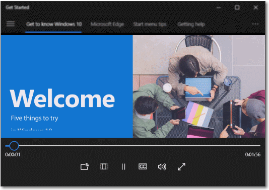

# メディア プレーヤー

ビデオ、オーディオ、および画像を表示したり聴いたりするには、メディア プレーヤーを使います。 メディアはインラインで (ページに埋め込むか、その他のコントロールのグループを使う) 再生するか、専用の全画面表示で再生できます。 プレーヤーのボタン セットやコントロール バーの背景を変更したり、必要に応じてレイアウトを整理したりできます。 ユーザーが必要とするのは基本的なコントロール セット (再生/一時停止、巻き戻し、早送り) です。


<span class="sidebar_heading" style="font-weight: bold;">重要な API</span>

-   [**MediaElement クラス**](https://msdn.microsoft.com/library/windows/apps/br242926)
-   [**MediaTransportControls クラス**](https://msdn.microsoft.com/library/windows/apps/windows.ui.xaml.controls.mediatransportcontrols)

## 適切なコントロールの選択

アプリでオーディオまたはビデオを再生する場合は、メディア プレーヤーを使います。 画像のコレクションを表示するには、[フリップ ビュー](flipview.md)を使います。

## 例

Windows 10 Get Started アプリのメディア要素。



## メディア プレーヤーの作成
XAML で [**MediaElement**](https://msdn.microsoft.com/library/windows/apps/br242926) オブジェクトを作成してアプリにメディアを追加し、オーディオやビデオ ファイルを指定する Uniform Resource Identifier (URI) に [**Source**](https://msdn.microsoft.com/library/windows/apps/br227419) を設定します。

この XAML は [**MediaElement**](https://msdn.microsoft.com/library/windows/apps/br242926) を作成し、その [**Source**](https://msdn.microsoft.com/library/windows/apps/br227419) プロパティをアプリのローカルにあるビデオ ファイルの URI に設定するコードを示します。 ページが読み込まれると、**MediaElement** によって再生が開始します。 メディアがすぐに再生されないようにするには、[**AutoPlay**](https://msdn.microsoft.com/library/windows/apps/br227360) プロパティを **false** に設定します。

```xaml
<MediaElement x:Name="mediaSimple" 
              Source="Videos/video1.mp4" 
              Width="400" AutoPlay="False"/>
```

この XAML は、組み込みのトランスポート コントロールが有効である [**MediaElement**](https://msdn.microsoft.com/library/windows/apps/br242926) を作成し、[**AutoPlay**](https://msdn.microsoft.com/library/windows/apps/br227360) プロパティを **false** に設定します。


```csharp
<MediaElement x:Name="mediaPlayer" 
              Source="Videos/video1.mp4" 
              Width="400" 
              AutoPlay="False"
              AreTransportControlsEnabled="True"/>
```

### メディア トランスポート コントロール
MediaElement には、再生、停止、一時停止、音量、ミュート、シーク (進行状況)、オーディオ トラックの選択を処理する組み込みのトランスポート コントロールがあります。 これらのコントロールを有効にするには、[**AreTransportControlsEnabled**](https://msdn.microsoft.com/library/windows/apps/dn298977) を **true** に設定します。 これらのコントロールを無効にするには、**AreTransportControlsEnabled** を **false** に設定します。 トランスポート コントロールは、[**MediaTransportControls**](https://msdn.microsoft.com/library/windows/apps/dn831962) クラスで表されます。 トランスポート コントロールは、そのまま使用することも、さまざまな方法でカスタマイズすることもできます。 詳しくは、[**MediaTransportControls**](https://msdn.microsoft.com/library/windows/apps/dn831962) クラスのリファレンスと「[カスタム トランスポート コントロールを作成する](custom-transport-controls.md)」をご覧ください。

トランスポート コントロールによって、ユーザーは [**MediaElement**](https://msdn.microsoft.com/library/windows/apps/br242926) のほとんどの機能を制御できますが、**MediaElement** にもオーディオとビデオの再生を制御するために使用できる多くのプロパティとメソッドが用意されています。 詳しくは、この記事で後述する「[プログラムによって MediaElement を制御する](#control_mediaelement_programmatically)」をご覧ください。

トランスポート コントロールは 1 行および 2 行のレイアウトをサポートします。 最初の例は、メディアのタイムラインの左側に再生/一時停止ボタンを配置した 1 行のレイアウトです。 このレイアウトは、コンパクトな画面に適しています。 


ほとんどの使用シナリオ (特に大きな画面) では、2 行のコントロールのレイアウト (下の図) をお勧めします。 このレイアウトでは、コントロールの領域がより多く確保されており、ユーザーが簡単にタイムラインを操作できます。


**システム メディア トランスポート コントロール**

[
            **MediaElement**](https://msdn.microsoft.com/library/windows/apps/br242926) をシステム メディア トランスポート コントロールに統合することもできます。 システム トランスポート コントロールは、キーボードのメディア ボタンなどのハードウェア メディア キーを押すとポップアップするコントロールです。 ユーザーがキーボードの一時停止キーを押し、アプリが [**SystemMediaTransportControls**](https://msdn.microsoft.com/library/windows/apps/dn278677) をサポートしている場合、アプリは通知を受け取り、ユーザーは適切なアクションを実行できます。 詳しくは、「[システム メディア トランスポート コントロール](https://msdn.microsoft.com/library/windows/apps/mt228338)」をご覧ください。

### メディア ソースを設定する
ネットワーク上のファイルまたはアプリに埋め込まれたファイルを再生する場合は、[**Source**](https://msdn.microsoft.com/library/windows/apps/br227419) プロパティをファイルのパスに設定します。

**ヒント**  インターネットからファイルを開くには、アプリのマニフェスト (Package.appxmanifest) で **Internet (Client)** 機能を宣言する必要があります。 機能の宣言について詳しくは、「[アプリ機能の宣言](https://msdn.microsoft.com/library/windows/apps/mt270968)」をご覧ください。

 

次のコードでは、XAML で定義した [**MediaElement**](https://msdn.microsoft.com/library/windows/apps/br242926) の [**Source**](https://msdn.microsoft.com/library/windows/apps/br227419) プロパティを、[**TextBox**](https://msdn.microsoft.com/library/windows/apps/br209683) に入力したファイルのパスに設定してみます。

```xaml
<TextBox x:Name="txtFilePath" Width="400" 
         FontSize="20"
         KeyUp="TxtFilePath_KeyUp"
         Header="File path"
         PlaceholderText="Enter file path"/>
```

```csharp
private void TxtFilePath_KeyUp(object sender, KeyRoutedEventArgs e)
{
    if (e.Key == Windows.System.VirtualKey.Enter)
    {
        TextBox tbPath = sender as TextBox;

        if (tbPath != null)
        {
            LoadMediaFromString(tbPath.Text);
        }
    }
}

private void LoadMediaFromString(string path)
{
    try
    {
        Uri pathUri = new Uri(path);
        mediaPlayer.Source = pathUri;
    }
    catch (Exception ex)
    {
        if (ex is FormatException)
        {
            // handle exception. 
            // For example: Log error or notify user problem with file
        }
    }
}
```

メディア ソースをアプリに埋め込まれたメディア ファイルに設定するには、**ms-appx:///** で始まるパスで [**Uri**](https://msdn.microsoft.com/library/windows/apps/br226017) を作成し、それに [**Source**](https://msdn.microsoft.com/library/windows/apps/br227419) を設定します。 たとえば、**Videos** サブフォルダーにある **video1.mp4** というファイルのパスは、**ms-appx:///Videos/video1.mp4** のようになります。

次のコードは、XAML で定義した [**MediaElement**](https://msdn.microsoft.com/library/windows/apps/br242926) の [**Source**](https://msdn.microsoft.com/library/windows/apps/br227419) プロパティを **ms-appx:///Videos/video1.mp4** に設定します。

```csharp
private void LoadEmbeddedAppFile()
{
    try
    {
        Uri pathUri = new Uri("ms-appx:///Videos/video1.mp4");
        mediaPlayer.Source = pathUri;
    }
    catch (Exception ex)
    {
        if (ex is FormatException)
        {
            // handle exception. 
            // For example: Log error or notify user problem with file
        }
    }
}
```

### ローカル メディア ファイルを開く
ローカル システムや OneDrive のファイルを開くには、[**FileOpenPicker**](https://msdn.microsoft.com/library/windows/apps/br207847) を使ってファイルを取得し、[**SetSource**](https://msdn.microsoft.com/library/windows/apps/br244338) を使ってメディア ソースを設定します。または、プログラムによってユーザーのメディア フォルダーにアクセスすることもできます。

アプリがユーザーの操作なしで、**Music** または **Video** フォルダーにアクセスする必要がある場合、たとえばユーザーのコレクションのすべての音楽ファイルやビデオ ファイルを列挙し、アプリで表示する場合は、**音楽ライブラリ**および**ビデオ ライブラリ**機能を宣言する必要があります。 詳しくは、「[ミュージック、画像、およびビデオ ライブラリのファイルとフォルダー](https://msdn.microsoft.com/library/windows/apps/mt188703)」をご覧ください。

ユーザーはどのファイルにアクセスしているかを完全に制御できるので、[**FileOpenPicker**](https://msdn.microsoft.com/library/windows/apps/br207847) には、ユーザーの **Music** または **Video** フォルダーなど、ローカル ファイル システム上のファイルにアクセスするための特別な機能は必要ありません。 セキュリティとプライバシーの観点から、アプリで使用する機能の数は最小限にすることをお勧めします。

**FileOpenPicker を使用してローカル メディア開くには**

1.  ユーザーがメディア ファイルを選べるようにするには、[**FileOpenPicker**](https://msdn.microsoft.com/library/windows/apps/br207847) を呼び出します。

    [
            **FileOpenPicker**](https://msdn.microsoft.com/library/windows/apps/br207847) クラスを使って、メディア ファイルを選びます。 **FileOpenPicker** が表示するファイルの種類を指定する [**FileTypeFilter**](https://msdn.microsoft.com/library/windows/apps/br207850) を設定します。 [
            **PickSingleFileAsync**](https://msdn.microsoft.com/library/windows/apps/jj635275) を呼び出して、ファイル ピッカーを起動し、ファイルを取得します。

2.  [
            **SetSource**](https://msdn.microsoft.com/library/windows/apps/br244338) を呼び出して、選んだメディア ファイルを [**MediaElement.Source**](https://msdn.microsoft.com/library/windows/apps/br227419) として設定します。

    [
            **MediaElement**](https://msdn.microsoft.com/library/windows/apps/br242926) の [**Source**](https://msdn.microsoft.com/library/windows/apps/br227419) を [**FileOpenPicker**](https://msdn.microsoft.com/library/windows/apps/br207847) から返された [**StorageFile**](https://msdn.microsoft.com/library/windows/apps/br227171) に設定するには、ストリームを開く必要があります。 **StorageFile** の [**OpenAsync**](https://msdn.microsoft.com/library/windows/apps/dn889851) メソッドを呼び出します。このメソッドは、[**MediaElement.SetSource**](https://msdn.microsoft.com/library/windows/apps/br244338) メソッドに渡すことができるストリームを返します。 その後、**MediaElement** で [**Play**](https://msdn.microsoft.com/library/windows/apps/br227402) を呼び出して、メディアを開始します。

この例は、[**FileOpenPicker**](https://msdn.microsoft.com/library/windows/apps/br207847) を使ってファイルを選び、そのファイルを [**MediaElement**](https://msdn.microsoft.com/library/windows/apps/br242926) の [**Source**](https://msdn.microsoft.com/library/windows/apps/br227419) に設定する方法を示しています。

```xaml
<MediaElement x:Name="mediaPlayer"/>
...
<Button Content="Choose file" Click="Button_Click"/>
```

```csharp
private async void Button_Click(object sender, RoutedEventArgs e)
{
    await SetLocalMedia();
}

async private System.Threading.Tasks.Task SetLocalMedia()
{
    var openPicker = new Windows.Storage.Pickers.FileOpenPicker();

    openPicker.FileTypeFilter.Add(".wmv");
    openPicker.FileTypeFilter.Add(".mp4");
    openPicker.FileTypeFilter.Add(".wma");
    openPicker.FileTypeFilter.Add(".mp3");

    var file = await openPicker.PickSingleFileAsync();
    
    // mediaPlayer is a MediaElement defined in XAML
    if (file != null)
    {
        var stream = await file.OpenAsync(Windows.Storage.FileAccessMode.Read);
        mediaPlayer.SetSource(stream, file.ContentType);

        mediaPlayer.Play();
    }
}
```

### ポスター ソースを設定する
[
            **PosterSource**](https://msdn.microsoft.com/library/windows/apps/br227409) プロパティを使って、メディアの読み込みが終わるまで [**MediaElement**](https://msdn.microsoft.com/library/windows/apps/br242926) に視覚的な表示を提供することができます。 **PosterSource** は、スクリーン ショットや映画のポスターなど、メディアの代わりに表示される画像です。 **PosterSource** は、次のような状況で表示されます。

-   有効なソースが設定されていないとき。 たとえば、[**Source**](https://msdn.microsoft.com/library/windows/apps/br227419) が設定されていないとき、**Source** が **Null** に設定されているとき、またはソースが無効であるとき ([**MediaFailed**](https://msdn.microsoft.com/library/windows/apps/br227393) イベントが発生したときと同様) です。
-   メディアの読み込み中。 たとえば、有効なソースが設定されていても、[**MediaOpened**](https://msdn.microsoft.com/library/windows/apps/br227394) イベントがまだ発生していないときです。
-   別のデバイスにメディアをストリーミングしているとき。
-   メディアがオーディオのみであるとき。

[
            **Source**](https://msdn.microsoft.com/library/windows/apps/br227419) がアルバムのトラックに設定され、[**PosterSource**](https://msdn.microsoft.com/library/windows/apps/br227409) がアルバムの表紙の画像を設定された [**MediaElement**](https://msdn.microsoft.com/library/windows/apps/br242926) を以下に示します。

```xaml
<MediaElement Source="Media/Track1.mp4" PosterSource="Media/AlbumCover.png"/> 
```

### デバイスの画面をアクティブに維持する
通常、ユーザーがいないときはバッテリーを節約するために画面が暗くなり、最終的には電源がオフになりますが、ビデオ アプリでは、ユーザーがビデオを見られるように画面をオンのままにしておく必要があります。 アプリで全画面表示でビデオを再生しているときなど、無操作状態が検出されてもディスプレイの電源が切れないようにするためには、[**DisplayRequest.RequestActive**](https://msdn.microsoft.com/library/windows/apps/br241818) を呼び出します。 [
            **DisplayRequest**](https://msdn.microsoft.com/library/windows/apps/br241816) クラスを使うと、ユーザーがビデオを見られるように画面をオンのままにするよう Windows に指示することができます。

消費電力とバッテリーの駆動時間を節約するため、不要になったら、[**DisplayRequest.RequestRelease**](https://msdn.microsoft.com/library/windows/apps/br241819) を呼び出して表示要求を解放してください。 Windows は、アプリが画面から消されると自動的にアプリのアクティブな表示要求を非アクティブ化し、アプリがフォアグラウンドに戻ると再びアクティブ化します。

表示要求を解放する必要があるのは、次のような場合です。

-   ユーザーの操作、バッファリング、限られた帯域幅のための調整などでビデオの再生が一時停止になる。
-   再生が停止する。 たとえば、ビデオの再生が完了したり、プレゼンテーションが終了したりする。
-   再生エラーが発生した。 たとえば、ネットワーク接続の問題や破損したファイル。

**画面をアクティブに維持するには**

1.  [
            **DisplayRequest**](https://msdn.microsoft.com/library/windows/apps/br241816) グローバル変数を作成します。 null に初期化します。
```csharp
// Create this variable at a global scope. Set it to null.
private DisplayRequest appDisplayRequest = null;
```

2.  [
            **RequestActive**](https://msdn.microsoft.com/library/windows/apps/br241818) を呼び出して、アプリで表示をオンのままにする必要があることを Windows に通知します。

3.  ビデオの再生が再生エラーによって停止、一時停止、中断したときには必ず、[**RequestRelease**](https://msdn.microsoft.com/library/windows/apps/br241819) を呼び出して表示要求を解放します。 アプリにアクティブな表示要求がなくなった場合、Windows は、デバイスが使われていないときには表示を暗くし、最終的には電源をオフにしてバッテリーを節約します。

    ここでは、[**CurrentStateChanged**](https://msdn.microsoft.com/library/windows/apps/br227375) イベントを使って、このような状況を検出します。 次に、[**IsAudioOnly**](https://msdn.microsoft.com/library/windows/apps/hh965334) プロパティを使って、オーディオ ファイルとビデオ ファイルのどちらが再生されているかを確認し、ビデオが再生されている場合にのみ画面をアクティブなままにします。
    ```xaml
<MediaElement Source="Media/video1.mp4"
              CurrentStateChanged="MediaElement_CurrentStateChanged"/>
    ```
 
    ```csharp
private void MediaElement_CurrentStateChanged(object sender, RoutedEventArgs e)
{
    MediaElement mediaElement = sender as MediaElement;
    if (mediaElement != null && mediaElement.IsAudioOnly == false)
    {
        if (mediaElement.CurrentState == Windows.UI.Xaml.Media.MediaElementState.Playing)
        {                
            if (appDisplayRequest == null)
            {
                // This call creates an instance of the DisplayRequest object. 
                appDisplayRequest = new DisplayRequest();
                appDisplayRequest.RequestActive();
            }
        }
        else // CurrentState is Buffering, Closed, Opening, Paused, or Stopped. 
        {
            if (appDisplayRequest != null)
            {
                // Deactivate the display request and set the var to null.
                appDisplayRequest.RequestRelease();
                appDisplayRequest = null;
            }
        }            
    }
} 
    ```

### プログラムでメディア プレーヤーを制御する
[**MediaElement**](https://msdn.microsoft.com/library/windows/apps/br242926) には、オーディオやビデオの再生を制御するプロパティ、メソッド、イベントが多数用意されています。 プロパティ、メソッド、イベントの完全な一覧については、[**MediaElement**](https://msdn.microsoft.com/library/windows/apps/br242926) のリファレンス ページをご覧ください。
    

### さまざまな言語のオーディオ トラックを選ぶ

[
            **AudioStreamIndex**](https://msdn.microsoft.com/library/windows/apps/br227358) プロパティと [**GetAudioStreamLanguage**](https://msdn.microsoft.com/library/windows/apps/br227384) メソッドを使って、ビデオのオーディオをさまざまな言語のトラックに変更します。 ビデオには、映画についての監督コメントなど、同じ言語による複数のオーディオ トラックを含めることもできます。 この例では、具体的にさまざまな言語を切り替える方法を示していますが、このコードを変更して任意のオーディオ トラックに切り替えることができます。

**さまざまな言語のオーディオ トラックを選ぶには**

1.  オーディオ トラックを取得します。

    特定の言語のトラックを検索するには、ビデオの各オーディオ トラックを反復処理することで開始します。 [
            **AudioStreamCount**](https://msdn.microsoft.com/library/windows/apps/br227356) を **for** ループの最大値として使います。

2.  オーディオ トラックの言語を取得します。

    [
            **GetAudioStreamLanguage**](https://msdn.microsoft.com/library/windows/apps/br227384) メソッドを使ってトラックの言語を取得します。 トラックの言語は、英語の **"en"**、日本語の **"ja"** などの[言語コード](http://msdn.microsoft.com/library/ms533052(vs.85).aspx)で識別されます。

3.  アクティブなオーディオ トラックを設定します。

    目的の言語のトラックが見つかったら、[**AudioStreamIndex**](https://msdn.microsoft.com/library/windows/apps/br227358) をそのトラックのインデックスに設定します。 **AudioStreamIndex** を **null** に設定すると、コンテンツで定義された既定のオーディオ トラックが選ばれます。

指定した言語にオーディオ トラックを設定するコードを次に示します。 [
            **MediaElement**](https://msdn.microsoft.com/library/windows/apps/br242926) オブジェクトのオーディオ トラックを反復処理し、[**GetAudioStreamLanguage**](https://msdn.microsoft.com/library/windows/apps/br227384) を使って各トラックの言語を取得しています。 目的の言語のトラックが存在する場合は、[**AudioStreamIndex**](https://msdn.microsoft.com/library/windows/apps/br227358) がそのトラックのインデックスに設定されます。

```csharp
/// <summary>
/// Attemps to set the audio track of a video to a specific language
/// </summary>
/// <param name="lcid">The id of the language. For example, "en" or "ja"</param>
/// <returns>true if the track was set; otherwise, false.</returns>
private bool SetAudioLanguage(string lcid, MediaElement media)
{
    bool wasLanguageSet = false;

    for (int index = 0; index < media.AudioStreamCount; index++)
    {
        if (media.GetAudioStreamLanguage(index) == lcid)
        {
            media.AudioStreamIndex = index;
            wasLanguageSet = true;
        }
    }

    return wasLanguageSet;
}
```

### フル ウィンドウのビデオ レンダリングを有効にする

フル ウィンドウのレンダリングを有効または無効にするには、[**IsFullWindow**](https://msdn.microsoft.com/library/windows/apps/dn298980) プロパティを設定します。 プログラムを使ってアプリにフル ウィンドウのレンダリングを設定する場合、手動で行う代わりに **IsFullWindow** を常に使う必要があります。 **IsFullWindow** により、システム レベルの最適化が実行され、パフォーマンスとバッテリーの寿命が向上します。 フル ウィンドウのレンダリングが正しく設定されていない場合、これらの最適化が有効になっていない可能性があります。

フル ウィンドウのレンダリングを切り替える [**AppBarButton**](https://msdn.microsoft.com/library/windows/apps/dn279244) を作成するコードを次に示します。

```xaml
<AppBarButton Icon="FullScreen" 
              Label="Full Window"
              Click="FullWindow_Click"/>>
```

```csharp
private void FullWindow_Click(object sender, object e)
{
    mediaPlayer.IsFullWindow = !media.IsFullWindow;
}
```

### ビデオのサイズを変更し、拡大する

[
            **Stretch**](https://msdn.microsoft.com/library/windows/apps/br227422) プロパティを使って、コンテナー内でのビデオ コンテンツのサイズを変更します。 この要素は、[**Stretch**](https://msdn.microsoft.com/library/windows/apps/br242968) の値に応じてビデオのサイズ変更と拡大を行います。 **Stretch** 状態は、多くのテレビ セットの画像サイズの設定に似ています。 ボタンにフックしてユーザーが好みの設定を選ぶことができるようにします。

-   [**None**](https://msdn.microsoft.com/library/windows/apps/br242968) は、元のサイズでコンテンツのネイティブの解像度を表示します。
-   [**Uniform**](https://msdn.microsoft.com/library/windows/apps/br242968) は、縦横比、画像コンテンツを維持したままスペースを最大限に使用します。 これにより、ビデオの端に水平方向または垂直方向の黒いバーが表示されることがあります。 これはワイドスクリーン モードに似ています。
-   [**UniformToFill**](https://msdn.microsoft.com/library/windows/apps/br242968) は、縦横比を維持したままスペース全体を使用します。 これにより、画像の一部がトリミングされることがあります。 これは全画面モードに似ています。
-   [**Fill**](https://msdn.microsoft.com/library/windows/apps/br242968) は、縦横比を維持せずに、スペース全体を使用します。 画像はトリミングされませんが、拡大されることがあります。 これはストレッチ モードに似ています。


ここでは、[**AppBarButton**](https://msdn.microsoft.com/library/windows/apps/dn279244) を使って、[**Stretch**](https://msdn.microsoft.com/library/windows/apps/br242968) オプションを順に切り替えます。 **switch** ステートメントは、[**Stretch**](https://msdn.microsoft.com/library/windows/apps/br227422) プロパティの現在の状態をチェックし、**Stretch** 列挙で次の値を設定します。 これにより、ユーザーはさまざまな拡大の状態を順番に表示することができます。

```xaml
<AppBarButton Icon="Switch" 
              Label="Resize Video"
              Click="PictureSize_Click" />
```

```csharp
private void PictureSize_Click(object sender, RoutedEventArgs e)
{
    switch (mediaPlayer.Stretch)
    {
        case Stretch.Fill:
            mediaPlayer.Stretch = Stretch.None;
            break;
        case Stretch.None:
            mediaPlayer.Stretch = Stretch.Uniform;
            break;
        case Stretch.Uniform:
            mediaPlayer.Stretch = Stretch.UniformToFill;
            break;
        case Stretch.UniformToFill:
            mediaPlayer.Stretch = Stretch.Fill;
            break;
        default:
            break;
    }
}
```

### 待機時間が短い再生を可能にする

[
            **RealTimePlayback**](https://msdn.microsoft.com/library/windows/apps/br227414) プロパティを **true** に設定すると、[**MediaElement**](https://msdn.microsoft.com/library/windows/apps/br242926) の再生の最初の待機時間を短くすることができます。 これは双方向通信アプリには重要で、ゲームのシナリオにも適用できる場合があります。 このモードでは、リソースがより多く消費され、電力効率が低下する点に注意してください。

この例では、[**MediaElement**](https://msdn.microsoft.com/library/windows/apps/br242926) を作って、[**RealTimePlayback**](https://msdn.microsoft.com/library/windows/apps/br227414) を **true** に設定します。

```xaml
<MediaElement x:Name="mediaPlayer" RealTimePlayback="True"/>
```

```csharp
MediaElement mediaPlayer = new MediaElement();
mediaPlayer.RealTimePlayback = true;
```
    
## 推奨事項 

メディア プレーヤーには濃色テーマと淡色テーマがありますが、ほとんどの場合は濃色テーマを選びます。 暗い背景を使うと、(特に高感度条件では) コントラストが強調され、表示エクスペリエンスに影響を及ぼすコントロール バーが制限されます。

インライン モードで全画面表示モードのレベルを上げて、専用の表示エクスペリエンスを使うことをお勧めします。 全画面表示エクスペリエンスが最適であり、インライン モードではオプションが制限されます。

画面領域がある場合は、2 行のレイアウトを採用します。 このレイアウトでは、コンパクトな 1 行のレイアウトよりもコントロールの領域が多く確保されます。

アプリに最適なエクスペリエンスを実現するには、以下の点に注意して、必要なカスタム オプションをメディア プレーヤーに追加します。

-   メディア再生エクスペリエンス用に最適化されている既定のコントロールのカスタマイズを制限します。
-   携帯電話およびその他のモバイル デバイスでは、デバイスのクロムは黒のままですが、ノート PC やデスクトップ PC では、デバイスのクロムはユーザーのテーマ カラーを継承します。
-   多数のオプションを含むコントロール バーをオーバーロードしないでください。
-   メディアのタイムラインを既定の最小サイズよりも縮小しないでください。この操作を行うと、タイムラインの効果が大きく制限されます。

\[この記事には、ユニバーサル Windows プラットフォーム (UWP) アプリと Windows 10 に固有の情報が含まれています。 Windows 8.1 のガイダンスについては、[Windows 8.1 ガイドラインの PDF](https://go.microsoft.com/fwlink/p/?linkid=258743) ファイルをダウンロードしてください。\]

## 関連記事

- [UWP アプリのコマンド設計の基本](https://msdn.microsoft.com/library/windows/apps/dn958433)
- [UWP アプリのコンテンツ デザインの基本](https://msdn.microsoft.com/library/windows/apps/dn958434)


<!--HONumber=Mar16_HO4-->


