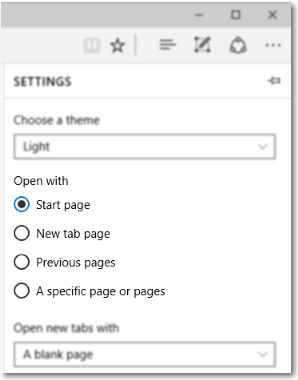

# ラジオ ボタン
ラジオ ボタンでは、ユーザーは 2 つ以上の選択肢から 1 つのオプションを選ぶことができます。 各オプションは、1 つのラジオ ボタンによって表されます。ユーザーは、ラジオ ボタン グループの中から、1 つのラジオ ボタンだけを選ぶことができます。

ラジオ ボタンという名称は、ラジオのチャンネル プリセットのボタンから付けられました。


<span class="sidebar_heading" style="font-weight: bold;">重要な API</span>

-   [**RadioButton クラス**](https://msdn.microsoft.com/library/windows/apps/br227544)
-   [**Checked イベント**](https://msdn.microsoft.com/library/windows/apps/windows.ui.xaml.controls.primitives.togglebutton.checked.aspx)
-   [**IsChecked プロパティ**](https://msdn.microsoft.com/library/windows/apps/windows.ui.xaml.controls.primitives.togglebutton.ischecked.aspx)

## 適切なコントロールの選択

ユーザーに 2 つ以上の相互排他的なオプションを提示するには、次のようにラジオ ボタンを使います。


ラジオ ボタンはわかりやすく、アプリで重要なオプションを目立つように表示します。 ラジオ ボタンは、広い画面領域を使うに値する重要なオプションを表示する場合であって、選択肢が明確なためにわかりやすいオプション表示が必要な場合に使用してます。

ラジオ ボタンはすべてのオプションを均等に強調するため、必要以上に注目される可能性があります。 ユーザーの特別な注目を引く必要がない場合は、他のコントロールを使うことを検討してください。 たとえば、ほとんどの状況でほとんどのユーザーに既定のオプションが適切な場合は、代わりに[ドロップダウン リスト](lists.md)を使います。

2 つだけの相互排他的なオプションの場合は、1 つの[チェック ボックス](checkbox.md)または[トグル スイッチ](toggles.md)にまとめます。 たとえば、"I agree" と "I don't agree" という 2 つのラジオ ボタンではなく、"I agree" のチェック ボックスを使います。


ユーザーが複数のオプションを選択できる場合は、代わりに[チェック ボックス](checkbox.md)または[リスト ボックス](lists.md) コントロールを使います。


オプションが 10、20、30 のように固定間隔の数値である場合は、ラジオ ボタンを使いません。 代わりに、[スライダー](slider.md) コントロールを使います。

オプションが 8 個より多い場合は、[ドロップダウン リスト](lists.md)、単一選択の[リスト ボックス](lists.md)、または[リスト ボックス](lists.md)を使います。

オプションがアプリの現在のコンテキストに基づいて表示される場合や、その他の方法で動的に変化する場合は、単一選択の [リスト ボックス](lists.md) を使います。

## 例
Microsoft Edge ブラウザーでのラジオ ボタンの設定です。



## ラジオ ボタンの作成

ラジオ ボタンは、グループで動作します。 ラジオ ボタン コントロールをグループ化する 2 つの方法があります。
- 同じ親コンテナー内に追加します。
- 各オプション ボタンの [**GroupName**](https://msdn.microsoft.com/library/windows/apps/windows.ui.xaml.controls.radiobutton.groupname.aspx) プロパティを同じ値に設定します。

> **注** &nbsp;&nbsp; キーボード経由でアクセスした場合、ラジオ ボタンのグループは、1 つのコントロールのように動作します。 Tab キーを使うと選んだオプションにのみアクセスできますが、方向キーを使ってグループを切り替えることができます。

この例では、スタック パネルを同じにすることでラジオ ボタンの最初のグループが暗黙的にグループ化されます。 2 つ目のグループは、2 つのスタック パネルの間で分割されているので、GroupName で明示的にグループ化されます。

```xaml
<StackPanel>
    <StackPanel>
        <TextBlock Text="Background" Style="{ThemeResource BaseTextBlockStyle}"/>
        <StackPanel Orientation="Horizontal">
            <RadioButton Content="Green" Tag="Green" Checked="BGRadioButton_Checked"/>
            <RadioButton Content="Yellow" Tag="Yellow" Checked="BGRadioButton_Checked"/>
            <RadioButton Content="Blue" Tag="Blue" Checked="BGRadioButton_Checked"/>
            <RadioButton Content="White" Tag="White" Checked="BGRadioButton_Checked" IsChecked="True"/>
        </StackPanel>
    </StackPanel>
    <StackPanel>
        <TextBlock Text="BorderBrush" Style="{ThemeResource BaseTextBlockStyle}"/>
        <StackPanel Orientation="Horizontal">
            <StackPanel>
                <RadioButton Content="Green" GroupName="BorderBrush" Tag="Green" Checked="BorderRadioButton_Checked"/>
                <RadioButton Content="Yellow" GroupName="BorderBrush" Tag="Yellow" Checked="BorderRadioButton_Checked" IsChecked="True"/>
            </StackPanel>
            <StackPanel>
                <RadioButton Content="Blue" GroupName="BorderBrush" Tag="Blue" Checked="BorderRadioButton_Checked"/>
                <RadioButton Content="White" GroupName="BorderBrush" Tag="White"  Checked="BorderRadioButton_Checked"/>
            </StackPanel>
        </StackPanel>
    </StackPanel>
    <Border x:Name="BorderExample1" BorderThickness="10" BorderBrush="#FFFFD700" Background="#FFFFFFFF" Height="50" Margin="0,10,0,10"/>
</StackPanel>
```

```csharp
private void BGRadioButton_Checked(object sender, RoutedEventArgs e)
{
    RadioButton rb = sender as RadioButton;

    if (rb != null && BorderExample1 != null)
    {
        string colorName = rb.Tag.ToString();
        switch (colorName)
        {
            case "Yellow":
                BorderExample1.Background = new SolidColorBrush(Colors.Yellow);
                break;
            case "Green":
                BorderExample1.Background = new SolidColorBrush(Colors.Green);
                break;
            case "Blue":
                BorderExample1.Background = new SolidColorBrush(Colors.Blue);
                break;
            case "White":
                BorderExample1.Background = new SolidColorBrush(Colors.White);
                break;
        }
    }
}

private void BorderRadioButton_Checked(object sender, RoutedEventArgs e)
{
    RadioButton rb = sender as RadioButton;

    if (rb != null && BorderExample1 != null)
    {
        string colorName = rb.Tag.ToString();
        switch (colorName)
        {
            case "Yellow":
                BorderExample1.BorderBrush = new SolidColorBrush(Colors.Gold);
                break;
            case "Green":
                BorderExample1.BorderBrush = new SolidColorBrush(Colors.DarkGreen);
                break;
            case "Blue":
                BorderExample1.BorderBrush = new SolidColorBrush(Colors.DarkBlue);
                break;
            case "White":
                BorderExample1.BorderBrush = new SolidColorBrush(Colors.White);
                break;
        }
    }
}
```

ラジオ ボタンのグループは、次のようになります。


ラジオ ボタンには*選択*または*クリア*の 2 つの状態があります。 ラジオ ボタンを選択すると、[**IsChecked**](https://msdn.microsoft.com/library/windows/apps/windows.ui.xaml.controls.primitives.togglebutton.ischecked.aspx) プロパティは **true** になります。 ラジオ ボタンがクリアされると、**IsChecked** プロパティは **false** になります。 同じグループ内の別のラジオ ボタンをクリックするとラジオ ボタンをクリアにできますが、ボタンをもう一度クリックしてもクリアにすることはできません。 ただし、プログラムで IsChecked プロパティを **false** に設定してラジオ ボタンをクリアにすることができます。

## 推奨事項

-   一連のラジオ ボタンの用途と現在の状態が明確に表示されていることを確認します。
-   ユーザーがラジオ ボタンをタップしたときには、必ず視覚的なフィードバックを返します。
-   ユーザーのラジオ ボタンの操作に合わせて、視覚的なフィードバックを返します。 ラジオ ボタンの状態には、たとえば、標準、押された状態、オンの状態、オフの状態があります。 ユーザーは、ラジオ ボタンをタップして関連のオプションをアクティブ化します。 アクティブなオプションをもう一度タップしても非アクティブにはなりませんが、別のオプションをタップすると、そのオプションにアクティブ化の状態が移ります。
-   タッチに対するフィードバック用とオンの状態用に視覚効果やアニメーションを予約します。オフの状態のラジオ ボタン コントロールは、使われていない、または非アクティブなコントロールとして表示します (無効なコントロールとして表示しないでください)。
-   ラジオ ボタンのテキスト コンテンツは、1 行に収まるように作成します。 ラジオ ボタンの視覚効果をカスタマイズして、メインのテキスト行の下に小さいフォント サイズでオプションの説明を表示することができます。
-   テキスト コンテンツが動的な場合、ボタンのサイズがどのように変わり、周囲の視覚効果にどのような影響が生じるかを検討してください。
-   ブランドのガイドラインで別のフォントが指示されていない限り、既定のフォントを使います。
-   ラベルをタップするとラジオ ボタンが選択されるように、ラベル要素でラジオ ボタンを囲みます。
-   ラベル テキストは、ラジオ ボタン コントロールの前や上ではなく、後に配置します。
-   ラジオ ボタンをカスタマイズすることを検討してください。 既定のラジオ ボタンは、2 つの同心円 (内側の円は塗りつぶされ、オンの場合に表示。外側の円はストロークのみ) とテキスト コンテンツで構成されています。 しかし、工夫しだいで使いやすさが向上します。 アプリのコンテンツを直接操作できれば、ユーザーが理解しやすくなります。 たとえば、グラフィックやさりげないテキストのトグル ボタンを使って、提供する実際のコンテンツを表示することもできます。
-   ラジオ ボタン グループには、8 個以上のオプションを含めないでください。 それより多くのオプションを提示する必要がある場合は、代わりに [ドロップダウン リスト](lists.md)、[リスト ボックス](lists.md)、[リスト ビュー](lists.md) などを使います。
-   2 つのラジオ ボタン グループを並べて配置しないようにします。 2 つのラジオ ボタン グループが並んでいると、どのボタンがどのグループに属しているかがわかりにくくなります。 グループを分けるには、グループ ラベルを使います。

## その他の使い方のガイダンス

この図は、適切な位置と間隔で配置したラジオ ボタンを示しています。


## 関連トピック

**デザイナー向け**
- [ボタンのガイドライン](buttons.md)
- [トグル スイッチのガイドライン](toggles.md)
- [チェック ボックスのガイドライン](checkbox.md)
- [ドロップダウン リストのガイドライン](lists.md)
- [リスト ビュー コントロールとグリッド ビュー コントロールのガイドライン](lists.md)
- [スライダーのガイドライン](slider.md)
- [選択コントロールのガイドライン](lists.md)


**開発者向け (XAML)**
- [**Windows.UI.Xaml.Controls RadioButton クラス**](https://msdn.microsoft.com/library/windows/apps/br227544)


<!--HONumber=Mar16_HO1-->


