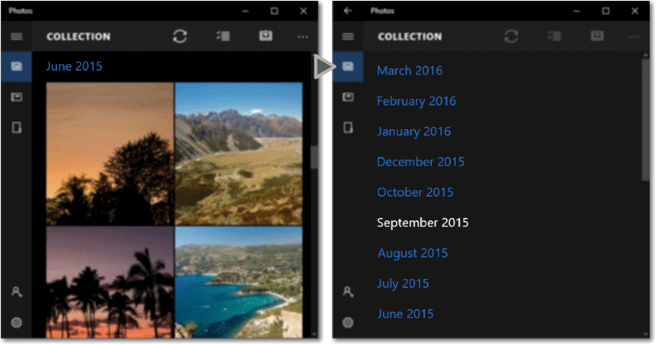

# <a name="semantic-zoom"></a>セマンティック ズーム

<link rel="stylesheet" href="https://az835927.vo.msecnd.net/sites/uwp/Resources/css/custom.css"> 

セマンティック ズームを使用すると、ユーザーは同じコンテンツを 2 種類のビューで表示できるようになるので、グループ化された大きなデータ セット内を迅速に移動できるようになります。
 
- 拡大表示は、コンテンツのメイン表示です。 これは、個別のデータ項目を表示するためのメイン ビューです。 
- 縮小表示は、同じコンテンツの上位レベルの表示です。 通常、グループ化されたデータ セットのグループ ヘッダーは、このビューで表示します。 

たとえば、アドレス帳を表示しているときに、表示を縮小して "W" の文字にすばやく移動したり、文字を拡大表示して、その文字に関連付けられた名前を調べたりすることができます。 

<div class="important-apis" >
<b>重要な API</b><br/>
<ul>
<li>[**SemanticZoom クラス**](https://msdn.microsoft.com/library/windows/apps/hh702601)</li>
<li>[**ListView クラス**](https://msdn.microsoft.com/library/windows/apps/xaml/windows.ui.xaml.controls.listview.aspx)</li>
<li>[**GridView クラス**](https://msdn.microsoft.com/library/windows/apps/xaml/windows.ui.xaml.controls.gridview.aspx)</li>
</ul>
</div>

**機能**:

-   縮小表示ビューのサイズは、セマンティック ズーム コントロールの境界によって制限されます。
-   グループ ヘッダーをタップするとビューが切り替わります。 ピンチしてビューを切り替える方法を有効にできます。
-   アクティブなヘッダーによりビューが切り替わります。

## <a name="is-this-the-right-control"></a>適切なコントロールの選択

**SemanticZoom** コントロールは、グループ化されたデータ セットを表示する際、データが大きすぎて 1 ページや 2 ページでは表示しきれない場合に使用します。

セマンティック ズームと光学式ズームを混同しないように気を付けてください。 操作方法と基本的な動作 (ズーム係数に基づいて詳しく表示したり簡単に表示したりする動作) は同じですが、光学式ズームでは、コンテンツ領域またはオブジェクトの倍率調整を写真のように行います。 光学式ズームを行うコントロールについて詳しくは、[**ScrollViewer**](https://msdn.microsoft.com/library/windows/apps/windows.ui.xaml.controls.scrollviewer.aspx) コントロールの説明をご覧ください。

## <a name="examples"></a>例

**フォト アプリ**

フォト アプリで使われるセマンティック ズームの例です。 写真は月ごとにグループ化されています。 既定のグリッド ビューで月ヘッダーを選択すると、月の一覧ビューにズームアウトして、すばやく移動できます。



**アドレス帳**

セマンティック ズームを使って簡単にナビゲートできるデータ セットの例として、アドレス帳があります。 縮小表示ビューを使用すると、必要な文字にすばやく移動できます (左の画像)。拡大表示ビューには、個別のデータ項目が表示されます (右の画像)。


## <a name="create-a-semantic-zoom"></a>セマンティック ズームの作成

**SemanticZoom**コントロールには、独自の視覚的表現はありません。 SemanticZoom は、コンテンツを表示する 2 つのコントロール (通常は **ListView** コントロールと **GridView** コントロール) 間の切り替えを管理する、ホスト コントロールです。  開発者は、これらのビュー コントロールを SemanticZoom の [ **ZoomedInView** ](https://msdn.microsoft.com/library/windows/apps/xaml/windows.ui.xaml.controls.semanticzoom.zoomedinview.aspx) プロパティと [ **ZoomedOutView** ](https://msdn.microsoft.com/library/windows/apps/xaml/windows.ui.xaml.controls.semanticzoom.zoomedoutview.aspx) プロパティに設定します。

セマンティック ズームに必要な 3 つの要素は次のとおりです。
- グループ化されたデータ ソース
- 項目レベルのデータを表示する拡大表示ビュー。
- グループ レベルのデータを表示する縮小表示ビュー。

セマンティック ズームを使用する前に、グループ化されたデータに対してリスト ビューを使用する方法を理解する必要があります。 詳しくは、「[リスト ビューとグリッド ビュー](listview-and-gridview.md)」と「[リスト内の項目のグループ化]()」をご覧ください。 

> **注**&nbsp;&nbsp;SemanticZoom コントロールの拡大表示ビューと縮小表示ビューを定義するには、[**ISemanticZoomInformation**]() インターフェイスを実装する任意のコントロールを 2 つ使用できます。 XAML フレームワークには、このインターフェイスを実装するコントロールが 3 つ用意されています。ListView、GridView、および Hub です。
 
 この XAML は、SemanticZoom コントロールの構造を示したものです。 ZoomedInView プロパティと ZoomedOutView プロパティに、他のコントロールを割り当てます。
 
 **XAML**
 ```xaml
<SemanticZoom>
    <SemanticZoom.ZoomedInView>
        <!-- Put the GridView for the zoomed out view here. -->   
    </SemanticZoom.ZoomedInView>

    <SemanticZoom.ZoomedOutView>
        <!-- Put the ListView for the zoomed in view here. -->       
    </SemanticZoom.ZoomedOutView>
</SemanticZoom>
 ```
 
この例は、「[XAML UI の基本サンプル](http://go.microsoft.com/fwlink/p/?LinkId=619992)」の SemanticZoom ページから引用したものです。 データ ソースを含む完全なコードは、このサンプルをダウンロードして確認できます。 このセマンティック ズームでは、拡大表示ビューに GridView を使用し、縮小表示ビューに ListView を使用しています。
  
**拡大表示ビューの定義**

ここでは、拡大表示ビューに GridView コントロールを使用する例を示します。 拡大表示ビューには、グループ内の個別のデータ項目が表示されます。 この例は、グリッド内の項目を画像とテキストで表示する方法を示したものです。 

**XAML**
```xaml
<SemanticZoom.ZoomedInView>
    <GridView ItemsSource="{x:Bind cvsGroups.View}" 
              ScrollViewer.IsHorizontalScrollChainingEnabled="False" 
              SelectionMode="None" 
              ItemTemplate="{StaticResource ZoomedInTemplate}">
        <GridView.GroupStyle>
            <GroupStyle HeaderTemplate="{StaticResource ZoomedInGroupHeaderTemplate}"/>
        </GridView.GroupStyle>
    </GridView>
</SemanticZoom.ZoomedInView>
```
 
グループ ヘッダーの外観は、`ZoomedInGroupHeaderTemplate` リソース内で定義されています。 項目の外観は、`ZoomedInTemplate` リソース内で定義されています。 

**XAML**   
```xaml
<DataTemplate x:Key="" x:DataType="data:ControlInfoDataGroup">
    <TextBlock Text="{x:Bind Title}" 
               Foreground="{ThemeResource ApplicationForegroundThemeBrush}" 
               Style="{StaticResource SubtitleTextBlockStyle}"/>
</DataTemplate>

<DataTemplate x:Key="ZoomedInTemplate" x:DataType="data:ControlInfoDataItem">
    <StackPanel Orientation="Horizontal" MinWidth="200" Margin="12,6,0,6">
        <Image Source="{x:Bind ImagePath}" Height="80" Width="80"/>
        <StackPanel Margin="20,0,0,0">
            <TextBlock Text="{x:Bind Title}" 
                       Style="{StaticResource BaseTextBlockStyle}"/>
            <TextBlock Text="{x:Bind Subtitle}" 
                       TextWrapping="Wrap" HorizontalAlignment="Left" 
                       Width="300" Style="{StaticResource BodyTextBlockStyle}"/>
        </StackPanel>
    </StackPanel>
</DataTemplate>
```

**縮小表示ビューの定義**

この XAML は、縮小表示用の ListView コントロールを定義したものです。 この例では、グループ ヘッダーをリスト内のテキストとして表示する方法を示しています。

**XAML**
```xaml
<SemanticZoom.ZoomedOutView>
    <ListView ItemsSource="{x:Bind cvsGroups.View.CollectionGroups}" 
              SelectionMode="None" 
              ItemTemplate="{StaticResource ZoomedOutTemplate}" />
</SemanticZoom.ZoomedOutView>
```

 外観は、`ZoomedOutTemplate` リソース内で定義されています。
 
 **XAML**   
```xaml    
<DataTemplate x:Key="ZoomedOutTemplate" x:DataType="wuxdata:ICollectionViewGroup">
    <TextBlock Text="{x:Bind Group.(data:ControlInfoDataGroup.Title)}" 
               Style="{StaticResource SubtitleTextBlockStyle}" TextWrapping="Wrap"/>
</DataTemplate>
```

**表示の同期**

拡大表示と縮小表示は同期する必要があります。したがって、ユーザーが縮小表示のグループを選択した場合、同じグループの詳細が拡大表示されることになります。 [**CollectionViewSource**](https://msdn.microsoft.com/library/windows/apps/xaml/windows.ui.xaml.data.collectionviewsource.aspx) を使うか、または表示を同期するためのコードを追加できます。

同じ CollectionViewSource にバインドするコントロールには、常に同じ現在の項目が含まれます。 両表示でデータ ソースとして同じ CollectionViewSource を使っている場合、CollectionViewSource により表示が自動的に同期されます。 詳しくは、「[**CollectionViewSource**](https://msdn.microsoft.com/library/windows/apps/xaml/windows.ui.xaml.data.collectionviewsource.aspx)」をご覧ください。

表示の同期のために CollectionViewSource を使わない場合は、[**ViewChangeStarted**](https://msdn.microsoft.com/library/windows/apps/xaml/windows.ui.xaml.controls.semanticzoom.viewchangestarted.aspx) のイベントを処理し、次のようなイベント ハンドラーで項目を同期化する必要があります。

**XAML**
```xaml
<SemanticZoom x:Name="semanticZoom" ViewChangeStarted="SemanticZoom_ViewChangeStarted">
```

**C#**
```csharp
private void SemanticZoom_ViewChangeStarted(object sender, SemanticZoomViewChangedEventArgs e)
{
    if (e.IsSourceZoomedInView == false)
    {
        e.DestinationItem.Item = e.SourceItem.Item;
    }
}
```

## <a name="recommendations"></a>推奨事項

-   アプリでセマンティック ズームを使うときは、ズーム レベルごとに項目のレイアウトとパン方向が変わらないようにする必要があります。 レイアウトとパン操作は、ズーム レベルに関係なく一貫して予測できるものにしてください。
-   セマンティック ズームを使ってすばやくコンテンツにジャンプできるようにするため、縮小モードでのページや画面の数は 3 つまでに制限します。 パンが多すぎると、セマンティック ズームの実用性が損なわれます。
-   セマンティック ズームを使ってコンテンツの範囲を変更しないでください。 たとえば、フォト アルバムをファイル エクスプローラーのフォルダー表示に切り替えないでください。
-   各ビューに不可欠な構造とセマンティクスを使います。
-   グループ化したコレクションの項目にはグループ名を使います。
-   グループ化せずに並べ替えたコレクションには並べ替え順序を使います (日付の場合は時系列順、名前の一覧の場合はアルファベット順など)。


## <a name="get-the-sample-code"></a>サンプル コードを入手する

- [XAML UI の基本のサンプル](http://go.microsoft.com/fwlink/p/?LinkId=619992)


## <a name="related-articles"></a>関連記事

- [ナビゲーション デザインの基本](../layout/navigation-basics.md)
- [リスト ビューとグリッド ビュー](listview-and-gridview.md)
- [リスト ビュー項目テンプレート](listview-item-templates.md)


