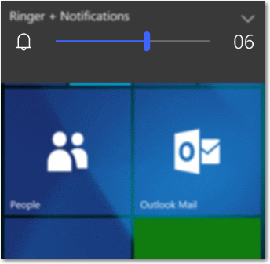
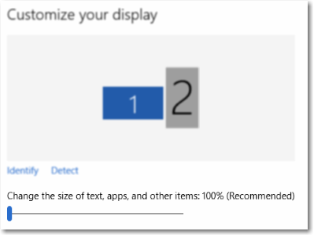

# <a name="sliders"></a><span data-ttu-id="f9c2f-104">スライダー</span><span class="sxs-lookup"><span data-stu-id="f9c2f-104">Sliders</span></span>

<link rel="stylesheet" href="https://az835927.vo.msecnd.net/sites/uwp/Resources/css/custom.css"> 

<span data-ttu-id="f9c2f-105">スライダーはユーザーがトラックに沿って thumb コントロールを動かすことで値の範囲から選択できるようにするコントロールです。</span><span class="sxs-lookup"><span data-stu-id="f9c2f-105">A slider is a control that lets the user select from a range of values by moving a thumb control along a track.</span></span>

> <span data-ttu-id="f9c2f-106">**重要な API**: [Slider クラス](https://msdn.microsoft.com/library/windows/apps/windows.ui.xaml.controls.slider.aspx)、[Value プロパティ](https://msdn.microsoft.com/library/windows/apps/windows.ui.xaml.controls.primitives.rangebase.value.aspx)、[ValueChanged イベント](https://msdn.microsoft.com/library/windows/apps/windows.ui.xaml.controls.primitives.rangebase.valuechanged.aspx)</span><span class="sxs-lookup"><span data-stu-id="f9c2f-106">**Important APIs**: [Slider class](https://msdn.microsoft.com/library/windows/apps/windows.ui.xaml.controls.slider.aspx), [Value property](https://msdn.microsoft.com/library/windows/apps/windows.ui.xaml.controls.primitives.rangebase.value.aspx), [ValueChanged event](https://msdn.microsoft.com/library/windows/apps/windows.ui.xaml.controls.primitives.rangebase.valuechanged.aspx)</span></span>


## <a name="is-this-the-right-control"></a><span data-ttu-id="f9c2f-108">適切なコントロールの選択</span><span class="sxs-lookup"><span data-stu-id="f9c2f-108">Is this the right control?</span></span>

<span data-ttu-id="f9c2f-109">定義された連続的な値 (音量や明るさなど) または個別の値の範囲 (画面解像度の設定など) をユーザーが設定できるようにする場合に、スライダーを使います。</span><span class="sxs-lookup"><span data-stu-id="f9c2f-109">Use a slider when you want your users to be able to set defined, contiguous values (such as volume or brightness) or a range of discrete values (such as screen resolution settings).</span></span>

<span data-ttu-id="f9c2f-110">スライダーは、ユーザーが値を数値でなく相対的な量であると考えている場合に適しています。</span><span class="sxs-lookup"><span data-stu-id="f9c2f-110">A slider is a good choice when you know that users think of the value as a relative quantity, not a numeric value.</span></span> <span data-ttu-id="f9c2f-111">たとえば、ユーザーはオーディオの音量を数値の 2 や 5 ではなく、低や中に設定しようと考えます。</span><span class="sxs-lookup"><span data-stu-id="f9c2f-111">For example, users think about setting their audio volume to low or medium—not about setting the value to 2 or 5.</span></span>

<span data-ttu-id="f9c2f-112">二者択一の設定には、スライダーは使いません。</span><span class="sxs-lookup"><span data-stu-id="f9c2f-112">Don't use a slider for binary settings.</span></span> <span data-ttu-id="f9c2f-113">代わりに[トグル スイッチ](toggles.md)を使います。</span><span class="sxs-lookup"><span data-stu-id="f9c2f-113">Use a [toggle switch](toggles.md) instead.</span></span>

<span data-ttu-id="f9c2f-114">スライダーを使うかどうかを決める際には、他にも次のような点を考慮します。</span><span class="sxs-lookup"><span data-stu-id="f9c2f-114">Here are some additional factors to consider when deciding whether to use a slider:</span></span>

-   **<span data-ttu-id="f9c2f-115">設定が相対的な量のように見えるか?</span><span class="sxs-lookup"><span data-stu-id="f9c2f-115">Does the setting seem like a relative quantity?</span></span>** <span data-ttu-id="f9c2f-116">見えない場合は、[ラジオ ボタン](radio-button.md)または[リスト ボックス](lists.md)を使います。</span><span class="sxs-lookup"><span data-stu-id="f9c2f-116">If not, use [radio buttons](radio-button.md) or a [list box](lists.md).</span></span>
-   **<span data-ttu-id="f9c2f-117">設定は正確な既知の数値か?</span><span class="sxs-lookup"><span data-stu-id="f9c2f-117">Is the setting an exact, known numeric value?</span></span>** <span data-ttu-id="f9c2f-118">その場合は、数値[テキスト ボックス](text-box.md)を使います。</span><span class="sxs-lookup"><span data-stu-id="f9c2f-118">If so, use a numeric [text box](text-box.md).</span></span>
-   **<span data-ttu-id="f9c2f-119">設定の変更による効果をすぐに確認できると、ユーザーにとって便利か?</span><span class="sxs-lookup"><span data-stu-id="f9c2f-119">Would a user benefit from instant feedback on the effect of setting changes?</span></span>** <span data-ttu-id="f9c2f-120">便利である場合は、スライダーを使います。</span><span class="sxs-lookup"><span data-stu-id="f9c2f-120">If so, use a slider.</span></span> <span data-ttu-id="f9c2f-121">たとえば、色合い、鮮やかさ、明度の値を変更した場合の効果をすぐに確認できると、ユーザーは色をより簡単に選べるようになります。</span><span class="sxs-lookup"><span data-stu-id="f9c2f-121">For example, users can choose a color more easily by immediately seeing the effect of changes to hue, saturation, or luminosity values.</span></span>
-   **<span data-ttu-id="f9c2f-122">設定に 4 つ以上の値の範囲があるか?</span><span class="sxs-lookup"><span data-stu-id="f9c2f-122">Does the setting have a range of four or more values?</span></span>** <span data-ttu-id="f9c2f-123">ない場合は、[ラジオ ボタン](radio-button.md)を使います。</span><span class="sxs-lookup"><span data-stu-id="f9c2f-123">If not, use [radio buttons](radio-button.md).</span></span>
-   **<span data-ttu-id="f9c2f-124">ユーザーが値を変えられるか?</span><span class="sxs-lookup"><span data-stu-id="f9c2f-124">Can the user change the value?</span></span>** <span data-ttu-id="f9c2f-125">スライダーは、ユーザーの操作用です。</span><span class="sxs-lookup"><span data-stu-id="f9c2f-125">Sliders are for user interaction.</span></span> <span data-ttu-id="f9c2f-126">ユーザーが値を変えられない場合は、代わりに読み取り専用のテキストを使います。</span><span class="sxs-lookup"><span data-stu-id="f9c2f-126">If a user can't ever change the value, use read-only text instead.</span></span>

<span data-ttu-id="f9c2f-127">スライダーと数値テキスト ボックスのどちらを使うかを決める際に、次の場合には数値テキスト ボックスを使います。</span><span class="sxs-lookup"><span data-stu-id="f9c2f-127">If you are deciding between a slider and a numeric text box, use a numeric text box if:</span></span>

-   <span data-ttu-id="f9c2f-128">画面領域が狭い。</span><span class="sxs-lookup"><span data-stu-id="f9c2f-128">Screen space is tight.</span></span>
-   <span data-ttu-id="f9c2f-129">ユーザーがキーボードを使おうとする可能性が高い。</span><span class="sxs-lookup"><span data-stu-id="f9c2f-129">The user is likely to prefer using the keyboard.</span></span>

<span data-ttu-id="f9c2f-130">次の場合にはスライダーを使います。</span><span class="sxs-lookup"><span data-stu-id="f9c2f-130">Use a slider if:</span></span>

-   <span data-ttu-id="f9c2f-131">ユーザーにとって、すぐに結果がわかると便利。</span><span class="sxs-lookup"><span data-stu-id="f9c2f-131">Users will benefit from instant feedback.</span></span>

## <a name="examples"></a><span data-ttu-id="f9c2f-132">例</span><span class="sxs-lookup"><span data-stu-id="f9c2f-132">Examples</span></span>

<span data-ttu-id="f9c2f-133">Windows Phone の音量を制御するためのスライダー。</span><span class="sxs-lookup"><span data-stu-id="f9c2f-133">A slider to control the volume on Windows Phone.</span></span>



<span data-ttu-id="f9c2f-135">Windows 画面設定でテキスト サイズを変更するためのスライダー。</span><span class="sxs-lookup"><span data-stu-id="f9c2f-135">A slider to change text size in Windows display settings.</span></span>



## <a name="create-a-slider"></a><span data-ttu-id="f9c2f-137">スライダーの作成</span><span class="sxs-lookup"><span data-stu-id="f9c2f-137">Create a slider</span></span>

<span data-ttu-id="f9c2f-138">XAML でスライダーを作成する方法を次に示します。</span><span class="sxs-lookup"><span data-stu-id="f9c2f-138">Here's how to create a slider in XAML.</span></span>

```xaml
<Slider x:Name="volumeSlider" Header="Volume" Width="200"
        ValueChanged="Slider_ValueChanged"/>
```

<span data-ttu-id="f9c2f-139">コードでスライダーを作成する方法を次に示します。</span><span class="sxs-lookup"><span data-stu-id="f9c2f-139">Here's how to create a slider in code.</span></span>

```csharp
Slider volumeSlider = new Slider();
volumeSlider.Header = "Volume";
volumeSlider.Width = 200;
volumeSlider.ValueChanged += Slider_ValueChanged;

// Add the slider to a parent container in the visual tree.
stackPanel1.Children.Add(volumeSlider);
```

<span data-ttu-id="f9c2f-140">[Value](https://msdn.microsoft.com/library/windows/apps/windows.ui.xaml.controls.primitives.rangebase.value.aspx) プロパティからスライダーの値を取得および設定します。</span><span class="sxs-lookup"><span data-stu-id="f9c2f-140">You get and set the value of the slider from the [Value](https://msdn.microsoft.com/library/windows/apps/windows.ui.xaml.controls.primitives.rangebase.value.aspx) property.</span></span> <span data-ttu-id="f9c2f-141">値の変更に応答するには、Value プロパティにバインドするデータ バインディングを使うか、[ValueChanged](https://msdn.microsoft.com/library/windows/apps/windows.ui.xaml.controls.primitives.rangebase.valuechanged.aspx) イベントを処理します。</span><span class="sxs-lookup"><span data-stu-id="f9c2f-141">To respond to value changes, you can use data binding to bind to the Value property, or handle the [ValueChanged](https://msdn.microsoft.com/library/windows/apps/windows.ui.xaml.controls.primitives.rangebase.valuechanged.aspx) event.</span></span>

```csharp
private void Slider_ValueChanged(object sender, RangeBaseValueChangedEventArgs e)
{
    Slider slider = sender as Slider;
    if (slider != null)
    {
        media.Volume = slider.Value;
    }
}
```

## <a name="recommendations"></a><span data-ttu-id="f9c2f-142">推奨事項</span><span class="sxs-lookup"><span data-stu-id="f9c2f-142">Recommendations</span></span>

-   <span data-ttu-id="f9c2f-143">コントロールのサイズは、ユーザーが値を簡単に設定できる大きさにします。</span><span class="sxs-lookup"><span data-stu-id="f9c2f-143">Size the control so that users can easily set the value they want.</span></span> <span data-ttu-id="f9c2f-144">個別の値を設定する場合は、ユーザーがマウスを使って値を簡単に選べるようにします。</span><span class="sxs-lookup"><span data-stu-id="f9c2f-144">For settings with discrete values, make sure the user can easily select any value using the mouse.</span></span> <span data-ttu-id="f9c2f-145">スライダーのエンドポイントが、常にビューの境界内にあることを確認します。</span><span class="sxs-lookup"><span data-stu-id="f9c2f-145">Make sure the endpoints of the slider always fit within the bounds of a view.</span></span>
-   <span data-ttu-id="f9c2f-146">ユーザーが選んでいるときまたは選んだ後で、すぐに結果が確認できるようにします (それが実際的な場合)。</span><span class="sxs-lookup"><span data-stu-id="f9c2f-146">Give immediate feedback while or after a user makes a selection (when practical).</span></span> <span data-ttu-id="f9c2f-147">たとえば、Windows のボリューム コントロールは、選ばれたオーディオ音量を示すためにビープ音を鳴らします。</span><span class="sxs-lookup"><span data-stu-id="f9c2f-147">For example, the Windows volume control beeps to indicate the selected audio volume.</span></span>
-   <span data-ttu-id="f9c2f-148">値の範囲を示すためにラベルを使います。</span><span class="sxs-lookup"><span data-stu-id="f9c2f-148">Use labels to show the range of values.</span></span> <span data-ttu-id="f9c2f-149">例外: スライダーが垂直方向で、上部のラベルが最大、高、多などの場合、下部の意味は明らかであるため、ラベルを省略できます。</span><span class="sxs-lookup"><span data-stu-id="f9c2f-149">Exception: If the slider is vertically oriented and the top label is Maximum, High, More, or equivalent, you can omit the other labels because the meaning is clear.</span></span>
-   <span data-ttu-id="f9c2f-150">スライダーを無効にする場合は、関連するすべてのラベルまたはフィードバックの視覚効果も無効にします。</span><span class="sxs-lookup"><span data-stu-id="f9c2f-150">Disable all associated labels or feedback visuals when you disable the slider.</span></span>
-   <span data-ttu-id="f9c2f-151">スライダーのフロー方向や向きを設定するときには、テキストの方向を考慮してください。</span><span class="sxs-lookup"><span data-stu-id="f9c2f-151">Consider the direction of text when setting the flow direction and/or orientation of your slider.</span></span> <span data-ttu-id="f9c2f-152">言語によって、左から右に書く場合と、右から左に書く場合があります。</span><span class="sxs-lookup"><span data-stu-id="f9c2f-152">Script flows from left to right in some languages, and from right to left in others.</span></span>
-   <span data-ttu-id="f9c2f-153">スライダーは、進行状況インジケーターとしては使いません。</span><span class="sxs-lookup"><span data-stu-id="f9c2f-153">Don't use a slider as a progress indicator.</span></span>
-   <span data-ttu-id="f9c2f-154">スライダーのつまみは、既定のサイズのままにします。</span><span class="sxs-lookup"><span data-stu-id="f9c2f-154">Don't change the size of the slider thumb from the default size.</span></span>
-   <span data-ttu-id="f9c2f-155">値の範囲が広く、ユーザーが選ぶのは範囲内のいくつかの代表的な値であることがほとんどの場合は、連続的なスライダーを作成しません。</span><span class="sxs-lookup"><span data-stu-id="f9c2f-155">Don't create a continuous slider if the range of values is large and users will most likely select one of several representative values from the range.</span></span> <span data-ttu-id="f9c2f-156">代わりに、それらの値だけを、許可される間隔として使います。</span><span class="sxs-lookup"><span data-stu-id="f9c2f-156">Instead, use those values as the only steps allowed.</span></span> <span data-ttu-id="f9c2f-157">たとえば、時間の最大値は 1 か月であっても、ユーザーが 1 分、1 時間、1 日、1 か月のいずれかを選ぶ場合は、4 つの間隔位置だけのスライダーを作成します。</span><span class="sxs-lookup"><span data-stu-id="f9c2f-157">For example if time value might be up to 1 month but users only need to pick from 1 minute, 1 hour, 1 day or 1 month, then create a slider with only 4 step points.</span></span>

## <a name="additional-usage-guidance"></a><span data-ttu-id="f9c2f-158">その他の使い方のガイダンス</span><span class="sxs-lookup"><span data-stu-id="f9c2f-158">Additional usage guidance</span></span>

### <a name="choosing-the-right-layout-horizontal-or-vertical"></a><span data-ttu-id="f9c2f-159">適切なレイアウトの選択: 水平または垂直</span><span class="sxs-lookup"><span data-stu-id="f9c2f-159">Choosing the right layout: horizontal or vertical</span></span>

<span data-ttu-id="f9c2f-160">スライダーは、水平方向または垂直方向に向きを設定できます。</span><span class="sxs-lookup"><span data-stu-id="f9c2f-160">You can orient your slider horizontally or vertically.</span></span> <span data-ttu-id="f9c2f-161">次のガイドラインを使って、使うレイアウトを決めます。</span><span class="sxs-lookup"><span data-stu-id="f9c2f-161">Use these guidelines to determine which layout to use.</span></span>

-   <span data-ttu-id="f9c2f-162">自然な方向を使います。</span><span class="sxs-lookup"><span data-stu-id="f9c2f-162">Use a natural orientation.</span></span> <span data-ttu-id="f9c2f-163">たとえば、スライダーが現実世界の値を表していて、通常は垂直方向に表示される場合 (気温など) は、垂直方向にします。</span><span class="sxs-lookup"><span data-stu-id="f9c2f-163">For example, if the slider represents a real-world value that is normally shown vertically (such as temperature), use a vertical orientation.</span></span>
-   <span data-ttu-id="f9c2f-164">ビデオ アプリのように、メディア内をシークするためにコントロールが使われる場合は、水平方向にします。</span><span class="sxs-lookup"><span data-stu-id="f9c2f-164">If the control is used to seek within media, like in a video app, use a horizontal orientation.</span></span>
-   <span data-ttu-id="f9c2f-165">1 つの方向 (水平または垂直) にパンするページでスライダーを使う場合は、パンの方向とは異なる方向をスライダーに使います。</span><span class="sxs-lookup"><span data-stu-id="f9c2f-165">When using a slider in page that can be panned in one direction (horizontally or vertically), use a different orientation for the slider than the panning direction.</span></span> <span data-ttu-id="f9c2f-166">そうしないと、ユーザーはページをパンしようとしてスライダーをスワイプし、誤って値を変えてしまう場合があります。</span><span class="sxs-lookup"><span data-stu-id="f9c2f-166">Otherwise, users might swipe the slider and change its value accidentally when they try to pan the page.</span></span>
-   <span data-ttu-id="f9c2f-167">使用する方向がまだ決まらない場合は、ページ レイアウトに適した方を使います。</span><span class="sxs-lookup"><span data-stu-id="f9c2f-167">If you're still not sure which orientation to use, use the one that best fits your page layout.</span></span>

### <a name="range-direction"></a><span data-ttu-id="f9c2f-168">範囲方向</span><span class="sxs-lookup"><span data-stu-id="f9c2f-168">Range direction</span></span>

<span data-ttu-id="f9c2f-169">範囲方向とは、現在の値から最大値へスライダーを動かす方向のことです。</span><span class="sxs-lookup"><span data-stu-id="f9c2f-169">The range direction is the direction you move the slider when you slide it from its current value to its max value.</span></span>

-   <span data-ttu-id="f9c2f-170">垂直方向スライダーでは、読みの方向に関係なく、最大値をスライダーの上部に配置します。</span><span class="sxs-lookup"><span data-stu-id="f9c2f-170">For vertical slider, put the largest value at the top of the slider, regardless of reading direction.</span></span> <span data-ttu-id="f9c2f-171">たとえば、音量スライダーでは、最大の音量設定を常にスライダーの上部に配置します。</span><span class="sxs-lookup"><span data-stu-id="f9c2f-171">For example, for a volume slider, always put the maximum volume setting at the top of the slider.</span></span> <span data-ttu-id="f9c2f-172">他の種類の値 (曜日など) では、ページの読みの方向に従います。</span><span class="sxs-lookup"><span data-stu-id="f9c2f-172">For other types of values (such as days of the week), follow the reading direction of the page.</span></span>
-   <span data-ttu-id="f9c2f-173">水平方向のスタイルでは、ページ レイアウトが左から右への場合は、低い方の値をスライダーの左側に配置します。ページ レイアウトが右から左への場合は、右側に配置します。</span><span class="sxs-lookup"><span data-stu-id="f9c2f-173">For horizontal styles, put the lower value on the left side of the slider for left-to-right page layout, and on the right for right-to-left page layout.</span></span>
-   <span data-ttu-id="f9c2f-174">前のガイドラインの 1 つの例外は、メディア シーク バーです。このバーでは、低い方の値を常にスライダーの左側に配置します。</span><span class="sxs-lookup"><span data-stu-id="f9c2f-174">The one exception to the previous guideline is for media seek bars: always put the lower value on the left side of the slider.</span></span>

### <a name="steps-and-tick-marks"></a><span data-ttu-id="f9c2f-175">間隔と目盛り</span><span class="sxs-lookup"><span data-stu-id="f9c2f-175">Steps and tick marks</span></span>

-   <span data-ttu-id="f9c2f-176">スライダーで最小値から最大値までの任意の値を許可するのではない場合は、間隔位置を使います。たとえば、購入する映画のチケットの数を指定するためにスライダーを使う場合、浮動小数点値は許可しません。</span><span class="sxs-lookup"><span data-stu-id="f9c2f-176">Use step points if you don't want the slider to allow arbitrary values between min and max. For example, if you use a slider to specify the number of movie tickets to buy, don't allow floating point values.</span></span> <span data-ttu-id="f9c2f-177">間隔の値を 1 にします。</span><span class="sxs-lookup"><span data-stu-id="f9c2f-177">Give it a step value of 1.</span></span>
-   <span data-ttu-id="f9c2f-178">間隔 (スナップ位置とも言います) を指定する場合、最後のステップがスライダーの最大値に揃うようにします。</span><span class="sxs-lookup"><span data-stu-id="f9c2f-178">If you specify steps (also known as snap points), make sure that the final step aligns to the slider's max value.</span></span>
-   <span data-ttu-id="f9c2f-179">主な、または重要な値の位置をユーザーに示す場合は、目盛りを使います。</span><span class="sxs-lookup"><span data-stu-id="f9c2f-179">Use tick marks when you want to show users the location of major or significant values.</span></span> <span data-ttu-id="f9c2f-180">たとえば、ズームを制御するスライダーでは、50%、100%、200% の目盛りを設定します。</span><span class="sxs-lookup"><span data-stu-id="f9c2f-180">For example, a slider that controls a zoom might have tick marks for 50%, 100%, and 200%.</span></span>
-   <span data-ttu-id="f9c2f-181">設定のおおよその値をユーザーが知る必要がある場合に、目盛りを表示します。</span><span class="sxs-lookup"><span data-stu-id="f9c2f-181">Show tick marks when users need to know the approximate value of the setting.</span></span>
-   <span data-ttu-id="f9c2f-182">選択した設定の正確な値を、コントロールを操作しなくてもユーザーが確認できるようにするには、目盛りと値ラベルを表示します。</span><span class="sxs-lookup"><span data-stu-id="f9c2f-182">Show tick marks and a value label when users need to know the exact value of the setting they choose, without interacting with the control.</span></span> <span data-ttu-id="f9c2f-183">または、値ヒントを使って、正確な値が見られるようにします。</span><span class="sxs-lookup"><span data-stu-id="f9c2f-183">Otherwise, they can use the value tooltip to see the exact value.</span></span>
-   <span data-ttu-id="f9c2f-184">間隔位置が明白でない場合は、常に目盛りを表示します。</span><span class="sxs-lookup"><span data-stu-id="f9c2f-184">Always show tick marks when step points aren't obvious.</span></span> <span data-ttu-id="f9c2f-185">たとえば、スライダーの幅が 200 ピクセルで、200 のスナップ位置がある場合は、ユーザーはスナップの動作に気付かないので、目盛りを非表示にできます。</span><span class="sxs-lookup"><span data-stu-id="f9c2f-185">For example, if the slider is 200 pixels wide and has 200 snap points, you can hide the tick marks because users won't notice the snapping behavior.</span></span> <span data-ttu-id="f9c2f-186">しかし、スナップ位置が 10 個しかない場合は、目盛りを表示します。</span><span class="sxs-lookup"><span data-stu-id="f9c2f-186">But if there are only 10 snap points, show tick marks.</span></span>

### <a name="labels"></a><span data-ttu-id="f9c2f-187">ラベル</span><span class="sxs-lookup"><span data-stu-id="f9c2f-187">Labels</span></span>

-   **<span data-ttu-id="f9c2f-188">スライダー ラベル</span><span class="sxs-lookup"><span data-stu-id="f9c2f-188">Slider labels</span></span>**

    <span data-ttu-id="f9c2f-189">スライダー ラベルは、スライダーの使用目的を示します。</span><span class="sxs-lookup"><span data-stu-id="f9c2f-189">The slider label indicates what the slider is used for.</span></span>

    -   <span data-ttu-id="f9c2f-190">ラベルを使うときは末尾に句点を付けません (これはすべてのコントロール ラベルでの規則です)。</span><span class="sxs-lookup"><span data-stu-id="f9c2f-190">Use a label with no ending punctuation (this is the convention for all control labels).</span></span>
    -   <span data-ttu-id="f9c2f-191">スライダーのあるフォームで、ほとんどのラベルがコントロールの上にある場合は、ラベルをスライダーの上に配置します。</span><span class="sxs-lookup"><span data-stu-id="f9c2f-191">Position labels above the slider when the slider is in a form that places most of its labels above their controls.</span></span>
    -   <span data-ttu-id="f9c2f-192">スライダーのあるフォームで、ほとんどのラベルがコントロールの横にある場合は、ラベルをスライダーの横に配置します。</span><span class="sxs-lookup"><span data-stu-id="f9c2f-192">Position labels to the sides when the slider is in a form that places most of its labels to the side of their controls.</span></span>
    -   <span data-ttu-id="f9c2f-193">ユーザーがスライダーにタッチするときに、指でラベルが見えなくなる場合があるので、ラベルをスライダーの下には配置しません。</span><span class="sxs-lookup"><span data-stu-id="f9c2f-193">Avoid placing labels below the slider because the user's finger might occlude the label when the user touches the slider.</span></span>
-   **<span data-ttu-id="f9c2f-194">範囲ラベル</span><span class="sxs-lookup"><span data-stu-id="f9c2f-194">Range labels</span></span>**

    <span data-ttu-id="f9c2f-195">範囲 (容量) ラベルは、スライダーの最小値と最大値を示します。</span><span class="sxs-lookup"><span data-stu-id="f9c2f-195">The range, or fill, labels describe the slider's minimum and maximum values.</span></span>

    -   <span data-ttu-id="f9c2f-196">垂直方向であることによって明白である場合以外は、スライダーの範囲の両端をラベルに表示します。</span><span class="sxs-lookup"><span data-stu-id="f9c2f-196">Label the two ends of the slider range, unless a vertical orientation makes this unnecessary.</span></span>
    -   <span data-ttu-id="f9c2f-197">各ラベルは、できれば 1 ワードだけにします。</span><span class="sxs-lookup"><span data-stu-id="f9c2f-197">Use only one word, if possible, for each label.</span></span>
    -   <span data-ttu-id="f9c2f-198">末尾に句点を付けません。</span><span class="sxs-lookup"><span data-stu-id="f9c2f-198">Don't use ending punctuation.</span></span>
    -   <span data-ttu-id="f9c2f-199">これらのラベルは、説明的で対比的なものにします。</span><span class="sxs-lookup"><span data-stu-id="f9c2f-199">Make sure these labels are descriptive and parallel.</span></span> <span data-ttu-id="f9c2f-200">例: 最大/最小、多/少、低/高、小/大</span><span class="sxs-lookup"><span data-stu-id="f9c2f-200">Examples: Maximum/Minimum, More/Less, Low/High, Soft/Loud.</span></span>
-   **<span data-ttu-id="f9c2f-201">値ラベル</span><span class="sxs-lookup"><span data-stu-id="f9c2f-201">Value labels</span></span>**

    <span data-ttu-id="f9c2f-202">値ラベルは、スライダーの現在の値を表示します。</span><span class="sxs-lookup"><span data-stu-id="f9c2f-202">A value label displays the current value of the slider.</span></span>

    -   <span data-ttu-id="f9c2f-203">値ラベルが必要な場合は、スライダーの下に表示します。</span><span class="sxs-lookup"><span data-stu-id="f9c2f-203">If you need a value label, display it below the slider.</span></span>
    -   <span data-ttu-id="f9c2f-204">テキストをコントロールに対して中央に配置し、単位 (ピクセルなど) を付記します。</span><span class="sxs-lookup"><span data-stu-id="f9c2f-204">Center the text relative to the control and include the units (such as pixels).</span></span>
    -   <span data-ttu-id="f9c2f-205">スライダーのつまみはスクラブ中に隠れるため、ラベルや他の視覚効果で現在の値を表示することをお勧めします。</span><span class="sxs-lookup"><span data-stu-id="f9c2f-205">Since the slider’s thumb is covered during scrubbing, consider showing the current value some other way, with a label or other visual.</span></span> <span data-ttu-id="f9c2f-206">スライダー設定のテキスト サイズは、スライダー以外の適切なサイズのサンプル テキストに連動させることができます。</span><span class="sxs-lookup"><span data-stu-id="f9c2f-206">A slider setting text size could render some sample text of the right size beside the slider.</span></span>

### <a name="appearance-and-interaction"></a><span data-ttu-id="f9c2f-207">外観と操作</span><span class="sxs-lookup"><span data-stu-id="f9c2f-207">Appearance and interaction</span></span>

<span data-ttu-id="f9c2f-208">スライダーはトラックとつまみで構成されます。</span><span class="sxs-lookup"><span data-stu-id="f9c2f-208">A slider is composed of a track and a thumb.</span></span> <span data-ttu-id="f9c2f-209">トラックは入力できる値の範囲を表すバーです (オプションでさまざまなスタイルの目盛りを表示できます)。</span><span class="sxs-lookup"><span data-stu-id="f9c2f-209">The track is a bar (which can optionally show various styles of tick marks) representing the range of values that can be input.</span></span> <span data-ttu-id="f9c2f-210">つまみは、ユーザーがトラックをタップするか、トラックを前後にスクラブして位置を調整できるセレクターです。</span><span class="sxs-lookup"><span data-stu-id="f9c2f-210">The thumb is a selector, which the user can position by either tapping the track or by scrubbing back and forth on it.</span></span>

<span data-ttu-id="f9c2f-211">スライダーには大きなタッチ ターゲットが設定されています。</span><span class="sxs-lookup"><span data-stu-id="f9c2f-211">A slider has a large touch target.</span></span> <span data-ttu-id="f9c2f-212">タッチのアクセシビリティを維持するには、スライダーを表示の端から十分に離して配置する必要があります。</span><span class="sxs-lookup"><span data-stu-id="f9c2f-212">To maintain touch accessibility, a slider should be positioned far enough away from the edge of the display.</span></span>

<span data-ttu-id="f9c2f-213">カスタム スライダーを設計する際は、余分な要素をできるだけなくし、ユーザーに必要なすべての情報を示す方法を検討してください。</span><span class="sxs-lookup"><span data-stu-id="f9c2f-213">When you’re designing a custom slider, consider ways to present all the necessary info to the user with as little clutter as possible.</span></span> <span data-ttu-id="f9c2f-214">ユーザーが設定を理解できるように単位を表示する必要がある場合は、値ラベルを使います。これらの値を視覚的に示す方法を工夫してください。</span><span class="sxs-lookup"><span data-stu-id="f9c2f-214">Use a value label if a user needs to know the units in order to understand the setting; find creative ways to represent these values graphically.</span></span> <span data-ttu-id="f9c2f-215">たとえば、音量を調整するスライダーでは、スライダーの最小の端に音波のないスピーカーのグラフィック、最大の端に音波のあるスピーカーのグラフィックを表示できます。</span><span class="sxs-lookup"><span data-stu-id="f9c2f-215">A slider that controls volume, for example, could display a speaker graphic without sound waves at the minimum end of the slider, and a speaker graphic with sound waves at the maximum end.</span></span>

## <a name="related-topics"></a><span data-ttu-id="f9c2f-216">関連トピック</span><span class="sxs-lookup"><span data-stu-id="f9c2f-216">Related topics</span></span>
- [<span data-ttu-id="f9c2f-217">トグル スイッチ</span><span class="sxs-lookup"><span data-stu-id="f9c2f-217">Toggle switches</span></span>](toggles.md)
- [<span data-ttu-id="f9c2f-218">Slider クラス</span><span class="sxs-lookup"><span data-stu-id="f9c2f-218">Slider class</span></span>](https://msdn.microsoft.com/library/windows/apps/br209614)
