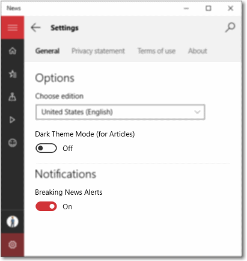

# トグル スイッチ
<link rel="stylesheet" href="https://az835927.vo.msecnd.net/sites/uwp/Resources/css/custom.css"> 


トグル スイッチは、ユーザーが項目をオンまたはオフに切り替えることができる物理的なスイッチを表します。 **ToggleSwitch** コントロールを使うと、ユーザーに 2 つの相互排他的なオプション (オン/オフのように) を表示できます。オプションの選択によって、即座にアクションが実行されます。

<div class="important-apis" >
<b>重要な API</b><br/>
<ul>
<li><a href="https://msdn.microsoft.com/library/windows/apps/windows.ui.xaml.controls.toggleswitch.aspx"><strong>ToggleSwitch クラス</strong></a></li>
<li><a href="https://msdn.microsoft.com/library/windows/apps/windows.ui.xaml.controls.toggleswitch.ison.aspx"><strong>IsOn プロパティ</strong></a></li>
<li><a href="https://msdn.microsoft.com/library/windows/apps/windows.ui.xaml.controls.toggleswitch.toggled.aspx"><strong>Toggled イベント</strong></a></li>
</ul>

</div>
</div>


## 適切なコントロールの選択

トグル スイッチは、ユーザーがそのトグル スイッチをフリップした後すぐに有効になるバイナリ操作に対して使います。 たとえば、トグル スイッチを使って、WiFi などのサービスまたはハードウェア コンポーネントをオンまたはオフにできます。


物理的なスイッチが動作する操作については、多くの場合、トグル スイッチが最適なコントロールです。

ユーザーがスイッチをオンまたはオフに切り替えた後、対応する操作が直ちに実行されるようにすることをお勧めします。

### トグル スイッチとチェック ボックスの選択

操作によっては、トグル スイッチまたはチェック ボックスの両方が使えることがあります。 どちらのコントロールがより適切に動作するかを判断するには、次のヒントを参考にしてください。

-   ユーザーが変更した後すぐに変更が有効になるようなバイナリ設定に対しては、トグル スイッチを使います。

    

    上の例では、トグル スイッチの場合は、ワイヤレスが "オン" になっていることが明らかです。 一方、チェック ボックスの場合は、ワイヤレスが現在オンになっているのか、またはオンにするためにチェック ボックスをオンにする必要があるのか、ユーザーが考える必要があります。

-   変更を有効にするためにユーザーが追加の手順を実行する必要があるときは、チェック ボックスを使います。 たとえば、ユーザーが [送信] や [次へ] などのボタンをクリックして変更を適用する必要がある場合は、チェック ボックスを使います。

    

-   ユーザーが複数の項目を選択できるときは、チェック ボックスまたは[リスト ボックス](lists.md)を使います。

    

## 例

ニュース アプリの全般的な設定のトグル スイッチです。



Windows のスタート メニューの設定のトグル スイッチです。


## トグル スイッチの作成

簡単なトグル スイッチを作成する方法を次に示します。 この XAML では、前に示した WiFi トグル スイッチを作成します。

```xaml
<ToggleSwitch x:Name="wiFiToggle" Header="Wifi"/>
```
コードで同じトグル スイッチを作成する方法を次に示します。

```csharp
ToggleSwitch wiFiToggle = new ToggleSwitch();
wiFiToggle.Header = "WiFi";

// Add the toggle switch to a parent container in the visual tree.
stackPanel1.Children.Add(wiFiToggle);
```

### IsOn

スイッチはオンまたはオフにできます。 [**IsOn**](https://msdn.microsoft.com/library/windows/apps/windows.ui.xaml.controls.toggleswitch.ison.aspx)プロパティを使って、スイッチの状態を判断します。 スイッチを使って別のバイナリ プロパティの状態を制御している場合、次に示すようにバインドを使うことができます。

```
<StackPanel Orientation="Horizontal">
    <ToggleSwitch x:Name="ToggleSwitch1" IsOn="True"/>
    <ProgressRing IsActive="{x:Bind ToggleSwitch1.IsOn, Mode=OneWay}" Width="130"/>
</StackPanel>
```

### Toggled

状況によっては、[**Toggled**](https://msdn.microsoft.com/library/windows/apps/windows.ui.xaml.controls.toggleswitch.toggled.aspx) イベントを処理して状態の変化に対応することができます。

この例は、XAML とコードに Toggled イベント ハンドラーを追加する方法を示しています。 Toggled イベントを処理すると、進行状況リングのオフとオフが切り替えられ、表示が変更されます。

```xaml
<ToggleSwitch x:Name="toggleSwitch1" IsOn="True" 
              Toggled="ToggleSwitch_Toggled"/>
```

コードで同じトグル スイッチを作成する方法を次に示します。

```csharp
// Create a new toggle switch and add a Toggled event handler.
ToggleSwitch toggleSwitch1 = new ToggleSwitch();
toggleSwitch1.Toggled += ToggleSwitch_Toggled;

// Add the toggle switch to a parent container in the visual tree.
stackPanel1.Children.Add(toggleSwitch1);
```

Toggled イベントのハンドラーを次に示します。

```csharp
private void ToggleSwitch_Toggled(object sender, RoutedEventArgs e)
{
    ToggleSwitch toggleSwitch = sender as ToggleSwitch;
    if (toggleSwitch != null)
    {
        if (toggleSwitch.IsOn == true)
        {
            progress1.IsActive = true;
            progress1.Visibility = Visibility.Visible;
        }
        else
        {
            progress1.IsActive = false;
            progress1.Visibility = Visibility.Collapsed;
        }
    }
}
```

### オン/オフ ラベル

既定では、トグル スイッチにはリテラルのオン/オフ ラベルが含まれており、自動的にローカライズされます。 これらのラベルは、[**OnContent**](https://msdn.microsoft.com/library/windows/apps/windows.ui.xaml.controls.toggleswitch.oncontent.aspx) プロパティと [**OffContent**](https://msdn.microsoft.com/library/windows/apps/windows.ui.xaml.controls.toggleswitch.offcontent.aspx) プロパティを設定して置き換えることができます。

この例では、オン/オフ ラベルを表示/非表示ラベルに置き換えます。  

```xaml
<ToggleSwitch x:Name="imageToggle" Header="Show images"
              OffContent="Show" OnContent="Hide" 
              Toggled="ToggleSwitch_Toggled"/>
```

[**OnContentTemplate**](https://msdn.microsoft.com/library/windows/apps/windows.ui.xaml.controls.toggleswitch.oncontenttemplate.aspx) プロパティと [**OffContentTemplate**](https://msdn.microsoft.com/library/windows/apps/windows.ui.xaml.controls.toggleswitch.offcontenttemplate.aspx) プロパティを設定することで、より複雑なコンテンツを使うこともできます。

## 推奨事項

-   設定に対して具体的なラベルがある場合は、それらを "オン" や "オフ" の代わりに使います。 特定の設定に対してより適切な、対になる項目を表す短い (3 ～ 4 文字) ラベルがある場合は、それらを使います。 たとえば、設定が "画像の表示" である場合は、"表示/非表示" などを使います。 より具体的なラベルを使うと、UI のローカライズ時に役立ちます。
-   "オン" と "オフ" のラベルは、必要がない限り変更しないでください。独自のラベルが必要な場合以外は既定のラベルを使います。
-   ラベルは 4 文字以内である必要があります。

## 関連記事

[**ToggleSwitch**](https://msdn.microsoft.com/library/windows/apps/hh701411)
- [ラジオ ボタン](radio-button.md)
- [トグル スイッチ](toggles.md)
- [チェック ボックス](checkbox.md)

**開発者向け (XAML)**
- [**ToggleSwitch クラス**](https://msdn.microsoft.com/library/windows/apps/br209712)


<!--HONumber=Aug16_HO3-->


