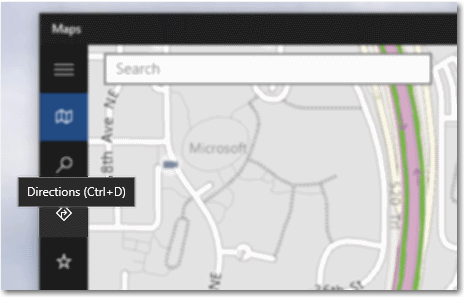

# ヒント
<link rel="stylesheet" href="https://az835927.vo.msecnd.net/sites/uwp/Resources/css/custom.css"> 

ヒントは、他のコントロールまたはオブジェクトにリンクされた短い説明です。 ヒントを使うと、UI では直接説明されていない、なじみのないオブジェクトをユーザーが理解しやすくなります。 ヒントは、ユーザーがコントロールにフォーカスを移動する、コントロール上で長押しする、またはマウス ポインターをコントロール上にホバーすると、自動的に表示されます。 また、ヒントは数秒経過するか、ユーザーが指、ポインター、またはキーボード/ゲームパッドのフォーカスを移動すると消えます。

<b>重要な API</b> 
<ul>
<li>[**ToolTip クラス**](https://msdn.microsoft.com/library/windows/apps/br227608)</li>
<li>[**ToolTipService クラス**](https://msdn.microsoft.com/library/windows/apps/windows.ui.xaml.controls.tooltipservice)</li>
</ul>

## 適切なコントロールの選択

ユーザーに操作の実行を指示する前に、ヒントを使ってコントロールに関する詳しい情報を表示します。 ヒントは慎重に使い、タスクを完了しようとしているユーザーにとって明らかに重要である場合にのみ追加します。 1 つの目安は、情報が同じエクスペリエンスのどこかで入手できる場合、ヒントは必要ありません。 価値あるヒントによって、不明瞭な操作を明確にします。

ヒントはどのような場合に使えばよいでしょうか。 それを判断するには、以下の質問を考えます。

-   **情報はポインターのホバーに基づいて表示すべきですか?**
    そうでない場合は、別のコントロールを使います。 ヒントは、ユーザーの操作の結果としてのみ表示します。自動的には表示しません。

-   **コントロールにはテキスト ラベルがありますか?**
    ない場合は、ヒントを使ってラベルを表示します。 UX の設計では、ほとんどのコントロールにインラインでラベルを付けることをお勧めします。それらのコントロールには、ヒントは必要ありません。 アイコンだけが表示されるツール バー コントロールとコマンド ボタンには、ヒントが必要です。

-   **説明や追加情報がオブジェクトに対して役立ちますか?**
    そうであれば、ヒントを使います。 ただし、このテキストは、主要なタスクに必須なものではなく、補助的なものである必要があります。 必須なものであれば、直接 UI に配置して、ユーザーが探さなくても済むようにします。

-   **表示する補助的な情報は、エラー、警告、または状態ですか?**
    その場合は、ポップアップなど、他の UI 要素を使います。

-   **ユーザーがヒントを操作する必要がありますか?**
    その場合は、別のコントロールを使います。 ヒントはマウスを動かすと消えるため、ユーザーはヒントを操作できません。

-   **ユーザーが補助的な情報を印刷する必要がありますか?**
    その場合は、別のコントロールを使います。

-   **ユーザーがヒントを煩わしいと感じますか?**
    その場合は、別の手段を使うことを検討します。何もしない、という選択肢もあります。 煩わしいと感じる可能性があってもヒントを使う場合は、ユーザーがヒントをオフにできるようにします。

## 例

Bing Maps アプリのヒントです。

## 推奨事項

-   ヒントは慎重に使います (または使わない)。 ヒントは作業の中断になります。 ヒントはポップアップと同じように煩わしい場合があるため、大きな付加価値がない限り使わないでください。
-   ヒントのテキストは簡潔なものにします。 ヒントは短い文やフレーズに適しています。 大きなテキストのまとまりは圧迫感を与えることがあり、ユーザーが読み終える前にヒントがタイムアウトする可能性があります。
-   役に立つ補足的なヒント テキストを作成します。 ヒントのテキストは、情報として役に立つ必要があります。 表示しなくても明らかな情報や、既に画面上に表示されている内容の繰り返しなどは避けます。 ヒントのテキストは常に表示されているわけではないため、ユーザーが必ずしも読まなくても問題がないような、補足的な情報である必要があります。 重要な情報は、名前から判別できるコントロール ラベルを使うか、補足的なテキストを適切な場所に配置することで伝えるようにします。
-   状況に応じて画像を使います。 ヒント内に画像を使うとよい場合もあります。 たとえば、ユーザーがハイパーリンクの上にカーソルを置いたときに、ヒントを使ってリンク先ページのプレビューを表示できます。
-   既に UI に表示されているテキストは、ヒントとして表示しないでください。 たとえば、ボタンと同じテキストを表示するヒントをボタンに表示しないでください。
-   ヒント内に対話的なコントロールを配置しないでください。
-   対話的に見えるような画像をヒント内に配置しないでください。

関連トピック

* [**ToolTip クラス**](https://msdn.microsoft.com/library/windows/apps/br227608)

