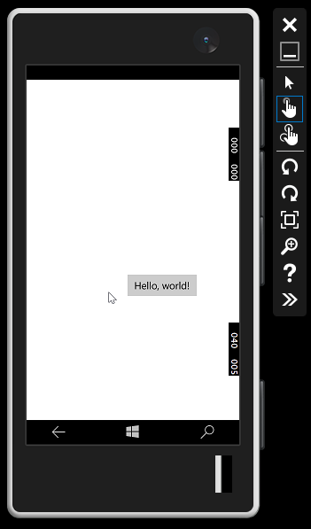

# "Hello, world" アプリを作成する (XAML)

このチュートリアルでは、Windows 10 のユニバーサル Windows プラットフォーム (UWP) 向けの単純な "Hello, world" アプリを XAML と C# で作る方法について説明します。 Microsoft Visual Studio の 1 つのプロジェクトを使って、Windows 10 のすべてのデバイスで実行されるアプリを構築できます。

ここでは、次の方法について説明します。

-   **Windows 10** と **UWP** を対象とする新しい **Visual Studio 2015** プロジェクトを作る。
-   スタート ページの UI を変更するように XAML を記述する。
-   Visual Studio でローカル デスクトップと電話エミュレーターに対してプロジェクトを実行する。
-   SpeechSynthesizer を使って、ボタンが押されたときにアプリがコンテンツを読み上げるようにする。

## はじめに...

-   [ユニバーサル Windows アプリとは](whats-a-uwp.md)?
-   [Windows 10 の新着情報](https://dev.windows.com/whats-new-windows-10-dev-preview)
-   このチュートリアルを行うには、Windows 10 と Visual Studio 2015 が必要です。 [準備してください](get-set-up.md)。
-   また、Visual Studio の既定のウィンドウ レイアウトを使用することを前提としています。 既定のレイアウトを変更した場合は、**[ウィンドウ]** メニューの **[ウィンドウ レイアウトのリセット]** を使って、レイアウトをリセットできます。


## ビデオを見る場合...

<iframe src="https://channel9.msdn.com/Blogs/One-Dev-Minute/Writing-Your-First-Windows-10-App/player" width="640" height="360" allowFullScreen frameBorder="0"></iframe>

ステップ バイ ステップ ガイドを読むより視覚的なアプローチをご希望の場合は、このビデオをご覧ください。内容は同じですが、素敵なサウンドトラックが付いています。

## 手順 1. Visual Studio で新しいプロジェクトを作る

1.  Visual Studio 2015 を起動します。

2.  **[ファイル]** メニューの **[新規作成]、[プロジェクト]** の順にクリックし、*[新しいプロジェクト]* ダイアログを開きます。

3.  左側のテンプレートの一覧で、**[インストール済み]、[テンプレート]、[Visual C#]、[Windows]** の順に開いた後、**[ユニバーサル]** を選択して UWP プロジェクト テンプレートの一覧を表示します。

    (ユニバーサル テンプレートが表示されない場合は、Visual Studio 2015 がインストールされていないか、UWP アプリを作成するためのコンポーネントがない可能性があります。 「[準備](get-set-up.md)」を確認してツールを修正してください)。

4.  **[空白のアプリ (ユニバーサル Windows)]** テンプレートを選択し、**[名前]** に「HelloWorld」と入力します。 **[OK]** を選択します。

    ![[新しいプロジェクト] ウィンドウ](images/win10-cs-01.png)

5.  ターゲット バージョンと最小バージョンのダイアログが表示されます。 既定の設定で問題ないため、**[OK]** を選択してプロジェクトを作成します。

    

6.  新しいプロジェクトが開き、そのプロジェクトのファイルが右側の**ソリューション エクスプローラー**のウィンドウに表示されます。 場合によっては、ファイルを表示するために **[ソリューション エクスプローラー]** タブを選択する必要があります (**[プロパティ]** タブではありません)。

    

**[空白のアプリ (ユニバーサル Windows)]** は最小限のテンプレートですが、多くのファイルが含まれています。 これらのファイルは、C# を使うすべての UWP アプリに必要です。 Visual Studio で作るすべてのプロジェクトには、これらのファイルが必ず含まれます。


### ファイルの内容

プロジェクトのファイルを表示して編集するには、**ソリューション エクスプローラー**でファイルをダブルクリックします。 フォルダーと同様、XAML ファイルを展開して、関連するコード ファイルを表示します。 XAML ファイルは、デザイン サーフェスと XAML エディターの両方を表示する分割ビューで開きます。
> [!NOTE]
> XAML とは Extensible Application Markup Language (XAML) は、アプリのユーザー インターフェイスを定義するための言語です。 XAML は、手動で入力することも、Visual Studio のデザイン ツールを使って作成することもできます。 .xaml ファイルには、ロジックが格納される .xaml.cs 分離コード ファイルがあります。 XAML と分離コードがまとまって、完全なクラスが作成されます。 詳しくは、「[XAML の概要](https://msdn.microsoft.com/library/windows/apps/Mt185595)」をご覧ください。

*App.xaml と App.xaml.cs*

-   App.xaml は、アプリ全体で使われるリソースを宣言するファイルです。
-   App.xaml.cs は、App.xaml の分離コード ファイルです。 すべての分離コード ページと同じように、`InitializeComponent` メソッドを呼び出すコンストラクターが含まれています。 `InitializeComponent` メソッドは自分で記述する必要はありません。 Visual Studio によって生成されるこのメソッドの主な目的は、XAML ファイルに宣言された要素を初期化することです。
-   App.xaml.cs は、アプリのエントリ ポイントです。
-   App.xaml.cs には、アプリのアクティブ化と中断を処理するためのメソッドも含まれています。

*MainPage.xaml*

-   MainPage.xaml は、アプリの UI を定義する場所です。 要素の追加は、XAML マークアップを使って直接行うことも、Visual Studio のデザイン ツールを使って行うこともできます。
-   MainPage.xaml.cs は、MainPage.xaml のコード ビハインド ページです。 ここには、アプリのロジックとイベント ハンドラーを追加します。
-   これら 2 つのファイルで、[**Page**](https://msdn.microsoft.com/library/windows/apps/BR227503) から継承される `MainPage` という新しいクラスを `HelloWorld` 名前空間に定義します。

*Package.appxmanifest*
-   名前、説明、タイル、開始ページなど、アプリを説明するマニフェスト ファイルです。
-   アプリに含まれるファイルの一覧が含まれています。

*一連のロゴ イメージ*
-   Assets/Square150x150Logo.scale-200.png は、スタート メニュー内のアプリを表します。
-   Assets/StoreLogo.png は、Windows ストア内のアプリを表します。
-   Assets/SplashScreen.scale-200.png は、アプリが起動したときに表示するスプラッシュ画面です。

## 手順 2. ボタンを追加する

### デザイナー ビューの使用

ページにボタンを追加しましょう。 このチュートリアルでは、前に示した複数のファイルの一部 (App.xaml、MainPage.xaml、および MainPage.xaml.cs) のみを操作します。

1.  **MainPage.xaml** をダブルクリックしてデザイン ビューで開きます。

    画面の上部にグラフィック ビュー、その下部に XAML コード ビューがあります。 どちらのビューでも変更を加えることができますが、ここではグラフィック ビューを使います。

    

2.  左側の縦方向に配置された **[ツールボックス]** タブをクリックして UI コントロールの一覧を開きます  (タイトル バーのピン アイコンをクリックすると、このウィンドウを表示したままにすることができます)。

    

3.  **[コモン XAML コントロール]** を展開し、**Button** をドラッグしてデザイン キャンバスの中央に配置します。

    

    XAML コード ウィンドウを見ると、そこにも Button が追加されたことがわかります。

    ```XAML
<Button x:name="button" Content="Button" HorizontalAlignment="Left" Margin = "152,293,0,0" VerticalAlignment="Top"/>
```

4.  ボタンのテキストを変更します。

    XAML コード ビュー内をクリックし、Content の値を "Button" から "Hello, world!" に変更します。

    ```XAML
<Button x:name="button" Content="Hello, world!" HorizontalAlignment="Left" Margin = "152,293,0,0" VerticalAlignment="Top"/>
```

    デザイン キャンバスに表示されたボタンが更新され、新しいテキストが表示されることがわかります。

    

## 手順 3. アプリを起動する


ここまでの操作で、非常に単純なアプリが作成されました。 ここで、アプリをビルド、デプロイ、起動してどうなるかを見てみましょう。 アプリは、ローカル コンピューター、シミュレーターかエミュレーター、またはリモート デバイスでデバッグできます。 Visual Studio の [ターゲット デバイス] メニューを示します。


### デスクトップ デバイスでアプリを起動する

既定では、アプリはローカル コンピューターで実行されます。 [ターゲット デバイス] メニューには、デスクトップ デバイス ファミリのデバイスでアプリをデバッグするためのいくつかのオプションが用意されています。

-   **シミュレーター**
-   **ローカル コンピューター**
-   **リモート コンピューター**

**ローカル コンピューターでデバッグを開始するには**

1.  **[標準]** ツール バーの [ターゲット デバイス] メニュー (![[デバッグの開始] メニュー](images/startdebug-full.png)) で、**[ローカル コンピューター]** が選択されていることを確認します  (既定で選択されています)。
2.  ツール バーの **[デバッグの開始]** ボタン (![[デバッグの開始] ボタン](images/startdebug-sm.png)) をクリックします。

   または

   **[デバッグ]** メニューの **[デバッグの開始]** をクリックします。

   または

   F5 キーを押します。

アプリがウィンドウで開かれ、最初に既定のスプラッシュ画面が表示されます。 スプラッシュ画面は、画像 (SplashScreen.png) と背景色によって定義されます (背景色はアプリのマニフェスト ファイルに指定します)。

スプラッシュ画面が消えた後、アプリが表示されます。 次のようになります。


Windows キーを押して **[スタート]** メニューを開き、すべてのアプリを表示します。 ローカルに配置したアプリのタイルが **[スタート]** メニューに追加されています。 後でもう一度 (デバッグ モード以外で) アプリを実行するときは、**[スタート]** メニューでこのタイルをタップまたはクリックします。

お疲れさまでした。これで、初めての UWP アプリの作成は完了です。

**デバッグを停止するには**

   ツール バーの **[デバッグの停止]** ボタン (![[デバッグの停止] ボタン](images/stopdebug.png)) をクリックします。

   または

   **[デバッグ]** メニューの **[デバッグの停止]** をクリックします。

   または

   アプリ ウィンドウを閉じます。

### モバイル デバイス エミュレーターでアプリを起動する

アプリは、すべての Windows 10 デバイスで実行できます。Windows Phone ではどのようになるかを見てみましょう。

Visual Studio では、デスクトップ デバイスでデバッグするオプションに加えて、コンピューターに接続された物理的なモバイル デバイスにアプリをデプロイしてデバッグするか、モバイル デバイス エミュレーターでアプリをデプロイしてデバッグするオプションが用意されています。 メモリとディスプレイの構成がさまざまなデバイスのエミュレーターの中から選ぶことができます。

-   **デバイス**
-   **Emulator <SDK version> WVGA 4 inch 512MB**
-   **Emulator <SDK version> WVGA 4 inch 1GB**
-   その他... (他の構成のさまざまなエミュレーター)

(エミュレーターが表示されない場合は、 「[準備](get-set-up.md)」を参照して、ユニバーサル Windows アプリ開発ツールがインストールされていることを確認します。)

**モバイル デバイス エミュレーターでデバッグを開始するには**

1.  画面が小さくメモリが限られているデバイスでアプリをテストすることをお勧めします。そのためには、**[標準]** ツール バーのターゲット デバイス メニュー (![[デバッグの開始] メニュー](images/startdebug-full.png)) で **[Emulator 10.0.14393.0 WVGA 4 inch 512MB]** を選択します。

2.  ツール バーの **[デバッグの開始]** ボタン (![[デバッグの開始] ボタン](images/startdebug-sm.png)) をクリックします。

   または

   **[デバッグ]** メニューの **[デバッグの開始]** をクリックします。

   または

   F5 キーを押します。

Visual Studio で、選択したエミュレーターが起動し、アプリが配置されて起動されます。 アプリを初めて起動するときは少し時間がかかる場合があります。 モバイル デバイス エミュレーターでは、アプリは次のように表示されます。



Windows Phone で Windows 10 を実行している場合は、Windows Phone をコンピューターに接続し、アプリを直接配置して実行できます (ただし、最初に[開発者モードを有効にする](enable-your-device-for-development.md)必要があります)。


## 手順 4. イベント ハンドラー

"イベント ハンドラー" は複雑なもののように思われますが、イベント (ユーザーによるボタンのクリックなど) が発生したときに呼び出されるコードの別名にすぎません。

1.  アプリの実行を停止します (まだ停止していない場合)。

2.  デザイン キャンバス上のボタン コントロールをダブルクリックします。Visual Studio によってボタンのイベント ハンドラーが作成されます。

  もちろん、すべてのコードを手動で作成することもできます。 または、ボタンをクリックして選択し、右下の **[プロパティ]** ウィンドウを確認します。 **[イベント]** (小さな稲妻) に切り替えると、イベント ハンドラーの名前を追加することができます。

3.  *MainPage.xaml.cs* (分離コード ページ) でイベント ハンドラーを編集します。 ここから面白くなります。 既定のイベント ハンドラーは次のようになります。

```C#
private void button_Click(object sender, RouteEventArgs e)
{

}
```

  これを変更して次のようにします。

```C#
private async void button_Click(object sender, RoutedEventArgs e)
        {
            MediaElement mediaElement = new MediaElement();
            var synth = new Windows.Media.SpeechSynthesis.SpeechSynthesizer();
            Windows.Media.SpeechSynthesis.SpeechSynthesisStream stream = await synth.SynthesizeTextToStreamAsync("Hello, World!");
            mediaElement.SetSource(stream, stream.ContentType);
            mediaElement.Play();
        }
```

**async** キーワードも含めるようにしてください。そうしないと、アプリを実行しようとしたときにエラーが表示されます。

### ここで実行したこと

このコードでは、いくつか Windows API を使用して音声合成オブジェクトを作成し、読み上げるテキストを指定します  (SpeechSynthesis の使い方について詳しくは、[SpeechSynthesis 名前空間](https://msdn.microsoft.com/library/windows/apps/windows.media.speechsynthesis.aspx)のドキュメントをご覧ください)。

アプリを実行し、ボタンをクリックすると、コンピューター (または電話) が "Hello, World!" を文字どおりにしゃべります。


## まとめ


これで、Windows 10 と UWP 用の初めてのアプリを作成しました。


<!--HONumber=Sep16_HO1-->


