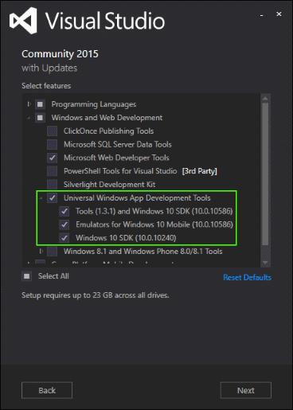

# 準備

準備は、思っているよりも簡単です。 次の手順に従って、Windows 10 用のユニバーサル Windows プラットフォーム (UWP) アプリの作成を開始してください。

## 1. Windows 10 の入手

UWP アプリを開発するには、Windows の最新バージョンが必要です。

-   [Windows 10 をオンラインで入手する](http://go.microsoft.com/fwlink/p/?LinkId=619312)

MSDN サブスクリプション会員の方は、 ISO をここからダウンロードできます。

-   Windows 10 は、[MSDN サブスクライバー ダウンロード](http://go.microsoft.com/fwlink/p/?LinkId=266384)からダウンロードできます。

## 2. Visual Studio のダウンロードまたは更新

Microsoft Visual Studio 2015 は、アプリの設計、コード化、テスト、デバッグに役立ちます。

Visual Studio 2015 をまだお持ちでない場合は、このリンクをクリックすると、Microsoft Visual Studio Community 2015 を無料でインストールできます。 このダウンロードには、アプリをテストするためのデバイスと電話のシミュレーターが含まれています。

-   [Windows 10 開発者ツールをダウンロードする](https://go.microsoft.com/fwlink/p/?LinkID=534189)

Visual Studio をインストールする場合は、カスタム オプションを使用して、次のように [ユニバーサル Windows アプリ開発ツール] のすべてのオプションが選択されていることを確認します。

## 3. デバイスを開発用に有効にする

UWP アプリのテストは実際の PC と電話で行うことが重要です。 PC または Windows Phone にアプリを展開するには、PC または電話を開発用に有効にする必要があります。

-   詳しい手順については、「[デバイスを開発用に有効にする](enable-your-device-for-development.md)」をご覧ください。

## 4. アプリ開発者としての登録

アプリの開発をすぐに開始できますが、ストアへの提出前に開発者アカウントが必要です。

-   開発者アカウントを取得するには、[サインアップ](sign-up.md) ページに移動します。

## 次の手順

ツールをインストールして開発者用ライセンスまたは開発者アカウントを取得したら、チュートリアルを使って最初のアプリを作成します。

-   
            [初めてのアプリの作成](your-first-app.md)のチュートリアル

## その他のツールとダウンロード

ツールとダウンロードの一覧については、「[ダウンロード](http://go.microsoft.com/fwlink/p/?linkid=285935)」をご覧ください。

<!--HONumber=Jul16_HO1-->

