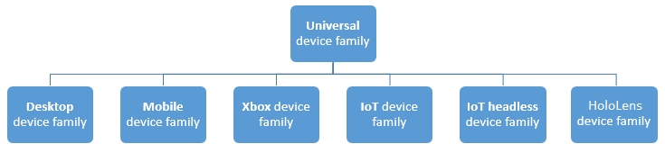

# <a name="intro-to-the-universal-windows-platform"></a><span data-ttu-id="0fdfe-104">ユニバーサル Windows プラットフォームの紹介</span><span class="sxs-lookup"><span data-stu-id="0fdfe-104">Intro to the Universal Windows Platform</span></span>

<span data-ttu-id="0fdfe-105">このガイドでは、ユニバーサル Windows プラットフォーム (UWP) と Windows 10 に関する以下の項目について説明します。</span><span class="sxs-lookup"><span data-stu-id="0fdfe-105">In this guide, you'll learn about the Universal Windows Platform (UWP) and Windows 10:</span></span>

-   <span data-ttu-id="0fdfe-106">デバイス ファミリの定義およびターゲットにするデバイス ファミリを決定する方法。</span><span class="sxs-lookup"><span data-stu-id="0fdfe-106">What a device family is and how to decide which one to target.</span></span>
-   <span data-ttu-id="0fdfe-107">拡張 SDK とは何か、および拡張 SDK がデバイスのクラスに固有な API へのアクセスを提供する方法。</span><span class="sxs-lookup"><span data-stu-id="0fdfe-107">What an Extension SDK is and how it provides access to APIs specific to a class of devices.</span></span>
-   <span data-ttu-id="0fdfe-108">さまざまな画面サイズや回転に合わせて UI を対応させる新しい UI コントロールとパネル。</span><span class="sxs-lookup"><span data-stu-id="0fdfe-108">New UI controls and panels for adapting your UI to different screen sizes or rotations.</span></span>
-   <span data-ttu-id="0fdfe-109">アプリで利用できる API サーフェスを理解および制御する方法。</span><span class="sxs-lookup"><span data-stu-id="0fdfe-109">How to understand and control the API surface that is available to your app.</span></span>

<span data-ttu-id="0fdfe-110">Windows 10 ではユニバーサル Windows プラットフォーム (UWP) が導入され、Windows 10 を実行する各デバイス間で利用可能な共通のアプリ プラットフォームが提供されます。</span><span class="sxs-lookup"><span data-stu-id="0fdfe-110">Windows 10 introduces the Universal Windows Platform (UWP), which provides a common app platform available on every device that runs Windows 10.</span></span> <span data-ttu-id="0fdfe-111">UWP はさまざまなデバイスに保証されたコア API を提供します。</span><span class="sxs-lookup"><span data-stu-id="0fdfe-111">The UWP provides a guaranteed core API across devices.</span></span> <span data-ttu-id="0fdfe-112">つまり、多様なデバイスにインストールできる単一のアプリ パッケージを作成することができます。</span><span class="sxs-lookup"><span data-stu-id="0fdfe-112">This means you can create a single app package that can be installed onto a wide range of devices.</span></span> <span data-ttu-id="0fdfe-113">そして、その単一のアプリ パッケージで、Windows ストアはアプリが実行できるすべてのデバイスの種類に利用可能な統合された配布チャネルを提供します。</span><span class="sxs-lookup"><span data-stu-id="0fdfe-113">And, with that single app package, the Windows Store provides a unified distribution channel to reach all the device types your app can run on.</span></span> <span data-ttu-id="0fdfe-114">UWP をターゲットとするアプリはすべてのデバイスに共通する WinRT API だけでなく、アプリが実行されているデバイスのクラスに固有の API (Win32 と .NET API を含む) も呼び出すことができます。</span><span class="sxs-lookup"><span data-stu-id="0fdfe-114">Apps that target the UWP can call not only the WinRT APIs that are common to all devices, but also APIs (including Win32 and .NET APIs) that are specific to the class of device that the app is running on.</span></span>


<span data-ttu-id="0fdfe-116">UWP アプリはさまざまなフォーム ファクターと入力の種類を備えた多様なデバイスで実行されるため、各デバイスに合わせて調整して、各デバイスの独自の機能のロックを解除する必要があります。</span><span class="sxs-lookup"><span data-stu-id="0fdfe-116">Because your UWP app runs on a wide variety of devices with different form factors and types of input, you want it to be tailored to each device and be able to unlock the unique capabilities of each device.</span></span> <span data-ttu-id="0fdfe-117">保証されたコア API レイヤーに加えて、これらのデバイス固有な API にアクセスするコードを作成して、アプリが他のデバイスで異なるエクスペリエンスを表示している間に 1 種類のデバイスに固有の機能の使い勝手をよくすることができます。</span><span class="sxs-lookup"><span data-stu-id="0fdfe-117">In addition to the guaranteed core API layer, you can write code to access device specific APIs so that your app lights up features specific to one type of device while presenting a different experience on other devices.</span></span> <span data-ttu-id="0fdfe-118">アダプティブ UI コントロールと新しいレイアウト パネルを使うと、UI をさまざまなデバイス画面の解像度やサイズで調整できます。</span><span class="sxs-lookup"><span data-stu-id="0fdfe-118">Adaptive UI controls and new layout panels help you to tailor your UI across a broad range of device screen resolutions and sizes.</span></span>

## <a name="device-families"></a><span data-ttu-id="0fdfe-119">デバイス ファミリ</span><span class="sxs-lookup"><span data-stu-id="0fdfe-119">Device families</span></span>

<span data-ttu-id="0fdfe-120">Windows 10 によってデバイスのさまざまなクラスをターゲットにできる方法を理解するには、デバイス ファミリという概念を理解しておくと役立ちます。</span><span class="sxs-lookup"><span data-stu-id="0fdfe-120">In order to understand how Windows 10 allows you to target different classes of devices, it's helpful to understand a concept called device families.</span></span> <span data-ttu-id="0fdfe-121">デバイス ファミリに基づいて、デバイスのクラス全体で想定できる API、システム特性、動作を特定します。</span><span class="sxs-lookup"><span data-stu-id="0fdfe-121">A device family identifies the APIs, system characteristics, and behaviors that you can expect across a class of devices.</span></span> <span data-ttu-id="0fdfe-122">ストアからアプリをインストールできる一連のデバイスも決定します。</span><span class="sxs-lookup"><span data-stu-id="0fdfe-122">It also determines the set of devices on which your app can be installed from the Store.</span></span> <span data-ttu-id="0fdfe-123">デバイス ファミリ (ただし、ユニバーサル デバイス ファミリを除く) は拡張 SDK として実装されています。これについては、後ほど説明します。</span><span class="sxs-lookup"><span data-stu-id="0fdfe-123">A device family (with the exception of the Universal device family) is implemented as an extension SDK, which we will discuss shortly.</span></span> <span data-ttu-id="0fdfe-124">次にデバイス ファミリの階層を示します。</span><span class="sxs-lookup"><span data-stu-id="0fdfe-124">Here is the device family hierarchy.</span></span>



<span data-ttu-id="0fdfe-126">デバイス ファミリは、API のセットを定義します。また、バージョン管理されています。</span><span class="sxs-lookup"><span data-stu-id="0fdfe-126">A device family defines a set of APIs and is versioned.</span></span> <span data-ttu-id="0fdfe-127">デバイス ファミリは OS の基盤です。</span><span class="sxs-lookup"><span data-stu-id="0fdfe-127">A device family is the foundation of an OS.</span></span> <span data-ttu-id="0fdfe-128">PC およびタブレットでは、デスクトップ デバイス ファミリに基づいているデスクトップ OS を実行します。</span><span class="sxs-lookup"><span data-stu-id="0fdfe-128">PCs and tablets run the desktop OS, which is based on the desktop device family.</span></span> <span data-ttu-id="0fdfe-129">電話では、モバイル デバイス ファミリに基づいているモバイル OS を実行します。</span><span class="sxs-lookup"><span data-stu-id="0fdfe-129">Phones run the mobile OS, which is based on the mobile device family.</span></span>

<span data-ttu-id="0fdfe-130">各子デバイス ファミリでは、独自の API が継承する API に追加されます。</span><span class="sxs-lookup"><span data-stu-id="0fdfe-130">Each child device family adds its own APIs to the ones it inherits.</span></span> <span data-ttu-id="0fdfe-131">結果として得られる子デバイス ファミリの API の和集合は、そのデバイス ファミリに基づく OS と、その OS を実行するすべてのデバイスに存在することが保証されます。</span><span class="sxs-lookup"><span data-stu-id="0fdfe-131">The resulting union of APIs in a child device family is guaranteed to be present in the OS based on that device family, and on every device running that OS.</span></span>

<span data-ttu-id="0fdfe-132">ユニバーサル デバイス ファミリの利点の 1 つは、電話、タブレット、デスクトップ コンピューターから Surface Hub、Xbox コンソール、HoloLens までのいずれか、またはすべてのデバイスでアプリを実行できることです。</span><span class="sxs-lookup"><span data-stu-id="0fdfe-132">One benefit of the universal device family is that your app can run on any, or even all, of a variety of devices from phones, tablets, desktop computers, Surface Hubs, Xbox consoles, and HoloLens.</span></span> <span data-ttu-id="0fdfe-133">アプリはユニバーサル デバイス ファミリの外部のデバイスの機能を動的に検出して使うアダプティブ コードを使うこともできます。</span><span class="sxs-lookup"><span data-stu-id="0fdfe-133">Your app can also use adaptive code to dynamically detect and use features of a device that are outside of the universal device family.</span></span>

<span data-ttu-id="0fdfe-134">アプリがターゲットにするデバイス ファミリに関する決定は自分で行うことができます。</span><span class="sxs-lookup"><span data-stu-id="0fdfe-134">The decision about which device family (or families) your app will target is yours to make.</span></span> <span data-ttu-id="0fdfe-135">この決定はこれらの重要な点でアプリに影響します。</span><span class="sxs-lookup"><span data-stu-id="0fdfe-135">And that decision impacts your app in these important ways.</span></span> <span data-ttu-id="0fdfe-136">次の内容を決定します。</span><span class="sxs-lookup"><span data-stu-id="0fdfe-136">It determines:</span></span>

-   <span data-ttu-id="0fdfe-137">アプリが実行されるときに存在する (したがって、自由に呼び出すことができる) と期待できる一連の API。</span><span class="sxs-lookup"><span data-stu-id="0fdfe-137">The set of APIs that your app can assume to be present when it runs (and can therefore call freely).</span></span>
-   <span data-ttu-id="0fdfe-138">条件ステートメント内のみで安全な一連の API 呼び出し。</span><span class="sxs-lookup"><span data-stu-id="0fdfe-138">The set of API calls that are safe only inside conditional statements.</span></span>
-   <span data-ttu-id="0fdfe-139">ストア (および結果として、UI を設計するときに検討する必要のあるフォーム ファクター) からアプリをインストールできる一連のデバイス。</span><span class="sxs-lookup"><span data-stu-id="0fdfe-139">The set of devices on which your app can be installed from the Store (and consequently the form factors that you need to consider when you design the UI).</span></span>

<span data-ttu-id="0fdfe-140">デバイス ファミリの選択には主に次の 2 つの結果があります。アプリによって無条件に呼び出せる API サーフェスとアプリをインストールできるデバイスの数です。</span><span class="sxs-lookup"><span data-stu-id="0fdfe-140">There are two main consequences of making a device family choice: the API surface that can be called unconditionally by the app, and the number of devices the app can reach.</span></span> <span data-ttu-id="0fdfe-141">これら 2 つの要素にはトレードオフがあり、逆相関します。</span><span class="sxs-lookup"><span data-stu-id="0fdfe-141">These two factors involve tradeoffs and are inversely related.</span></span> <span data-ttu-id="0fdfe-142">たとえば、UWP アプリは特にユニバーサル デバイス ファミリをターゲットとするアプリで、その結果、すべてのデバイスに利用できます。</span><span class="sxs-lookup"><span data-stu-id="0fdfe-142">For example, a UWP app is an app that specifically targets the universal device family, and consequently is available to all devices.</span></span> <span data-ttu-id="0fdfe-143">ユニバーサル デバイス ファミリをターゲットとするアプリでは、ユニバーサル デバイス ファミリの API のみが存在することが期待できます。</span><span class="sxs-lookup"><span data-stu-id="0fdfe-143">An app that targets the universal device family can assume the presence of only the APIs in the universal device family.</span></span> <span data-ttu-id="0fdfe-144">その他の API は、条件付きで呼び出す必要があります。</span><span class="sxs-lookup"><span data-stu-id="0fdfe-144">Other APIs must be called conditionally.</span></span> <span data-ttu-id="0fdfe-145">また、このようなアプリはさまざまなデバイスで実行できるため、高度なアダプティブ UI と包括的な入力機能を備えている必要があります。</span><span class="sxs-lookup"><span data-stu-id="0fdfe-145">Also, such an app must have a highly adaptive UI and comprehensive input capabilities because it can run on a wide variety of devices.</span></span> <span data-ttu-id="0fdfe-146">Windows モバイル アプリは、特にモバイル デバイス ファミリをターゲットとするアプリで、OS がモバイル デバイス ファミリ (電話、タブレット、類似したデバイスを含む) に基づくデバイスで利用できます。</span><span class="sxs-lookup"><span data-stu-id="0fdfe-146">A Windows mobile app is an app that specifically targets the mobile device family, and is available to devices whose OS is based on the mobile device family (which includes phones, tablets, and similar devices).</span></span> <span data-ttu-id="0fdfe-147">モバイル デバイス ファミリのアプリには、モバイル デバイス ファミリのすべての API が存在することが期待でき、その UI はある程度アダプティブである必要があります。</span><span class="sxs-lookup"><span data-stu-id="0fdfe-147">A mobile device family app can assume the presence of all APIs in the mobile device family, and its UI has to be moderately adaptive.</span></span> <span data-ttu-id="0fdfe-148">IoT デバイス ファミリをターゲットとするアプリは IoT デバイスのみにインストールすることができ、IoT デバイス ファミリ内のすべての API が存在することが期待できます。</span><span class="sxs-lookup"><span data-stu-id="0fdfe-148">An app that targets the IoT device family can be installed only on IoT devices and can assume the presence of all APIs in the IoT device family.</span></span> <span data-ttu-id="0fdfe-149">このアプリは特定の種類のデバイスでのみ実行されることがわかっているため、UI と入力機能に特化することができます。</span><span class="sxs-lookup"><span data-stu-id="0fdfe-149">That app can be very specialized in its UI and input capabilities because you know that it will run only on a specific type of device.</span></span>

<iframe src="https://channel9.msdn.com/Blogs/One-Dev-Minute/Introduction-to-UWP-and-Device-Families/player" width="640" height="360" allowFullScreen frameBorder="0"></iframe>

<span data-ttu-id="0fdfe-150">ターゲットにするデバイス ファミリを決定するために役立つ考慮事項をいくつか紹介します。</span><span class="sxs-lookup"><span data-stu-id="0fdfe-150">Here are some considerations to help you decide which device family to target:</span></span>

**<span data-ttu-id="0fdfe-151">アプリの適用範囲の最大化</span><span class="sxs-lookup"><span data-stu-id="0fdfe-151">Maximizing your app's reach</span></span>**

<span data-ttu-id="0fdfe-152">アプリでのデバイスの範囲を最大限に広げ、できるだけ多くの種類のデバイス上で実行するために、アプリはユニバーサル デバイス ファミリをターゲットとします。</span><span class="sxs-lookup"><span data-stu-id="0fdfe-152">To reach the maximum range of devices with your app, and to have it run on as many kinds of devices as possible, your app will target the universal device family.</span></span> <span data-ttu-id="0fdfe-153">これにより、アプリはユニバーサルに基づくすべてのデバイス ファミリを自動的にターゲットにします (図内、ユニバーサルのすべての子)。</span><span class="sxs-lookup"><span data-stu-id="0fdfe-153">By doing so, the app automatically targets every device family that's based on universal (in the diagram, all the children of universal).</span></span> <span data-ttu-id="0fdfe-154">つまり、アプリはそれらのデバイス ファミリに基づくすべての OS で実行され、それらのオペレーティング システムを実行するすべてのデバイスで実行されます。</span><span class="sxs-lookup"><span data-stu-id="0fdfe-154">That means that the app runs on every OS based on those device families, and on all the devices that run those operating systems.</span></span> <span data-ttu-id="0fdfe-155">それらのすべてのデバイスで利用できることが保証される API のみが、ターゲットとするユニバーサル デバイス ファミリの特定のバージョンで定義されるセットです。</span><span class="sxs-lookup"><span data-stu-id="0fdfe-155">The only APIs that are guaranteed to be available on all those devices is the set defined by the particular version of the universal device family that you target.</span></span> <span data-ttu-id="0fdfe-156">アプリがターゲットのデバイス ファミリのバージョン以外の API を呼び出す方法については、このトピックの後方にある「[コードの記述](#writing-code)」をご覧ください。</span><span class="sxs-lookup"><span data-stu-id="0fdfe-156">To find out how an app can call APIs outside of its target device family version, see [Writing Code](#writing-code) later in this topic.</span></span>

**<span data-ttu-id="0fdfe-157">アプリを 1 種類のデバイスに制限する</span><span class="sxs-lookup"><span data-stu-id="0fdfe-157">Limiting your app to one kind of device</span></span>**

<span data-ttu-id="0fdfe-158">アプリをさまざまなデバイスで実行せずに、たとえば、デスクトップ PC や Xbox コンソールに特化する場合があります。</span><span class="sxs-lookup"><span data-stu-id="0fdfe-158">You may not want your app to run on a wide range of devices; perhaps it's specialized for a desktop PC or for an Xbox console.</span></span> <span data-ttu-id="0fdfe-159">その場合、子デバイス ファミリのいずれかでアプリをターゲットにすることができます。</span><span class="sxs-lookup"><span data-stu-id="0fdfe-159">In that case you can choose to target your app at one of the child device families.</span></span> <span data-ttu-id="0fdfe-160">たとえば、デスクトップ デバイス ファミリをターゲットとする場合、アプリで利用可能であることが保証されている API には、ユニバーサル デバイス ファミリから継承された API とデスクトップ デバイス ファミリに固有の API が含まれます。</span><span class="sxs-lookup"><span data-stu-id="0fdfe-160">For example, if you target the desktop device family, the APIs guaranteed to be available to your app include the APIs inherited from the universal device family plus the APIs that are particular to the desktop device family.</span></span>

**<span data-ttu-id="0fdfe-161">アプリを使用可能なすべてのデバイスのサブセットに制限する</span><span class="sxs-lookup"><span data-stu-id="0fdfe-161">Limiting your app to a subset of all possible devices</span></span>**

<span data-ttu-id="0fdfe-162">ユニバーサル デバイス ファミリをターゲットとしたり、子デバイス ファミリのいずれかをターゲットとしたりする代わりに、2 つ以上の子デバイス ファミリをターゲットにすることができます。</span><span class="sxs-lookup"><span data-stu-id="0fdfe-162">Instead of targeting the universal device family, or targeting one of the child device families, you can instead target two (or more) child device families.</span></span> <span data-ttu-id="0fdfe-163">アプリのターゲットとして、デスクトップとモバイルが適している場合があります。</span><span class="sxs-lookup"><span data-stu-id="0fdfe-163">Targeting desktop and mobile might make sense for your app.</span></span> <span data-ttu-id="0fdfe-164">また、デスクトップと HoloLens が適している場合があります。</span><span class="sxs-lookup"><span data-stu-id="0fdfe-164">Or desktop and HoloLens.</span></span> <span data-ttu-id="0fdfe-165">また、デスクトップ、Xbox、Surface Hub などが適している場合があります。</span><span class="sxs-lookup"><span data-stu-id="0fdfe-165">Or desktop, Xbox and Surface Hub, and so on.</span></span>

**<span data-ttu-id="0fdfe-166">デバイス ファミリの特定のバージョンのサポートを除外する</span><span class="sxs-lookup"><span data-stu-id="0fdfe-166">Excluding support for a particular version of a device family</span></span>**

<span data-ttu-id="0fdfe-167">まれに、特定のデバイス ファミリの特定のバージョンのデバイスを除くすべてでアプリを実行する場合があります。</span><span class="sxs-lookup"><span data-stu-id="0fdfe-167">In rare cases you may want your app to run everywhere except on devices with a particular version of a particular device family.</span></span> <span data-ttu-id="0fdfe-168">たとえば、アプリがユニバーサル デバイス ファミリのバージョン 10.0.x.0 をターゲットとするとします。</span><span class="sxs-lookup"><span data-stu-id="0fdfe-168">For example, let's say your app targets version 10.0.x.0 of the universal device family.</span></span> <span data-ttu-id="0fdfe-169">将来的にオペレーティング システムのバージョンが、たとえば 10.0.x.2 に変更された場合、その時点でアプリのターゲットをユニバーサル 10.0.x.0 と Xbox 10.0.x.2 にして、アプリを Xbox のバージョン 10.0.x.1 以外のすべてで実行するように指定することができます。</span><span class="sxs-lookup"><span data-stu-id="0fdfe-169">When the operating system version changes in the future, say to 10.0.x.2, at that point you can specify that your app runs everywhere except version 10.0.x.1 of Xbox by targeting your app to 10.0.x.0 of universal and 10.0.x.2 of Xbox.</span></span> <span data-ttu-id="0fdfe-170">その後、アプリは Xbox 10.0.x.1 以前のデバイス ファミリのバージョンのセットでは使用できなくなります。</span><span class="sxs-lookup"><span data-stu-id="0fdfe-170">Your app will then be unavailable to the set of device family versions within Xbox 10.0.x.1 (inclusive) and earlier.</span></span>

<span data-ttu-id="0fdfe-171">既定では、Microsoft Visual Studio はアプリ パッケージ マニフェスト ファイルでターゲット デバイス ファミリとして **Windows.Universal** を指定します。</span><span class="sxs-lookup"><span data-stu-id="0fdfe-171">By default, Microsoft Visual Studio specifies **Windows.Universal** as the target device family in the app package manifest file.</span></span> <span data-ttu-id="0fdfe-172">アプリがターゲットとする 1 つまたは複数のデバイス ファミリをストアで指定するには、Package.appxmanifest ファイルの [**TargetDeviceFamily**](https://msdn.microsoft.com/library/windows/apps/dn986903) 要素を手動で構成します。</span><span class="sxs-lookup"><span data-stu-id="0fdfe-172">To specify the device family or device families that your app is offered to from within the Store, manually configure the [**TargetDeviceFamily**](https://msdn.microsoft.com/library/windows/apps/dn986903) element in your Package.appxmanifest file.</span></span>

## <a name="extension-sdks"></a><span data-ttu-id="0fdfe-173">拡張 SDK</span><span class="sxs-lookup"><span data-stu-id="0fdfe-173">Extension SDKs</span></span>

<span data-ttu-id="0fdfe-174">アプリがターゲットとするデバイス ファミリが決まったら、そのデバイス ファミリの API を実装している拡張 SDK への参照を追加します。</span><span class="sxs-lookup"><span data-stu-id="0fdfe-174">Once you have decided on the device family that your app will target, add a reference to the Extension SDK(s) that implements the APIs for that device family.</span></span>  <span data-ttu-id="0fdfe-175">ユニバーサル デバイス ファミリをターゲットとする場合は、拡張 SDK を参照する必要はありません。</span><span class="sxs-lookup"><span data-stu-id="0fdfe-175">If you are targeting the Universal device family, you don't need to reference an extension SDK.</span></span> <span data-ttu-id="0fdfe-176">ユニバーサル以外のデバイス ファミリをターゲットにする場合、選択したデバイス ファミリに一致する拡張 SDK への参照を、Visual Studio で追加します。</span><span class="sxs-lookup"><span data-stu-id="0fdfe-176">But if you are targeting a device family besides Universal, in Visual Studio you will add a reference to the extension SDK that matches the device family you have chosen.</span></span>  <span data-ttu-id="0fdfe-177">たとえば、モバイル デバイス ファミリをターゲットとする場合、Visual Studio の参照マネージャーで [_Windows Mobile Extensions for the UWP_] への参照を追加します。</span><span class="sxs-lookup"><span data-stu-id="0fdfe-177">For example, if you are targeting the mobile device family, you would add a reference to the _Windows Mobile Extensions for the UWP_ in Visual Studio's Reference Manager.</span></span>

<span data-ttu-id="0fdfe-178">デバイス ファミリを選択しても、他の種類のデバイスの 拡張 SDK を追加することは可能です。</span><span class="sxs-lookup"><span data-stu-id="0fdfe-178">Selecting a device family does not prohibit you from adding extension SDKs for other types of devices.</span></span> <span data-ttu-id="0fdfe-179">下記の「[コードの記述](#writing-code)」に記されているように、選択したデバイス ファミリに含まれていない API の存在をテストする必要があります。</span><span class="sxs-lookup"><span data-stu-id="0fdfe-179">You will just need to ensure that you test for the presence of APIs not included in the device family you have chosen as described below in [Writing Code](#writing-code).</span></span>

## <a name="ui-and-universal-input"></a><span data-ttu-id="0fdfe-180">UI とユニバーサル入力</span><span class="sxs-lookup"><span data-stu-id="0fdfe-180">UI and universal input</span></span>

<span data-ttu-id="0fdfe-181">UWP アプリは、異なる形式の入力、画面の解像度、DPI 密度、その他の固有の特性を備えた、多くの異なる種類のデバイスで実行できます。</span><span class="sxs-lookup"><span data-stu-id="0fdfe-181">A UWP app can run on many different kinds of devices that have different forms of input, screen resolutions, DPI density, and other unique characteristics.</span></span> <span data-ttu-id="0fdfe-182">Windows 10 には、新しいユニバーサル コントロール、レイアウト パネル、およびアプリが動作するデバイスに UI を対応させるためのツールが用意されています。</span><span class="sxs-lookup"><span data-stu-id="0fdfe-182">Windows 10 provides new universal controls, layout panels, and tooling to help you adapt your UI to the devices your app may run on.</span></span> <span data-ttu-id="0fdfe-183">たとえば、アプリがデスクトップ コンピューターとモバイル デバイスで実行されている場合、画面の解像度の違いを利用して UI を調整することができます。</span><span class="sxs-lookup"><span data-stu-id="0fdfe-183">For example, you can tailor the UI to take advantage of the difference in screen resolution when your app is running on a desktop computer versus on a mobile device.</span></span>

<span data-ttu-id="0fdfe-184">アプリの UI の一部はデバイス間で自動的に対応します。</span><span class="sxs-lookup"><span data-stu-id="0fdfe-184">Some aspects of your app's UI will automatically adapt across devices.</span></span> <span data-ttu-id="0fdfe-185">ボタン、スライダーなどのコントロールは、デバイス ファミリと入力モード間で自動的に対応します。</span><span class="sxs-lookup"><span data-stu-id="0fdfe-185">Controls such as buttons and sliders automatically adapt across device families and input modes.</span></span> <span data-ttu-id="0fdfe-186">ただし、アプリのユーザー エクスペリエンスの設計は、アプリが実行されているデバイスへの対応が必要になる場合があります。</span><span class="sxs-lookup"><span data-stu-id="0fdfe-186">Your app's user-experience design, however, may need to adapt depending on the device the app is running on.</span></span> <span data-ttu-id="0fdfe-187">たとえば、フォト アプリが小型のハンドヘルド デバイスで実行されている場合、UI を片手での使用に適するように調整する必要があります。</span><span class="sxs-lookup"><span data-stu-id="0fdfe-187">For example, a photos app should adapt the UI when running on a small, hand-held device to ensure that usage is ideal for single-hand use.</span></span> <span data-ttu-id="0fdfe-188">フォト アプリがデスクトップ コンピューターで実行されている場合、UI は広い画面スペースを利用するように調整する必要があります。</span><span class="sxs-lookup"><span data-stu-id="0fdfe-188">When the photos app is running on a desktop computer, the UI should adapt to take advantage of the additional screen space.</span></span>

<span data-ttu-id="0fdfe-189">Windows では、UI を次の機能を備えた複数のデバイスを対象としたものにすることができます。</span><span class="sxs-lookup"><span data-stu-id="0fdfe-189">Windows helps you target your UI to multiple devices with the following features:</span></span>

-   <span data-ttu-id="0fdfe-190">UI をデバイスの画面の解像度に合わせて最適化するために役立つユニバーサル コントロールとレイアウト パネル</span><span class="sxs-lookup"><span data-stu-id="0fdfe-190">Universal controls and layout panels help you to optimize your UI for the screen resolution of the device</span></span>
-   <span data-ttu-id="0fdfe-191">一般的な入力処理では、タッチ、ペン、マウス、キーボード、またはコントローラー (Microsoft Xbox コントローラーなど) による入力を受け取ることができます。</span><span class="sxs-lookup"><span data-stu-id="0fdfe-191">Common input handling allows you to receive input through touch, a pen, a mouse, or a keyboard, or a controller such as a Microsoft Xbox controller</span></span>
-   <span data-ttu-id="0fdfe-192">さまざまな画面の解像度に合わせて変化する UI の設計に役立つツール</span><span class="sxs-lookup"><span data-stu-id="0fdfe-192">Tooling helps you to design UI that can adapt to different screen resolutions</span></span>
-   <span data-ttu-id="0fdfe-193">デバイス間での解像度と DPI の相違を調整するアダプティブ スケーリング</span><span class="sxs-lookup"><span data-stu-id="0fdfe-193">Adaptive scaling adjusts to resolution and DPI differences across devices</span></span>

### <a name="universal-controls-and-layout-panels"></a><span data-ttu-id="0fdfe-194">ユニバーサル コントロールとレイアウト パネル</span><span class="sxs-lookup"><span data-stu-id="0fdfe-194">Universal controls and layout panels</span></span>

<span data-ttu-id="0fdfe-195">Windows 10 には、calendar and split ビューなどの新しいコントロールが含まれています。</span><span class="sxs-lookup"><span data-stu-id="0fdfe-195">Windows 10 includes new controls such as the calendar and split view.</span></span> <span data-ttu-id="0fdfe-196">以前は Windows Phone のみで使用できたピボット コントロールも、ユニバーサル デバイス ファミリで使用できるようになりました。</span><span class="sxs-lookup"><span data-stu-id="0fdfe-196">The pivot control, which was previously available only for Windows Phone, is also now available for the universal device family.</span></span>

<span data-ttu-id="0fdfe-197">コントロールは、より大きな画面で適切に動作し、デバイスで使用できる画面ピクセル数に対応し、キーボード、マウス、タッチ、ペン、コントローラー (Xbox コントローラーなど) などの複数の種類の入力で適切に動作するように更新されています。</span><span class="sxs-lookup"><span data-stu-id="0fdfe-197">Controls have been updated to work well on larger screens, adapt themselves based on the number of screen pixels available on the device, and work well with multiple types of input such as keyboard, mouse, touch, pen, and controllers such as the Xbox controller.</span></span>

<span data-ttu-id="0fdfe-198">アプリが実行されるデバイスの画面の解像度に基づいて、全体的な UI レイアウトの調整が必要になる可能性があります。</span><span class="sxs-lookup"><span data-stu-id="0fdfe-198">You may find that you need to adapt your overall UI layout based on the screen resolution of the device your app will be running on.</span></span> <span data-ttu-id="0fdfe-199">たとえば、デスクトップで実行されている通信アプリに呼び出し元のピクチャ イン ピクチャとマウス入力に適したコントロールが含まれている場合があります。</span><span class="sxs-lookup"><span data-stu-id="0fdfe-199">For example, a communication app running on the desktop may include a picture-in-picture of the caller and controls well suited to mouse input:</span></span>


<span data-ttu-id="0fdfe-201">ただし、アプリを電話で実行する場合は、操作する画面の作業領域が小さいため、アプリではピクチャ イン ピクチャ ビューを削除して、片手で操作しやすいように通話ボタンを大きくする場合があります。</span><span class="sxs-lookup"><span data-stu-id="0fdfe-201">However, when the app runs on a phone, because there is less screen real-estate to work with, your app may eliminate the picture-in-picture view and make the call button larger to facilitate one-handed operation:</span></span>


<span data-ttu-id="0fdfe-203">使用可能な画面領域の量に基づいて全体的な UI レイアウトを調整するために、Windows 10 ではアダプティブ パネルとデザイン状態が導入されています。</span><span class="sxs-lookup"><span data-stu-id="0fdfe-203">To help you adapt your overall UI layout based on the amount of available screen space, Windows 10 introduces adaptive panels and design states.</span></span>

### <a name="design-adaptive-ui-with-adaptive-panels"></a><span data-ttu-id="0fdfe-204">アダプティブ パネルでアダプティブ UI を設計する</span><span class="sxs-lookup"><span data-stu-id="0fdfe-204">Design adaptive UI with adaptive panels</span></span>

<span data-ttu-id="0fdfe-205">レイアウト パネルでは、利用可能な領域に応じて、子にサイズと位置を指定します。</span><span class="sxs-lookup"><span data-stu-id="0fdfe-205">Layout panels give sizes and positions to their children, depending on available space.</span></span> <span data-ttu-id="0fdfe-206">たとえば、[**StackPanel**](https://msdn.microsoft.com/library/windows/apps/br209635) は子を連続的に順序付けます (横方向または縦方向)。</span><span class="sxs-lookup"><span data-stu-id="0fdfe-206">For example, [**StackPanel**](https://msdn.microsoft.com/library/windows/apps/br209635) orders its children sequentially (horizontally or vertically).</span></span> <span data-ttu-id="0fdfe-207">[**Grid**](https://msdn.microsoft.com/library/windows/apps/br242704) は子をセルに配置する CSS グリッドのようなものです。</span><span class="sxs-lookup"><span data-stu-id="0fdfe-207">[**Grid**](https://msdn.microsoft.com/library/windows/apps/br242704) is like a CSS grid that places its children into cells.</span></span>

<span data-ttu-id="0fdfe-208">新しい [**RelativePanel**](https://msdn.microsoft.com/library/windows/apps/dn879546) は子要素間の関係で定義されるレイアウトのスタイルを実装します。</span><span class="sxs-lookup"><span data-stu-id="0fdfe-208">The new [**RelativePanel**](https://msdn.microsoft.com/library/windows/apps/dn879546) implements a style of layout that is defined by the relationships between its child elements.</span></span> <span data-ttu-id="0fdfe-209">画面の解像度の変更に対応できるアプリのレイアウトの作成で使用します。</span><span class="sxs-lookup"><span data-stu-id="0fdfe-209">It's intended for use in creating app layouts that can adapt to changes in screen resolution.</span></span> <span data-ttu-id="0fdfe-210">**RelativePanel** は要素間の関係を定義して要素を並べ替えやすくして、入れ子になったレイアウトを使わずにさらに動的な UI を作成できるようにします。</span><span class="sxs-lookup"><span data-stu-id="0fdfe-210">The **RelativePanel** eases the process of rearranging elements by defining relationships between elements, which allows you to build more dynamic UI without using nested layouts.</span></span>

<span data-ttu-id="0fdfe-211">次の例では、**blueButton** は向きやレイアウトの変更にかかわらず **textBox1** の右側に表示され、**orangeButton** はテキストが入力されて **textBox1** の幅が変わる場合でも、**blueButton** のすぐ下に、揃えて表示されます。</span><span class="sxs-lookup"><span data-stu-id="0fdfe-211">In the following example, **blueButton** will appear to the right of **textBox1** regardless of changes in orientation or layout, and **orangeButton** will appear immediately below, and aligned with, **blueButton**—even as the width of **textBox1** changes as text is typed into it.</span></span> <span data-ttu-id="0fdfe-212">この効果を出すためには、以前は **Grid** で行と列が必要でしたが、はるかに少ないマークアップで実行できるようになりました。</span><span class="sxs-lookup"><span data-stu-id="0fdfe-212">It would previously have required rows and columns in a **Grid** to achieve this effect, but now it can be done using far less markup.</span></span>


```XML
<RelativePanel>
    <TextBox x:Name="textBox1" Text="textbox" Margin="5"/>
    <Button x:Name="blueButton" Margin="5" Background="LightBlue" Content="ButtonRight" RelativePanel.RightOf="textBox1"/>
    <Button x:Name="orangeButton" Margin="5" Background="Orange" Content="ButtonBelow" RelativePanel.RightOf="textBox1" RelativePanel.Below="blueButton"/>
</RelativePanel>
```

### <a name="use-visual-state-triggers-to-build-ui-that-can-adapt-to-available-screen-space"></a><span data-ttu-id="0fdfe-214">表示状態のトリガーを使用して、利用可能な画面上のスペースに対応できる UI を構築する</span><span class="sxs-lookup"><span data-stu-id="0fdfe-214">Use visual state triggers to build UI that can adapt to available screen space</span></span>

<span data-ttu-id="0fdfe-215">UI はウィンドウ サイズの変化への対応が必要になる場合があります。</span><span class="sxs-lookup"><span data-stu-id="0fdfe-215">Your UI may need to adapt to changes in window size.</span></span> <span data-ttu-id="0fdfe-216">アダプティブな表示状態により、ウィンドウのサイズの変化に応じて表示状態を変更できます。</span><span class="sxs-lookup"><span data-stu-id="0fdfe-216">Adaptive visual states allows you to change the visual state in response to changes in the size of the window.</span></span>

<span data-ttu-id="0fdfe-217">StateTriggers は表示状態がアクティブ化されるしきい値を定義し、状態の変更をトリガーしたウィンドウ サイズに適したレイアウト プロパティを設定します。</span><span class="sxs-lookup"><span data-stu-id="0fdfe-217">StateTriggers define a threshold at which a visual state is activated, which then sets layout properties as appropriate for the window size that triggered the state change.</span></span>

<span data-ttu-id="0fdfe-218">次の例では、ウィンドウ サイズの幅が 720 ピクセル以上の場合、**wideView** という名前の表示状態がトリガーされ、**[高評価ゲーム]** パネルが **[トップ無料ゲーム]** パネルの右側に、上部を揃えて表示されるように配置します。</span><span class="sxs-lookup"><span data-stu-id="0fdfe-218">In the following example, when the window size is 720 pixels or more in width, the visual state named **wideView** is triggered, which then arranges the **Best-rated games** panel to appear to the right of, and aligned with the top of, the **Top free games** panel.</span></span>


<span data-ttu-id="0fdfe-221">ウィンドウが 720 ピクセル未満の場合、**wideView** のトリガーは適合せず、無効になっているため、**narrowView** 表示状態がトリガーされます。</span><span class="sxs-lookup"><span data-stu-id="0fdfe-221">When the window is less than 720 pixels, the **narrowView** visual state is triggered because the **wideView** trigger is no longer satisfied and so no longer in effect.</span></span> <span data-ttu-id="0fdfe-222">**narrowView** 表示状態は **[高評価ゲーム]** パネルを **[トップ有料ゲーム]** パネルの下に、左側を揃えて配置します。</span><span class="sxs-lookup"><span data-stu-id="0fdfe-222">The **narrowView** visual state positions the **Best-rated games** panel below, and aligned with the left of, the **Top paid games** panel:</span></span>


<span data-ttu-id="0fdfe-225">先に説明した表示状態のトリガーの XAML を次に示します。</span><span class="sxs-lookup"><span data-stu-id="0fdfe-225">Here is the XAML for the visual state triggers described above.</span></span> <span data-ttu-id="0fdfe-226">以下の "`...`" でわかるように、わかりやすくするためにパネルの定義は削除されました。</span><span class="sxs-lookup"><span data-stu-id="0fdfe-226">The definition of the panels, alluded to by "`...`" below, has been removed for brevity.</span></span>

```XML
<Grid Background="{ThemeResource ApplicationPageBackgroundThemeBrush}">
    <VisualStateManager.VisualStateGroups>
        <VisualStateGroup>
            <VisualState x:Name="wideView">
                <VisualState.StateTriggers>
                    <AdaptiveTrigger MinWindowWidth="720" />
                </VisualState.StateTriggers>
                <VisualState.Setters>
                    <Setter Target="best.(RelativePanel.RightOf)" Value="free"/>
                    <Setter Target="best.(RelativePanel.AlignTopWidth)" Value="free"/>
                </VisualState.Setters>
            </VisualState>
            <VisualState x:Name="narrowView">
                <VisualState.Setters>
                    <Setter Target="best.(RelativePanel.Below)" Value="paid"/>
                    <Setter Target="best.(RelativePanel.AlignLeftWithPanel)" Value="true"/>
                </VisualState.Setters>
                <VisualState.StateTriggers>
                    <AdaptiveTrigger MinWindowWidth="0" />
                </VisualState.StateTriggers>
            </VisualState>
        </VisualStateGroup>
    </VisualStateManager.VisualStateGroups>
    ...
</Grid>
```

### <a name="tooling"></a><span data-ttu-id="0fdfe-227">ツール</span><span class="sxs-lookup"><span data-stu-id="0fdfe-227">Tooling</span></span>

<span data-ttu-id="0fdfe-228">既定では、できるだけ幅広いデバイス ファミリをターゲットにします。</span><span class="sxs-lookup"><span data-stu-id="0fdfe-228">By default, you'll probably want to target the broadest possible device family.</span></span> <span data-ttu-id="0fdfe-229">特定のデバイスでのアプリの外観とレイアウトを表示する準備ができたら、Visual Studio のデバイス プレビュー ツール バーを使用して、小規模または中規模のモバイル デバイス、PC、または大画面テレビで、UI をプレビューします。</span><span class="sxs-lookup"><span data-stu-id="0fdfe-229">When you're ready to see how your app looks and lays out on a particular device, use the device preview toolbar in Visual Studio to preview your UI on a small or medium mobile device, on a PC, or on a large TV screen.</span></span> <span data-ttu-id="0fdfe-230">このようにして、アダプティブ表示状態を調整して、テストすることができます。</span><span class="sxs-lookup"><span data-stu-id="0fdfe-230">That way you can tailor and test your adaptive visual states:</span></span>


<span data-ttu-id="0fdfe-232">サポートするすべてのデバイスの種類について事前に決定する必要はありません。</span><span class="sxs-lookup"><span data-stu-id="0fdfe-232">You don’t have to make a decision up front about every device type that you'll support.</span></span> <span data-ttu-id="0fdfe-233">プロジェクトには、追加のデバイス サイズを後で追加することができます。</span><span class="sxs-lookup"><span data-stu-id="0fdfe-233">You can add an additional device size to your project later.</span></span>

### <a name="adaptive-scaling"></a><span data-ttu-id="0fdfe-234">アダプティブ スケーリング</span><span class="sxs-lookup"><span data-stu-id="0fdfe-234">Adaptive scaling</span></span>

<span data-ttu-id="0fdfe-235">Windows 10 には、既存のスケーリング モデルの進化形が導入されています。</span><span class="sxs-lookup"><span data-stu-id="0fdfe-235">Windows 10 introduces an evolution of the existing scaling model.</span></span> <span data-ttu-id="0fdfe-236">表示スケール ベクター コンテンツに加えて、さまざまな画面サイズと画面の解像度で UI 要素に一貫したサイズを提供するスケール ファクターの統合されたセットがあります。</span><span class="sxs-lookup"><span data-stu-id="0fdfe-236">In addition to scaling vector content, there is a unified set of scale factors that provides a consistent size for UI elements across a variety of screen sizes and display resolutions.</span></span> <span data-ttu-id="0fdfe-237">スケール ファクターは、iOS や Android などの他のオペレーティング システムのスケール ファクターとも互換性があります。</span><span class="sxs-lookup"><span data-stu-id="0fdfe-237">The scale factors are also compatible with the scale factors of other operating systems such as iOS and Android.</span></span> <span data-ttu-id="0fdfe-238">これにより、これらのプラットフォーム間でのアセットの共有が簡単になります。</span><span class="sxs-lookup"><span data-stu-id="0fdfe-238">This makes it easier to share assets between these platforms.</span></span>

<span data-ttu-id="0fdfe-239">ストアでは、デバイスの DPI の一部に基づいて、ダウンロードするアセットが選ばれます。</span><span class="sxs-lookup"><span data-stu-id="0fdfe-239">The Store picks the assets to download based in part of the DPI of the device.</span></span> <span data-ttu-id="0fdfe-240">デバイスに最適なアセットのみがダウンロードされます。</span><span class="sxs-lookup"><span data-stu-id="0fdfe-240">Only the assets that best match the device are downloaded.</span></span>

### <a name="common-input-handling"></a><span data-ttu-id="0fdfe-241">共通の入力処理</span><span class="sxs-lookup"><span data-stu-id="0fdfe-241">Common input handling</span></span>

<span data-ttu-id="0fdfe-242">マウス、キーボード、タッチ、ペン、コントローラー (たとえば、Xbox コントローラー) などのさまざまな入力を処理するユニバーサル コントロールを使ってユニバーサル Windows アプリをビルドすることができます。</span><span class="sxs-lookup"><span data-stu-id="0fdfe-242">You can build a Universal Windows app using universal controls that handle various inputs such as mouse, keyboard, touch, pen, and controller (such as the Xbox controller).</span></span> <span data-ttu-id="0fdfe-243">従来、手描き入力はペン入力のみに関連付けられていましたが、Windows 10 では、一部のデバイスでのタッチ、およびポインター入力によって手描き入力ができます。</span><span class="sxs-lookup"><span data-stu-id="0fdfe-243">Traditionally, inking has been associated only with pen input, but with Windows 10, you can ink with touch on some devices, and with any pointer input.</span></span> <span data-ttu-id="0fdfe-244">手描き入力は、多くのデバイス (モバイル デバイスなど) でサポートされており、数行のコードだけで簡単に組み込むことができます。</span><span class="sxs-lookup"><span data-stu-id="0fdfe-244">Inking is supported on many devices (including mobile devices) and can easily be incorporated with a just few lines of code.</span></span>

<span data-ttu-id="0fdfe-245">次の API は、入力へのアクセスを提供します。</span><span class="sxs-lookup"><span data-stu-id="0fdfe-245">The following APIs provide access to input:</span></span>

-   <span data-ttu-id="0fdfe-246">[**CoreIndependentInputSource**](https://msdn.microsoft.com/library/windows/apps/dn298460) は、メイン スレッドまたはバックグラウンド スレッドで未加工入力を利用できるようにする新しい API です。</span><span class="sxs-lookup"><span data-stu-id="0fdfe-246">[**CoreIndependentInputSource**](https://msdn.microsoft.com/library/windows/apps/dn298460) is a new API that allows you to consume raw input on the main thread or a background thread.</span></span>
-   <span data-ttu-id="0fdfe-247">[**PointerPoint**](https://msdn.microsoft.com/library/windows/apps/br242038) は、未加工のタッチ、マウス、ペンのデータを、1 つの一貫したインターフェイスやイベントのセットに統合します。これらのインターフェイスやイベントは、**CoreInput** を使うことにより、メイン スレッドまたはバックグラウンド スレッドで利用できます。</span><span class="sxs-lookup"><span data-stu-id="0fdfe-247">[**PointerPoint**](https://msdn.microsoft.com/library/windows/apps/br242038) unifies raw touch, mouse, and pen data into a single, consistent set of interfaces and events that can be consumed on the main thread or background thread by using **CoreInput.**</span></span>
-   <span data-ttu-id="0fdfe-248">[**PointerDevice**](https://msdn.microsoft.com/library/windows/apps/br225633) は、デバイスで使用可能な入力の種類を特定するために、デバイス機能の照会をサポートするデバイス API です。</span><span class="sxs-lookup"><span data-stu-id="0fdfe-248">[**PointerDevice**](https://msdn.microsoft.com/library/windows/apps/br225633) is a device API that supports querying device capabilities so that you can determine what kinds of input are available on the device.</span></span>
-   <span data-ttu-id="0fdfe-249">新しい [**InkCanvas**](https://msdn.microsoft.com/library/windows/apps/dn858535) XAML コントロールと [**InkPresenter**](https://msdn.microsoft.com/library/windows/apps/dn922011) Windows ランタイム API によって、インク ストローク データにアクセスできます。</span><span class="sxs-lookup"><span data-stu-id="0fdfe-249">The new [**InkCanvas**](https://msdn.microsoft.com/library/windows/apps/dn858535) XAML control and [**InkPresenter**](https://msdn.microsoft.com/library/windows/apps/dn922011) Windows Runtime APIs allow you to access ink stroke data.</span></span>

## <a name="writing-code"></a><span data-ttu-id="0fdfe-250">コードの記述</span><span class="sxs-lookup"><span data-stu-id="0fdfe-250">Writing code</span></span>

<span data-ttu-id="0fdfe-251">[Visual Studio での Windows 10 プロジェクト](https://msdn.microsoft.com/library/windows/apps/dn609832.aspx#target_win10) に使用するプログラミング言語オプションには、Visual C++、C#、Visual Basic、JavaScript が含まれます。</span><span class="sxs-lookup"><span data-stu-id="0fdfe-251">Your programming language options for your [Windows 10 project in Visual Studio](https://msdn.microsoft.com/library/windows/apps/dn609832.aspx#target_win10) include Visual C++, C#, Visual Basic, and JavaScript.</span></span> <span data-ttu-id="0fdfe-252">Visual C++、C#、Visual Basic については、完全な再現性を持つ、ネイティブ UI エクスペリエンスのために XAML を使うことができます。</span><span class="sxs-lookup"><span data-stu-id="0fdfe-252">For Visual C++, C#, and Visual Basic, you can use XAML for a full-fidelity, native UI experience.</span></span> <span data-ttu-id="0fdfe-253">Visual C++ については、XAML の代わりに、または XAML に加えて、DirectX を選ぶことができます。</span><span class="sxs-lookup"><span data-stu-id="0fdfe-253">For Visual C++ you can choose DirectX either instead of or as well as using XAML.</span></span> <span data-ttu-id="0fdfe-254">JavaScript については、プレゼンテーション レイヤーは HTML になり、HTML はもちろん、クロスプラットフォーム Web 標準です。</span><span class="sxs-lookup"><span data-stu-id="0fdfe-254">For JavaScript, your presentation layer will be HTML, and HTML is of course a cross-platform web standard.</span></span> <span data-ttu-id="0fdfe-255">コードと UI の大部分はユニバーサルで、すべての場所で同様に実行されます。</span><span class="sxs-lookup"><span data-stu-id="0fdfe-255">Much of your code and UI will be universal and it will run the same way everywhere.</span></span> <span data-ttu-id="0fdfe-256">特定のデバイス ファミリに合わせて調整されたコードと特定のフォーム ファクターに合わせて調整された UI については、アダプティブ コードとアダプティブ UI を使用するオプションがあります。</span><span class="sxs-lookup"><span data-stu-id="0fdfe-256">But for code tailored to particular device families, and for UI tailored to particular form factors, you'll have the option to use adaptive code and adaptive UI.</span></span> <span data-ttu-id="0fdfe-257">これらの異なる場合を詳しく見てみましょう。</span><span class="sxs-lookup"><span data-stu-id="0fdfe-257">Let's look at these different cases.</span></span>

**<span data-ttu-id="0fdfe-258">ターゲット デバイス ファミリで実装されている API の呼び出し</span><span class="sxs-lookup"><span data-stu-id="0fdfe-258">Calling an API that's implemented by your target device family</span></span>**

<span data-ttu-id="0fdfe-259">UWP アプリで API を呼び出す場合は、アプリがターゲットとしているデバイス ファミリでその API が実装されているかどうかを把握しておく必要があります。</span><span class="sxs-lookup"><span data-stu-id="0fdfe-259">Whenever you want to call an API in a UWP app, you'll want to know whether the API is implemented by the device family that your app is targeting.</span></span> <span data-ttu-id="0fdfe-260">Visual Studio の Intellisense では、選択した拡張 SDK で利用できる API のみが表示されます。</span><span class="sxs-lookup"><span data-stu-id="0fdfe-260">Visual Studio Intellisense only shows you the APIs that are available for the extension SDKs that you have chosen.</span></span> <span data-ttu-id="0fdfe-261">拡張 SDK を選択していない場合には、ユニバーサル デバイス ファミリで利用できる API のみが表示されます。</span><span class="sxs-lookup"><span data-stu-id="0fdfe-261">If you have not selected an extension SDK, you'll see only the APIs available to the Universal device family.</span></span>

<span data-ttu-id="0fdfe-262">また、API のドキュメントでは、API が含まれるデバイス ファミリを示しています。</span><span class="sxs-lookup"><span data-stu-id="0fdfe-262">The API documentation also tells you which device family an API is part of.</span></span> <span data-ttu-id="0fdfe-263">要件のセクションを見ると、実装するデバイス ファミリの種類、API が存在するデバイス ファミリのバージョンがわかります。</span><span class="sxs-lookup"><span data-stu-id="0fdfe-263">If you look at the Requirements section, you'll see what the implementing device family is and which version of that device family the API appears in.</span></span>

**<span data-ttu-id="0fdfe-264">ターゲット デバイス ファミリで実装されていない API の呼び出し</span><span class="sxs-lookup"><span data-stu-id="0fdfe-264">Calling an API that's NOT implemented by your target device family</span></span>**

<span data-ttu-id="0fdfe-265">参照した拡張 SDK で API を呼び出すときに、その API がターゲットとするデバイス ファミリの一部ではない場合があります。</span><span class="sxs-lookup"><span data-stu-id="0fdfe-265">There will be cases when you want to call an API in an extension SDK that you've referenced, but that API is not part of the device family you are targeting.</span></span> <span data-ttu-id="0fdfe-266">たとえば、ユニバーサル デバイス ファミリをターゲットにするが、もしアプリがモバイル デバイスで実行された場合には使用したいデスクトップ API がある場合です。</span><span class="sxs-lookup"><span data-stu-id="0fdfe-266">For example, you may be targeting the universal device family, but have a desktop API that you'd like to use if the app happens to be running on a mobile device.</span></span> <span data-ttu-id="0fdfe-267">その場合、その API を呼び出すためにアダプティブ コードを記述することができます。</span><span class="sxs-lookup"><span data-stu-id="0fdfe-267">In that case you can opt to write adaptive code in order to call that API.</span></span>

**<span data-ttu-id="0fdfe-268">ApiInformation クラスを使ったアダプティブ コードの記述</span><span class="sxs-lookup"><span data-stu-id="0fdfe-268">Writing adaptive code with the ApiInformation class</span></span>**

<span data-ttu-id="0fdfe-269">アダプティブ コードを記述するには 2 つの手順があります。</span><span class="sxs-lookup"><span data-stu-id="0fdfe-269">There are two steps to write adaptive code.</span></span> <span data-ttu-id="0fdfe-270">最初の手順は、プロジェクトで使用可能な、アクセスする API を作成します。</span><span class="sxs-lookup"><span data-stu-id="0fdfe-270">The first step is to make the APIs that you want to access available to your project.</span></span> <span data-ttu-id="0fdfe-271">そのためには、条件付きで呼び出す API を所有しているデバイス ファミリを表す拡張 SDK への参照を追加します。</span><span class="sxs-lookup"><span data-stu-id="0fdfe-271">To do that, add a reference to the extension SDK that represents the device family that owns the APIs that you want to conditionally call.</span></span> <span data-ttu-id="0fdfe-272">[拡張 SDK](../porting/w8x-to-uwp-porting-to-a-uwp-project.md#extension-sdks) をご覧ください。</span><span class="sxs-lookup"><span data-stu-id="0fdfe-272">See [Extension SDKs](../porting/w8x-to-uwp-porting-to-a-uwp-project.md#extension-sdks).</span></span>

<span data-ttu-id="0fdfe-273">2 番目の手順は、呼び出す API の存在をテストするためにコードの条件で [**Windows.Foundation.Metadata.ApiInformation**](https://msdn.microsoft.com/library/windows/apps/dn949001) クラスを使います。</span><span class="sxs-lookup"><span data-stu-id="0fdfe-273">The second step is to use the [**Windows.Foundation.Metadata.ApiInformation**](https://msdn.microsoft.com/library/windows/apps/dn949001) class in a condition in your code to test for the presence of the API you want to call.</span></span> <span data-ttu-id="0fdfe-274">このテストの条件は、アプリの実行時に必ず評価されますが、API が存在するデバイスに対してのみ true と評価され、呼び出しが可能になります。</span><span class="sxs-lookup"><span data-stu-id="0fdfe-274">This condition is evaluated wherever your app runs, but it evaluates to true only on devices where the API is present and therefore available to call.</span></span>

<span data-ttu-id="0fdfe-275">少数の API のみを呼び出す場合は、次のように [**ApiInformation.IsTypePresent**](https://msdn.microsoft.com/library/windows/apps/dn949016) メソッドを使うことができます。</span><span class="sxs-lookup"><span data-stu-id="0fdfe-275">If you want to call just a small number of APIs, you could use the [**ApiInformation.IsTypePresent**](https://msdn.microsoft.com/library/windows/apps/dn949016) method like this.</span></span>

```csharp
    // Note: Cache the value instead of querying it more than once.
    bool isHardwareButtonsAPIPresent =
        Windows.Foundation.Metadata.ApiInformation.IsTypePresent("Windows.Phone.UI.Input.HardwareButtons");

    if (isHardwareButtonsAPIPresent)
    {
        Windows.Phone.UI.Input.HardwareButtons.CameraPressed +=
            HardwareButtons_CameraPressed;
    }
```

<span data-ttu-id="0fdfe-276">この場合、[**HardwareButtons**](https://msdn.microsoft.com/library/windows/apps/jj207557) クラスが存在すると [**CameraPressed**](https://msdn.microsoft.com/library/windows/apps/dn653805) イベントが存在します。これはクラスとメンバーには同じ要件の情報があるためです。</span><span class="sxs-lookup"><span data-stu-id="0fdfe-276">In this case we can be confident that the presence of the [**HardwareButtons**](https://msdn.microsoft.com/library/windows/apps/jj207557) class implies the presence of the [**CameraPressed**](https://msdn.microsoft.com/library/windows/apps/dn653805) event, because the class and the member have the same requirements info.</span></span> <span data-ttu-id="0fdfe-277">しかし、やがて、新しいメンバーは既に導入されたクラスに追加され、それらのメンバーは後でバージョン番号に "導入" されます。</span><span class="sxs-lookup"><span data-stu-id="0fdfe-277">But in time, new members will be added to already-introduced classes, and those members will have later "introduced in" version numbers.</span></span> <span data-ttu-id="0fdfe-278">このような場合、**IsTypePresent** を使う代わりに、**IsEventPresent**、**IsMethodPresent**、**IsPropertyPresent**、および同様のメソッドを使って個々のメンバーの存在をテストすることができます。</span><span class="sxs-lookup"><span data-stu-id="0fdfe-278">In such cases, instead of using **IsTypePresent**, you can test for the presence of individual members by using **IsEventPresent**, **IsMethodPresent**, **IsPropertyPresent**, and similar methods.</span></span> <span data-ttu-id="0fdfe-279">次に例を示します。</span><span class="sxs-lookup"><span data-stu-id="0fdfe-279">Here's an example.</span></span>

```csharp
    bool isHardwareButtons_CameraPressedAPIPresent =
        Windows.Foundation.Metadata.ApiInformation.IsEventPresent
            ("Windows.Phone.UI.Input.HardwareButtons", "CameraPressed");
```

<span data-ttu-id="0fdfe-280">デバイス ファミリ内の API のセットは、API コントラクトと呼ばれる小項目にさらに分類されます。</span><span class="sxs-lookup"><span data-stu-id="0fdfe-280">The set of APIs within a device family is further broken down into subdivisions known as API contracts.</span></span> <span data-ttu-id="0fdfe-281">API コントラクトの存在をテストするには、**ApiInformation.IsApiContractPresent** メソッドを使うことができます。</span><span class="sxs-lookup"><span data-stu-id="0fdfe-281">You can use the **ApiInformation.IsApiContractPresent** method to test for the presence of an API contract.</span></span> <span data-ttu-id="0fdfe-282">これは、すべてが API コントラクトの同じバージョンに存在する膨大な数の API の存在をテストする場合に便利です。</span><span class="sxs-lookup"><span data-stu-id="0fdfe-282">This is useful if you want to test for the presence of a large number of APIs that all exist in the same version of an API contract.</span></span>

```csharp
    bool isWindows_Devices_Scanners_ScannerDeviceContract_1_0Present =
        Windows.Foundation.Metadata.ApiInformation.IsApiContractPresent
            ("Windows.Devices.Scanners.ScannerDeviceContract", 1, 0);
```

**<span data-ttu-id="0fdfe-283">UWP での Win32 API</span><span class="sxs-lookup"><span data-stu-id="0fdfe-283">Win32 APIs in the UWP</span></span>**

<span data-ttu-id="0fdfe-284">C++/CX で記述された UWP アプリまたは Windows ランタイム コンポーネントは UWP の一部である Win32 API にアクセスします。</span><span class="sxs-lookup"><span data-stu-id="0fdfe-284">A UWP app or Windows Runtime Component written in C++/CX has access to the Win32 APIs that are part of the UWP.</span></span> <span data-ttu-id="0fdfe-285">これらの Win32 API は、すべての Windows 10 デバイス ファミリによって実装されます。</span><span class="sxs-lookup"><span data-stu-id="0fdfe-285">These Win32 APIs are implemented by all Windows 10 device families.</span></span> <span data-ttu-id="0fdfe-286">アプリを Windowsapp.lib とリンクします。</span><span class="sxs-lookup"><span data-stu-id="0fdfe-286">Link your app with Windowsapp.lib.</span></span> <span data-ttu-id="0fdfe-287">Windowsapp.lib は UWP API へのエクスポートを提供する "包括的な" lib です。</span><span class="sxs-lookup"><span data-stu-id="0fdfe-287">Windowsapp.lib is an "umbrella" lib that provides the exports for the UWP APIs.</span></span> <span data-ttu-id="0fdfe-288">Windowsapp.lib へリンクすると、すべての Windows 10 デバイス ファミリに存在する DLL にアプリの依存関係を追加することになります。</span><span class="sxs-lookup"><span data-stu-id="0fdfe-288">Linking to Windowsapp.lib will add to your app dependencies on dlls that are present on all Windows 10 device families.</span></span>

<span data-ttu-id="0fdfe-289">UWP アプリに利用可能な Win32 API の完全な一覧については、「[UWP アプリの API セット](https://msdn.microsoft.com/library/windows/desktop/mt186421)」と「[UWP アプリの DLL](https://msdn.microsoft.com/library/windows/desktop/mt186422)」をご覧ください。</span><span class="sxs-lookup"><span data-stu-id="0fdfe-289">For the full list of Win32 APIs available to UWP apps, see [API Sets for UWP apps](https://msdn.microsoft.com/library/windows/desktop/mt186421) and [Dlls for UWP apps](https://msdn.microsoft.com/library/windows/desktop/mt186422).</span></span>

## <a name="user-experience"></a><span data-ttu-id="0fdfe-290">ユーザー エクスペリエンス</span><span class="sxs-lookup"><span data-stu-id="0fdfe-290">User experience</span></span>

<span data-ttu-id="0fdfe-291">ユニバーサル Windows アプリによって、実行されているデバイスの固有の機能を利用することができます。</span><span class="sxs-lookup"><span data-stu-id="0fdfe-291">A Universal Windows app allows you to take advantage of the unique capabilities of the device on which it is running.</span></span> <span data-ttu-id="0fdfe-292">アプリでは、デスクトップ デバイスのすべての機能、タブレットの直接的で自然な操作 (タッチ/ペン入力を含む)、モバイル デバイスの移植性と便利さ、[Surface Hub](http://go.microsoft.com/fwlink/?LinkId=526365) の協調機能、UWP アプリをサポートするその他のデバイスを使うことができます。</span><span class="sxs-lookup"><span data-stu-id="0fdfe-292">Your app can make use of all of the power of a desktop device, the natural interaction of direct manipulation on a tablet (including touch and pen input), the portability and convenience of mobile devices, the collaborative power of [Surface Hub](http://go.microsoft.com/fwlink/?LinkId=526365), and other devices that support UWP apps.</span></span>

<span data-ttu-id="0fdfe-293">適切な[設計](http://go.microsoft.com/fwlink/?LinkId=258848)とは、ユーザーによるアプリの操作方法と、アプリの外観や機能を決定するプロセスです。</span><span class="sxs-lookup"><span data-stu-id="0fdfe-293">Good [design](http://go.microsoft.com/fwlink/?LinkId=258848) is the process of deciding how users will interact with your app, as well as how it will look and function.</span></span> <span data-ttu-id="0fdfe-294">ユーザー エクスペリエンスは、ユーザーがアプリでどの程度満足するかを判断する場合に大きな役割を果たします。そのため、この手順は必ず守ってください。</span><span class="sxs-lookup"><span data-stu-id="0fdfe-294">User experience plays a huge part in determining how happy people will be with your app, so don't skimp on this step.</span></span> <span data-ttu-id="0fdfe-295">[設計の基本に関するページ](https://dev.windows.com/design)では、ユニバーサル Windows アプリの設計を紹介します。</span><span class="sxs-lookup"><span data-stu-id="0fdfe-295">[Design basics](https://dev.windows.com/design) introduce you to designing a Universal Windows app.</span></span> <span data-ttu-id="0fdfe-296">ユーザーを楽しませる UWP アプリの設計の情報については、「[デザイナー向けユニバーサル Windows プラットフォーム (UWP) アプリの紹介](https://msdn.microsoft.com/library/windows/apps/dn958439)」をご覧ください。</span><span class="sxs-lookup"><span data-stu-id="0fdfe-296">See the [Introduction to Universal Windows Platform (UWP) apps for designers](https://msdn.microsoft.com/library/windows/apps/dn958439) for information on designing UWP apps that delight your users.</span></span> <span data-ttu-id="0fdfe-297">コーディングを開始する前に、ターゲットにするすべての異なるフォーム ファクターについてのアプリの使用についての操作エクスペリエンスを検討するために役立つ「[デバイスの基本情報](../input-and-devices/device-primer.md)」をご覧ください。</span><span class="sxs-lookup"><span data-stu-id="0fdfe-297">Before you start coding, see the [device primer](../input-and-devices/device-primer.md) to help you think through the interaction experience of using your app on all the different form factors you want to target.</span></span>


<span data-ttu-id="0fdfe-299">さまざまなデバイスでの操作に加えて、複数のデバイスで動作する利点を取り入れるように [アプリの計画](https://msdn.microsoft.com/library/windows/apps/hh465427) を行います。</span><span class="sxs-lookup"><span data-stu-id="0fdfe-299">In addition to interaction on different devices, [plan your app](https://msdn.microsoft.com/library/windows/apps/hh465427) to embrace the benefits of working across multiple devices.</span></span> <span data-ttu-id="0fdfe-300">たとえば、次のようなものです。</span><span class="sxs-lookup"><span data-stu-id="0fdfe-300">For example:</span></span>

-   <span data-ttu-id="0fdfe-301">[クラウド サービス](http://go.microsoft.com/fwlink/?LinkId=526377)を使用して、デバイス間で同期します。</span><span class="sxs-lookup"><span data-stu-id="0fdfe-301">Use [cloud services](http://go.microsoft.com/fwlink/?LinkId=526377) to sync across devices.</span></span> <span data-ttu-id="0fdfe-302">アプリのエクスペリエンスをサポートするにあたって、[Web サービスに接続する](https://msdn.microsoft.com/library/windows/apps/xaml/hh761504)方法について説明します。</span><span class="sxs-lookup"><span data-stu-id="0fdfe-302">Learn how to [connect to web services](https://msdn.microsoft.com/library/windows/apps/xaml/hh761504) in support of your app experience.</span></span>

-   <span data-ttu-id="0fdfe-303">あるデバイスから別のデバイスに移動し、中断した場所から再開するユーザーをサポートする方法を検討します。</span><span class="sxs-lookup"><span data-stu-id="0fdfe-303">Consider how you can support users moving from one device to another, picking up where they left off.</span></span> <span data-ttu-id="0fdfe-304">[通知](https://msdn.microsoft.com/library/windows/apps/mt187203)と[アプリ内購入](https://msdn.microsoft.com/library/windows/apps/mt219684)を計画に盛り込みます。</span><span class="sxs-lookup"><span data-stu-id="0fdfe-304">Include [notifications](https://msdn.microsoft.com/library/windows/apps/mt187203) and [in-app purchases](https://msdn.microsoft.com/library/windows/apps/mt219684) in your planning.</span></span> <span data-ttu-id="0fdfe-305">これらの機能はさまざまなデバイスで動作する必要があります。</span><span class="sxs-lookup"><span data-stu-id="0fdfe-305">These features should work across devices.</span></span>

-   <span data-ttu-id="0fdfe-306">モバイル、小型画面デバイス、大型画面デバイスに対応するには、「[UWP アプリのナビゲーション デザインの基本](https://msdn.microsoft.com/library/windows/apps/dn958438)」を使用してワークフローをデザインします。</span><span class="sxs-lookup"><span data-stu-id="0fdfe-306">Design your workflow using [Navigation design basics for UWP apps](https://msdn.microsoft.com/library/windows/apps/dn958438) to accommodate mobile, small-screen, and large-screen devices.</span></span> <span data-ttu-id="0fdfe-307">さまざまな画面サイズと解像度に対応するように[ユーザー インターフェイスをレイアウトします](https://msdn.microsoft.com/library/windows/apps/dn958435)。</span><span class="sxs-lookup"><span data-stu-id="0fdfe-307">[Lay out your user interface](https://msdn.microsoft.com/library/windows/apps/dn958435) to respond to different screen sizes and resolutions.</span></span>

-   <span data-ttu-id="0fdfe-308">小さな携帯電話の画面では役に立たないアプリの機能があるかどうかを検討します。</span><span class="sxs-lookup"><span data-stu-id="0fdfe-308">Consider whether there are features of your app that don’t make sense on a small mobile screen.</span></span> <span data-ttu-id="0fdfe-309">また、固定されたデスクトップ コンピューターでは役に立たず、モバイル デバイスを使う必要がある領域がある場合もあります。</span><span class="sxs-lookup"><span data-stu-id="0fdfe-309">There may also be areas that don’t make sense on a stationary desktop machine and require a mobile device to light up.</span></span> <span data-ttu-id="0fdfe-310">たとえば、[場所](https://msdn.microsoft.com/library/windows/apps/mt219698)に関連するシナリオではモバイル デバイスを意味することが多いものです。</span><span class="sxs-lookup"><span data-stu-id="0fdfe-310">For example, most scenarios around [location](https://msdn.microsoft.com/library/windows/apps/mt219698) imply a mobile device.</span></span>

-   <span data-ttu-id="0fdfe-311">複数の入力の種類の対処方法を検討してください。</span><span class="sxs-lookup"><span data-stu-id="0fdfe-311">Consider how you'll accommodate multiple kinds of input.</span></span> <span data-ttu-id="0fdfe-312">ユーザーが [Cortana](https://msdn.microsoft.com/library/windows/apps/dn974233)、[音声認識](https://msdn.microsoft.com/library/windows/apps/dn596121)、[タッチ操作](https://msdn.microsoft.com/library/windows/apps/hh465370)、[タッチ キーボード](https://msdn.microsoft.com/library/windows/apps/hh972345)などを使ってアプリを操作する方法については、「[操作のガイドライン](https://msdn.microsoft.com/library/windows/apps/dn611861)」をご覧ください。</span><span class="sxs-lookup"><span data-stu-id="0fdfe-312">See the [Guidelines for interactions](https://msdn.microsoft.com/library/windows/apps/dn611861) to learn how users can interact with your app by using [Cortana](https://msdn.microsoft.com/library/windows/apps/dn974233), [Speech](https://msdn.microsoft.com/library/windows/apps/dn596121), [Touch interactions](https://msdn.microsoft.com/library/windows/apps/hh465370), the [Touch keyboard](https://msdn.microsoft.com/library/windows/apps/hh972345) and more.</span></span>

    <span data-ttu-id="0fdfe-313">従来の操作エクスペリエンスについて詳しくは、「[テキストとテキスト入力のガイドライン](https://msdn.microsoft.com/library/windows/apps/dn611864)」をご覧ください。</span><span class="sxs-lookup"><span data-stu-id="0fdfe-313">See the [Guidelines for text and text input](https://msdn.microsoft.com/library/windows/apps/dn611864) for more tradition interaction experiences.</span></span>

## <a name="submit-a-universal-windows-app-through-your-dashboard"></a><span data-ttu-id="0fdfe-314">ダッシュボードによるユニバーサル Windows アプリの申請</span><span class="sxs-lookup"><span data-stu-id="0fdfe-314">Submit a Universal Windows app through your Dashboard</span></span>


<span data-ttu-id="0fdfe-315">新しい統合 Windows デベロッパー センター ダッシュボードにより、Windows デバイス向けのすべてのアプリの管理と申請を 1 か所で行うことができます。</span><span class="sxs-lookup"><span data-stu-id="0fdfe-315">The new unified Windows Dev Center dashboard lets you manage and submit all of your apps for Windows devices in one place.</span></span> <span data-ttu-id="0fdfe-316">新しい機能が追加されたことで、より高度な管理が可能になった一方、プロセスは簡単になりました。</span><span class="sxs-lookup"><span data-stu-id="0fdfe-316">New features simplify processes while giving you more control.</span></span> <span data-ttu-id="0fdfe-317">また、詳しい[分析レポート](https://msdn.microsoft.com/library/windows/apps/mt148522)に加えて、[支払いの詳細](https://msdn.microsoft.com/library/windows/apps/dn986925)も得られるようになりました。いずれも[アプリの宣伝と顧客エンゲージメントの獲得](https://msdn.microsoft.com/library/windows/apps/mt148526)に役立ちます。</span><span class="sxs-lookup"><span data-stu-id="0fdfe-317">You'll also find detailed [analytic reports](https://msdn.microsoft.com/library/windows/apps/mt148522) combined [payout details](https://msdn.microsoft.com/library/windows/apps/dn986925), ways to [promote your app and engage with your customers](https://msdn.microsoft.com/library/windows/apps/mt148526), and much more.</span></span>

<span data-ttu-id="0fdfe-318">Windows ストアにアプリ公開の申請をする方法については、「[統合 Windows デベロッパー センター ダッシュボードの使用](../publish/using-the-windows-dev-center-dashboard.md)」をご覧ください。</span><span class="sxs-lookup"><span data-stu-id="0fdfe-318">See [Using the unified Windows Dev Center dashboard](../publish/using-the-windows-dev-center-dashboard.md) to learn how to submit your apps for publication in the Windows Store.</span></span>

## <a name="see-also"></a><span data-ttu-id="0fdfe-319">関連項目</span><span class="sxs-lookup"><span data-stu-id="0fdfe-319">See Also</span></span> ##
<span data-ttu-id="0fdfe-320">別の入門資料については、「[Windows 10 デバイス向け Windows アプリのビルドの概要](https://msdn.microsoft.com/magazine/dn973012.aspx)」をご覧ください。</span><span class="sxs-lookup"><span data-stu-id="0fdfe-320">For more introductory material, see [Windows 10 - An Introduction to Building Windows Apps for Windows 10 Devices](https://msdn.microsoft.com/magazine/dn973012.aspx)</span></span>
