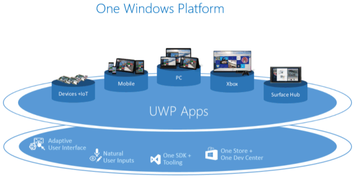

# ユニバーサル Windows プラットフォーム (UWP) アプリとはWhat's a Universal Windows Platform (UWP) app?

UWP アプリには次のような特長があります。A UWP app is:

- 高いセキュリティ。UWP アプリはアクセスするデバイス リソースとデータを宣言します。Secure: UWP apps declare which device resources and data they access. ユーザーは、そのアクセスを承認する必要があります。The user must authorize that access.
- Windows 10 を実行しているすべてのデバイスで共通の API を使用できます。Able to use a common API on all devices that run Windows 10.
- デバイス固有の機能を使用して、異なるデバイスの画面サイズ、解像度、DPI に合わせて UI を調整することができます。Able to use device specific capabilities and adapt the UI to different device screen sizes, resolutions, and DPI.
- Windows 10 を実行するすべてのデバイス (または指定したデバイスのみ) で Microsoft Store から入手できます。Available from the Microsoft Store on all devices (or only those that you specify) that run on Windows 10. Microsoft Store では、アプリで収益を上げるいくつかの方法を提供します。The Microsoft Store provides multiple ways to make money on your app.
- コンピューターへのリスクや "コンピューターの劣化" を気にせずにインストールおよびアンインストールできます。Able to be installed and uninstalled without risk to the machine or incurring "machine rot".
- 魅力的。ライブ タイル、プッシュ通知、Windows タイムラインや Cortana の前回終了した位置から再開を利用したユーザー アクティビティによって、ユーザーのエンゲージメントを高めます。Engaging: use live tiles, push notifications, and user activities that interact with Windows Timeline and Cortana's Pick Up Where I Left Off, to engage users.
- C#、C++、Visual Basic、Javascript でプログラミング可能です。Programmable in C#, C++, Visual Basic, and Javascript. UI 用に、XAML、HTML、または DirectX を使用します。For UI, use XAML, HTML, or DirectX.

これらをさらに詳しく見てみましょう。Let's look at these in more detail.

## セキュリテイ保護Secure

UWP アプリでは、マイク、位置情報、Web カメラ、USB デバイス、ファイルなどへのアクセスに必要なデバイスの機能をマニフェストで宣言します。UWP apps declare in their manifest the device capabilities they need such as access to the microphone, location, Webcam, USB devices, files, and so on. アプリに機能が付与される前に、ユーザーがそのアクセスを確認して承認する必要があります。The user must acknowledge and authorize that access before the app is granted the capability.

## すべてのデバイスに共通の API セットA common API surface across all devices

Windows 10 ではユニバーサル Windows プラットフォーム (UWP) が導入され、Windows 10 を実行する各デバイスで共通のアプリ プラットフォームが提供されます。Windows 10 introduces the Universal Windows Platform (UWP), which provides a common app platform on every device that runs Windows 10. UWP のコア API は、すべての Windows デバイスで同じです。The UWP core APIs are the same on all Windows devices. アプリがコア API のみを使う場合は、対象となるのがデスクトップ PC、Xbox、Mixed Reality ヘッドセットなどのいずれかに関係なく、そのアプリはどの Windows 10 デバイスでも動作します。If your app only uses the core APIs, it will run on any Windows 10 device no matter whether you are targeting a desktop PC, Xbox, Mixed-reality headset, and so on.

C++/WinRT または C++/CX で記述された UWP アプリは UWP の一部である Win32 API にアクセスします。A UWP app written in C++ /WinRT or C++ /CX has access to the Win32 APIs that are part of the UWP. これらの Win32 API は、すべての Windows 10 デバイスによって実装されます。These Win32 APIs are implemented by all Windows 10 devices.

## 拡張 SDK が特定のデバイスの種類に固有の機能を公開するExtension SDKs expose the unique capabilities of specific device types

ユニバーサル API を対象としている場合、アプリは Windows 10 が動作しているすべてのデバイスで実行できます。If you target the universal APIs, your app can run on all devices that run Windows 10. ただし、UWP アプリでデバイス固有の API を利用したい場合は、利用できます。But if you want your UWP app to take advantage of device specific APIs, you can.

拡張 SDK では、さまざまなデバイスに特化した API を呼び出すことができます。Extension SDKs let you call specialized APIs for different devices. たとえば、UWP アプリで IoT デバイスをターゲットにしている場合、IoT デバイスに固有の機能をターゲットにしたプロジェクトに IoT 拡張 SDK を追加できます。For example, if your UWP app targets an IoT device, you can add the IoT extension SDK to your project to target features specific to IoT devices. 拡張 SDK の追加に関する詳細については、[デバイス ファミリの概要に関するページ](https://docs.microsoft.com/uwp/extension-sdks/device-families-overview#extension-sdks)の**拡張 SDK**のセクションを参照してください。For more information about adding extension SDKs, see the **Extension SDKs** section in [Device families overview](https://docs.microsoft.com/uwp/extension-sdks/device-families-overview#extension-sdks).

特定の種類のデバイスでのみ実行されることを想定し、Microsoft Store からの配布をその種類のデバイスのみに制限するようにアプリを記述することができます。You can write your app so that you expect it to run only on a particular type of device, and then limit its distribution from the Microsoft Store to just that type of device. または、実行時に API の存在を条件付きでテストし、結果に応じてアプリの動作を調整できます。Or, you can conditionally test for the presence of an API at runtime and adapt your app's behavior accordingly. 詳細については、[デバイス ファミリの概要に関するページ](https://docs.microsoft.com/uwp/extension-sdks/device-families-overview#writing-code)の**コードの記述**のセクションを参照してください。For more information, see the **Writing Code** section in [Device families overview](https://docs.microsoft.com/uwp/extension-sdks/device-families-overview#writing-code). 

次のビデオでは、デバイス ファミリとアダプティブ コードの作成に関する簡単な概要を示します。The following video provides a brief overview of device families and adaptive coding:
<iframe src="https://channel9.msdn.com/Blogs/One-Dev-Minute/Introduction-to-UWP-and-Device-Families/player" width="640" height="360" allowFullScreen frameBorder="0"></iframe>

## アダプティブ コントロールおよび入力Adaptive controls and input

UI 要素は、そのレイアウトやスケールを調整することで、アプリが実行されている画面のサイズや DPI に対応します。UI elements respond to the size and DPI of the screen the app is running on by adjusting their layout and scale. UWP アプリは、キーボード、マウス、タッチ、ペン、Xbox One コントローラーなど、さまざまな種類の入力デバイスで問題なく機能します。UWP apps work well with multiple types of input such as keyboard, mouse, touch, pen, and Xbox One controllers. 特定の画面サイズやデバイスに合わせて UI をさらに調整する必要がある場合は、新しく追加されたレイアウト パネルとツールを使用して、アプリが実行されるさまざまなデバイスやフォーム ファクターに合わせて調整可能な UI を設計できます。If you need to further tailor your UI to a specific screen size or device, new layout panels and tooling help you design UI that can adapt to the different devices and form factors that your app may run on.

Windows では、UI を次の機能を備えた複数のデバイスを対象としたものにすることができます。Windows helps you target your UI to multiple devices with the following features:

- UI をデバイスの画面の解像度に合わせて最適化するために役立つユニバーサル コントロールとレイアウト パネル。Universal controls and layout panels help you to optimize your UI for the screen resolution of the device. たとえば、ボタンやスライダーなどのコントロールは、デバイスの画面サイズや DPI 密度に合わせて自動的に調整されます。For example, controls such as buttons and sliders automatically adapt to device screen size and DPI density. レイアウト パネルは、画面のサイズに基づいてコンテンツのレイアウトを調整するのに役立ちます。Layout panels help adjust the layout of content based on the size of the screen. デバイス間での解像度と DPI の相違を調整するアダプティブ スケーリング。Adaptive scaling adjusts to resolution and DPI differences across devices.
- 一般的な入力処理では、タッチ、ペン、マウス、キーボード、またはコントローラー (Microsoft Xbox コントローラーなど) による入力を受け取ることができます。Common input handling allows you to receive input through touch, a pen, a mouse, a keyboard, or a controller such as a Microsoft Xbox controller.
- さまざまな画面の解像度に合わせて変化する UI の設計に役立つツール。Tooling that helps you to design UI that can adapt to different screen resolutions.

アプリの UI の一部はデバイス間で自動的に対応します。Some aspects of your app's UI will automatically adapt across devices. ただし、アプリのユーザー エクスペリエンスの設計は、アプリが実行されているデバイスへの対応が必要になる場合があります。Your app's user-experience design, however, may need to adapt depending on the device the app is running on. たとえば、フォト アプリが小型のハンドヘルド デバイスで実行されている場合、UI を片手での使用に適するように調整できます。For example, a photo app could adapt its UI when running on a small, handheld device to ensure that usage is ideal for single-handed use. フォト アプリがデスクトップ コンピューターで実行されている場合、UI は広い画面スペースを利用するように調整する必要があります。When a photo app is running on a desktop computer, the UI should adapt to take advantage of the additional screen space.

## 1 つのストアですべてのデバイスに対応するThere's one store for all devices

統一されたアプリ ストアによって、PC、タブレット、Xbox、HoloLens、Surface Hub、IoT (モノのインターネット) デバイス などの Windows 10 デバイスでアプリを入手できます。A unified app store makes your app available on Windows 10 devices such as PC, tablet, Xbox, HoloLens, Surface Hub, and Internet of Things (IoT) devices. 開発者は、アプリをストアに提出し、すべての種類のデバイスまたは選択した種類のデバイス向けに販売できます。You can submit your app to the store and make it available to all types of devices, or only those you choose. Windows デバイス向けのすべてのアプリを 1 か所で提出、管理できます。You submit and manage all your apps for Windows devices in one place. UWP の機能を使って最新化し、Microsoft Store での販売を希望する C++ デスクトップ アプリがある場合もHave a C++ desktop app that you want to modernize with UWP features and sell in the Microsoft store? 問題ありません。That's okay, too.

UWP アプリは、詳細なテレメトリや分析のために [Application Insights](http://azure.microsoft.com/services/application-insights/) に統合されています。これは、ユーザーを理解し、アプリの品質を向上させるために欠かせないツールです。UWP apps integrate with [Application Insights](http://azure.microsoft.com/services/application-insights/) for detailed telemetry and analytics—a crucial tool for understanding your users and improving your apps.

### アプリの収益化Monetize your app

アプリを収益化する方法を選択できます。You can choose how you'll monetize your app. アプリで収益を得る方法は多数あります。There are a number of ways to make money with your app. 必要なのは、ニーズに合った最適な方法を選ぶことだけです。たとえば、次のような方法があります。All you need to do is choose the one that works best for you, for example:

- 有料のダウンロードは最も簡単な方法です。A paid download is the simplest option. 必要な作業は価格の指定だけです。Just name the price.
- 試用版を使うとユーザーは購入前にアプリを試すことができ、従来の "フリーミアム" オプションよりも目につきやすく、コンバージョンも簡単です。Trials let users try your app before buying it, providing easier discoverability and conversion than the more traditional "freemium" options.
- セール価格はユーザーに対して動機付けとなります。Sale prices to incentivize users.
- アプリ内購入と広告も利用できます。In-app purchases and ads are also available.

### Microsoft Store からアプリのシームレスなインストール、アンインストール、アップグレードのエクスペリエンスを提供するApps from the Microsoft Store provide a seamless install, uninstall, and upgrade experience

すべての UWP アプリは、ユーザー、デバイス、システムを保護するパッケージ システムを使用して配布されます。All UWP apps are distributed using a packaging system that protects the user, device, and system. UWP アプリはアプリで作成したドキュメント以外に何も残さずにアンインストールすることができるため、ユーザーはアプリをインストールしたことを後悔する必要はありません。Users never need regret installing an app because UWP apps can be uninstalled without leaving anything behind except the documents created with the app.

アプリはシームレスに展開および更新することができます。Apps can be deployed and updated seamlessly. ユーザーが必要に応じてコンテンツや拡張機能をダウンロードできるように、アプリのパッケージをモジュール化することができます。App packaging can be modularized so that you can download content and extensions on demand.

## 関連するリアルタイム情報をユーザーに表示して繰り返し集客するDeliver relevant, real-time info to your users to keep them coming back

UWP アプリに対するユーザーのエンゲージメントを維持するためのさまざまな方法があります。There are a variety of ways to keep users engaged with your UWP app:

- ライブ タイルとロック画面タイルは、アプリからのコンテキストに関連したタイムリーな情報をひとめでわかるように表示します。Live tiles and lock screen tiles that show contextually relevant and timely info from your app at a glance.
- プッシュ通知は、ユーザーがリアルタイムの通知に注目できるようにします。Push notifications that bring real-time alerts to your user’s attention.
- ユーザー アクティビティでは、異なるデバイスでも、アプリで前回中断したところから作業を始めることができます。User Activities allow users to pick up where they left off in your app, even across devices.
- アクション センターでは、アプリの通知を整理できます。The Action Center organizes notifications from your app.
- バックグラウンドの実行とトリガーにより、ユーザーが必要とするときにアプリが有効になります。Background execution and triggers bring your app into action when the user needs it.
- アプリで音声と Bluetooth LE デバイスを使うと、ユーザーはそれらのデバイスを中心に広がる世界とやり取りすることができます。Your app can use voice and Bluetooth LE devices to help users interact with the world around them.
- 音声コマンド機能をアプリに追加するには、Cortana を統合します。Integrate Cortana to add voice command capability to your app.

##  使い慣れた言語の使用Use a language you already know

UWP アプリは、オペレーティング システムによって提供されるネイティブな API である Windows ランタイムを使います。UWP apps use the Windows Runtime, the native API provided by the operating system. この API は C++ で実装され、C#、Visual Basic、C++、JavaScript でサポートされます。This API is implemented in C++ and is supported in C#, Visual Basic, C++, and JavaScript. UWP アプリを作成するための一部のオプションを次に示します。Some options for writing UWP apps include:

- XAML UI と、C#、VB、または C++XAML UI and C#, VB, or C++
- DirectX UI と C++DirectX UI and C++
- JavaScript と HTMLJavaScript and HTML

## 役に立つリンクLinks to help you get going

### 準備Get set up

「[準備](get-set-up.md)」を確認し、アプリの作成を始めるために必要なツールをダウンロードしてから、[初めてのアプリを作成](your-first-app.md)してください。Check out [Get set up](get-set-up.md) to download the tools you need to start creating apps, and then [write your first app](your-first-app.md).

### アプリをデザインするDesign your app

Microsoft デザイン システムは Fluent と呼ばれます。The Microsoft design system is named Fluent. Fluent Design System は、すべての種類の Windows デバイスで適切に動作するアプリを作成するためのベスト プラクティスと組み合わされた、UWP 機能のセットです。The Fluent Design System is a set of UWP features combined with best practices for creating apps that perform beautifully on all types of Windows-powered devices. Fluent エクスペリエンスは、タブレット、ノート PC、デスクトップ、テレビから、仮想現実デバイスまで、さまざまなデバイスに対応し、自然に操作できます。Fluent experiences adapt and feel natural on devices from tablets to laptops, from PCs to televisions, and on virtual reality devices. Fluent Design の概要については、[UWP アプリ向けの Fluent Design System に関するページ](https://docs.microsoft.com/windows/uwp/design/fluent-design-system)を参照してください。See [The Fluent Design System for UWP apps](https://docs.microsoft.com/windows/uwp/design/fluent-design-system) for an introduction to Fluent Design.

適切な[設計](http://go.microsoft.com/fwlink/?LinkId=258848)とは、アプリの外観や機能に加えて、ユーザーによるアプリの操作方法を決定するプロセスです。Good [design](http://go.microsoft.com/fwlink/?LinkId=258848) is the process of deciding how users will interact with your app, in addition to how it will look and function. ユーザー エクスペリエンスは、ユーザーがアプリでどの程度満足するかを判断する場合に大きな役割を果たします。そのため、この手順は必ず守ってください。User experience plays a huge part in determining how happy people will be with your app, so don't skimp on this step. [設計の基本に関するページ](https://dev.windows.com/design)では、ユニバーサル Windows アプリの設計を紹介します。[Design basics](https://dev.windows.com/design) introduces you to designing a Universal Windows app. ユーザーを楽しませる UWP アプリの設計の情報については、「[デザイナー向けユニバーサル Windows プラットフォーム (UWP) アプリの紹介](https://msdn.microsoft.com/library/windows/apps/dn958439)」をご覧ください。See the [Introduction to Universal Windows Platform (UWP) apps for designers](https://msdn.microsoft.com/library/windows/apps/dn958439) for information on designing UWP apps that delight your users. コーディングを開始する前に、ターゲットにするすべての異なるフォーム ファクターについてのアプリの使用についての操作エクスペリエンスを検討するために役立つ「[デバイスの基本情報](../design/devices/index.md)」をご覧ください。Before you start coding, see the [device primer](../design/devices/index.md) to help you think through the interaction experience of using your app on all the different form factors you want to target.

さまざまなデバイスでの操作に加えて、複数のデバイスで動作する利点を取り入れるように [アプリの計画](https://msdn.microsoft.com/library/windows/apps/hh465427) を行います。In addition to interaction on different devices, [plan your app](https://msdn.microsoft.com/library/windows/apps/hh465427) to embrace the benefits of working across multiple devices. 次に例を示します。For example:

- モバイル、小型画面デバイス、大型画面デバイスに対応するには、「[UWP アプリのナビゲーション デザインの基本](https://msdn.microsoft.com/library/windows/apps/dn958438)」を使用してワークフローをデザインします。Design your workflow using [Navigation design basics for UWP apps](https://msdn.microsoft.com/library/windows/apps/dn958438) to accommodate mobile, small-screen, and large-screen devices. さまざまな画面サイズと解像度に対応するように[ユーザー インターフェイスをレイアウトします](https://msdn.microsoft.com/library/windows/apps/dn958435)。[Lay out your user interface](https://msdn.microsoft.com/library/windows/apps/dn958435) to respond to different screen sizes and resolutions.

- 複数の入力の種類の対処方法を検討してください。Consider how you'll accommodate multiple kinds of input. ユーザーが [Cortana](https://msdn.microsoft.com/library/windows/apps/dn974233)、[音声認識](https://msdn.microsoft.com/library/windows/apps/dn596121)、[タッチ操作](https://msdn.microsoft.com/library/windows/apps/hh465370)、[タッチ キーボード](https://msdn.microsoft.com/library/windows/apps/hh972345)などを使ってアプリを操作する方法については、「[操作のガイドライン](https://msdn.microsoft.com/library/windows/apps/dn611861)」をご覧ください。See the [Guidelines for interactions](https://msdn.microsoft.com/library/windows/apps/dn611861) to learn how users can interact with your app by using [Cortana](https://msdn.microsoft.com/library/windows/apps/dn974233), [Speech](https://msdn.microsoft.com/library/windows/apps/dn596121), [Touch interactions](https://msdn.microsoft.com/library/windows/apps/hh465370), the [Touch keyboard](https://msdn.microsoft.com/library/windows/apps/hh972345) and more.  または、従来の操作エクスペリエンスについて詳しくは、「[テキストとテキスト入力のガイドライン](https://msdn.microsoft.com/library/windows/apps/dn611864)」をご覧ください。Or, see the [Guidelines for text and text input](https://msdn.microsoft.com/library/windows/apps/dn611864) for more traditional interaction experiences.

### サービスの追加Add services

- [クラウド サービス](http://go.microsoft.com/fwlink/?LinkId=526377)を使用して、デバイス間で同期します。Use [cloud services](http://go.microsoft.com/fwlink/?LinkId=526377) to sync across devices.
- アプリのエクスペリエンスをサポートするにあたって、[Web サービスに接続する](https://msdn.microsoft.com/library/windows/apps/xaml/hh761504)方法について説明します。Learn how to [connect to web services](https://msdn.microsoft.com/library/windows/apps/xaml/hh761504) to support your app experience.
- アプリで音声コマンドに応答できるようにするために、[アプリに Cortana を追加する](https://mva.microsoft.com/training-courses/integrating-cortana-in-your-apps-8487?l=20D3s5Xz_5904984382)方法について説明します。Learn how to [Add Cortana to your app](https://mva.microsoft.com/training-courses/integrating-cortana-in-your-apps-8487?l=20D3s5Xz_5904984382) so that your app can respond to voice commands.
- [プッシュ通知](https://msdn.microsoft.com/library/windows/apps/mt187203)と[アプリ内購入](https://msdn.microsoft.com/library/windows/apps/mt219684)を計画に盛り込みます。Include [Push notifications](https://msdn.microsoft.com/library/windows/apps/mt187203) and [in-app purchases](https://msdn.microsoft.com/library/windows/apps/mt219684) in your planning. これらの機能はさまざまなデバイスで動作する必要があります。These features should work across devices.

### アプリをストアに提出するSubmit your app to the store

新しい統合 Windows デベロッパー センター ダッシュボードにより、Windows デバイス向けのすべてのアプリの管理と申請を 1 か所で行うことができます。The new unified Windows Dev Center dashboard lets you manage and submit all of your apps for Windows devices in one place. Microsoft Store にアプリ公開の申請をする方法については、「[統合 Windows デベロッパー センター ダッシュボードの使用](../publish/using-the-windows-dev-center-dashboard.md)」をご覧ください。See [Using the unified Windows Dev Center dashboard](../publish/using-the-windows-dev-center-dashboard.md) to learn how to submit your apps for publication in the Microsoft Store.

新しい機能が追加されたことで、より高度な管理が可能になった一方、プロセスは簡単になりました。New features simplify processes while giving you more control. また、詳しい[分析レポート](https://msdn.microsoft.com/library/windows/apps/mt148522)に加えて、[支払いの詳細](https://msdn.microsoft.com/library/windows/apps/dn986925)も得られるようになりました。いずれも[アプリの宣伝と顧客エンゲージメントの獲得](https://msdn.microsoft.com/library/windows/apps/mt148526)に役立ちます。You'll also find detailed [analytic reports](https://msdn.microsoft.com/library/windows/apps/mt148522) combined [payout details](https://msdn.microsoft.com/library/windows/apps/dn986925), ways to [promote your app and engage with your customers](https://msdn.microsoft.com/library/windows/apps/mt148526), and much more.

別の入門資料については、「[Windows 10 デバイス向け Windows アプリのビルドの概要](https://msdn.microsoft.com/magazine/dn973012.aspx)」をご覧ください。For more introductory material, see [An Introduction to Building Windows Apps for Windows 10 Devices](https://msdn.microsoft.com/magazine/dn973012.aspx)

### 高度なトピックMore advanced topics

- アプリでのユーザー アクティビティが Windows タイムラインと Cortana の 前回終了した位置から再開機能に表示されるようにするには、[ユーザー アクティビティ](https://blogs.windows.com/buildingapps/2017/12/19/application-engagement-windows-timeline-user-activities/#tHuZ6tLPtCXqYKvw.97)の使用方法に関するページを参照してください。Learn how to use [User Activities](https://blogs.windows.com/buildingapps/2017/12/19/application-engagement-windows-timeline-user-activities/#tHuZ6tLPtCXqYKvw.97) so that user activity in your app appear in Windows Timeline and Cortana's Pick Up Where I Left Off feature.
- [UWP アプリのタイル、バッジ、通知](https://docs.microsoft.com/windows/uwp/design/shell/tiles-and-notifications/)の使用方法に関するページを参照してください。Learn how to use [Tiles, badges, and notifications for UWP apps](https://docs.microsoft.com/windows/uwp/design/shell/tiles-and-notifications/).
- UWP アプリで利用可能な Win32 API の完全な一覧については、「[UWP アプリの API セット](https://msdn.microsoft.com/library/windows/desktop/mt186421)」と「[UWP アプリの DLL](https://msdn.microsoft.com/library/windows/desktop/mt186422)」をご覧ください。For the full list of Win32 APIs available to UWP apps, see [API Sets for UWP apps](https://msdn.microsoft.com/library/windows/desktop/mt186421) and [Dlls for UWP apps](https://msdn.microsoft.com/library/windows/desktop/mt186422).
- .NET UWP アプリの作成の概要については、[.NET でのユニバーサル Windows アプリに関するページ](https://blogs.msdn.microsoft.com/dotnet/2015/07/30/universal-windows-apps-in-net)を参照してください。See [Universal Windows apps in .NET](https://blogs.msdn.microsoft.com/dotnet/2015/07/30/universal-windows-apps-in-net) for an overview of writing .NET UWP apps.
- UWP アプリで使用できる .NET 型の一覧については、「[UWP アプリの .NET](https://msdn.microsoft.com/library/mt185501.aspx)」を参照してください。For a list of .NET types that you can use in a UWP app, see [.NET for UWP apps](https://msdn.microsoft.com/library/mt185501.aspx)
- [.NET Native - ユニバーサル Windows プラットフォーム (UWP) 開発者にとっての意味.NET Native - What it means for Universal Windows Platform (UWP) developers](https://blogs.windows.com/buildingapps/2015/08/20/net-native-what-it-means-for-universal-windows-platform-uwp-developers/#TYsD3tJuBJpK3Hc7.97)
- [デスクトップ ブリッジ](https://developer.microsoft.com/windows/bridges/desktop)を使用して、既存のデスクトップ アプリに Windows 10 ユーザー向けの最新のエクスペリエンスを追加し、Microsoft Store で配布する方法について説明しています。Learn how to add modern experiences for Windows 10 users to your existing desktop app and distribute it in the Microsoft Store with the [Desktop Bridge](https://developer.microsoft.com/windows/bridges/desktop).

## ユニバーサル Windows プラットフォームが Windows ランタイム Api に関連する方法How the Universal Windows Platform relates to Windows Runtime APIs
ユニバーサル Windows プラットフォーム (UWP) アプリを作成する場合は、多くの経費と増減同義語として"ユニバーサル Windows プラットフォーム (UWP)"と「Windows ランタイム (WinRT)」という用語を扱う外の利便性を取得できます。If you're building a Universal Windows Platform (UWP) app, then you can get a lot of mileage and convenience out of treating the terms "Universal Windows Platform (UWP)" and "Windows Runtime (WinRT)" as more or less synonymous. ですが、\*\* では、テクノロジの外観やだけどのような違いは、それらのアイデアの間を判断することもできます。But it *is* possible to look under the covers of the technology, and determine just what the difference is between those ideas. については、興味があるなら、し、この最後のセクションが役立ちます。If you're curious about that, then this last section is for you.

Windows ランタイムと WinRT Api は、Windows Api の進化したものです。The Windows Runtime, and WinRT APIs, are an evolution of Windows APIs. 最初に、フラット、C スタイルの Win32 Api 経由で Windows のプログラム。Originally, Windows was programmed via flat, C-style Win32 APIs. COM Api ([DirectX](https://msdn.microsoft.com/library/windows/desktop/ee663274)著名な例をされている) が追加されました。To those were added COM APIs ([DirectX](https://msdn.microsoft.com/library/windows/desktop/ee663274) being a prominent example). Windows フォーム、WPF、.NET では、マネージ言語となり、独自の Windows アプリ、および API のテクノロジの独自のフレーバーの作成の方法が設定されます。Windows Forms, WPF, .NET, and managed languages brought their own way of writing Windows apps, and their own flavor of API technology. Windows ランタイムでは、COM の次のステージThe Windows Runtime is, under the covers, the next stage of COM. 実際のアプリケーション バイナリ インターフェイス (ABI) レイヤーで COM では、そのルートが表示されます。At the actual application binary interface (ABI) layer, its roots in COM become visible. ただし、Windows ランタイムはさまざまなプログラミング言語の優れた範囲から呼び出すことに設計されています。But the Windows Runtime was designed to be callable from a great range of different programming languages. 各言語に非常に自然な方法で呼び出すことができます。And callable in a way that's very natural to each of those languages. このため、Windows ランタイムへのアクセスは言語プロジェクションとして知られる経由で使用可能になります。To this end, access to the Windows Runtime is made available via what are known as language projections. C#、Visual basic、標準的な C++ に、JavaScript、およびなどに、Windows ランタイム言語プロジェクションがあります。There is a Windows Runtime language projection into C#, into Visual Basic, into standard C++, into JavaScript, and so on. さらに、1 回パッケージ化に適切に ([デスクトップ ブリッジ](/windows/uwp/porting/desktop-to-uwp-root)を参照)、アプリケーション モデルの優れた範囲のいずれかで構築されたアプリから WinRT Api を呼び出すことができます: .NET、Win32、WinForms、および WPF します。Furthermore, once packaged appropriately (see [Desktop Bridge](/windows/uwp/porting/desktop-to-uwp-root)), you can call WinRT APIs from an app built in one of a great range of application models: Win32, .NET, WinForms, and WPF.

そして、もちろん、UWP アプリから WinRT Api を呼び出すことができます。And, of course, you can call WinRT APIs from your UWP app. UWP は、Windows ランタイムの上に構築されたアプリケーション モデルです。UWP is an application model built on top of the Windows Runtime. 技術的には、UWP アプリケーション モデルは、プログラミング言語の好みに応じてからその詳細が表示されないことが、 [CoreApplication](/uwp/api/windows.applicationmodel.core.coreapplication)に基づいています。Technically, the UWP application model is based on [CoreApplication](/uwp/api/windows.applicationmodel.core.coreapplication), although that detail may be hidden from you, depending on your choice of programming language. 値提案の観点から、このトピックでは説明したように、UWP に適していますが、選択する必要があります、Microsoft Store に公開して実行できる優れたさまざまなデバイスのフォーム ファクターのいずれかを 1 つのバイナリを記述します。As this topic has explained, from a value proposition point of view, the UWP lends itself to writing a single binary that can, should you choose, be published to the Microsoft Store and run on any one of a great range of device form factors. UWP アプリのデバイスに到達は、通話をアプリに制限することや、条件付きで呼び出すこと、UWP Api のサブセットとは異なります。The device reach of your UWP app depends on the subset of UWP APIs that you limit your app to calling, or that you call conditionally.

できれば、このセクションでは、Windows ランタイム Api とメカニズムとユニバーサル Windows プラットフォームのビジネスの値を基になるテクノロジの違いの説明に成功しています。Hopefully, this section has been successful in describing the difference between the technology underlying Windows Runtime APIs, and the mechanism and business value of the Universal Windows Platform.
