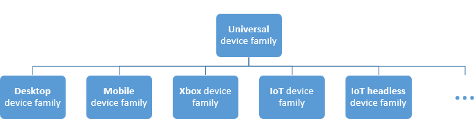

# ユニバーサル Windows プラットフォーム (UWP) アプリのガイド


\[Windows 10 の UWP アプリ向けに更新。 Windows 8.x の記事については、[アーカイブ](http://go.microsoft.com/fwlink/p/?linkid=619132)をご覧ください\]

ここでは、次の項目について説明します。

-   *デバイス ファミリ* の定義およびターゲットにするデバイス ファイルを決定する方法。
-   さまざまなデバイスのフォーム ファクターに合わせて UI を対応させることができる新しい UI コントロールおよびパネル。
-   アプリで利用できる API サーフェスを理解および制御する方法。

Windows 8 では、Windows アプリ モデルの進化形である Windows ランタイム (WinRT) が導入されました。 これは一般的なアプリケーション アーキテクチャを意図したものでした。

Windows Phone 8.1 が使用できるようになったとき、Windows ランタイムは Windows Phone 8.1 と Windows の間に配置されました。 これにより、開発者は共有コードベースを使って Windows と Windows Phone の両方をターゲットにする *ユニバーサル Windows 8 アプリ* の作成が可能となりました。

Windows 10 では、Windows ランタイム モデルをさらに進化させ、Windows 10 の統合されたコアにまとめる、ユニバーサル Windows プラットフォーム (UWP) が導入されています。 コアの一部として、UWP は Windows 10 を実行するすべてのデバイスで利用可能な共通アプリ プラットフォームを提供するようになりました。 この進化により、UWP をターゲットとするアプリはすべてのデバイスに共通する WinRT API だけでなく、アプリが実行されているデバイス ファミリに固有の API (Win32 と .NET API を含む) も呼び出すことができます。 UWP はさまざまなデバイスに保証されたコア API レイヤーを提供します。 つまり、多様なデバイスにインストールできる単一のアプリ パッケージを作成することができます。 そして、その単一のアプリ パッケージで、Windows ストアはアプリが実行できるすべてのデバイスの種類に利用可能な統合された配布チャネルを提供します。


UWP アプリはさまざまなフォーム ファクターと入力モダリティを備えた多様な種類のデバイスで実行されるため、各デバイスに合わせて調整して、各デバイスの独自の機能のロックを解除する必要があります。 デバイスはデバイス固有の API を保証された API レイヤーに追加します。 これらの固有な API に条件付きでアクセスするコードを作成して、アプリが他のデバイスで異なるエクスペリエンスを表示している間に 1 種類のデバイスに固有の機能の使い勝手をよくすることができます。 アダプティブ UI コントロールと新しいレイアウト パネルを使うと、UI をさまざまな画面解像度で調整できます。

## デバイス ファミリ


Windows 8.1 アプリと Windows Phone 8.1 アプリがターゲットとするオペレーティング システム (OS) は、Windows または Windows Phone です。 Windows 10 では、オペレーティング システムをターゲットにする代わりに、1 つまたは複数のデバイス ファミリに設定されたアプリをターゲットにします。 デバイス ファミリに基づいて、デバイス ファミリのデバイス全体で想定できる API、システム特性、動作を特定します。 ストアからアプリをインストールできる一連のデバイスも決定します。 次にデバイス ファミリの階層を示します。



デバイス ファミリは、まとめられて、名前とバージョン番号が指定された一連の API です。 デバイス ファミリは OS の基盤です。 PC ではデスクトップ デバイス ファミリに基づいているデスクトップ OS を実行します。 電話やタブレットなどでは、モバイル デバイス ファミリに基づいているモバイル OS を実行します。 その他

ユニバーサル デバイス ファミリは特殊です。 直接には、いずれの OS の基盤でもありません。 代わりに、ユニバーサル デバイス ファミリの一連の API は、子デバイス ファミリで継承されます。 ユニバーサル デバイス ファミリ API はすべての OS に存在することが保証され、その結果、すべてのデバイスに存在することが保証されます。

各子デバイス ファミリでは、独自の API が継承する API に追加されます。 結果として得られる子デバイス ファミリの API の和集合は、そのデバイス ファミリに基づく OS、つまり、その OS を実行するすべてのデバイス、に存在することが保証されます。

デバイス ファミリの利点の 1 つは、電話、タブレット、およびデスクトップ コンピューターから Surface Hub と Xbox コンソールまでのいずれか、またはすべてのデバイスでアプリを実行できることです。 アプリはユニバーサル デバイス ファミリの外部のデバイスの機能を動的に検出して使うアダプティブ コードを使うこともできます。

アプリがターゲットにするデバイス ファミリに関する決定は自分で行うことができます。 この決定はこれらの重要な点でアプリに影響します。 次の内容を決定します。

-   アプリが実行されるときに存在する (したがって、自由に呼び出すことができる) と期待できる一連の API。
-   条件ステートメント内のみで安全な一連の API 呼び出し。
-   ストア (および結果として、検討する必要のあるフォーム ファクター) からアプリをインストールできる一連のデバイス。

デバイス ファミリの選択には主に次の 2 つの結果があります。アプリによって無条件に呼び出せる API サーフェスとアプリをインストールできるデバイスの数です。 これら 2 つの要素にはトレードオフがあり、逆相関します。 たとえば、UWP アプリは特にユニバーサル デバイス ファミリをターゲットとするアプリで、その結果、すべてのデバイスに利用できます。 ユニバーサル デバイス ファミリをターゲットとするアプリでは、ユニバーサル デバイス ファミリの API のみが存在することが期待できます (ターゲットとするものであるため)。 その他の API は、条件付きで呼び出す必要があります。 また、このようなアプリはさまざまなデバイスで実行できるため、高度なアダプティブ UI と包括的な入力機能を備えている必要があります。 Windows モバイル アプリは、特にモバイル デバイス ファミリをターゲットとするアプリで、OS がモバイル デバイス ファミリ (電話、タブレット、類似したデバイスを含む) に基づくデバイスで利用できます。 モバイル デバイス ファミリのアプリには、モバイル デバイス ファミリのすべての API が存在することが期待でき、その UI はある程度アダプティブである必要があります。 IoT デバイス ファミリをターゲットとするアプリは IoT デバイスのみにインストールすることができ、IoT デバイス ファミリ内のすべての API が存在することが期待できます。 このアプリは特定の種類のデバイスでのみ実行されることがわかっているため、UI と入力機能に特化することができます。

ターゲットにするデバイス ファミリを決定するために役立つ考慮事項をいくつか紹介します。

**アプリの適用範囲の最大化**

アプリでのデバイスの範囲を最大限に広げ、できるだけ多くの種類のデバイス上で実行するために、アプリはユニバーサル デバイス ファミリをターゲットとします。 これにより、アプリはユニバーサルに基づくすべてのデバイス ファミリを自動的にターゲットにします (図内、ユニバーサルのすべての子)。 つまり、アプリはそれらのデバイス ファミリに基づくすべての OS で実行され、それらのオペレーティング システムを実行するすべてのデバイスで実行されます。 それらのすべてのデバイスで利用できることが保証される API のみが、ターゲットとするユニバーサル デバイス ファミリの特定のバージョンで定義されるセットです。 (このリリースでは、バージョンは常に 10.0.x.0)。アプリがターゲットのデバイス ファミリのバージョン以外の API を呼び出す方法については、このトピックの後方にある「コードの記述」をご覧ください。

**アプリを 1 種類のデバイスに制限する**

アプリをさまざまなデバイスで実行せずに、たとえば、デスクトップ PC や Xbox コンソールに特化する場合があります。 その場合、子デバイス ファミリのいずれかでアプリをターゲットにすることができます。 たとえば、デスクトップ デバイス ファミリをターゲットとする場合、アプリで利用可能であることが保証されている API には、ユニバーサル デバイス ファミリから継承された API とデスクトップ デバイス ファミリに固有の API が含まれます。

**アプリを使用可能なすべてのデバイスのサブセットに制限する**

ユニバーサル デバイス ファミリをターゲットとしたり、子デバイス ファミリのいずれかをターゲットとしたりする代わりに、2 つ以上の子デバイス ファミリをターゲットにすることができます。 アプリのターゲットとして、デスクトップとモバイルが適している場合があります。 また、デスクトップと Xbox が適している場合があります。 また、デスクトップ、Xbox、Surface Hub が適している場合があります。

**デバイス ファミリの特定のバージョンのサポートを除外する**

まれに、特定のデバイス ファミリの特定のバージョンのデバイスを除くすべてでアプリを実行する場合があります。 たとえば、アプリがユニバーサル デバイス ファミリのバージョン 10.0.x.0 をターゲットとするとします。 将来的にオペレーティング システムのバージョンが、たとえば 10.0.x.2 に変更された場合、その時点でアプリのターゲットをユニバーサル 10.0.x.0 と Xbox 10.0.x.1 にして、アプリを Xbox のバージョン 10.0.x.1 以外のすべてで実行するように指定することができます。 その後、アプリは Xbox 10.0.x.1 以前のデバイス ファミリのバージョンのセットでは使用できなくなります。

既定では、Microsoft Visual Studio はアプリ パッケージ マニフェスト ファイルでターゲット デバイス ファミリとして **Windows.Universal** を指定します。 アプリがターゲットとする 1 つまたは複数のデバイス ファミリをストアで指定するには、Package.appxmanifest ファイルの [**TargetDeviceFamily**](https://msdn.microsoft.com/library/windows/apps/dn986903) 要素を手動で構成します。

## UI とユニバーサル入力


UWP アプリは、異なる形式の入力、画面の解像度、DPI 密度、その他の固有の特性を備えた、多くの異なる種類のデバイスで実行できます。 Windows 10 には、新しいユニバーサル コントロール、レイアウト パネル、およびアプリが動作するデバイスに UI を対応させるためのツールが用意されています。 たとえば、アプリがデスクトップ コンピューターとモバイル デバイスで実行されている場合、画面の解像度の違いを利用して UI を調整することができます。

アプリの UI の一部はデバイス間で自動的に対応します。 ボタン、スライダーなどのコントロールは、デバイス ファミリと入力モード間で自動的に対応します。 ただし、アプリのユーザー エクスペリエンスの設計は、アプリが実行されているデバイスへの対応が必要になる場合があります。 たとえば、フォト アプリが小型のハンドヘルド デバイスで実行されている場合、UI を片手での使用に適するように調整する必要があります。 フォト アプリがデスクトップ コンピューターで実行されている場合、UI は広い画面スペースを利用するように調整する必要があります。

Windows では、UI を次の機能を備えた複数のデバイスを対象としたものにすることができます。

-   UI をデバイスの画面の解像度に合わせて最適化するために役立つユニバーサル コントロールとレイアウト パネル
-   一般的な入力処理では、タッチ、ペン、マウス、キーボード、またはコントローラー (Microsoft Xbox コントローラーなど) による入力を受け取ることができます。
-   さまざまな画面の解像度に合わせて変化する UI の設計に役立つツール
-   デバイス間での解像度と DPI の相違を調整するアダプティブ スケーリング

### ユニバーサル コントロールとレイアウト パネル

Windows 10 には、calendar and split ビューなどの新しいコントロールが含まれています。 以前は Windows Phone のみで使用できたピボット コントロールも、ユニバーサル デバイス ファミリで使用できるようになりました。

コントロールは、より大きな画面で適切に動作し、デバイスで使用できる画面ピクセル数に対応し、キーボード、マウス、タッチ、ペン、コントローラー (Xbox コントローラーなど) などの複数の種類の入力で適切に動作するように更新されています。

アプリが実行されるデバイスの画面の解像度に基づいて、全体的な UI レイアウトの調整が必要になる可能性があります。 たとえば、デスクトップで実行されている通信アプリに呼び出し元のピクチャ イン ピクチャとマウス入力に適したコントロールが含まれている場合があります。


ただし、アプリを電話で実行する場合は、操作する画面の作業領域が小さいため、アプリではピクチャ イン ピクチャ ビューを削除して、片手で操作しやすいように通話ボタンを大きくする場合があります。


使用可能な画面領域の量に基づいて全体的な UI レイアウトを調整するために、Windows 10 ではアダプティブ パネルとデザイン状態が導入されています。

### アダプティブ パネルでアダプティブ UI を設計する

レイアウト パネルでは、利用可能な領域に応じて、子にサイズと位置を指定します。 たとえば、[**StackPanel**](https://msdn.microsoft.com/library/windows/apps/br209635) は子を連続的に順序付けます (横方向または縦方向)。 [**Grid**](https://msdn.microsoft.com/library/windows/apps/br242704) は子をセルに配置する CSS グリッドのようなものです。

新しい [**RelativePanel**](https://msdn.microsoft.com/library/windows/apps/dn879546) は子要素間の関係で定義されるレイアウトのスタイルを実装します。 画面の解像度の変更に対応できるアプリのレイアウトの作成で使用します。 **RelativePanel** は要素間の関係を定義して要素を並べ替えやすくして、入れ子になったレイアウトを使わずにさらに動的な UI を作成できるようにします。

次の例では、**blueButton** は向きやレイアウトの変更にかかわらず **textBox1** の右側に表示され、**orangeButton** はテキストが入力されて **textBox1** の幅が変わる場合でも、**blueButton** のすぐ下に、揃えて表示されます。 この効果を出すためには、以前は **Grid** で行と列が必要でしたが、はるかに少ないマークアップで実行できるようになりました。


```XAML
<RelativePanel>
    <TextBox x:Name="textBox1" Text="textbox" Margin="5"/>
    <Button x:Name="blueButton" Margin="5" Background="LightBlue" Content="ButtonRight" RelativePanel.RightOf="textBox1"/>
    <Button x:Name="orangeButton" Margin="5" Background="Orange" Content="ButtonBelow" RelativePanel.RightOf="textBox1" RelativePanel.Below="blueButton"/>
</RelativePanel>
```

### 表示状態のトリガーを使用して、利用可能な画面上のスペースに対応できる UI を構築する

UI はウィンドウ サイズの変化への対応が必要になる場合があります。 アダプティブな表示状態により、ウィンドウのサイズの変化に応じて表示状態を変更できます。

StateTriggers は表示状態がアクティブ化されるしきい値を定義し、状態の変更をトリガーしたウィンドウ サイズに適したレイアウト プロパティを設定します。

次の例では、ウィンドウ サイズの幅が 720 ピクセル以上の場合、**wideView** という名前の表示状態がトリガーされ、**[高評価ゲーム]** パネルが **[トップ無料ゲーム]** パネルの右側に、上部を揃えて表示されるように配置します。


ウィンドウが 720 ピクセル未満の場合、**wideView** のトリガーは適合せず、無効になっているため、**narrowView** 表示状態がトリガーされます。 **narrowView** 表示状態は **[高評価ゲーム]** パネルを **[トップ有料ゲーム]** パネルの下に、左側を揃えて配置します。


先に説明した表示状態のトリガーの XAML を次に示します。 以下の "`...`" でわかるように、わかりやすくするためにパネルの定義は削除されました。

```XAML
<Grid Background="{ThemeResource ApplicationPageBackgroundThemeBrush}">
    <VisualStateManager.VisualStateGroups>
        <VisualStateGroup>
            <VisualState x:Name="wideView">
                <VisualState.StateTriggers>
                    <AdaptiveTrigger MinWindowWidth="720" />
                </VisualState.StateTriggers>
                <VisualState.Setters>
                    <Setter Target="best.(RelativePanel.RightOf)" Value="free"/>
                    <Setter Target="best.(RelativePanel.AlignTopWidth)" Value="free"/>
                </VisualState.Setters>
            </VisualState>
            <VisualState x:Name="narrowView">
                <VisualState.Setters>
                    <Setter Target="best.(RelativePanel.Below)" Value="paid"/>
                    <Setter Target="best.(RelativePanel.AlignLeftWithPanel)" Value="true"/>
                </VisualState.Setters>
                <VisualState.StateTriggers>
                    <AdaptiveTrigger MinWindowWidth="0" />
                </VisualState.StateTriggers>
            </VisualState>
        </VisualStateGroup>
    </VisualStateManager.VisualStateGroups>
    ...
</Grid>
```

### ツール

既定では、できるだけ幅広いデバイス ファミリをターゲットにします。 特定のデバイスでのアプリの外観とレイアウトを表示する準備ができたら、Visual Studio のデバイス プレビュー ツール バーを使用して、小規模または中規模のモバイル デバイス、PC、または大画面テレビで、UI をプレビューします。 このようにして、アダプティブ表示状態を調整して、テストすることができます。


サポートするすべてのデバイスの種類について事前に決定する必要はありません。 プロジェクトには、追加のデバイス サイズを後で追加することができます。

### アダプティブ スケーリング

Windows 10 には、既存のスケーリング モデルの進化形が導入されています。 表示スケール ベクター コンテンツに加えて、さまざまな画面サイズと画面の解像度で UI 要素に一貫したサイズを提供するスケール ファクターの統合されたセットがあります。 スケール ファクターは、iOS や Android などの他のオペレーティング システムのスケール ファクターとも互換性があります。 これにより、これらのプラットフォーム間でのアセットの共有が簡単になります。

ストアでは、デバイスの DPI の一部に基づいて、ダウンロードするアセットが選ばれます。 デバイスに最適なアセットのみがダウンロードされます。

### 共通の入力処理

マウス、キーボード、タッチ、ペン、コントローラー (たとえば、Xbox コントローラー) などのさまざまな入力を処理するユニバーサル コントロールを使ってユニバーサル Windows アプリをビルドすることができます。 従来、手描き入力はペン入力のみに関連付けられていましたが、Windows 10 では、一部のデバイスでのタッチ、およびポインター入力によって手描き入力ができます。 手描き入力は、多くのデバイス (モバイル デバイスなど) でサポートされており、数行のコードだけで簡単に組み込むことができます。

次の API は、入力へのアクセスを提供します。

-   [**CoreIndependentInputSource**](https://msdn.microsoft.com/library/windows/apps/dn298460) は、メイン スレッドまたはバックグラウンド スレッドで未加工入力を利用できるようにする新しい API です。
-   [**PointerPoint**](https://msdn.microsoft.com/library/windows/apps/br242038) は、未加工のタッチ、マウス、ペンのデータを、1 つの一貫したインターフェイスやイベントのセットに統合します。これらのインターフェイスやイベントは、**CoreInput** を使うことにより、メイン スレッドまたはバックグラウンド スレッドで利用できます。
-   [**PointerDevice**](https://msdn.microsoft.com/library/windows/apps/br225633) は、デバイスで使用可能な入力モダリティを特定するために、デバイス機能の照会をサポートするデバイス API です。
-   新しい [**InkCanvas**](https://msdn.microsoft.com/library/windows/apps/dn858535) XAML コントロールと [**InkPresenter**](https://msdn.microsoft.com/library/windows/apps/dn922011) Windows ランタイム API によって、インク ストローク データにアクセスできます。

## コードの記述


[Visual Studio での Windows 10 プロジェクト](https://msdn.microsoft.com/en-us/library/windows/apps/dn609832.aspx#target_win10) に使用するプログラミング言語オプションには、Visual C++、C#、Visual Basic、JavaScript が含まれます。 Visual C++、C#、Visual Basic については、完全な再現性を持つ、ネイティブ UI エクスペリエンスのために XAML を使うことができます。 Visual C++ については、XAML の代わりに、または XAML に加えて、DirectX での描画を選ぶことができます。 JavaScript については、プレゼンテーション レイヤーは HTML になり、HTML はもちろん、クロスプラットフォーム Web 標準です。 コードと UI の大部分はユニバーサルで、すべての場所で同様に実行されます。 特定のデバイス ファミリに合わせて調整されたコードと特定のフォーム ファクターに合わせて調整された UI については、アダプティブ コードとアダプティブ UI を使用するオプションがあります。 これらの異なる場合を詳しく見てみましょう。

**ターゲット デバイス ファミリで実装されている API の呼び出し**

API を呼び出す場合は、アプリがターゲットとしているデバイス ファミリでその API が実装されているかどうかを把握しておく必要があります。 判断がつかない場合は、API リファレンス ドキュメントで検索することができます。 関連するトピックを開いて、要件セクションを表示すると、実装するデバイス ファミリの内容が表示されます。 たとえば、アプリがユニバーサル デバイス ファミリのバージョン 10.0.x.0 をターゲットにしていて、[**Windows.UI.Core.SystemNavigationManager**](https://msdn.microsoft.com/library/windows/apps/dn893595) クラスのメンバーを呼び出すとします。 この例におけるデバイス ファミリは "ユニバーサル" です。 呼び出そうとするクラス メンバーもターゲット内にあることを、この場合でもさらに確認することをお勧めします。 したがって、この例では、API はアプリをインストールできるすべてのデバイスに存在することが保証されることがわかり、通常と同様に、コードに API を呼び出すことができます。

```csharp
    Windows.UI.Core.SystemNavigationManager.GetForCurrentView().BackRequested += TestView_BackRequested;
```

もう 1 つの例として、アプリが Xbox デバイス ファミリのバージョン 10.0.x.0 をターゲットとしていて、呼び出す API のリファレンス トピックでは API は Xbox デバイス ファミリのバージョン 10.0.x.0 に導入されたと示されているとします。 その場合も、API はアプリがインストールできるすべてのデバイス上に存在することが保証されます。 そのため、コード内で通常の方法でその API を呼び出すことができます。

Visual Studio の IntelliSense はアプリのターゲット デバイス ファミリまたは参照している拡張 SDK によって実装されていない限り、API を認識しないことに注意してください。 そのため、拡張 SDK を参照していない場合は、IntelliSense に表示される API は確実にターゲット デバイス ファミリにあり、自由に呼び出すことができます。

**ターゲット デバイス ファミリで実装されていない API の呼び出し**

API を呼び出そうとしてもドキュメントの一覧にターゲット デバイス ファミリがない場合があります。 その場合、その API を呼び出すためにアダプティブ コードを記述することができます。

**ApiInformation クラスを使ったアダプティブ コードの記述**

アダプティブ コードを記述するには 2 つの手順があります。 最初の手順は、プロジェクトで使用可能な、アクセスする API を作成します。 そのためには、条件付きで呼び出す API を所有しているデバイス ファミリを表す拡張 SDK への参照を追加します。 [拡張 SDK](../porting/w8x-to-uwp-porting-to-a-uwp-project.md#extension-sdks) をご覧ください。

2 番目の手順は、呼び出す API の存在をテストするためにコードの条件で [**Windows.Foundation.Metadata.ApiInformation**](https://msdn.microsoft.com/library/windows/apps/dn949001) クラスを使います。 このテストの条件は、アプリの実行時に必ず評価されますが、API が存在するデバイスに対してのみ true と評価され、呼び出しが可能になります。

少数の API のみを呼び出す場合は、次のように [**ApiInformation.IsTypePresent**](https://msdn.microsoft.com/library/windows/apps/dn949016) メソッドを使うことができます。

```csharp
    // Note: Cache the value instead of querying it more than once.
    bool isHardwareButtonsAPIPresent =
        Windows.Foundation.Metadata.ApiInformation.IsTypePresent("Windows.Phone.UI.Input.HardwareButtons");

    if (isHardwareButtonsAPIPresent)
    {
        Windows.Phone.UI.Input.HardwareButtons.CameraPressed +=
            HardwareButtons_CameraPressed;
    }
```

この場合、[**HardwareButtons**](https://msdn.microsoft.com/library/windows/apps/jj207557) クラスが存在すると [**CameraPressed**](https://msdn.microsoft.com/library/windows/apps/dn653805) イベントが存在します。これはクラスとメンバーには同じ要件の情報があるためです。 しかし、やがて、新しいメンバーは既に導入されたクラスに追加され、それらのメンバーは後でバージョン番号に "導入" されます。 このような場合、**IsTypePresent** を使う代わりに、**IsEventPresent**、**IsMethodPresent**、**IsPropertyPresent**、および同様のメソッドを使って個々のメンバーの存在をテストすることができます。 次に例を示します。

```csharp
    bool isHardwareButtons_CameraPressedAPIPresent =
        Windows.Foundation.Metadata.ApiInformation.IsEventPresent
            ("Windows.Phone.UI.Input.HardwareButtons", "CameraPressed");
```

デバイス ファミリ内の API のセットは、API コントラクトと呼ばれる小項目にさらに分類されます。 API コントラクトの存在をテストするには、**ApiInformation.IsApiContractPresent** メソッドを使うことができます。 これは、すべてが API コントラクトの同じバージョンに存在する膨大な数の API の存在をテストする場合に便利です。

```csharp
    bool isWindows_Devices_Scanners_ScannerDeviceContract_1_0Present =
        Windows.Foundation.Metadata.ApiInformation.IsApiContractPresent
            ("Windows.Devices.Scanners.ScannerDeviceContract", 1, 0);
```

**UWP での Win32 API**

C++/CX で記述された UWP アプリまたは Windows ランタイム コンポーネントは UWP の一部である Win32 API にアクセスします。 これらの Win32 API は、すべての Windows 10 デバイス ファミリによって実装されます。 アプリを Windowsapp.lib とリンクします。 Windowsapp.lib は UWP API へのエクスポートを提供する "包括的な" lib です。 Windowsapp.lib へリンクすると、すべての Windows 10 デバイス ファミリに存在する DLL にアプリの依存関係を追加することになります。

UWP アプリに利用可能な Win32 API の完全な一覧については、「[UWP アプリの API セット](https://msdn.microsoft.com/library/windows/desktop/mt186421)」と「[UWP アプリの DLL](https://msdn.microsoft.com/library/windows/desktop/mt186422)」をご覧ください。

## ユーザー エクスペリエンス


ユニバーサル Windows アプリによって、実行されているデバイスの固有の機能を利用することができます。 アプリでは、デスクトップ デバイスのすべての機能、タブレットの直接的な自然な操作 (タッチ/ペン入力を含む)、モバイル デバイスの移植性と便利さ、[Surface Hub](http://go.microsoft.com/fwlink/?LinkId=526365) の協調機能を使うことができます。

適切な「[UWP アプリの設計](http://go.microsoft.com/fwlink/?LinkId=258848)」は、ユーザーがアプリを操作する方法とアプリの外観と機能を決定するプロセスです。 ユーザー エクスペリエンスは、ユーザーがアプリでどの程度満足するかを判断する場合に大きな役割を果たします。そのため、この手順は必ず守ってください。 「[設計の基本](https://dev.windows.com/en-us/design) ユーザーを楽しませる UWP アプリの設計の情報については、「[デザイナー向けユニバーサル Windows プラットフォーム (UWP) アプリの紹介](https://msdn.microsoft.com/library/windows/apps/dn958439)」をご覧ください。 コーディングを開始する前に、ターゲットにするすべての異なるフォーム ファクターについてのアプリの使用についての操作エクスペリエンスを検討するために役立つ「[デバイスの基本情報](../input-and-devices/device-primer.md)」をご覧ください。


さまざまなデバイスでの操作に加えて、複数のデバイスで動作する利点を取り入れるように [アプリの計画](https://msdn.microsoft.com/library/windows/apps/hh465427) を行います。 たとえば、次のようなものです。

-   [クラウド サービス](http://go.microsoft.com/fwlink/?LinkId=526377)を使用して、デバイス間で同期します。 アプリのエクスペリエンスをサポートするにあたって、[Web サービスに接続する](https://msdn.microsoft.com/library/windows/apps/xaml/hh761504)方法について説明します。

-   あるデバイスから別のデバイスに移動し、中断した場所から再開するユーザーをサポートする方法を検討します。 [通知](https://msdn.microsoft.com/library/windows/apps/mt187203)と[アプリ内購入](https://msdn.microsoft.com/library/windows/apps/mt219684)を計画に盛り込みます。 これらの機能はさまざまなデバイスで動作する必要があります。

-   モバイル、小型画面デバイス、大型画面デバイスに対応するには、「[UWP アプリのナビゲーション デザインの基本](https://msdn.microsoft.com/library/windows/apps/dn958438)」を使用してワークフローをデザインします。 [ユーザー インターフェイスをレイアウトする](https://msdn.microsoft.com/library/windows/apps/dn958435)さまざまな画面サイズと解像度に対応します。

-   小さな携帯電話の画面では役に立たないアプリの機能があるかどうかを検討します。 また、固定されたデスクトップ コンピューターでは役に立たず、モバイル デバイスを使う必要がある領域がある場合もあります。 たとえば、[場所](https://msdn.microsoft.com/library/windows/apps/mt219698)に関連するシナリオではモバイル デバイスを意味することが多いものです。

-   複数の入力モダリティの対処方法を検討してください。 ユーザーが [Cortana](https://msdn.microsoft.com/library/windows/apps/dn611861)、[音声認識](https://msdn.microsoft.com/library/windows/apps/dn974233)、[タッチ操作](https://msdn.microsoft.com/library/windows/apps/dn596121)、[タッチ キーボード](https://msdn.microsoft.com/library/windows/apps/hh465370)などを使ってアプリを操作する方法については、「[操作のガイドライン](https://msdn.microsoft.com/library/windows/apps/hh972345)」をご覧ください。

    従来の操作エクスペリエンスについて詳しくは、「[テキストとテキスト入力のガイドライン](https://msdn.microsoft.com/library/windows/apps/dn611864)」をご覧ください。

## ダッシュボードによるユニバーサル Windows アプリの申請


新しい統合 Windows デベロッパー センター ダッシュボードにより、Windows デバイス向けのすべてのアプリの管理と申請を 1 か所で行うことができます。 新しい機能が追加されたことで、より高度な管理が可能になった一方、プロセスは簡単になりました。 また、詳しい[分析レポート](https://msdn.microsoft.com/library/windows/apps/mt148522)に加えて、[支払いの詳細](https://msdn.microsoft.com/library/windows/apps/dn986925)も得られるようになりました。いずれも[アプリの宣伝と顧客エンゲージメントの獲得](https://msdn.microsoft.com/library/windows/apps/mt148526)に役立ちます。

Windows ストアにアプリ公開の申請をする方法については、「[統合 Windows デベロッパー センター ダッシュボードの使用](../publish/using-the-windows-dev-center-dashboard.md)」をご覧ください。

 

 


<!--HONumber=Mar16_HO1-->


