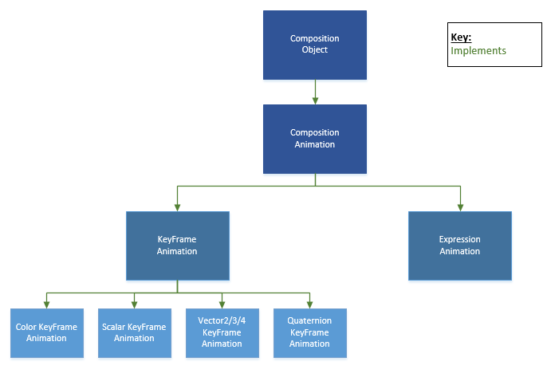

# <a name="composition-animations"></a>コンポジションのアニメーション

\[Windows 10 の UWP アプリ向けに更新。 Windows 8.x の記事については、[アーカイブ](http://go.microsoft.com/fwlink/p/?linkid=619132)をご覧ください\]

Windows.UI.Composition WinRT API によって、統合された API レイヤーでコンポジター オブジェクトを作成、アニメーション化、変換、操作することができます。 コンポジションのアニメーションは、アプリケーションの UI でアニメーションを実行するための強力で効率的な手段を提供します。 コンポジション アニメーションは、アニメーションが UI スレッドから独立して 60 FPS で実行され、時間だけでなく、入力やその他のプロパティを使ってアニメーションを駆動する驚くようなエクスペリエンスを柔軟に構築できるように、一から設計されています。
このトピックでは、コンポジション オブジェクトのプロパティのアニメーション化で使用できる機能の概要を説明します。
このドキュメントでは、ビジュアル レイヤーの構造の基礎を理解していることを前提としています。 詳しくは、[こちらをご覧ください](./composition-visual-tree.md)。 コンポジション アニメーションには、**キー フレーム アニメーション**と**数式アニメーション**の 2 つの種類があります。  

  
   
 
## <a name="types-of-composition-animations"></a>コンポジション アニメーションの種類
**キー フレーム アニメーション**は、従来の時間に基づく*フレーム単位の*アニメーション エクスペリエンスを提供します。 開発者は、アニメーション タイムラインの特定の時点におけるアニメーション化プロパティの値を指定する*制御点*を明示的に定義できます さらに重要なのは、イージング関数 (インターポレーターとも呼ばれる) を使って、これらの制御点の間を遷移する方法を指定できる点です。  

**暗黙的なアニメーション**は、開発者がアプリのコア ロジックとは別に、再利用可能な個々のアニメーションまたは一連のアニメーションを定義できるようにする、一種のアニメーションです。 暗黙的なアニメーションを使用すると、開発者は、*テンプレート*を作成し、そのテンプレートをトリガーでフックできます。 これらのトリガーはプロパティの変更であり、明示的な割り当てによって発生します。 テンプレートは 1 つのアニメーションまたはアニメーション グループとして定義できます。 アニメーション グループは、アニメーション テンプレートのコレクションで、明示的に、またはトリガーによって、まとめて開始することができます。 暗黙的なアニメーションを使用すると、プロパティ値の変更とアニメーション化が必要になるたびに、明示的な KeyFrameAnimations を作成しなくてもよくなります。

**数式アニメーション**は、Windows 10 の 11 月の更新プログラム (ビルド 10586) のビジュアル レイヤーで導入されたアニメーションの種類です。 数式アニメーションの背景にあるのは、開発者が、[Visual](https://msdn.microsoft.com/library/windows/apps/windows.ui.composition.visual.aspx) プロパティと、フレームごとに評価および更新される個別の値の間に数学的な関係を構築できるようにするという考え方です。 開発者はコンポジション オブジェクトのプロパティやプロパティ セットを参照したり、数学関数ヘルパーを使用したり、入力を参照したりすることで、これらの数学的な関係を導き出します。 数式によって、Windows プラットフォームで、視差や固定ヘッダーなどのエクスペリエンスが実現され、スムーズに処理できます。  

## <a name="why-composition-animations"></a>コンポジション アニメーションを使う理由
**パフォーマンス**  
 ユニバーサル Windows アプリケーションを構築する場合、ほとんどの開発者コードは UI スレッドで実行されます。 アニメーションがさまざまなデバイス カテゴリでスムーズに実行されるように、システムはアニメーションの計算を実行し、60 FPS を維持するために独立したスレッドで処理します。 つまり、開発者はスムーズなアニメーションの提供をシステムに任せて、アプリケーションでは、高度なユーザー エクスペリエンスを実現する他の複雑な処理を実行できます。    
 
**可能性**  
ビジュアル レイヤーのコンポジション アニメーションの目標は、美しい UI の作成を簡単にすることです。 マイクロソフトでは、開発者がすばらしいアイデアを容易に構築できるように、さまざまな種類のアニメーションを提供したいと考えています。
 
   

**テンプレート化**  
 ビジュアル レイヤーのすべてのコンポジション アニメーションがテンプレートです。つまり、開発者は、別のアニメーションを作る必要なく、複数のオブジェクトで 1 つのアニメーションを使用できます。 これにより、開発者は同じアニメーションを使用し、プロパティやパラメーターを調整することで、以前の用途に影響を及ぼすことを心配せずに、他のニーズを満たすことができます。  

//Build で、[数式アニメーション](https://channel9.msdn.com/events/Build/2016/P486)、[対話型エクスペリエンス](https://channel9.msdn.com/Events/Build/2016/P405)、[暗黙的なアニメーション](https://channel9.msdn.com/events/Build/2016/P484)、[接続型アニメーション](https://channel9.msdn.com/events/Build/2016/P485)の使用例をいくつかご確認ください。

また、[コンポジションに関する GitHub のページ](http://go.microsoft.com/fwlink/?LinkID=789439)で、API の使い方についてのサンプルや、動作している API の高品質のサンプルもご覧ください。
 
## <a name="what-can-you-animate-with-composition-animations"></a>コンポジション アニメーションでアニメーション化できる対象
コンポジション アニメーションは、[Visual](https://msdn.microsoft.com/library/windows/apps/windows.ui.composition.visual.aspx) や **InsetClip** など、コンポジション オブジェクトの多くのプロパティに適用できます。 コンポジション アニメーションは、コンポジション効果やプロパティ セットに適用することもできます。 **アニメーション化する対象を選択するときは、その型に注意します。その型を使って、構築するキー フレーム アニメーションの型や、数式を解決する必要がある型を決定します。**  
 
### <a name="visual"></a>Visual
|アニメーション化が可能な Visual プロパティ|    型|
|------|------|
|AnchorPoint|    Vector2|
|CenterPoint|    Vector3|
|Offset|    Vector3|
|Opacity|    Scalar|
|Orientation|    Quaternion|
|RotationAngle|    Scalar|
|RotationAngleInDegrees|    Scalar|
|RotationAxis|    Vector3|
|Scale|    Vector3|
|Size|    Vector2|
|TransformMatrix*|    Matrix4x4|
*TransformMatrix プロパティ全体を Matrix4x4 としてアニメーション化する場合は、ExpressionAnimation を使用する必要があります。 それ以外の場合は、マトリックスの個々のセルをターゲットにして、KeyFrame または ExpressionAnimation を使用できます。  

### <a name="insetclip"></a>InsetClip
|アニメーション化が可能な InsetClip プロパティ|    型|
|-------------------------------|-------|
|BottomInset|    Scalar|
|LeftInset|    Scalar|
|RightInset|    Scalar|
|TopInset|    Scalar|

## <a name="visual-sub-channel-properties"></a>Visual サブ チャネルのプロパティ
[Visual](https://msdn.microsoft.com/library/windows/apps/windows.ui.composition.visual.aspx) のプロパティをアニメーション化できるほか、これらのプロパティの*サブ チャネル* コンポーネントもアニメーション化のターゲットにすることができます。 たとえば、オフセット全体ではなく、[Visual](https://msdn.microsoft.com/library/windows/apps/windows.ui.composition.visual.aspx) の X オフセットだけをアニメーション化できます。 アニメーション化では、Vector3 Offset プロパティか、Offset プロパティの Scalar X コンポーネントをターゲットにすることができます。 プロパティの個々のサブ チャネル コンポーネントをターゲットにできるほか、複数のコンポーネントをターゲットにすることもできます。 たとえば、Scale の X および Y コンポーネントをターゲットにすることができます。

|アニメーション化が可能な Visual サブ チャネルのプロパティ|    型|
|----------------------------------------|------|
|AnchorPoint.x、y|Scalar|
|AnchorPoint.xy|Vector2|
|CenterPoint.x、y、z|Scalar|
|CenterPoint.xy、xz、yz|Vector2|
|Offset.x、y、z|Scalar|
|Offset.xy、xz、yz|Vector2|
|RotationAxis.x、y、z|Scalar|
|RotationAxis.xy、xz、yz|Vector2|
|Scale.x、y、z|Scalar|
|Scale.xy、xz、yz|Vector2|
|Size.x、y|Scalar|
|Size.xy|Vector2|
|TransformMatrix._11.TransformMatrix._NN、|Scalar|
|TransformMatrix._11_12 ... TransformMatrix._NN_NN|Vector2|
|TransformMatrix._11_12_13 ... TransformMatrix._NN_NN_NN|Vector3|
|TransformMatrix._11_12_13_14|Vector4|
|Color*|    Colors (Windows.UI)|

*Brush プロパティの Color サブチャネルのアニメーション化は少し異なります。 StartAnimation() を Visual.Brush にアタッチし、アニメーション化するプロパティをパラメーターで "Color" として宣言します  (色のアニメーション化については後で詳しく説明します)

## <a name="property-sets-and-effects"></a>プロパティ セットと効果
[Visual](https://msdn.microsoft.com/library/windows/apps/windows.ui.composition.visual.aspx) と InsetClip のプロパティをアニメーション化するだけでなく、PropertySet や Effect のプロパティをアニメーション化することもできます。 プロパティ セットの場合は、プロパティを定義し、コンポジションのプロパティ セットに格納します。このプロパティは、後でアニメーションのターゲットにすることができます (同時に別のアニメーションで参照することもできます)。 これについては、次のセクションで詳しく説明します。  

効果の場合は、コンポジション効果 API を使ってグラフィック効果を定義できます (詳しくは、「[効果の概要](./composition-effects.md)」をご覧ください)。 効果をできることに加えて、効果のプロパティ値をアニメーション化することもできます。 これを行うには、スプライト ビジュアルの Brush プロパティのプロパティ コンポーネントをターゲットに設定します。

## <a name="quick-formula-getting-started-with-composition-animations"></a>早わかり: コンポジション アニメーションの概要
さまざまな種類のアニメーションを作成および使用する方法について詳しい説明に入る前に、コンポジション アニメーションを作成する方法について簡単な概要を以下に示します。  
1.    アニメーション化するプロパティ、サブ チャネル プロパティ、効果を決定し、その型を書き留めておきます。  
2.    アニメーションのための新しいオブジェクトを作成します。これは、キー フレーム アニメーションまたは数式アニメーションです。  
    *  キー フレーム アニメーションの場合は、アニメーション化するプロパティの型と一致する型のキー フレーム アニメーションを作成していることを確認します。  
    *  数式アニメーションの型は 1 つだけです。  
3.    アニメーションのコンテンツを定義します。キー フレームを挿入するか、または数式の文字列を定義します。  
    *  キー フレーム アニメーションでは、キー フレームの値が、アニメーション化するプロパティと同じ型であることを確認します。  
    *  数式アニメーションでは、数式の文字列が、アニメーション化するプロパティと同じ型に解決されることを確認します。  
4.    アニメーション化するプロパティを持つ [Visual](https://msdn.microsoft.com/library/windows/apps/windows.ui.composition.visual.aspx) でアニメーションを開始します。StartAnimation を呼び出して、アニメーション化するプロパティの名前 (文字列形式) とアニメーションのオブジェクトをパラメーターとして含めます。  

```cs
// KeyFrame Animation Example to target Opacity property
// Step 2 - Create your animation object
var animation = _compositor.CreateScalarKeyFrameAnimation();
// Step 3 - Define Content
animation.InsertKeyFrameAnimation(1.0f, 0.2f); 
// Step 4 - Attach animation to Visual property and start animation
_targetVisual.StartAnimation("Opacity", animation); 
  
// Expression Animation Example to target Opacity property
// Step 2 - Create your animation object
var expression = _compositor.CreateExpressionAnimation(); 
// Step 3 - Define Content (you can also define the string as part of the expression object
// declaration)
expression.Expression = "targetVisual.Offset.X / windowWidth";
expression.SetReferenceParameter("targetVisual", _target);
expression.SetScalarParameter("windowWidth", _xSizeWindow);
// Step 4 - Attach animation to Visual property and start animation
_targetVisual.StartAnimation("Opacity", expression);

```

## <a name="using-keyframe-animations"></a>キー フレーム アニメーションの使用
キー フレーム アニメーションは時間に基づくアニメーションで、1 つまたは複数のキー フレームを使って時間の経過と共にアニメーション化された値を変更する方法を指定します。 フレームはマーカーまたは制御点を表し、アニメーション化された値が特定の時点でどのようになるかを定義できます。  
 
### <a name="creating-your-animation-and-defining-keyframes"></a>アニメーションの作成とキー フレームの定義
キー フレーム アニメーションを作成するには、アニメーション化するプロパティの型に関連付けられたコンポジター オブジェクトのコンストラクター メソッドを使います。 キー フレーム アニメーションには、次のようなさまざまな型があります。
*    ColorKeyFrameAnimation
*    QuaternionKeyFrameAnimation
*    ScalarKeyFrameAnimation
*    Vector2KeyFrameAnimation
*    Vector3KeyFrameAnimation
*    Vector4KeyFrameAnimation  

Vector3 キー フレーム アニメーションを作成する例:     
```cs
var animation = _compositor.CreateVector3KeyFrameAnimation(); 
```

各キー フレーム アニメーションは、2 つのコンポーネント (オプションで第 3 のコンポーネント) を定義する個々のキー フレーム セグメントを挿入することによって作成されます。  
*    時間: 正規化されたキー フレームの進行状況 (0.0 ～ 1.0)
*    値: 特定の時間状態でのアニメーション化する値の特定の値
*    (省略可能) イージング関数: 前のキー フレームと現在のキー フレームの間の補間を記述する関数 (このトピックで後で説明します)。  

アニメーションの中間点にキー フレームを挿入する例:
```cs
animation.InsertKeyFrame(0.5f, new Vector3(50.0f, 80.0f, 0.0f));
```

**注:** キー フレーム アニメーションを使って色をアニメーション化する場合は、さらにいくつかの事項に注意する必要があります。
1.    StartAnimation を [Visual](https://msdn.microsoft.com/library/windows/apps/windows.ui.composition.visual.aspx) ではなく Visual.Brush にアタッチし、アニメーション化するプロパティのパラメーターとして **Color** を指定します。
2.    キー フレームの "値" コンポーネントは、Windows.UI 名前空間の Colors オブジェクトによって定義されます。
3.    InterpolationColorSpace プロパティを設定することによって、補間を行う色空間を定義できます。 表示される値は次のとおりです。
    *    CompositionColorSpace.Rgb
    *    CompositionColorSpace.Hsl


## <a name="keyframe-animation-properties"></a>キー フレーム アニメーションのプロパティ
キー フレーム アニメーションと個々のキー フレームを定義すると、アニメーションの複数のプロパティを定義できます。
*    DelayTime: StartAnimation() が呼び出されてからアニメーションが開始されるまでの時間
*    Duration: アニメーションの継続時間
*    IterationBehavior: アニメーションの繰り返し動作の回数または無制限
*    IterationCount: キー フレーム アニメーションが繰り返される有限の回数
*    KeyFrame Count: 特定のキー フレーム アニメーションのキー フレームの数
*    StopBehavior: StopAnimation が呼び出されたときのアニメーションのプロパティ値の動作を指定する  
*   Direction: アニメーションの再生方向を指定する。  

アニメーションの継続時間を 5 秒間に設定する例:  
```cs
animation.Duration = TimeSpan.FromSeconds(5);
```

## <a name="easing-functions"></a>イージング関数
イージング関数 (CompositionEasingFunction) は、前のキー フレーム値から現在のキー フレーム値への中間値の進行状況を指定します。 キーフレームのイージング関数を指定しない場合、既定の曲線が使用されます。  
2 種類のイージング関数がサポートされています。
*    線形
*    3 次ベジエ  
*   ステップ  

3 次ベジエは、拡大/縮小が可能な滑らかな曲線を記述するためによく使用されるパラメトリック関数です。 コンポジション キー フレーム アニメーションで使う場合は、Vector2 オブジェクトである 2 つの制御点を定義します。 これらの制御点は、曲線の形状を定義するために使用されます。 [こちらのサイト](http://cubic-bezier.com/#0,-0.01,.48,.99)などのサイトで、次の 2 つの制御点で 3 次ベジエ曲線を作成する方法を視覚化してみることをお勧めします。

イージング関数を作成するには、Compositor オブジェクトのコンストラクター メソッドを利用します。 次の 2 つの例では、線形イージング関数と基本的な 3 次ベジエ イージング関数を作成します。    
```cs
var linear = _compositor.CreateLinearEasingFunction();
var easeIn = _compositor.CreateCubicBezierEasingFunction(new Vector2(0.5f, 0.0f), new Vector2(1.0f, 1.0f));
var step = _compositor.CreateStepEasingFunction();
```
イージング関数をキー フレームに追加するには、アニメーションにキー フレームを挿入するときに、3 番目のパラメーターを追加するだけです。   
キー フレームで easeIn イージング関数を追加する例:  
```cs
animation.InsertKeyFrame(0.5f, new Vector3(50.0f, 80.0f, 0.0f), easeIn);
```

## <a name="starting-and-stopping-keyframe-animations"></a>キー フレーム アニメーションの開始と停止
アニメーションとキー フレームを定義したら、アニメーションを接続できます。 アニメーションを開始する場合、アニメーション化する [Visual](https://msdn.microsoft.com/library/windows/apps/windows.ui.composition.visual.aspx)、アニメーション化するターゲット プロパティ、アニメーションへの参照を指定します。 これを行うには、StartAnimation() 関数を呼び出します。 プロパティで StartAnimation() を呼び出すと、以前に実行されていたアニメーションは切断されて削除されます。  
**注:** アニメーション化するために選択したプロパティへの参照は、文字列の形式です。  

[Visual](https://msdn.microsoft.com/library/windows/apps/windows.ui.composition.visual.aspx) の Offset プロパティでアニメーションを設定して開始する例:  
```cs
targetVisual.StartAnimation("Offset", animation);
```  

サブ チャネル プロパティをターゲットにする場合は、アニメーション化するプロパティを定義する文字列にサブ チャネルを追加します。 上記の例では、構文は StartAnimation ("Offset.X, animation2) に変換されます。ここで、animation2 は ScalarKeyFrameAnimation です。  

アニメーションを開始した後、アニメーションが終了する前に停止することもできます。 これを行うには、StopAnimation() 関数を使います。  
[Visual](https://msdn.microsoft.com/library/windows/apps/windows.ui.composition.visual.aspx) の Offset プロパティでアニメーションを停止する例:    
```cs
targetVisual.StopAnimation("Offset");
```

明示的に停止されたときのアニメーションの動作を定義することもできます。 そのためには、アニメーションの StopBehavior プロパティを定義します。 次の 3 つのオプションがあります。
*    LeaveCurrentValue: アニメーションは、アニメーション化されたプロパティの値をアニメーションの最後に計算された値としてマークします。
*    SetToFinalValue: アニメーションは、アニメーション化されたプロパティの値を最後のキー フレームの値としてマークします。
*    SetToInitialValue: アニメーションは、アニメーション化されたプロパティの値を最初のキー フレームの値としてマークします。  

キー フレーム アニメーションの StopBehavior プロパティを設定する例:  
```cs
animation.StopBehavior = AnimationStopBehavior.LeaveCurrentValue;
```

## <a name="animation-completion-events"></a>アニメーション完了イベント
キー フレーム アニメーションでは、開発者は、アニメーションのバッチを使って、選択したアニメーション (またはアニメーションのグループ) の完了時点を集計できます。 キー フレーム アニメーションの完了イベントのみを一括処理できます。 数式アニメーションには、明確な終わりがないため、完了イベントは発生しません。 バッチ内の数式アニメーションが開始された場合、アニメーションは期待どおりに実行され、バッチが実行されるタイミングには影響しません。    

バッチ完了イベントは、バッチ内のすべてのアニメーションが完了したときに発生します。 バッチのイベントが発生するまでの時間は、バッチ内の最も長い、または最も遅延したアニメーションに依存します。
終了状態の集計は、他の作業をスケジュールするために、選択したアニメーションのグループが完了するタイミングを把握する必要がある場合に便利です。  

完了イベントが発生すると、バッチは破棄されます。 また、いつでも Dispose() を呼び出して、早期にリソースを解放することもできます。 バッチ アニメーションが早期に終了し、完了イベントを取得する必要がない場合は、手動でバッチ オブジェクトを破棄することもできます。 アニメーションが中断または取り消された場合、完了イベントを発生し、設定されているバッチにカウントされます。 詳しくは、[Windows/コンポジションに関する GitHub](http://go.microsoft.com/fwlink/p/?LinkId=789439) にある Animation_Batch SDK サンプルをご覧ください。  
 
## <a name="scoped-batches"></a>スコープ指定されたバッチ
アニメーションの特定のグループを集計したり、1 つのアニメーションの完了イベントをターゲットとするには、スコープ指定されたバッチを作成します。    
```cs
CompositionScopedBatch myScopedBatch = _compositor.CreateScopedBatch(CompositionBatchTypes.Animation);
``` 
スコープ指定されたバッチを作成した後、開始されたすべてのアニメーションは、Suspend または End 関数を使って、明示的に中断または停止されるまで集計されます。    

Suspend 関数を呼び出すと、Resume が呼び出されるまで、アニメーションの終了状態の集計は停止します。 これにより、特定のバッチから明示的にコンテンツを除外することができます。  

次の例では、VisualA の Offset プロパティをターゲットとするアニメーションは、バッチに含まれていません。  
```cs
myScopedBatch.Suspend();
VisualA.StartAnimation("Offset", myAnimation);
myScopeBatch.Resume();
```

バッチを完了するには、End() を呼び出す必要があります。 End を呼び出さない場合、バッチは開いたまま、オブジェクトの収集を継続します。  
 
次のコード スニペットと図は、バッチで終了状態を追跡するためにアニメーションを集計する例を示しています。 この例では、アニメーション 1、3、4 はこのバッチにより終了状態が追跡されますが、アニメーション 2 の終了状態は追跡されません。  
```cs
myScopedBatch.End();
CompositionScopedBatch myScopedBatch =     _compositor.CreateScopedBatch(CompositionBatchTypes.Animation);
// Start Animation1
[…]
myScopedBatch.Suspend();
// Start Animation2 
[…]
myScopedBatch.Resume();
// Start Animation3
[…]
// Start Animation4
[…]
myScopedBatch.End();
```  

 
## <a name="batching-a-single-animations-completion-event"></a>1 つのアニメーションの完了イベントを一括処理
1 つのアニメーションが終了するタイミングを判断する場合、ターゲットのアニメーションのみを含むスコープ指定されたバッチを作成する必要があります。 以下に例を示します。  
```cs
CompositionScopedBatch myScopedBatch =     _compositor.CreateScopedBatch(CompositionBatchTypes.Animation);
Visual.StartAnimation("Opacity", myAnimation);
myScopedBatch.End();
```

## <a name="retrieving-a-batchs-completion-event"></a>バッチの完了イベントの取得

アニメーションまたは複数のアニメーションを一括処理する場合、バッチの完了イベントは同様に取得されます。 ターゲットのバッチの Completed イベントのイベント処理メソッドを登録します。  

```cs
myScopedBatch.Completed += OnBatchCompleted;
``` 

## <a name="batch-states"></a>バッチの状態
既存のバッチの状態を判断するには、IsActive と IsEnded の 2 つのプロパティを使用できます。  

IsActive プロパティは、ターゲットのバッチが開いており、アニメーションを集計している場合、true を返します。 バッチが中断または終了している場合、IsActive は false を返します。   

IsEnded プロパティは、特定のバッチにアニメーションを追加できない場合に true を返します。 特定のバッチについて End() を明示的に呼び出すと、バッチは終了します。  
 
## <a name="using-expression-animations"></a>数式アニメーションの使用
数式アニメーションは、Windows 10 の 11 月の更新プログラム (10586) でコンポジション担当チームが導入した新しい種類のアニメーションです。 大まかに言うと、数式アニメーションは、離散値と他のコンポジション オブジェクトのプロパティとの数学的な方程式/関係に基づいています。 補間関数 (3 次ベジエ、4 次、5 次など) を使用して時間の経過と共に変化する値を指定するキー フレーム アニメーションとは対照的に、数式アニメーションでは、数学方程式を使用して、各フレームでアニメーション化される値の計算方法を定義します。 重要な点は、数式アニメーションでは期間が定義されないことです。数式アニメーションが開始されると、明示的に停止されるまで、数学方程式によってアニメーション化されるプロパティの値を決定して実行されます。

**それでは、数式アニメーションはどのような場合に役立つのでしょうか。** 数式アニメーションの真価は、他のオブジェクトのパラメーターやプロパティへの参照を含む数学的な関係を作成できることにあります。 つまり、他のコンポジション オブジェクトのプロパティの値、ローカル変数、コンポジション プロパティ セットの共有値を参照する方程式を使用できます。 この参照モデルと、方程式が各フレームで評価されることにより、方程式を定義する値が変化すると、方程式の出力も変化します。 これは、値が不連続で定義済みである従来のキー フレーム アニメーションに比べて大きな可能性をもたらします。 たとえば、数式アニメーションを使うと、固定ヘッダーや視差などのエクスペリエンスを簡単に記述できます。

**注:** "数式" や "数式文字列" という用語は、数式アニメーション オブジェクトを定義する数学方程式を指す用語として使用されています。

## <a name="creating-and-attaching-your-expression-animation"></a>数式アニメーションの作成とアタッチ
数式アニメーションを作成するための構文について説明する前に、いくつかの基本原則を示します。  
*    数式アニメーションでは、定義済みの数学方程式を使って、各フレームでアニメーション化するプロパティの値を決定します。
*    数学方程式は文字列として数式に入力されます。
*    数学方程式の出力は、アニメーション化するプロパティと同じ型に解決される必要があります。 型が一致しない場合、数式を計算するときにエラーが出力されます。 方程式が NaN (数値/0) に解決される場合、システムでは前回計算された値が使用されます。
*    数式アニメーションの*有効期間は無期限*であるため、停止するまで継続して実行されます。  

数式アニメーションを作成するには、コンポジション オブジェクトのコンストラクターを使って、数学的な式を指定します。  
 
2 つのスカラー値を合計する非常に基本的な数式が定義されているコンストラクターの例を以下に示します (次のセクションでは、より複雑な数式について説明します)。  
```cs
var expression = _compositor.CreateExpressionAnimation("0.2 + 0.3");
```
アニメーションを実行するには、キー フレーム アニメーションと同様に、数式アニメーション定義した後、アニメーションを Visual にアタッチし、アニメーション化するプロパティを宣言する必要があります。 ここでは、引き続き前の例を使って、数式アニメーションを [Visual](https://msdn.microsoft.com/library/windows/apps/windows.ui.composition.visual.aspx) の Opacity プロパティ (Scalar 型) にアタッチします。  
```cs
targetVisual.StartAnimation("Opacity", expression);
```

## <a name="components-of-your-expression-string"></a>数式文字列の構成要素
前のセクションの例では、2 つの単純なスカラー値を合計しています。 これは有効な数式の例ですが、数式を使ってできる処理の潜在的な可能性をすべて示しているとはいえません。 前の例で注意すべき点の 1 つは、これらは離散値であるため、すべてのフレームでこの方程式は 0.5 に解決され、アニメーションの有効期間を通して変化しないということです。 数式の真価は、値が定期的または常時変化する数学的な関係を定義できることにあります。  
 
ここでは、このような種類の数式を構成する要素について説明します。  

### <a name="operators-precedence-and-associativity"></a>演算子、優先順位、結合性
数式文字列では、方程式のさまざまな構成要素間の数学的な関係を記述するために使用される標準的な演算子の使用がサポートされています。  

|カテゴリ|    演算子|
|--------|-----------|
|単項|    -|
|乗算|    * /|
|加算|    + -|
|剰余| %|  

同様に、式を評価するときには、C# 言語の仕様で定義されている演算子の優先順位と結合性に準拠します。 言い換えると、演算子の基本的な順序に準拠します。  

次の例では、評価する場合、丸かっこが最初に解決された後、演算子の優先順位に基づいて方程式の残りの部分が解決されます。  
```cs
"(5.0 * (72.4 – 36.0) + 5.0" // (5.0 * 36.4 + 5) -> (182 + 5) -> 187
```

### <a name="property-parameters"></a>プロパティのパラメーター
プロパティのパラメーターは、数式アニメーションの最も強力な構成要素の 1 つです。 数式文字列では、[Visual](https://msdn.microsoft.com/library/windows/apps/windows.ui.composition.visual.aspx)、コンポジション プロパティ セット、他の C# オブジェクトなど、他のオブジェクトのプロパティ値を参照できます。   

数式文字列でこれらを使用するには、数式アニメーションに対するパラメーターとして、参照を定義する必要があります。 そのためには、数式で使用される文字列を実際のオブジェクトにマッピングします。 これにより、数式を評価するときに、値を計算するために検査する対象がシステムで認識されます。 数式に含めるオブジェクトの型と相互に関連するさまざまな型のパラメーターがあります。  

|型|    パラメーターを作成する関数|
|----|------------------------------|
|Scalar|    SetScalarParameter(String ref, Scalar obj)|
|Vector|    SetVector2Parameter(String ref, Vector2 obj)<br/>SetVector3Parameter(String ref, Vector3 obj)<br/>SetVector4Parameter(String ref, Vector4 obj)|
|Matrix|    SetMatrix3x2Parameter(String ref, Matrix3x2 obj)<br/>SetMatrix4x4Parameter(String ref, Matrix4x4 obj)|
|Quaternion|    SetQuaternionParameter(String ref, Quaternion obj)|
|Color|    SetColorParameter(String ref, Color obj)|
|CompositionObject|    SetReferenceParameter(String ref, Composition object obj)|
|Boolean| SetBooleanParameter(String ref, Boolean obj)|  

次の例では、他の 2 つのコンポジションの [Visual](https://msdn.microsoft.com/library/windows/apps/windows.ui.composition.visual.aspx) と基本的な System.Numerics Vector3 オブジェクトのオフセットを参照する数式アニメーションを作成します。  
```cs
var commonOffset = new Vector3(25.0, 17.0, 10.0);
var expression = _compositor.CreateExpressionAnimation("SomeOffset / ParentOffset + additionalOffset);
expression.SetVector3Parameter("SomeOffset", childVisual.Offset);
expression.SetVector3Parameter("ParentOffset", parentVisual.Offset);
expression.SetVector3Parameter("additionalOffset", commonOffset);
```

さらに、前の説明と同じモデルを使用して、数式からプロパティ セット内の値を参照できます。 コンポジション プロパティ セットは、アニメーションで使用されるデータを格納するための便利な方法であり、他のコンポジション オブジェクトの有効期間に関連付けられていない、共有可能で再利用可能なデータを作成するのに便利です。 プロパティ セットの値は、他のプロパティの参照に似た数式で参照できます  (プロパティ セットについては、後のセクションで詳しく説明します)。  

前の例を、ローカル変数ではなく、プロパティ セットを使用して commonOffset が定義されるように変更できます。
```cs
_sharedProperties = _compositor.CreatePropertySet();
_sharedProperties.InsertVector3("commonOffset", offset);
var expression = _compositor.CreateExpressionAnimation("SomeOffset / ParentOffset + sharedProperties.commonOffset);
expression.SetVector3Parameter("SomeOffset", childVisual.Offset);
expression.SetVector3Parameter("ParentOffset", parentVisual.Offset);
expression.SetReferenceParameter("sharedProperties", _sharedProperties);
```

最後に、他のオブジェクトのプロパティを参照する場合、数式文字列で、または参照パラメーターの一部として、サブチャネル プロパティを参照することもできます。  
 
次の例では、2 つの [Visual](https://msdn.microsoft.com/library/windows/apps/windows.ui.composition.visual.aspx) から Offset プロパティの x サブチャネルを参照します。まず数式文字列自体で参照し、次にパラメーター参照を作成するときに参照します。
Offset の X コンポーネントを参照する場合、パラメーターの型を前の例のような Vector3 ではなく、Scalar パラメーターに変更していることに注意してください。  
```cs
var expression = _compositor.CreateExpressionAnimation("xOffset/ ParentOffset.X");
expression.SetScalarParameter("xOffset", childVisual.Offset.X);
expression.SetVector3Parameter("ParentOffset", parentVisual.Offset);
```

### <a name="expression-helper-functions-and-constructors"></a>数式ヘルパー関数とコンストラクター
演算子やプロパティ パラメーターを使用できることに加えて、数学関数のリストを数式で使用できます。 これらの関数は、System.Numerics オブジェクトを処理する場合と同様に、さまざまな型に対して計算や演算を実行するために用意されています。  

次の例では、スカラーを対象として、Clamp ヘルパー関数を活用するための数式を作成します。  
```cs
var expression = _compositor.CreateExpressionAnimation("Clamp((scroller.Offset.y * -1.0) – container.Offset.y, 0, container.Size.y – header.Size.y)"
```

ヘルパー関数の一覧に加えて、指定されたパラメーターに基づく型のインスタンスを生成する、組み込みのコンストラクター メソッドを数式文字列内で使用できます。  

次の例では、数式文字列で新しい Vector3 を定義する数式を作成します。  
```cs
var expression = _compositor.CreateExpressionAnimation("Offset / Vector3(targetX, targetY, targetZ");
```

ヘルパー関数やコンストラクターの詳しい一覧については、「付録」セクションまたは次の一覧から各型の説明をご覧ください。  
*    [Scalar](#scalar)
*    [Vector2](#vector2)
*    [Vector3](#vector3)
*    [Matrix3x2](#matrix3x2)
*    [Matrix4x4](#matrix4x4)
*    [Quaternion](#quaternion)
*    [Color](#color)  

### <a name="expression-keywords"></a>数式のキーワード
数式文字列を評価するときに異なる方法で処理される、特殊な "キーワード" を利用できます。 これらは "キーワード" と見なされるため、プロパティ参照の文字列パラメーターとしては使用できません。  
 
|キーワード|    説明|
|-------|--------------|
|this.StartingValue| アニメーション化されるプロパティの開始値への参照を提供します。|
|this.CurrentValue|    プロパティの現在の "既知" の値への参照を提供します。|
|Pi| 円周率の値を参照するキーワードです。|

次の例では、this.StartingValue キーワードの使い方を示しています。  
```cs
var expression = _compositor.CreateExpressionAnimation("this.StartingValue + delta");
```

### <a name="expressions-with-conditionals"></a>条件を含む数式
演算し、プロパティ参照、関数、コンストラクターを使った数学的な関係のサポートに加えて、3 項演算子を含む式を作成することもできます。  
```
(condition ? ifTrue_expression : ifFalse_expression)
```

条件ステートメントによって、特定の条件に基づいて、異なる数学的な関係を使ってアニメーション化するプロパティの値を計算するような数式を作成できます。 true または false のステートメントの式として、3 項演算子は入れ子にできます。  

条件ステートメントでは、次の条件演算子がサポートされています。 
*    等しい (==)
*    等しくない (!=)
*    より小さい (<)
*    以下 (<=)
*    より大きい (>)
*    以上 (>=)  

条件ステートメント内の演算子や関数として次の要素がサポートされています。
*    Not: ! / Not(bool1)
*    And: && / And(bool1, bool2)
*    Or: || / Or(bool1, bool2)  

条件を使用する数式アニメーションの例を次に示します。  
```cs
var expression = _compositor.CreateExpressionAnimation("target.Offset.x > 50 ? 0.0f + (target.Offset.x / parent.Offset.x) : 1.0f");
```

## <a name="expression-keyframes"></a>数式キー フレーム
既にこのドキュメントで、キー フレーム アニメーションを作成する方法を説明し、数式アニメーションと数式文字列を構成するさまざまな要素を紹介しました。 数式アニメーションの利点を活用しながら、キー フレーム アニメーションによる時間の補間も必要な場合はどうすればよいでしょうか。 その答えは数式キー フレームです。  

キー フレーム アニメーションの各制御点として離散値を定義する代わりに、値として数式文字列を指定できます。 この場合、タイムラインの特定の時点でのアニメーション化するプロパティの値を計算するために数式文字列が使用されます。 システムは、通常のキー フレーム アニメーションの場合と同様に、単にこの値を補間します。    

数式キー フレームを使用するために特殊なアニメーションを作成する必要はありません。標準のキー フレーム アニメーションに ExpressionKeyFrame を挿入し、値として時間と数式文字列を指定するだけです。 次の例では、キー フレームの 1 つの値として数式文字列を使用する方法を示します。   
```cs
var animation = _compositor.CreateScalarKeyFrameAnimation();
animation.InsertExpressionKeyFrame(0.25, "VisualBOffset.X / VisualAOffset.Y");
animation.InsertKeyFrame(1.00f, 0.8f);
```

## <a name="expression-sample"></a>数式のサンプル
次のコードでは、スクロール ビューアーから入力値を取得する、基本的な視差エクスペリエンスの数式アニメーションを設定する例を示します。
```cs
// Get scrollviewer
ScrollViewer myScrollViewer = ThumbnailList.GetFirstDescendantOfType<ScrollViewer>();
_scrollProperties = ElementCompositionPreview.GetScrollViewerManipulationPropertySet(myScrollViewer);

// Setup the expression
_parallaxExpression = compositor.CreateExpressionAnimation();
_parallaxExpression.SetScalarParameter("StartOffset", 0.0f);
_parallaxExpression.SetScalarParameter("ParallaxValue", 0.5f);
_parallaxExpression.SetScalarParameter("ItemHeight", 0.0f);
_parallaxExpression.SetReferenceParameter("ScrollManipulation", _scrollProperties);
_parallaxExpression.Expression = "(ScrollManipulation.Translation.Y + StartOffset - (0.5 *     ItemHeight)) * ParallaxValue - (ScrollManipulation.Translation.Y + StartOffset - (0.5     * ItemHeight))";
```

## <a name="animating-with-property-sets"></a>プロパティ セットを使ったアニメーション化
コンポジション プロパティ セットを使用すると、複数のアニメーション間で共有でき、別のコンポジション オブジェクトの有効期間に関連付けられていない値を格納することができます。 プロパティ セットは、よく使用される値を格納するのに非常に便利であり、後でアニメーション内で簡単に参照できます。 また、プロパティ セットを使って、数式を使用するアプリケーション ロジックに基づいてデータを格納することもできます。  

プロパティ セットを作成するには、コンポジター オブジェクトのコンストラクター メソッドを使います。  
```cs
_sharedProperties = _compositor.CreatePropertySet();
```

プロパティ セットを作成したら、プロパティ セットにプロパティと値を追加できます。  
```cs
_sharedProperties.InsertVector3("NewOffset", offset);
```

既に説明したように、このプロパティ セットの値は数式アニメーションで参照できます。  
```cs
var expression = _compositor.CreateExpressionAnimation("this.target.Offset + sharedProperties.NewOffset");
expression.SetReferenceParameter("sharedProperties", _sharedProperties);
targetVisual.StartAnimation("Offset", expression);
```

プロパティ セットの値をアニメーション化することもできます。 この処理を実行するには、アニメーションを PropertySet オブジェクトにアタッチし、文字列でプロパティ名を参照します。 ここでは、キー フレーム アニメーションを使って、プロパティ セット内の NewOffset プロパティをアニメーション化します。  
```cs
var keyFrameAnimation = _compositor.CreateVector3KeyFrameAnimation()
keyFrameAnimation.InsertKeyFrame(0.5f, new Vector3(25.0f, 68.0f, 0.0f);
keyFrameAnimation.InsertKeyFrame(1.0f, new Vector3(89.0f, 125.0f, 0.0f);
_sharedProperties.StartAnimation("NewOffset", keyFrameAnimation);
```


アプリでこのコードを実行した場合、数式アニメーションがアタッチされている、アニメーション化されたプロパティ値がどのようになるか疑問に感じるかもしれません。 この場合、数式によって最初は値が出力されますが、キー フレーム アニメーションがプロパティ セット内のプロパティのアニメーション化を開始すると、各フレームで方程式が計算されるため、数式の値も更新されます。 これが、数式およびキー フレーム アニメーションでプロパティ セットを使う利点です。  
 
## <a name="manipulationpropertyset"></a>ManipulationPropertySet
開発者は、コンポジション プロパティ セットを使用することに加えて、XAML ScrollViewer のプロパティへのアクセスを許可する ManipulationPropertySet にアクセスすることもできます。 これらのプロパティを数式アニメーションで使用および参照することによって、視差や固定ヘッダーなどのエクスペリエンスを強化することができます。 注: スクロール可能なコンテンツを含む任意の XAML コントロール (ListView、GridView など) の ScrollViewer を取得し、その ScrollViewer を使用してそれらのスクロール可能なコントロールの ManipulationPropertySet を取得します。  

数式では、スクロール ビューアーの次のプロパティを参照できます。  

|プロパティ| 型|  
|--------|-----|  
|Translation| Vector3|  
|Pan| Vector3|  
|Scale| Vector3|  
|CenterPoint| Vector3|  
|Matrix| Matrix4x4|  

ManipulationPropertySet への参照を取得するには、ElementCompositionPreview の GetScrollViewerManipulationPropertySet メソッドを利用します。  
```csharp
CompositionPropertySet manipPropSet = ElementCompositionPreview.GetScrollViewerManipulationPropertySet(myScroller);
```

このプロパティ セットへの参照がある場合、プロパティ セットに含まれるスクロール ビューアーのプロパティを参照できます。 まず、参照パラメーターを作成します。  
```csharp
ExpressionAnimation exp = compositor.CreateExpressionAnimation();
exp.SetReferenceParameter("ScrollManipulation", manipPropSet);
```

参照パラメーターを設定すると、数式で ManipulationPropertySet プロパティを参照できます。  
```csharp
exp.Expression = “ScrollManipulation.Translation.Y / ScrollBounds”;
_target.StartAnimation(“Opacity”, exp);
```

## <a name="using-implicit-animations"></a>暗黙的なアニメーションの使用  
アニメーションでは、ユーザーに対する動作を効果的に表すことができます。 コンテンツをアニメーション化する方法は複数ありますが、これまでに説明した方法はすべて、明示的にアニメーションを*開始*する必要があります。 この方法では、アニメーションを開始するタイミングの定義は完全に制御できますが、プロパティ値が変更されるたびにアニメーションが必要になる場合の管理は難しくなります。 この状況は、アニメーションを定義するアプリの "パーソナリティ" が、アプリのコア コンポーネントとインフラストラクチャを定義するアプリの "ロジック" から分離されている場合によく発生します。 暗黙的なアニメーションにより、簡単かつ明確に、アニメーションをアプリのコア ロジックから切り離して定義することができます。 このようなアニメーションは、フックして、特定のプロパティ変更トリガーで実行できます。

### <a name="setting-up-your-implicitanimationcollection"></a>ImplicitAnimationCollection の設定  
暗黙的なアニメーションは、その他の **CompositionAnimation** オブジェクト (**KeyFrameAnimation** または **ExpressionAnimation**) によって定義されます。 **ImplicitAnimationCollection** は、プロパティ変更*トリガー"*が満たされたときに開始される **CompositionAnimation** オブジェクトのセットを表します。 アニメーションを定義するときは、必ず **Target** プロパティを設定してください。これにより、開始時にアニメーションのターゲットとなる [Visual](https://msdn.microsoft.com/library/windows/apps/windows.ui.composition.visual.aspx) プロパティが定義されます。 **Target** のプロパティとして使用できるのは、アニメーション化可能な [Visual](https://msdn.microsoft.com/library/windows/apps/windows.ui.composition.visual.aspx) プロパティだけです。
以下のコード スニペットでは、**Vector3KeyFrameAnimation** が 1 つ作成され、**ImplicitAnimationCollection** の一部として定義されます。 その後、**ImplicitAnimationCollection** は、[Visual](https://msdn.microsoft.com/library/windows/apps/windows.ui.composition.visual.aspx) の **ImplicitAnimation** プロパティに接続されるため、トリガーが満たされると、アニメーションが開始されます。  
```csharp
Vector3KeyFrameAnimation animation = _compositor.CreateVector3KeyFrameAnimation();
animation.DelayTime =  TimeSpan.FromMilliseconds(index);
animation.InsertExpressionKeyFrame(1.0f, "this.FinalValue");
animation.Target = "Offset";
ImplicitAnimationCollection implicitAnimationCollection = compositor.CreateImplicitAnimationCollection();

visual.ImplicitAnimations = implicitAnimationCollection;
```


### <a name="triggering-when-the-implicitanimation-starts"></a>ImplicitAnimation 開始時のトリガー  
トリガーという言葉は、アニメーションが暗黙的に開始されるタイミングを説明するときに使用されます。 現在、トリガーは、[Visual](https://msdn.microsoft.com/library/windows/apps/windows.ui.composition.visual.aspx) でアニメーション化可能なプロパティのいずれかに対する変更として定義されています。この変更は、プロパティの明示的な設定を通じて発生します。 たとえば、**Offset** トリガーを **ImplicitAnimationCollection** に配置し、アニメーションを関連付けると、ターゲット [Visual](https://msdn.microsoft.com/library/windows/apps/windows.ui.composition.visual.aspx) の **Offset** に対する更新が、コレクション内のアニメーションを使用して新しい値に変化します。  
ここでは、この追加行を挿入して、トリガーをターゲット [Visual](https://msdn.microsoft.com/library/windows/apps/windows.ui.composition.visual.aspx) の **Offset** プロパティに設定します。  
```csharp
implicitAnimationCollection["Offset"] = animation;
```  
**ImplicitAnimationCollection** には、複数のトリガーを指定できます。 つまり、暗黙的なアニメーションまたはアニメーションのグループは、さまざまなプロパティへの変更に応じて開始することができます。 上記の例では、開発者は、Opacity などの他のプロパティのトリガーを追加できます。  
###<a name="thisfinalvalue"></a>this.FinalValue     
最初の暗黙的なアニメーションの例では、"1.0" キー フレームの ExpressionKeyFrame を使用し、**this.FinalValue** の式を割り当てました。 **this.FinalValue** は、暗黙的なアニメーションの特徴的な動作を提供する、式言語で予約されたキーワードです。 **this.FinalValue** は、API プロパティの値セットをアニメーションにバインドします。 これは、本当の意味でのテンプレートを作成するうえで役立ちます。 **this.FinalValue** は、明示的なアニメーションでは役に立ちません。API プロパティが即座に設定されるためです。それに対し、暗黙的なアニメーションの場合、このプロパティはすぐには設定されません。  
 
## <a name="using-animation-groups"></a>アニメーション グループの使用  
**CompositionAnimationGroup** を使用すると、開発者が、暗黙的または明示的なアニメーションで使用できるアニメーションの一覧を容易にグループ化できます。   
### <a name="creating-and-populating-animation-groups"></a>アニメーション グループの作成と設定  
Compositor オブジェクトの **CreateAnimationGroup** メソッドを使用すると、開発者はアニメーション グループを作成できます。  
```sharp
CompositionAnimationGroup animationGroup = _compositor.CreateAnimationGroup();
animationGroup.Add(animationA);
animationGroup.Add(animationB);
```   
グループが作成されたら、個々のアニメーションをアニメーション グループに追加できます。 個々のアニメーションを明示的に開始する必要はありません。これらはすべて、**StartAnimationGroup** が呼び出されたとき (明示的なシナリオの場合) またはトリガーが満たされたとき (暗黙的なシナリオの場合) に開始されます。  
グループに追加されたアニメーションで、**Target** プロパティが定義されていることを確認してください。 これにより、ターゲット [Visual](https://msdn.microsoft.com/library/windows/apps/windows.ui.composition.visual.aspx) のどのプロパティがアニメーション化されるかが定義されます。

### <a name="using-animation-groups-with-implicit-animations"></a>暗黙的なアニメーションでのアニメーション グループの使用  
開発者は、トリガーが満たされたときにアニメーション グループ形式の一連のアニメーションが開始されるような、暗黙的なアニメーションを作成できます。 この場合、トリガーが満たされた時点で開始されるアニメーションのセットとしてアニメーション グループを定義します。  
```csharp
implicitAnimationCollection["Offset"] = animationGroup;
```   
### <a name="using-animation-groups-with-explicit-animations"></a>明示的なアニメーションでのアニメーション グループの使用  
開発者は、**StartAnimationGroup** が呼び出されると、追加された個々のアニメーションが開始されるような、明示的なアニメーションを作成できます。 この **StartAnimation** の呼び出しでは、個々のアニメーションがさまざまなプロパティをターゲットとしている可能性があるため、グループを対象としたプロパティはありません。 各アニメーションのターゲット プロパティが設定されていることを確認してください。  
```csharp
visual.StartAnimationGourp(AnimationGroup);
```  

### <a name="e2e-sample"></a>E2E サンプル 
この例では、新しい値が設定されたときに Offset プロパティを暗黙的にアニメーション化することを示します。  
```csharp 
class PropertyAnimation
{
    PropertyAnimation(Compositor compositor, SpriteVisual heroVisual, SpriteVisual listVisual)
    {
        // Define ImplicitAnimationCollection
        ImplicitAnimationCollection implicitAnimations = 
        compositor.CreateImplicitAnimationCollection();

        // Trigger animation when the “Offset” property changes.
        implicitAnimations["Offset"] = CreateAnimation(compositor);

        // Assign ImplicitAnimations to a visual. Unlike Visual.Children,    
        // ImplicitAnimations can be shared by multiple visuals so that they 
        // share the same implicit animation behavior (same as Visual.Clip).
        heroVisual.ImplicitAnimations = implicitAnimations;

        // ImplicitAnimations can be shared among visuals 
        listVisual.ImplicitAnimations = implicitAnimations;

        listVisual.Offset = new Vector3(20f, 20f, 20f);
    }

    Vector3KeyFrameAnimation CreateAnimation(Compositor compositor)
    {
        Vector3KeyFrameAnimation animation = compositor.CreateVector3KeyFrameAnimation();
        animation.InsertExpressionKeyFrame(0f, "this.StartingValue");
        animation.InsertExpressionKeyFrame(1f, "this.FinalValue");
        animation.Target = “Offset”;
        animation.Duration = TimeSpan.FromSeconds(0.25);
        return animation;
    }
}
```   

 
 
## <a name="appendix"></a>付録
### <a name="expression-functions-by-structure-type"></a>構造体の型ごとの式関数
### <a name="scalar"></a>Scalar  

|関数とコンストラクターの演算| 説明|  
|-----------------------------------|--------------|  
|Abs(Float value)| Float パラメーターの絶対値を表す浮動小数点数を返します。|  
|Clamp(Float value, Float min, Float max)| 値が最小値よりも大きく最大値よりも小さい場合はその値、値が最小値よりも小さい場合は最小値、値が最大値よりも大きい場合は最大値を表す浮動小数点数値を返します。|  
|Max (Float value1, Float value2)| value1 と value2 で大きい方の浮動小数点数値を返します。|  
|Min (Float value1, Float value2)| value1 と value2 で小さい方の浮動小数点数値を返します。|  
|Lerp(Float value1, Float value2, Float progress)| 進行状況に基づいて 2 つのスカラー値の線形補間によって計算された結果を表す浮動小数点数値を返します (注: 進行状況は 0.0 ～ 1.0 です)。|  
|Slerp(Float value1, Float value2, Float progress)|    進行状況に基づいて 2 つの浮動小数点数値の球面補間によって計算された結果を表す浮動小数点数値を返します (注: 進行状況は 0.0 ～ 1.0 です)。|  
|Mod(Float value1, Float value2)| value1 を value2 で除算した結果の余りの浮動小数点数値を返します。|  
|Ceil(Float value)| 次に大きい整数に丸められた Float パラメーターを返します。|  
|Floor(Float value)| 次に小さい整数に丸められた Float パラメーターを返します。|  
|Sqrt(Float value)|    Float パラメーターの平方根を返します。|  
|Square(Float value)| Float パラメーターの 2 乗を返します。|  
|Sin(Float value1)| Float パラメーターの正弦を返します。|
|Asin(Float value2)| Float パラメーターの逆正弦を返します。|
|Cos(Float value1)| Float パラメーターの余弦を返します。|
|ACos(Float value2)| Float パラメーターの逆余弦を返します。|
|Tan(Float value1)| Float パラメーターの正接を返します。|
|ATan(Float value2)| Float パラメーターの逆正接を返します。|
|Round(Float value)| 最も近い整数に丸められた Float パラメーターを返します。|
|Log10(Float value)| Float パラメーターの対数 (底 10) を返します。|
|Ln(Float value)| Float パラメーターの自然対数を返します。|
|Pow(Float value, Float power)|    Float パラメーターの指定されたべき乗の結果を返します。|
|ToDegrees(Float radians)| 度に変換された Float パラメーターを返します。|
|ToRadians(Float degrees)| ラジアンに変換された Float パラメーターを返します。|

### <a name="vector2"></a>Vector2  

|関数とコンストラクターの演算|    説明|
|-----------------------------------|--------------|
|Abs (Vector2 value)|    各コンポーネントに適用された絶対値を含む Vector2 を返します。|
|Clamp (Vector2 value1, Vector2 min, Vector2 max)|    各コンポーネントのクランプされた値を格納する Vector2 を返します。|
|Max (Vector2 value1, Vector2 value2)|    value1 および value2 の対応する各コンポーネントに Max を実行した Vector2 を返します。|
|Min (Vector2 value1, Vector2 value2)|    value1 および value2 の対応する各コンポーネントに Min を実行した Vector2 を返します。|
|Scale(Vector2 value, Float factor)|    ベクターの各コンポーネントにスケール ファクターを乗算した Vector2 を返します。|
|Transform(Vector2 value, Matrix3x2 matrix)|    Vector2 と Matrix3x2 の間で線形変換を実行した (ベクターとマトリックスを乗算した) 結果の Vector2 を返します。|
|Lerp(Vector2 value1, Vector2 value2, Float progress)|    進行状況に基づいて 2 つの Vector2 値の線形補間によって計算された結果を表す Vector2 を返します (注: 進行状況は 0.0 ～ 1.0 です)。|
|Length(Vector2 value)|    Vector2 の長さ/大きさを表す浮動小数点数値を返します。|
|LengthSquared(Vector2)|    Vector2 の長さ/大きさの 2 乗を表す浮動小数点数値を返します。|
|Distance(Vector2 value1, Vector2 value2)|    2 つの Vector2 値の間の距離を表す浮動小数点数値を返します。|
|DistanceSquared(Vector2 value1, Vector2 value2)|    2 つの Vector2 値の間の距離の 2 乗を表す浮動小数点数値を返します。|
|Normalize(Vector2 value)|    すべてのコンポーネントが正規化されているパラメーターの単位ベクトルを表す Vector2 を返します。|
|Vector2(Float x, Float y)|    2 つの Float パラメーターを使用して Vector2 を作成します。|

### <a name="vector3"></a>Vector3  

|関数とコンストラクターの演算|    説明|
|-----------------------------------|--------------|
|Abs (Vector3 value)|    各コンポーネントに適用された絶対値を含む Vector3 を返します。|
|Clamp (Vector3 value1, Vector3 min, Vector3 max)|    各コンポーネントのクランプされた値を格納する Vector3 を返します。|
|Max (Vector3 value1, Vector3 value2)|    value1 および value2 の対応する各コンポーネントに Max を実行した Vector3 を返します。|
|Min (Vector3 value1, Vector3 value2)|    value1 および value2 の対応する各コンポーネントに Min を実行した Vector3 を返します。|
|Scale(Vector3 value, Float factor)|    ベクターの各コンポーネントにスケール ファクターを乗算した Vector3 を返します。|
|Lerp(Vector3 value1, Vector3 value2, Float progress)|    進行状況に基づいて 2 つの Vector3 値の線形補間によって計算された結果を表す Vector3 を返します (注: 進行状況は 0.0 ～ 1.0 です)。|
|Length(Vector3 value)|    Vector3 の長さ/大きさを表す浮動小数点数値を返します。|
|LengthSquared(Vector3)|    Vector3 の長さ/大きさの 2 乗を表す浮動小数点数値を返します。|
|Distance(Vector3 value1, Vector3 value2)|    2 つの Vector3 値の間の距離を表す浮動小数点数値を返します。|
|DistanceSquared(Vector3 value1, Vector3 value2)|    2 つの Vector3 値の間の距離の 2 乗を表す浮動小数点数値を返します。|
|Normalize(Vector3 value)|    すべてのコンポーネントが正規化されているパラメーターの単位ベクトルを表す Vector3 を返します。|
|Vector3(Float x, Float y, Float z)|    3 つの Float パラメーターを使用して Vector3 を作成します。|

### <a name="vector4"></a>Vector4  

|関数とコンストラクターの演算|    説明|
|-----------------------------------|--------------|
|Abs (Vector4 value)|    各コンポーネントに適用された絶対値を含む Vector3 を返します。|
|Clamp (Vector4 value1, Vector4 min, Vector4 max)|    各コンポーネントのクランプされた値を格納する Vector4 を返します。|
|Max (Vector4 value1 Vector4 value2)|    value1 および value2 の対応する各コンポーネントに Max を実行した Vector4 を返します。|
|Min (Vector4 value1 Vector4 value2)|    value1 および value2 の対応する各コンポーネントに Min を実行した Vector4 を返します。|
|Scale(Vector3 value, Float factor)|    ベクターの各コンポーネントにスケール ファクターを乗算した Vector3 を返します。|
|Transform(Vector4 value, Matrix4x4 matrix)|    Vector4 と Matrix4x4 の間で線形変換を実行した (ベクターとマトリックスを乗算した) 結果の Vector4 を返します。|
|Lerp(Vector4 value1, Vector4 value2, Float progress)|    進行状況に基づいて 2 つの Vector4 値の線形補間によって計算された結果を表す Vector4 を返します (注: 進行状況は 0.0 ～ 1.0 です)。|
|Length(Vector4 value)|    Vector4 の長さ/大きさを表す浮動小数点数値を返します。|
|LengthSquared(Vector4)|    Vector4 の長さ/大きさの 2 乗を表す浮動小数点数値を返します。|
|Distance(Vector4 value1, Vector4 value2)|    2 つの Vector4 値の間の距離を表す浮動小数点数値を返します。|
|DistanceSquared(Vector4 value1, Vector4 value2)|    2 つの Vector4 値の間の距離の 2 乗を表す浮動小数点数値を返します。|
|Normalize(Vector4 value)|    すべてのコンポーネントが正規化されているパラメーターの単位ベクトルを表す Vector4 を返します。|
|Vector4(Float x, Float y, Float z, Float w)|     4 つの Float パラメーターを使用して Vector4 を作成します。|

### <a name="matrix3x2"></a>Matrix3x2  

|関数とコンストラクターの演算|    説明|
|-----------------------------------|--------------|
|Scale(Matrix3x2 value, Float factor)|    マトリックスの各コンポーネントにスケール ファクターを乗算した Matrix3x2 を返します。|
|Inverse(Matrix 3x2 value)|    逆マトリックスを表す Matrix3x2 オブジェクトを返します。|
|Matrix3x2(Float M11, Float M12, Float M21, Float M22, Float M31, Float M32)|    6 つの Float パラメーターを使用して Matrix3x2 を作成します。|
|Matrix3x2.CreateFromScale(Vector2 scale)|    スケールを表す Vector2 から Matrix3x2 を構築します。<br/>\[scale.X, 0.0<br/> 0.0, scale.Y<br/> 0.0, 0.0 \]|
|Matrix3x2.CreateFromTranslation(Vector2 translation)|    平行移動を表す Vector2 から Matrix3x2 を構築します。<br/>\[1.0, 0.0,<br/> 0.0, 1.0,<br/> translation.X, translation.Y\]|  
|Matrix3x2.CreateSkew(Float x, Float y, Vector2 centerpoint)| スキューを表す 2 つの浮動小数点数値と Vector2 から Matrix3x2 を構築します。<br/>\[1.0, Tan(y),<br/>Tan(x), 1.0,<br/>-centerpoint.Y * Tan(x), -centerpoint.X * Tan(y)\]|  
|Matrix3x2.CreateRotation(Float radians)| 回転 (ラジアン単位) から Matrix3x2 を構築します。<br/>\[Cos(radians), Sin(radians),<br/>-Sin(radians), Cos(radians),<br/>0.0, 0.0 \]|   
|Matrix3x2.CreateTranslation(Vector2 translation)| CreateFromTranslation と同じ。|      
|Matrix3x2.CreateScale(Vector2 scale)| CreateFromScale と同じ。|    

    
### <a name="matrix4x4"></a>Matrix4x4  

|関数とコンストラクターの演算|    説明|
|-----------------------------------|--------------|
|Scale(Matrix4x4 value, Float factor)|    マトリックスの各コンポーネントにスケール ファクターを乗算した Matrix4x4 を返します。|
|Inverse(Matrix4x4)|    逆マトリックスを表す Matrix4x4 オブジェクトを返します。|
|Matrix4x4(Float M11, Float M12, Float M13, Float M14,<br/>Float M21, Float M22, Float M23, Float M24,<br/>       Float M31, Float M32, Float M33, Float M34,<br/>       Float M41, Float M42, Float M43, Float M44)|    16 個の Float パラメーターを使用して Matrix4x4 を作成します。|
|Matrix4x4.CreateFromScale(Vector3 scale)|    スケールを表す Vector3 から Matrix4x4 を構築します。<br/>\[scale.X, 0.0, 0.0, 0.0,<br/> 0.0, scale.Y, 0.0, 0.0,<br/> 0.0, 0.0, scale.Z, 0.0,<br/> 0.0, 0.0, 0.0, 1.0\]|
|Matrix4x4.CreateFromTranslation(Vector3 translation)|    平行移動を表す Vector3 から Matrix4x4 を構築します。<br/>\[1.0, 0.0, 0.0, 0.0,<br/> 0.0, 1.0, 0.0, 0.0,<br/> 0.0, 0.0, 1.0, 0.0,<br/> translation.X, translation.Y, translation.Z, 1.0\]|
|Matrix4x4.CreateFromAxisAngle(Vector3 axis, Float angle)|    Vector3 軸と角度を表す浮動小数点数値から Matrix4x4 を構築します。|
|Matrix4x4(Matrix3x2 matrix)| Matrix3x2 を使用して Matrix4x4 を構築します。<br/>\[matrix.11, matrix.12, 0, 0,<br/>matrix.21, matrix.22, 0, 0,<br/>0, 0, 1, 0,<br/>matrix.31, matrix.32, 0, 1\]|  
|Matrix4x4.CreateTranslation(Vector3 translation)| CreateFromTranslation と同じ。|  
|Matrix4x4.CreateScale(Vector3 scale)| CreateFromScale と同じ。|  


### <a name="quaternion"></a>Quaternion  

|関数とコンストラクターの演算|    説明|
|-----------------------------------|--------------|
|Slerp(Quaternion value1, Quaternion value2, Float progress)|    進行状況に基づいて 2 つの Quaternion の球面補間によって計算された結果を表す Quaternion を返します (注: 進行状況は 0.0 ～ 1.0 です)。|
|Concatenate(Quaternion value1 Quaternion value2)|    2 つの Quaternion の連結を表す Quaternion (結合された 2 つの個別の回転を表す Quaternion) を返します。|
|Length(Quaternion value)|    Quaternion の長さ/大きさを表す浮動小数点数値を返します。|
|LengthSquared(Quaternion)|    Quaternion の長さ/大きさの 2 乗を表す浮動小数点数値を返します。|
|Normalize(Quaternion value)|    コンポーネントが正規化された Quaternion を返します。|
|Quaternion.CreateFromAxisAngle(Vector3 axis, Scalar angle)|    Vector3 軸と角度を表すスカラーから Quaternion を構築します。|
|Quaternion(Float x, Float y, Float z, Float w)|    4 つの浮動小数点数値から Quaternion を構築します。|

### <a name="color"></a>Color

|関数とコンストラクターの演算|    説明|
|-----------------------------------|--------------|
|ColorLerp(Color colorTo, Color colorFrom, Float progress)|    特定の進行状況に基づいて 2 つの Color オブジェクト間で計算された線形補間値を表す Color オブジェクトを返します  (注: 進行状況は 0.0 ～ 1.0 です)。|
|ColorLerpRGB(Color colorTo, Color colorFrom, Float progress)|    特定の進行状況に基づいて、RGB 色空間の 2 つのオブジェクト間で計算された線形補間値を表す Color オブジェクトを返します |
|ColorLerpHSL(Color colorTo, Color colorFrom, Float progress)|    特定の進行状況に基づいて、HSL 色空間の 2 つのオブジェクト間で計算された線形補間値を表す Color オブジェクトを返します |
|ColorArgb(Float a, Float r, Float g, Float b)|    ARGB コンポーネントで定義される Color を表すオブジェクトを作成します。|
|ColorHsl(Float h, Float s, Float l)|    HSL コンポーネントで定義される Color を表すオブジェクトを作成します (注: 色相は 0 ～ 2pi で定義されます)。|


