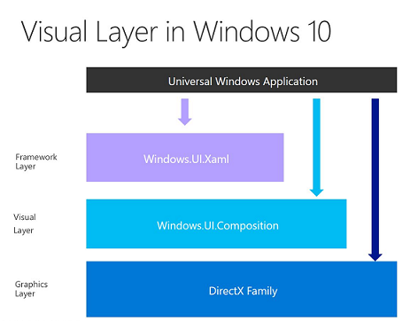

# ビジュアル レイヤー

\[Windows 10 の UWP アプリ向けに更新。 Windows 8.x の記事については、[アーカイブ](http://go.microsoft.com/fwlink/p/?linkid=619132)をご覧ください\]

Windows 10 では、デスクトップかモバイルかにかかわらず、すべての Windows アプリケーションに対応した新たな統合コンポジターとレンダリング エンジンを作成するために、重要な取り組みが行われました。 その取り組みの結果が、Windows.UI.Composition と呼ばれる統合コンポジション WinRT API です。この API により、新しい軽量コンポジション オブジェクトだけでなく、新しいコンポジター駆動型のアニメーションや効果にもアクセスできるようになります。

Windows.UI.Composition は宣言型の[保持モード](https://msdn.microsoft.com/library/windows/desktop/ff684178.aspx) API であり、ユニバーサル Windows プラットフォーム (UWP) アプリケーションから呼び出して、アプリケーションで直接、コンポジション オブジェクト、アニメーション、効果を作成できます。 この API は、XAML などの既存のフレーム ワークを補強するものであり、UWP アプリケーションの開発者は、使い慣れた C# サーフェスをアプリケーションに追加できるようになります。 この API を使って、DX スタイル フレームワークレス アプリケーションを作成することもできます。

XAML 開発者は、C# のコンポジション層まで降り、この層で WinRT を使ってカスタムの操作を実行できます。グラフィック層まで降り、DirectX と C++ を使ってカスタムの UI 操作を実行する必要はありません。 この手法を用いることにより、コンポジション API を使用して既存の要素をアニメーション化したり、XAML 要素ツリー内で Windows.UI.Composition コンテンツの "ビジュアル アイランド" を作成して UI を拡張したりすることができます。

## コンポジション オブジェクトとコンポジター

コンポジション オブジェクトは [**Compositor**](https://msdn.microsoft.com/library/windows/apps/Dn706789) (コンポジション オブジェクトのファクトリとして機能します) によって作成されます。 コンポジターは [**Visual**](https://msdn.microsoft.com/library/windows/apps/Dn706858) オブジェクトを作成できるため、この API の他のすべての機能とコンポジション オブジェクトでベースとして使われるビジュアル ツリー構造を作成できます。

この API により、開発者は 1 つまたは複数の [**Visual**](https://msdn.microsoft.com/library/windows/apps/Dn706858) オブジェクトを作成して定義できます。これらの各オブジェクトはビジュアル ツリーの 1 つのノードを表します。

ビジュアル オブジェクトは、他のビジュアル オブジェクトのコンテナーやコンテンツ ビジュアル オブジェクトのホストとして利用できます。 この API では、使いやすさを考慮して、特定のタスクに合わせて一連の [**Visual**](https://msdn.microsoft.com/library/windows/apps/Dn706858) オブジェクトが階層化されています。

-   [**Visual**](https://msdn.microsoft.com/library/windows/apps/Dn706858) - ベース オブジェクト。 プロパティの大半はここにあり、他のビジュアル オブジェクトによって継承されます。
-   [**ContainerVisual**](https://msdn.microsoft.com/library/windows/apps/Dn706810) - [**Visual**](https://msdn.microsoft.com/library/windows/apps/Dn706858) から派生し、子ビジュアル オブジェクトを挿入できます。
-   [**SpriteVisual**](https://msdn.microsoft.com/library/windows/apps/Mt589433) - [**ContainerVisual**](https://msdn.microsoft.com/library/windows/apps/Dn706810) から派生し、画像、効果、スワップ チェーン形式のコンテンツが格納されます。
-   [**Compositor**](https://msdn.microsoft.com/library/windows/apps/Dn706789) - アプリケーションとシステム コンポジター プロセスとの関係を管理するオブジェクト ファクトリ。

コンポジターは、ツリー内のビジュアル オブジェクトのクリッピングや変換に使われる他の多数のコンポジション オブジェクトだけでなく、多様なアニメーションと効果のファクトリでもあります。

## 効果システム

Windows.UI.Composition では、アニメーション化、カスタマイズ、チェーンできるリアルタイム効果がサポートされています。 効果には、2D アフィン変換、算術演算コンポジット、ブレンド、カラー ソース、コンポジット、コントラスト、露出、グレースケール、ガンマ伝達、色相回転、色の反転、彩度、セピア、色温度、濃淡などがあります。

詳しくは、「[コンポジションの効果](composition-effects.md)」をご覧ください。

## アニメーション システム

Windows.UI.Composition には、フレーム ワークに依存しない表現力豊かなアニメーション システムが含まれており、キー フレーム アニメーションと数式アニメーションという 2 種類のアニメーションを設定できるようになっています。 これらのアニメーションを使って、ビジュアル オブジェクトを動かしたり、変換/クリッピングしたり、効果をアニメーション化したりします。 コンポジター プロセスで直接実行することで、滑らかさとスケールを保持しながら、多数のアニメーションを同時に実行できるようになります。

詳しくは、「[コンポジションのアニメーション](composition-animation.md)」をご覧ください。

## XAML の相互運用

コンポジション API は、ビジュアル ツリーを最初から作成できるだけでなく、[**Windows.UI.Xaml.Hosting**](https://msdn.microsoft.com/library/windows/apps/Hh701908) の [**ElementCompositionPreview**](https://msdn.microsoft.com/library/windows/apps/Mt608976) クラスを使用して、既存の XAML UI と相互運用することもできます。

- [**ElementCompositionPreview.GetElementVisual()**](https://msdn.microsoft.com/library/windows/apps/windows.ui.xaml.hosting.elementcompositionpreview.getelementvisual): コンポジション API を使用してアニメーション化するために、要素のバッキング ビジュアルを取得します。
- [**ElementCompositionPreview.SetChildVisual()**](https://msdn.microsoft.com/library/windows/apps/windows.ui.xaml.hosting.elementcompositionpreview.setelementchildvisual): XAML ツリーにコンポジション コンテンツの "ビジュアル アイランド" を追加します。
- [**ElementCompositionPreview.GetScrollViewerManipulationPropertySet()**](https://msdn.microsoft.com/library/windows/apps/mt608980.aspx): コンポジション アニメーションの入力として、[**ScrollViewer**](https://msdn.microsoft.com/library/windows/apps/windows.ui.xaml.controls.scrollviewer.aspx) の操作を使用します。

**注**  
この記事は、ユニバーサル Windows プラットフォーム (UWP) アプリを作成する Windows 10 開発者を対象としています。 Windows 8.x 用または Windows Phone 8.x 用の開発を行っている場合は、[アーカイブされているドキュメント](http://go.microsoft.com/fwlink/p/?linkid=619132)をご覧ください。

 

## その他の情報

-   この API に関する Kenny Kerr の MSDN 記事:「[グラフィックスとアニメーション - Windows 合成が 10 歳になる](https://msdn.microsoft.com/magazine/mt590968)」
-   [WindowsUIDevLabs GitHub](https://github.com/microsoft/windowsuidevlabs) にある高度な UI とコンポジションのサンプル
-   [**API に関する詳しいリファレンス ドキュメント**](https://msdn.microsoft.com/library/windows/apps/Dn706878)
-   既知の問題: [既知の問題](http://go.microsoft.com/fwlink/?LinkId=823237)

 

 

<!--HONumber=Aug16_HO3-->

