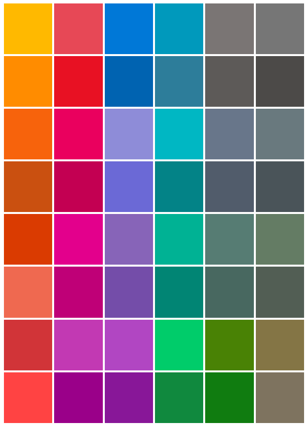

# 色

色により、アプリのさまざまな情報レベルで直感的に移動先を見つけることができます。また、色は操作モデルを強化するための重要なツールとして機能します。

Windows では、色もカスタマイズが可能です。 各ユーザーが色や淡色/濃色のテーマを選んで、各自の環境全体に適用することができます。

## アクセント カラー

ユーザーは、*[設定] > [パーソナル設定] > [色]* で、アクセントと呼ばれる 1 つの色を選ぶことができます。 選別された 48 色の見本から選びます。Xbox の場合は、21 色のテレビ セーフ カラーのパレットから選びます。

<!-- Alternate version for the dev center. Need to add hex values. -->
 既定のアクセント カラー

 Xbox のアクセント カラー

ユーザーがアクセント カラーを選ぶと、その色がシステムのテーマの一部として表示されます。 アクセント カラーが適用される領域は、スタート画面、タスク バー、ウィンドウ クロム、選択した操作の状態、および[共通コントロール](https://dev.windows.com/design/controls-patterns)内のハイパーリンクです。 また、各アプリの文字体裁、背景、および操作にアクセント カラーを組み込んだり、アクセント カラーを無視してアプリ固有のブランドを維持したりできます。

## 色調

アクセント カラーを選ぶと、色の明度の HSB 値に基づいて明るい色調と暗い色調のアクセント カラーが作成されます。 アプリはこの色調のバリエーションを使用して視覚的な階層を作成し、操作を示します。

既定では、ハイパーリンクにはユーザーのアクセント カラーが使用されます。 ページの背景と似ていてハイパーリンクが目立たない場合は、適用するアクセント カラーの色調を調整してコントラストを強調できます。

<figure class="figure-img" >
    
        <figcaption>
既定のアクセント カラーのさまざまな色調。

</figcaption>
</figure>

<figure class="figure-img" >
    
        <figcaption>
色のロジックを設計仕様に適用する方法の例。

</figcaption>
</figure>

<aside class="aside-dev">
    

    

    

            XAML では、`SystemAccentColor` という名前の[テーマ リソース](https://msdn.microsoft.com/library/windows/apps/Mt187274.aspx)でプライマリ アクセント カラーが公開されます。 色調は、`SystemAccentColorLight3`、`SystemAccentColorLight2`、`SystemAccentColorLight1`、`SystemAccentColorDark1`、`SystemAccentColorDark2`、`SystemAccentColorDark3` で表現できます。 [UISettings.GetColorValue](https://msdn.microsoft.com/library/windows/apps/windows.ui.viewmanagement.uisettings.getcolorvalue.aspx) および [UIColorType](https://msdn.microsoft.com/library/windows/apps/windows.ui.viewmanagement.uicolortype.aspx) 列挙型を使って、プログラムで使用することもできます。
    

</aside>

## 色のテーマ

ユーザーはシステムの淡色テーマまたは濃色テーマを選ぶこともできます。 一部のアプリでは、ユーザーの設定を基にテーマを変更し、その他のテーマを使用しないように選択できます。

淡色テーマを使用するアプリは、生産性アプリが関係するシナリオに適しています。 Microsoft Office で利用可能なアプリ スイートがその例です。 淡色テーマを使用すると、長時間のタスクの際に長いテキストが読みやすくなります。

濃色テーマを使用すると、メディアを中心とするアプリまたは多数のビデオや画像がユーザーに対して表示されるシナリオにおいて、コンテンツのコントラストをはっきりさせることができます。 このようなシナリオでは、映画を視聴する場合や、低光量の周囲条件下であっても、読むことが必ずしも第一の目標というわけではありません。

前述のどちらかの説明に該当しないアプリの場合は、ユーザーが最適なテーマを決められるように、次のシステム テーマの使用を検討してください。

テーマを設計しやすくするために、Windows では、テーマに合わせて自動的に追加のカラー パレットが表示されます。

<!-- OP version -->
### 淡色テーマ
#### 基本

#### 代替

#### リスト

#### クロム

### 濃色テーマ
#### 基本

#### 代替

#### リスト

#### クロム

<aside class="aside-dev">
    

    

    

            それぞれの色は XAML の[テーマ リソース](https://msdn.microsoft.com/library/windows/apps/Mt187274.aspx#the_xaml_color_ramp_and_theme-dependent_brushes) として利用できます。このリソースは `System*Color` 名前付け規則に従っている必要があります (例: `SystemChromeHighColor`)。 アプリのテーマは、[Application.RequestedTheme](https://msdn.microsoft.com/library/windows/apps/windows.ui.xaml.application.requestedtheme.aspx) または [FrameworkElement.RequestedTheme](https://msdn.microsoft.com/library/windows/apps/windows.ui.xaml.frameworkelement.requestedtheme.aspx) で制御できます。
    

</aside>

## アクセシビリティ

画面を使用するためにパレットが最適化されています。 読みやすさをできる限り高めるため、背景に対するテキストのコントラスト比は 4.5:1 にすることをお勧めします。 無料で提供されているさまざまなツールを使って、色の[コントラスト比](http://leaverou.github.io/contrast-ratio/)などをテストできます。

<!--HONumber=May16_HO2-->

