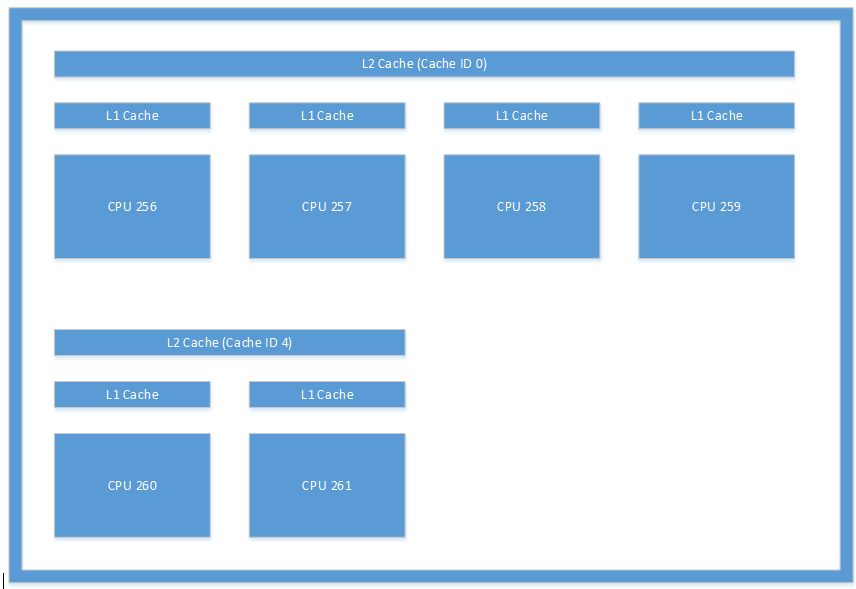

# <a name="cpusets-for-game-development"></a><span data-ttu-id="92a92-103">ゲーム開発用の CPUSets</span><span class="sxs-lookup"><span data-stu-id="92a92-103">CPUSets for game development</span></span>

## <a name="introduction"></a><span data-ttu-id="92a92-104">はじめに</span><span class="sxs-lookup"><span data-stu-id="92a92-104">Introduction</span></span>

<span data-ttu-id="92a92-105">ユニバーサル Windows プラットフォーム (UWP) は、多様な家庭用電子機器の中核に位置付けられています。</span><span class="sxs-lookup"><span data-stu-id="92a92-105">The Universal Windows Platform (UWP) is at the core of a wide range of consumer electronic devices.</span></span> <span data-ttu-id="92a92-106">そのため、ゲームや埋め込みアプリケーションからサーバーで実行されるエンタープライズ ソフトウェアまで、あらゆる種類のアプリケーションのニーズに対応する汎用 API が必要です。</span><span class="sxs-lookup"><span data-stu-id="92a92-106">As such, it requires a general purpose API to address the needs of all types of applications from games to embedded apps to enterprise software running on servers.</span></span> <span data-ttu-id="92a92-107">この API によって提供される適切な情報を活用して、ゲームがどのようなハードウェアでも最適な状態で実行されることを保証できます。</span><span class="sxs-lookup"><span data-stu-id="92a92-107">By leveraging the right information provided by the API, you can ensure your game runs at its best on any hardware.</span></span>

## <a name="cpusets-api"></a><span data-ttu-id="92a92-108">CPUSets API</span><span class="sxs-lookup"><span data-stu-id="92a92-108">CPUSets API</span></span>

<span data-ttu-id="92a92-109">CPUSets API によって、スレッドをスケジュールするためにどの CPU セットを利用できるかを制御できます。</span><span class="sxs-lookup"><span data-stu-id="92a92-109">The CPUSets API provides control over which CPU sets are available for threads to be scheduled on.</span></span> <span data-ttu-id="92a92-110">スレッドをスケジュールする場所を制御するために、2 つの関数を利用できます。</span><span class="sxs-lookup"><span data-stu-id="92a92-110">Two functions are available to control where threads are scheduled:</span></span>
- <span data-ttu-id="92a92-111">**SetProcessDefaultCpuSets**: この関数を使用すると、スレッドが特定の CPU セットに割り当てられていない場合に、新しいスレッドが実行される CPU セットを指定できます。</span><span class="sxs-lookup"><span data-stu-id="92a92-111">**SetProcessDefaultCpuSets** – This function can be used to specify which CPU sets new threads may run on if they are not assigned to specific CPU sets.</span></span>
- <span data-ttu-id="92a92-112">**SetThreadSelectedCpuSets**: この関数を使用すると、特定のスレッドが実行される CPU セットを制限できます。</span><span class="sxs-lookup"><span data-stu-id="92a92-112">**SetThreadSelectedCpuSets** – This function allows you to limit the CPU sets a specific thread may run on.</span></span>

<span data-ttu-id="92a92-113">**SetProcessDefaultCpuSets** 関数を使わない場合は、新しく作成されたスレッドは、プロセスで使用できる任意の CPU セットでスケジュールすることができます。</span><span class="sxs-lookup"><span data-stu-id="92a92-113">If the **SetProcessDefaultCpuSets** function is never used, newly created threads may be scheduled on any CPU set available to your process.</span></span> <span data-ttu-id="92a92-114">このセクションでは、CPUSets API の基本事項について説明します。</span><span class="sxs-lookup"><span data-stu-id="92a92-114">This section goes over the basics of the CPUSets API.</span></span>

### <a name="getsystemcpusetinformation"></a><span data-ttu-id="92a92-115">GetSystemCpuSetInformation</span><span class="sxs-lookup"><span data-stu-id="92a92-115">GetSystemCpuSetInformation</span></span>

<span data-ttu-id="92a92-116">情報を収集するために使用される最初の API は、**GetSystemCpuSetInformation** 関数です。</span><span class="sxs-lookup"><span data-stu-id="92a92-116">The first API used for gathering information is the **GetSystemCpuSetInformation** function.</span></span> <span data-ttu-id="92a92-117">この関数は、タイトル コードによって提供される **SYSTEM_CPU_SET_INFORMATION** オブジェクトの配列に情報を挿入します。</span><span class="sxs-lookup"><span data-stu-id="92a92-117">This function populates information in an array of **SYSTEM_CPU_SET_INFORMATION** objects provided by title code.</span></span> <span data-ttu-id="92a92-118">実行先のメモリはゲーム コードによって割り当てられる必要があり、そのサイズは **GetSystemCpuSetInformation** 自体を呼び出すことによって決定されます。</span><span class="sxs-lookup"><span data-stu-id="92a92-118">The memory for the destination must be allocated by game code, the size of which is determined by calling **GetSystemCpuSetInformation** itself.</span></span> <span data-ttu-id="92a92-119">そのためには、次の例に示されているように、**GetSystemCpuSetInformation** を 2 回呼び出す必要があります。</span><span class="sxs-lookup"><span data-stu-id="92a92-119">This requires two calls to **GetSystemCpuSetInformation** as demonstrated in the following example.</span></span>

```
unsigned long size;
HANDLE curProc = GetCurrentProcess();
GetSystemCpuSetInformation(nullptr, 0, &size, curProc, 0);

std::unique_ptr<uint8_t[]> buffer(new uint8_t[size]);

PSYSTEM_CPU_SET_INFORMATION cpuSets = reinterpret_cast<PSYSTEM_CPU_SET_INFORMATION>(buffer.get());
  
GetSystemCpuSetInformation(cpuSets, size, &size, curProc, 0);
```

<span data-ttu-id="92a92-120">返される **SYSTEM_CPU_SET_INFORMATION** の各インスタンスには、一意の処理装置 (CPU セットとも呼ばれる) の 1 つに関する情報が格納されます。</span><span class="sxs-lookup"><span data-stu-id="92a92-120">Each instance of **SYSTEM_CPU_SET_INFORMATION** returned contains information about one unique processing unit, also known as a CPU set.</span></span> <span data-ttu-id="92a92-121">これは、必ずしも一意の物理ハードウェアを表すとは限りません。</span><span class="sxs-lookup"><span data-stu-id="92a92-121">This does not necessarily mean that it represents a unique physical piece of hardware.</span></span> <span data-ttu-id="92a92-122">ハイパースレッディングを利用する CPU では、1 つの物理的な処理コア上で複数の論理コアが実行されます。</span><span class="sxs-lookup"><span data-stu-id="92a92-122">CPUs that utilize hyperthreading will have multiple logical cores running on a single physical processing core.</span></span> <span data-ttu-id="92a92-123">同一の物理コア上にある複数の論理コアで複数のスレッドをスケジュールする場合は、ハードウェア レベルでリソースを最適化できますが、それ以外の場合は、カーネル レベルでの追加の処理が必要になります。</span><span class="sxs-lookup"><span data-stu-id="92a92-123">Scheduling multiple threads on different logical cores that reside on the same physical core allows hardware-level resource optimization that would otherwise require extra work to be done at the kernel level.</span></span> <span data-ttu-id="92a92-124">2 つのスレッドが同じ物理コア上の異なる論理コアでスケジュールされている場合、CPU 時間を共有する必要がありますが、同じ論理コアでスケジュールされている場合よりも効率的に実行されます。</span><span class="sxs-lookup"><span data-stu-id="92a92-124">Two threads scheduled on separate logical cores on the same physical core must share CPU time, but would run more efficiently than if they were scheduled to the same logical core.</span></span>

### <a name="systemcpusetinformation"></a><span data-ttu-id="92a92-125">SYSTEM_CPU_SET_INFORMATION</span><span class="sxs-lookup"><span data-stu-id="92a92-125">SYSTEM_CPU_SET_INFORMATION</span></span>

<span data-ttu-id="92a92-126">**GetSystemCpuSetInformation** から返されるこのデータ構造体の各インスタンスには、スレッドをスケジュールできる一意の処理装置に関する情報が格納されます。</span><span class="sxs-lookup"><span data-stu-id="92a92-126">The information in each instance of this data structure returned from **GetSystemCpuSetInformation** contains information about a unique processing unit that threads may be scheduled on.</span></span> <span data-ttu-id="92a92-127">可能なターゲット デバイスの範囲を考えると、**SYSTEM_CPU_SET_INFORMATION** データ構造体の情報の多くがゲーム開発には適用されない可能性があります。</span><span class="sxs-lookup"><span data-stu-id="92a92-127">Given the possible range of target devices, a lot of the information in the **SYSTEM_CPU_SET_INFORMATION** data structure may not applicable for game development.</span></span> <span data-ttu-id="92a92-128">表 1 では、ゲームの開発に役立つデータ メンバーについて説明します。</span><span class="sxs-lookup"><span data-stu-id="92a92-128">Table 1 provides an explanation of data members that are useful for game development.</span></span>

 **<span data-ttu-id="92a92-129">表 1.</span><span class="sxs-lookup"><span data-stu-id="92a92-129">Table 1.</span></span> <span data-ttu-id="92a92-130">ゲーム開発に役立つデータ メンバー</span><span class="sxs-lookup"><span data-stu-id="92a92-130">Data members useful for game development.</span></span>**

| <span data-ttu-id="92a92-131">メンバー名</span><span class="sxs-lookup"><span data-stu-id="92a92-131">Member name</span></span>  | <span data-ttu-id="92a92-132">データ型</span><span class="sxs-lookup"><span data-stu-id="92a92-132">Data type</span></span> | <span data-ttu-id="92a92-133">説明</span><span class="sxs-lookup"><span data-stu-id="92a92-133">Description</span></span> |
| ------------- | ------------- | ------------- |
| <span data-ttu-id="92a92-134">Type</span><span class="sxs-lookup"><span data-stu-id="92a92-134">Type</span></span>  | <span data-ttu-id="92a92-135">CPU_SET_INFORMATION_TYPE</span><span class="sxs-lookup"><span data-stu-id="92a92-135">CPU_SET_INFORMATION_TYPE</span></span>  | <span data-ttu-id="92a92-136">構造体内の情報の種類です。</span><span class="sxs-lookup"><span data-stu-id="92a92-136">The type of information in the structure.</span></span> <span data-ttu-id="92a92-137">この値が **CpuSetInformation** ではない場合、この値は無視されます。</span><span class="sxs-lookup"><span data-stu-id="92a92-137">If the value of this is not **CpuSetInformation**, it should be ignored.</span></span>  |
| <span data-ttu-id="92a92-138">Id</span><span class="sxs-lookup"><span data-stu-id="92a92-138">Id</span></span>  | <span data-ttu-id="92a92-139">unsigned long</span><span class="sxs-lookup"><span data-stu-id="92a92-139">unsigned long</span></span>  | <span data-ttu-id="92a92-140">指定した CPU セットの ID です。</span><span class="sxs-lookup"><span data-stu-id="92a92-140">The ID of the specified CPU set.</span></span> <span data-ttu-id="92a92-141">これは、**SetThreadSelectedCpuSets** などの CPU セット関数で使用する必要がある ID です。</span><span class="sxs-lookup"><span data-stu-id="92a92-141">This is the ID that should be used with CPU set functions such as **SetThreadSelectedCpuSets**.</span></span>  |
| <span data-ttu-id="92a92-142">Group</span><span class="sxs-lookup"><span data-stu-id="92a92-142">Group</span></span>  | <span data-ttu-id="92a92-143">unsigned short</span><span class="sxs-lookup"><span data-stu-id="92a92-143">unsigned short</span></span>  | <span data-ttu-id="92a92-144">CPU セットの "プロセッサ グループ" を指定します。</span><span class="sxs-lookup"><span data-stu-id="92a92-144">Specifies the “processor group” of the CPU set.</span></span> <span data-ttu-id="92a92-145">プロセッサ グループを使用すると、PC で 64 個を超える論理コアを使用でき、システムの実行中に CPU のホット スワップが可能になります。</span><span class="sxs-lookup"><span data-stu-id="92a92-145">Processor groups allow a PC to have more than 64 logical cores, and allow for hot swapping of CPUs while the system is running.</span></span> <span data-ttu-id="92a92-146">サーバー以外で複数のグループを持つ PC は一般的ではありません。</span><span class="sxs-lookup"><span data-stu-id="92a92-146">It is uncommon to see a PC that is not a server with more than one group.</span></span> <span data-ttu-id="92a92-147">ほとんどのコンシューマー向け PC ではプロセッサ グループは 1 つだけであるため、大規模なサーバーやサーバー ファームで実行されるアプリケーションを作成している場合を除き、単一グループの CPU セットを使用することをお勧めします。</span><span class="sxs-lookup"><span data-stu-id="92a92-147">Unless you are writing applications meant to run on large servers or server farms, it is best to use CPU sets in a single group because most consumer PCs will only have one processor group.</span></span> <span data-ttu-id="92a92-148">この構造体の他のすべての値は、グループを基準にしています。</span><span class="sxs-lookup"><span data-stu-id="92a92-148">All other values in this structure are relative to the Group.</span></span>  |
| <span data-ttu-id="92a92-149">LogicalProcessorIndex</span><span class="sxs-lookup"><span data-stu-id="92a92-149">LogicalProcessorIndex</span></span>  | <span data-ttu-id="92a92-150">unsigned char</span><span class="sxs-lookup"><span data-stu-id="92a92-150">unsigned char</span></span>  | <span data-ttu-id="92a92-151">グループを基準とした CPU セットのインデックス。</span><span class="sxs-lookup"><span data-stu-id="92a92-151">Group relative index of the CPU set</span></span>  |
| <span data-ttu-id="92a92-152">CoreIndex</span><span class="sxs-lookup"><span data-stu-id="92a92-152">CoreIndex</span></span>  | <span data-ttu-id="92a92-153">unsigned char</span><span class="sxs-lookup"><span data-stu-id="92a92-153">unsigned char</span></span>  | <span data-ttu-id="92a92-154">グループを基準とした、CPU セットが配置されている物理 CPU コアのインデックス。</span><span class="sxs-lookup"><span data-stu-id="92a92-154">Group relative index of the physical CPU core where the CPU set is located</span></span>  |
| <span data-ttu-id="92a92-155">LastLevelCacheIndex</span><span class="sxs-lookup"><span data-stu-id="92a92-155">LastLevelCacheIndex</span></span>  | <span data-ttu-id="92a92-156">unsigned char</span><span class="sxs-lookup"><span data-stu-id="92a92-156">unsigned char</span></span>  | <span data-ttu-id="92a92-157">グループを基準とした、この CPU セットに関連付けられているラスト レベル キャッシュのインデックス。</span><span class="sxs-lookup"><span data-stu-id="92a92-157">Group relative index of the last cache associated with this CPU set.</span></span> <span data-ttu-id="92a92-158">システムが NUMA ノードを利用している場合を除き、これは最も低速のキャッシュで、通常、L2 または L3 キャッシュです。</span><span class="sxs-lookup"><span data-stu-id="92a92-158">This is the slowest cache unless the system utilizes NUMA nodes, usually the L2 or L3 cache.</span></span>  |

<br />

<span data-ttu-id="92a92-159">その他のデータ メンバーが提供する情報は、コンシューマー向け PC やコンシューマー向けデバイスの CPU との関連性が低く、有用ではない傾向があります。</span><span class="sxs-lookup"><span data-stu-id="92a92-159">The other data members provide information that is unlikely to describe CPUs in consumer PCs or other consumer devices and is unlikely to be useful.</span></span> <span data-ttu-id="92a92-160">返されるデータによって提供される情報は、さまざまな方法でスレッドを編成するために使用できます。</span><span class="sxs-lookup"><span data-stu-id="92a92-160">The information provided by the data returned can then be used to organize threads in various ways.</span></span> <span data-ttu-id="92a92-161">このホワイト ペーパーの「[ゲーム開発に関する考慮事項](#considerations-for-game-development)」では、このデータを活用してスレッドの割り当てを最適化する方法について詳しく説明しています。</span><span class="sxs-lookup"><span data-stu-id="92a92-161">The [Considerations for game development](#considerations-for-game-development) section of this white paper details a few ways to leverage this data to optimize thread allocation.</span></span>

<span data-ttu-id="92a92-162">次に、さまざまな種類のハードウェアで実行される UWP アプリケーションから収集される情報の種類について、例をいくつか示します。</span><span class="sxs-lookup"><span data-stu-id="92a92-162">The following are some examples of the type of information gathered from UWP applications running on various types of hardware.</span></span>

**<span data-ttu-id="92a92-163">表 2.</span><span class="sxs-lookup"><span data-stu-id="92a92-163">Table 2.</span></span> <span data-ttu-id="92a92-164">Microsoft Lumia 950 で実行されている UWP アプリから返された情報。</span><span class="sxs-lookup"><span data-stu-id="92a92-164">Information returned from a UWP app running on a Microsoft Lumia 950.</span></span> <span data-ttu-id="92a92-165">これは、複数のラスト レベル キャッシュを持つシステムの例です。</span><span class="sxs-lookup"><span data-stu-id="92a92-165">This is an example of a system that has multiple last level caches.</span></span> <span data-ttu-id="92a92-166">Lumia 950 は、デュアル コア ARM Cortex A57 CPU とクアッド コア ARM Cortex A53 CPU を内蔵した Qualcomm 808 Snapdragon プロセッサを搭載しています。</span><span class="sxs-lookup"><span data-stu-id="92a92-166">The Lumia 950 features a Qualcomm 808 Snapdragon process that contains a dual core ARM Cortex A57 and quad core ARM Cortex A53 CPUs.</span></span>**

  

**<span data-ttu-id="92a92-168">表 3.</span><span class="sxs-lookup"><span data-stu-id="92a92-168">Table 3.</span></span> <span data-ttu-id="92a92-169">一般的な PC で実行されている UWP アプリから返された情報。</span><span class="sxs-lookup"><span data-stu-id="92a92-169">Information returned from a UWP app running on a typical PC.</span></span> <span data-ttu-id="92a92-170">これは、ハイパースレッディングを使用しているシステムの例です。各物理コアには、スレッドをスケジュールできる論理コアが 2 つあります。</span><span class="sxs-lookup"><span data-stu-id="92a92-170">This is an example of a system that uses hyperthreading; each physical core has two logical cores onto which threads can be scheduled.</span></span> <span data-ttu-id="92a92-171">この例では、システムに Intel Xenon CPU E5-2620 が搭載されています。</span><span class="sxs-lookup"><span data-stu-id="92a92-171">In this case, the system contained an Intel Xenon CPU E5-2620.</span></span>**

  

**<span data-ttu-id="92a92-173">表 4.</span><span class="sxs-lookup"><span data-stu-id="92a92-173">Table 4.</span></span> <span data-ttu-id="92a92-174">クアッド コア Microsoft Surface Pro 4 で実行されている UWP アプリから返された情報。</span><span class="sxs-lookup"><span data-stu-id="92a92-174">Information returned from a UWP app running on a quad core Microsoft Surface Pro 4.</span></span> <span data-ttu-id="92a92-175">このシステムには、Intel Core i5-6300 CPU が搭載されています。</span><span class="sxs-lookup"><span data-stu-id="92a92-175">This system had an Intel Core i5-6300 CPU.</span></span>**

  

### <a name="setthreadselectedcpusets"></a><span data-ttu-id="92a92-177">SetThreadSelectedCpuSets</span><span class="sxs-lookup"><span data-stu-id="92a92-177">SetThreadSelectedCpuSets</span></span>

<span data-ttu-id="92a92-178">これで CPU セットに関する情報が利用できるようになりました。この情報を使ってスレッドを編成できます。</span><span class="sxs-lookup"><span data-stu-id="92a92-178">Now that information about the CPU sets is available, it can be used to organize threads.</span></span> <span data-ttu-id="92a92-179">**CreateThread** で作成されたスレッドのハンドルは、スレッドをスケジュールできる対象の CPU セットの ID の配列と共に、この関数に渡されます。</span><span class="sxs-lookup"><span data-stu-id="92a92-179">The handle of a thread created with **CreateThread** is passed to this function along with an array of IDs of the CPU sets that the thread can be scheduled on.</span></span> <span data-ttu-id="92a92-180">その使用例の 1 つを、次のコードに示します。</span><span class="sxs-lookup"><span data-stu-id="92a92-180">One example of its usage is demonstrated in the following code.</span></span>

```
HANDLE audioHandle = CreateThread(nullptr, 0, AudioThread, nullptr, 0, nullptr);
unsigned long cores [] = { cpuSets[0].CpuSet.Id, cpuSets[1].CpuSet.Id };
SetThreadSelectedCpuSets(audioHandle, cores, 2);
```
<span data-ttu-id="92a92-181">この例では、スレッドは **AudioThread** として宣言されている関数に基づいて作成されます。</span><span class="sxs-lookup"><span data-stu-id="92a92-181">In this example, a thread is created based on a function declared as **AudioThread**.</span></span> <span data-ttu-id="92a92-182">このスレッドは、2 つの CPU セットのいずれかにスケジュールすることができます。</span><span class="sxs-lookup"><span data-stu-id="92a92-182">This thread is then allowed to be scheduled on one of two CPU sets.</span></span> <span data-ttu-id="92a92-183">スレッドによる CPU セットの所有権は排他的ではありません。</span><span class="sxs-lookup"><span data-stu-id="92a92-183">Thread ownership of the CPU set is not exclusive.</span></span> <span data-ttu-id="92a92-184">特定の CPU セットにロックされずに作成されたスレッドが、**AudioThread** の時間を奪う可能性があります。</span><span class="sxs-lookup"><span data-stu-id="92a92-184">Threads that are created without being locked to a specific CPU set may take time from the **AudioThread**.</span></span> <span data-ttu-id="92a92-185">同様に、作成された他のスレッドが、後でこれらの CPU セットの一方または両方にロックされる可能性もあります。</span><span class="sxs-lookup"><span data-stu-id="92a92-185">Likewise, other threads created may also be locked to one or both of these CPU sets at a later time.</span></span>

### <a name="setprocessdefaultcpusets"></a><span data-ttu-id="92a92-186">SetProcessDefaultCpuSets</span><span class="sxs-lookup"><span data-stu-id="92a92-186">SetProcessDefaultCpuSets</span></span>

<span data-ttu-id="92a92-187">**SetThreadSelectedCpuSets** の逆が **SetProcessDefaultCpuSets** です。</span><span class="sxs-lookup"><span data-stu-id="92a92-187">The converse to **SetThreadSelectedCpuSets** is **SetProcessDefaultCpuSets**.</span></span> <span data-ttu-id="92a92-188">スレッドは、作成されるときに、特定の CPU セットにロックされる必要はありません。</span><span class="sxs-lookup"><span data-stu-id="92a92-188">When threads are created, they do not need to be locked into certain CPU sets.</span></span> <span data-ttu-id="92a92-189">これらのスレッドを特定の CPU セット (たとえば、レンダリング スレッドまたはオーディオのスレッドで使われるもの) で実行する必要がない場合は、この関数を使用して、スレッドをスケジュールできる対象のコアを指定できます。</span><span class="sxs-lookup"><span data-stu-id="92a92-189">If you do not want these threads to run on specific CPU sets (those used by your render thread or audio thread for example), you can use this function to specify which cores these threads are allowed to be scheduled on.</span></span>

## <a name="considerations-for-game-development"></a><span data-ttu-id="92a92-190">ゲーム開発に関する考慮事項</span><span class="sxs-lookup"><span data-stu-id="92a92-190">Considerations for game development</span></span>

<span data-ttu-id="92a92-191">既に説明したように、CPUSets API は、スレッドのスケジュールに関して多くの情報と柔軟性を提供します。</span><span class="sxs-lookup"><span data-stu-id="92a92-191">As we've seen, the CPUSets API provides a lot of information and flexibility when it comes to scheduling threads.</span></span> <span data-ttu-id="92a92-192">ボトムアップのアプローチでこのデータの用途を探すよりも、トップダウンのアプローチで、一般的なシナリオに対応するためにこのデータをどのように利用できるかを考える方が効果的です。</span><span class="sxs-lookup"><span data-stu-id="92a92-192">Instead of taking the bottom-up approach of trying to find uses for this data, it is more effective to take the top-down approach of finding how the data can be used to accommodate common scenarios.</span></span>

### <a name="working-with-time-critical-threads-and-hyperthreading"></a><span data-ttu-id="92a92-193">タイム クリティカルなスレッドとハイパースレッディングの使用</span><span class="sxs-lookup"><span data-stu-id="92a92-193">Working with time critical threads and hyperthreading</span></span>

<span data-ttu-id="92a92-194">この方法は、ゲームで複数のスレッドをリアルタイムで実行する必要があり、他のワーカー スレッドが必要とする CPU 時間が比較的少ない場合に有効です。</span><span class="sxs-lookup"><span data-stu-id="92a92-194">This method is effective if your game has a few threads that must run in real time along with other worker threads that require relatively little CPU time.</span></span> <span data-ttu-id="92a92-195">最適なゲーム エクスペリエンスを提供するために、継続的 BGM など、いくつかのタスクは中断することなく実行される必要があります。</span><span class="sxs-lookup"><span data-stu-id="92a92-195">Some tasks, like continuous background music, must run without interruption for an optimal gaming experience.</span></span> <span data-ttu-id="92a92-196">オーディオ スレッドでは、1 つのフレームのスタベーションによってポップ ノイズやグリッチ ノイズが発生する可能性があるため、各フレームで必要な量の CPU 時間が提供されることが重要です。</span><span class="sxs-lookup"><span data-stu-id="92a92-196">Even a single frame of starvation for an audio thread may cause popping or glitching, so it is critical that it receives the necessary amount of CPU time every frame.</span></span>

<span data-ttu-id="92a92-197">**SetThreadSelectedCpuSets** を **SetProcessDefaultCpuSets** と組み合わせて使用することにより、大量のスレッドでもワーカー スレッドによって中断されることなく継続できます。</span><span class="sxs-lookup"><span data-stu-id="92a92-197">Using **SetThreadSelectedCpuSets** in conjunction with **SetProcessDefaultCpuSets** can ensure your heavy threads remain uninterrupted by any worker threads.</span></span> <span data-ttu-id="92a92-198">**SetThreadSelectedCpuSets** を使用して、大量のスレッドを特定の CPU セットに割り当てることができます。</span><span class="sxs-lookup"><span data-stu-id="92a92-198">**SetThreadSelectedCpuSets** can be used to assign your heavy threads to specific CPU sets.</span></span> <span data-ttu-id="92a92-199">次に、**SetProcessDefaultCpuSets** を使用して、作成済みで割り当てられていないスレッドを、他の CPU セットに割り当てることができます。</span><span class="sxs-lookup"><span data-stu-id="92a92-199">**SetProcessDefaultCpuSets** can then be used to make sure any unassigned threads created are put on other CPU sets.</span></span> <span data-ttu-id="92a92-200">ハイパースレッディングを利用する CPU の場合は、論理コアが同一物理コア上にあることも重要です。</span><span class="sxs-lookup"><span data-stu-id="92a92-200">In the case of CPUs that utilize hyperthreading, it's also important to account for logical cores on the same physical core.</span></span> <span data-ttu-id="92a92-201">リアルタイムの応答性を必要とするスレッドと同じ物理コアを共有する論理コアで、ワーカー スレッドを実行しないでください。</span><span class="sxs-lookup"><span data-stu-id="92a92-201">Worker threads should not be allowed to run on logical cores that share the same physical core as a thread that you want to run with real time responsiveness.</span></span> <span data-ttu-id="92a92-202">次のコードは、PC でハイパースレッディングを使用しているかどうかを判断する方法を示しています。</span><span class="sxs-lookup"><span data-stu-id="92a92-202">The following code demonstrates how to determine whether a PC uses hyperthreading.</span></span>

```
unsigned long retsize = 0;
(void)GetSystemCpuSetInformation( nullptr, 0, &retsize,
    GetCurrentProcess(), 0);
 
std::unique_ptr<uint8_t[]> data( new uint8_t[retsize] );
if ( !GetSystemCpuSetInformation(
    reinterpret_cast<PSYSTEM_CPU_SET_INFORMATION>( data.get() ),
    retsize, &retsize, GetCurrentProcess(), 0) )
{
    // Error!
}
 
std::set<DWORD> cores;
std::vector<DWORD> processors;
uint8_t const * ptr = data.get();
for( DWORD size = 0; size < retsize; ) {
    auto info = reinterpret_cast<const SYSTEM_CPU_SET_INFORMATION*>( ptr );
    if ( info->Type == CpuSetInformation ) {
         processors.push_back( info->CpuSet.Id );
         cores.insert( info->CpuSet.CoreIndex );
    }
    ptr += info->Size;
    size += info->Size;
}
 
bool hyperthreaded = processors.size() != cores.size();
```

<span data-ttu-id="92a92-203">システムでハイパースレッディングを利用している場合、既定の CPU セットに、リアルタイム スレッドと同じ物理コア上にある論理コアが含まれていないことが重要です。</span><span class="sxs-lookup"><span data-stu-id="92a92-203">If the system utilizes hyperthreading, it is important that the set of default CPU sets does not include any logical cores on the same physical core as any real time threads.</span></span> <span data-ttu-id="92a92-204">システムがハイパースレッディングを利用していない場合は、既定の CPU セットに、オーディオ スレッドを実行する CPU セットと同じコアが含まれていないことを確認するだけで済みます。</span><span class="sxs-lookup"><span data-stu-id="92a92-204">If the system is not hyperthreading, it is only necessary to make sure that the default CPU sets do not include the same core as the CPU set running your audio thread.</span></span>

<span data-ttu-id="92a92-205">物理コアに基づいてスレッドを編成する例については、「[その他の情報](#additional-resources)」セクションに示されている GitHub リポジトリで入手できる CPUSets のサンプルをご覧ください。</span><span class="sxs-lookup"><span data-stu-id="92a92-205">An example of organizing threads based on physical cores can be found in the CPUSets sample available on the GitHub repository linked in the [Additional resources](#additional-resources) section.</span></span>

### <a name="reducing-the-cost-of-cache-coherence-with-last-level-cache"></a><span data-ttu-id="92a92-206">ラスト レベル キャッシュによるキャッシュの一貫性のコスト削減</span><span class="sxs-lookup"><span data-stu-id="92a92-206">Reducing the cost of cache coherence with last level cache</span></span>

<span data-ttu-id="92a92-207">キャッシュの一貫性とは、同じデータを操作する複数のハードウェア リソースの間でメモリにキャッシュされた内容が同じであるという概念です。</span><span class="sxs-lookup"><span data-stu-id="92a92-207">Cache coherency is the concept that cached memory is the same across multiple hardware resources that act on the same data.</span></span> <span data-ttu-id="92a92-208">別のコアでスケジュールされている複数のスレッドが同じデータを操作する場合、異なるキャッシュにある同じデータの別のコピーを操作している可能性があります。</span><span class="sxs-lookup"><span data-stu-id="92a92-208">If threads are scheduled on different cores, but work on the same data, they may be working on separate copies of that data in different caches.</span></span> <span data-ttu-id="92a92-209">正しい結果を得るには、これらのキャッシュが相互に一貫している必要があります。</span><span class="sxs-lookup"><span data-stu-id="92a92-209">In order to get correct results, these caches must be kept coherent with each other.</span></span> <span data-ttu-id="92a92-210">複数のキャッシュ間で一貫性を維持することは、割高になりますが、マルチコア システムを運用するために必要なことです。</span><span class="sxs-lookup"><span data-stu-id="92a92-210">Maintaining coherency between multiple caches is relatively expensive, but necessary for any multi-core system to operate.</span></span> <span data-ttu-id="92a92-211">さらに、キャッシュの一貫性は完全にクライアント コードの制御の範囲外です。基になるシステムが、独立してコア間の共有メモリ リソースにアクセスすることによって、キャッシュを最新の状態に保ちます。</span><span class="sxs-lookup"><span data-stu-id="92a92-211">Additionally, it is completely out of the control of client code; the underlying system works independently to keep caches up to date by accessing shared memory resources between cores.</span></span>

<span data-ttu-id="92a92-212">ゲームに特に大量のデータを共有する複数のスレッドがある場合、ラスト レベル キャッシュを共有する CPU セットでスレッドをスケジュールすることによって、キャッシュの一貫性のコストを最小限に抑えることができます。</span><span class="sxs-lookup"><span data-stu-id="92a92-212">If your game has multiple threads that share an especially large amount of data, you can minimize the cost of cache coherency by ensuring that they are scheduled on CPU sets that share a last level cache.</span></span> <span data-ttu-id="92a92-213">ラスト レベル キャッシュは、NUMA ノードを使用しないシステムのコアで使用可能な最も低速のキャッシュです。</span><span class="sxs-lookup"><span data-stu-id="92a92-213">The last level cache is the slowest cache available to a core on systems that do not utilize NUMA nodes.</span></span> <span data-ttu-id="92a92-214">ゲーム PC で NUMA ノードが使用されていることは非常にまれです。</span><span class="sxs-lookup"><span data-stu-id="92a92-214">It is extremely rare for a gaming PC to utilize NUMA nodes.</span></span> <span data-ttu-id="92a92-215">コアがラスト レベル キャッシュを共有していない場合、一貫性を維持するには、より高いレベルの (したがって低速の) メモリ リソースにアクセスする必要があります。</span><span class="sxs-lookup"><span data-stu-id="92a92-215">If cores do not share a last level cache, maintaining coherency would require accessing higher level, and therefore slower, memory resources.</span></span> <span data-ttu-id="92a92-216">キャッシュと物理コアを共有する個別の CPU セットに 2 つのスレッドをロックすると、特定のフレームで 50% 以上の時間を必要としない場合、個別の物理コアでスレッドをスケジュールするよりもパフォーマンスが高くなります。</span><span class="sxs-lookup"><span data-stu-id="92a92-216">Locking two threads to separate CPU sets that share a cache and a physical core may provide even better performance than scheduling them on separate physical cores if they do not require more than 50% of the time in any given frame.</span></span> 

<span data-ttu-id="92a92-217">次のコード例では、頻繁に通信するスレッドがラスト レベル キャッシュを共有できるかどうかを判断する方法を示します。</span><span class="sxs-lookup"><span data-stu-id="92a92-217">This code example shows how to determine whether threads that communicate frequently can share a last level cache.</span></span>

```
unsigned long retsize = 0;
(void)GetSystemCpuSetInformation(nullptr, 0, &retsize,
    GetCurrentProcess(), 0);
 
std::unique_ptr<uint8_t[]> data(new uint8_t[retsize]);
if (!GetSystemCpuSetInformation(
    reinterpret_cast<PSYSTEM_CPU_SET_INFORMATION>(data.get()),
    retsize, &retsize, GetCurrentProcess(), 0))
{
    // Error!
}
 
unsigned long count = retsize / sizeof(SYSTEM_CPU_SET_INFORMATION);
bool sharedcache = false;
 
std::map<unsigned char, std::vector<SYSTEM_CPU_SET_INFORMATION>> cachemap;
for (size_t i = 0; i < count; ++i)
{
    auto cpuset = reinterpret_cast<PSYSTEM_CPU_SET_INFORMATION>(data.get())[i];
    if (cpuset.Type == CPU_SET_INFORMATION_TYPE::CpuSetInformation)
    {
        if (cachemap.find(cpuset.CpuSet.LastLevelCacheIndex) == cachemap.end())
        {
            std::pair<unsigned char, std::vector<SYSTEM_CPU_SET_INFORMATION>> newvalue;
            newvalue.first = cpuset.CpuSet.LastLevelCacheIndex;
            newvalue.second.push_back(cpuset);
            cachemap.insert(newvalue);
        }
        else
        {
            sharedcache = true;
            cachemap[cpuset.CpuSet.LastLevelCacheIndex].push_back(cpuset);
        }
    }
}
```

<span data-ttu-id="92a92-218">図 1 に示すキャッシュ レイアウトは、システムに見られるレイアウトの例です。</span><span class="sxs-lookup"><span data-stu-id="92a92-218">The cache layout illustrated in Figure 1 is an example of the type of layout you might see from a system.</span></span> <span data-ttu-id="92a92-219">次の図は、Microsoft Lumia 950 のキャッシュを図示したものです。</span><span class="sxs-lookup"><span data-stu-id="92a92-219">This figure is an illustration of the caches found in a Microsoft Lumia 950.</span></span> <span data-ttu-id="92a92-220">CPU 256 と CPU 260 の間でスレッド間通信が発生する場合、システムが L2 キャッシュの一貫性を維持する必要があるため、大きなオーバーヘッドが発生します。</span><span class="sxs-lookup"><span data-stu-id="92a92-220">Inter-thread communication occurring between CPU 256 and CPU 260 would incur significant overhead because it would require the system to keep their L2 caches coherent.</span></span>

**<span data-ttu-id="92a92-221">図 1.</span><span class="sxs-lookup"><span data-stu-id="92a92-221">Figure 1.</span></span> <span data-ttu-id="92a92-222">Microsoft Lumia 950 デバイスのキャッシュ アーキテクチャ。</span><span class="sxs-lookup"><span data-stu-id="92a92-222">Cache architecture found on a Microsoft Lumia 950 device.</span></span>**



## <a name="summary"></a><span data-ttu-id="92a92-224">まとめ</span><span class="sxs-lookup"><span data-stu-id="92a92-224">Summary</span></span>

<span data-ttu-id="92a92-225">UWP 開発で使用できる CPUSets API によって、相当な量の情報が提供され、マルチスレッド オプションを制御できます。</span><span class="sxs-lookup"><span data-stu-id="92a92-225">The CPUSets API available for UWP development provides a considerable amount of information and control over your multithreading options.</span></span> <span data-ttu-id="92a92-226">Windows 開発用の以前のマルチスレッド API と比較して、複雑な部分が増えているため学習に時間が必要ですが、柔軟性が向上しているため、最終的にはさまざまなコンシューマー向け PC やその他のハードウェア ターゲットでパフォーマンスが向上します。</span><span class="sxs-lookup"><span data-stu-id="92a92-226">The added complexities compared to previous multithreaded APIs for Windows development has some learning curve, but the increased flexibility ultimately allows for better performance across a range of consumer PCs and other hardware targets.</span></span>

## <a name="additional-resources"></a><span data-ttu-id="92a92-227">その他の資料</span><span class="sxs-lookup"><span data-stu-id="92a92-227">Additional resources</span></span>
- [<span data-ttu-id="92a92-228">CPU セット (MSDN)</span><span class="sxs-lookup"><span data-stu-id="92a92-228">CPU Sets (MSDN)</span></span>](https://msdn.microsoft.com/library/windows/desktop/mt186420(v=vs.85).aspx)
- [<span data-ttu-id="92a92-229">ATG によって提供される CPUSets のサンプル</span><span class="sxs-lookup"><span data-stu-id="92a92-229">CPUSets sample provided by ATG</span></span>](https://github.com/Microsoft/Xbox-ATG-Samples/tree/master/Samples/System/CPUSets)
- [<span data-ttu-id="92a92-230">Xbox One の UWP</span><span class="sxs-lookup"><span data-stu-id="92a92-230">UWP on Xbox One</span></span>](index.md)

