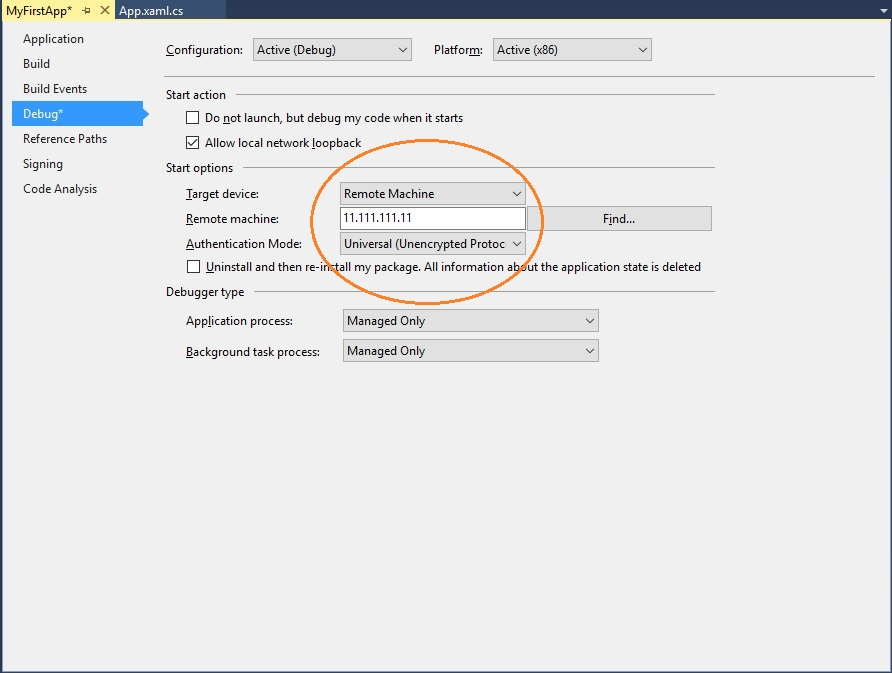

# Xbox の開発環境に UWP を設定する

Xbox の開発環境のユニバーサル Windows プラットフォーム (UWP) は、ローカル ネットワークを介して Xbox One コンソールに接続されている開発用 PC で構成されます。
開発用 PC には、Windows 10、Visual Studio 2017 または Visual Studio 2015 Update 3、Windows 10 SDK ビルド 14393 以降などの幅広いサポート ツールが必要です。

この記事では、開発環境を設定およびテストする手順について説明します。

## Visual Studio のセットアップ

1. Visual Studio 2017、Visual Studio 2015 Update 3、または Visual Studio の最新リリースをインストールします。 詳しい情報とインストール方法については、「[Windows 10 のダウンロードとツール](https://dev.windows.com/downloads)」をご覧ください。 開発者とセキュリティの最新の更新プログラムを受信できるように、最新バージョンの Visual Studio を使用することをお勧めします。

2. Visual Studio 2017 をインストールする場合、必ず**ユニバーサル Windows プラットフォーム開発**ワークロードを選択してください。 C++ 開発者の場合、必ず **[ユニバーサル Windows プラットフォーム開発]** の右側にある **[概要]** ウィンドウで **[C++ ユニバーサル Windows プラットフォーム ツール]** チェック ボックスもオンにしてください。 既定のインストールの一部ではありません。

    

    Visual Studio 2015 Update 3 をインストールするときは、**[ユニバーサル Windows アプリ開発ツール]** チェック ボックスがオンになっていることを確認します。

    

## Windows 10 SDK のセットアップ

最新の Windows 10 SDK をインストールします。 これは、Visual Studio のインストールに付属していますが、別個にダウンロードする場合は「[Windows 10 SDK](https://developer.microsoft.com/windows/downloads/windows-10-sdk)」をご覧ください。

## 開発者モードを有効にする

開発用 PC からアプリを展開する前に、開発者モードを有効にする必要があります。 **設定**アプリで **[更新とセキュリティ]** / **[開発者向け]** に移動し、**[開発者向け機能を使う]** で **[開発者モード]** を選びます。

## Xbox One の設定

Xbox One にアプリを展開する前に、ユーザーがコンソールにサインインする必要があります。 既存の Xbox Live アカウントを使用することも、開発者モードで本体の新しいアカウントを作成することもできます。 

## 初めてのアプリの作成

1. 開発用 PC がターゲットの Xbox One 本体と同じローカル ネットワーク上にあることを確認します。 通常、これらは同じルーターを使用し、同じサブネット上にある必要があります。 ワイヤード (有線) ネットワーク接続をお勧めします。

2. Xbox One 本体が開発者モードになっていることを確認します。  詳しくは、「[Xbox One の開発者モードのアクティブ化](devkit-activation.md)」をご覧ください。

3. UWP アプリに使用するプログラミング言語を決定します。

4. 開発用 PC の Visual Studio で、**[新規]/[プロジェクト]** を選びます。

5. **[新しいプロジェクト]** ウィンドウで、**[Windows ユニバーサル]/[空のアプリ (Windows ユニバーサル)]** を選びます。

### C# プロジェクトの開始

  ![[新しいプロジェクト] ダイアログ ボックス](images/development-environment-setup-2.png)

1. **[新しいユニバーサル Windows プロジェクト]** ダイアログ ボックスの **[最小バージョン]** ドロップダウンでビルド 14393 以降を選びます。 **[ターゲット バージョン]** ドロップダウン リストで最新の SDK を選びます。 **[開発者モード]** ダイアログ ボックスが表示されたら、**[OK]** をクリックします。 新しい空のアプリが作成されます。

2. リモート デバッグの開発環境を構成します。

    a. **[ソリューション エクスプローラー]** でプロジェクトを右クリックし、**[プロパティ]** を選びます。

    b. **[デバッグ]** タブで、**[プラットフォーム]** を **[x64]** に変更します  (x86 プラットフォームは Xbox ではサポートされなくなりました)。

    c. **[起動オプション]** で、**[ターゲット デバイス]** を **[リモート コンピューター]** に変更します。

    d. **[リモート コンピューター]** で、システムの IP アドレスまたは Xbox One 本体のホスト名を入力します。 IP アドレスまたはホスト名の取得について詳しくは、「[Xbox One ツールの概要](introduction-to-xbox-tools.md)」をご覧ください。

    e. **[認証モード]** ドロップダウン リストで、**[ユニバーサル (暗号化されていないプロトコル)]** をクリックします。

    

### C++ プロジェクトの開始

  

1. **[新しいユニバーサル Windows プロジェクト]** ダイアログ ボックスの **[最小バージョン]** ドロップダウンでビルド 14393 以降を選びます。 **[ターゲット バージョン]** ドロップダウン リストで最新の SDK を選びます。 **[開発者モード]** ダイアログ ボックスが表示されたら、**[OK]** をクリックします。 新しい空のアプリが作成されます。

2. リモート デバッグの開発環境を構成します。

   a. **[ソリューション エクスプローラー]** でプロジェクトを右クリックし、**[プロパティ]** を選びます。

   b. **[デバッグ]** タブで、**[起動するデバッガー]** を **[リモート コンピューター]** に変更します。

   c. **[コンピューター名]** で、システムの IP アドレスまたは Xbox One 本体のホスト名を入力します。 IP アドレスまたはホスト名の取得について詳しくは、「[Xbox One ツールの概要](introduction-to-xbox-tools.md)」をご覧ください。

   d. **[認証の種類]** ドロップダウン リストで、**[ユニバーサル (暗号化されていないプロトコル)]** をクリックします。

   e. **[プラットフォーム]** ドロップダウンで、**[x64]** を選びます。

    

### PIN を使用してデバイスと Visual Studio をペアリングする

1. 設定を保存し、Xbox One 本体が開発者モードになっていることを確認します。

2. Visual Studio でプロジェクトを開いたまま F5 キーを押します。

3. 初めて展開する場合、Visual Studio に PIN を使用してデバイスとペアリングすることを求めるダイアログ ボックスが表示されます。

    a. PIN を取得するには、Xbox One 本体のホーム画面から **[Dev Home]** を開きます。

    b. **[ホーム]** タブの **[クイック アクション]** で、**[Visual Studio PIN の表示]** を選びます。
  
    ![[Pair with Visual Studio] ダイアログ ボックス](images/development-environment-setup-5.png)

    c. **[Pair with Visual Studio]** ダイアログ ボックスに PIN を入力します。 次の PIN は単なる例であり、実際のものとは異なります。

    ![[Pair with Visual Studio PIN] ダイアログ ボックス](images/devhome_pin.png)

    d. 展開エラーが発生した場合、**[出力]** ウィンドウに表示されます。

これで、Xbox に初めての UWP アプリが正しく作成および展開されました。

## 参照
- [Xbox One 開発者モードのアクティブ化](devkit-activation.md)  
- [Windows 10 用のダウンロードとツール](https://dev.windows.com/downloads)  
- [Windows Insider Program](http://go.microsoft.com/fwlink/?LinkId=780552)  
- [Xbox One ツールの概要](introduction-to-xbox-tools.md) 
- [Xbox One の UWP](index.md)