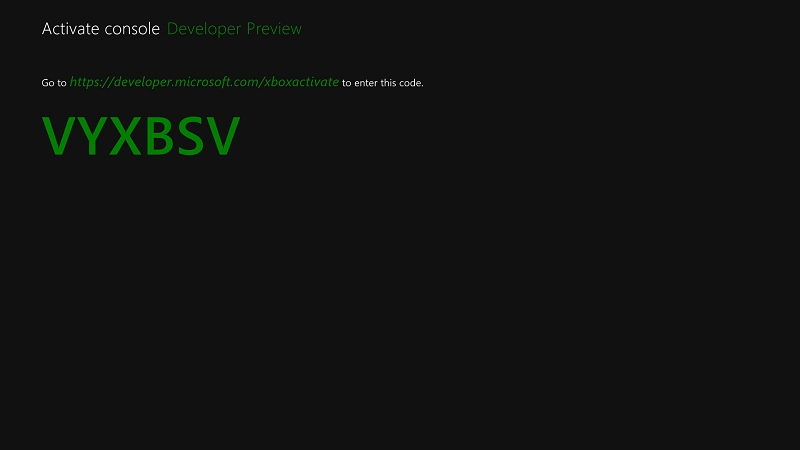
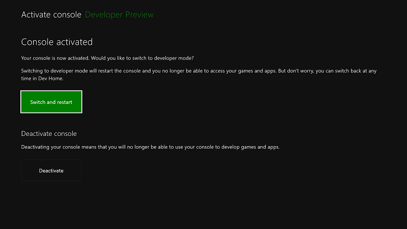

# Xbox One 開発者モードのアクティブ化Xbox One Developer Mode activation

## 開発者モードの動作How Developer Mode works
Xbox One には、*リテール* モード (**1**) と*開発者*モード (**2**) の 2 つのモードがあります。Xbox One has two modes, *Retail* Mode (**1**) and *Developer* Mode (**2**). リテール モードは、Xbox One 本体のユーザーが本体を使うときのモードです。ユーザーとしてゲームをプレイしたり、アプリを実行したりできます。In Retail Mode, the console is in the state that any customer or user of an Xbox One console would use: you can play games and run apps as a user. 開発者モードでは、本体用のソフトウェアを開発することができますが、製品版のゲームをプレイしたり、製品版のアプリを実行したりすることはできません。In Developer Mode, you can develop software for the console, but you cannot play retail games or run retail apps.

開発者モードは、製品版のすべての Xbox One 本体で有効にできます。Developer Mode can be enabled on any retail Xbox One console. 開発者モードを有効にした後は、リテール モード (**2a**) と開発者モード (**2b**) を相互に切り替えることができます。After Developer Mode is enabled, you can switch back and forth between Retail (**2a**) and Developer Modes (**2b**).

## 製品版の Xbox One 本体で開発者モードをアクティブにするActivate Developer Mode on your retail Xbox One console

1.  Xbox One 本体を起動します。Start your Xbox One console.

2.  Xbox One Store から、**開発者モードのアクティブ化**用アプリを検索してインストールします。Search for and install the **Dev Mode Activation** app from the Xbox One store.

    

3.  Microsoft Store ページからアプリを起動します。Launch the app from the Store page.

    

4.  開発者モードのアクティブ化用アプリに表示されたコードを書き留めます。Note the code displayed in the Dev Mode Activation app.

      
    
5.  [Partner.microsoft.com/xboxactivate](https://partner.microsoft.com/xboxactivate)に移動します。Go to [partner.microsoft.com/xboxactivate](https://partner.microsoft.com/xboxactivate).

6.  アカウントの資格情報を[パートナー センター](https://partner.microsoft.com/dashboard)にサインインします。Sign in to [Partner Center](https://partner.microsoft.com/dashboard) with your account credentials.

7.  開発者モードのアクティブ化用アプリに表示されたアクティブ化コードを入力します。Enter the activation code displayed in the Dev Mode Activation app. アカウントに関連付けられているアクティブ化の数には制限があります。You have a limited number of activations associated with your account. 開発者モードをアクティブ化後、パートナー センターは、アカウントに関連付けられているライセンス認証のいずれかを使用したを示します。After Developer Mode has been activated, Partner Center will indicate you have used one of the activations associated with your account.

        
    
8.  **[Agree and activate]** (同意してアクティブ化) をクリックします。Click **Agree and activate**. ページの再読み込みが行われ、デバイスが表に追加されます。This will cause the page to reload, and you will see your device populate in the table. Xbox One 開発者モードのライセンス認証プログラム契約は、[Xbox One開発者モードのライセンス認証プログラム](http://go.microsoft.com/fwlink/p/?LinkId=760399) にあります。Terms for the Xbox One Developer Mode Activation Program agreement can be found at [Xbox One Developer Mode Activation Program](http://go.microsoft.com/fwlink/p/?LinkId=760399).

9.  アクティブ化コードを入力すると、アクティブ化プロセスの進行状況が表示されます。After you’ve entered your activation code, your console will display a progress screen for the activation process.  
    
10. アクティブ化の完了後、開発者モードのアクティブ化用アプリを開き、**[Switch and restart]** (切り替えて再起動) をクリックして、開発者モードに移行します。After activation has completed, open the Dev Mode Activation app and click **Switch and restart** to go to Developer Mode. これは通常の再起動よりも時間がかかります。Note that this will take longer than usual.

       

## リテール モードと開発者モードを切り替えるSwitch between Retail and Developer Mode
本体で開発者モードを有効にした後、リテール モードと開発者モードを切り替えるには、**Dev Home** を使います。After Developer Mode has been enabled on your console, use **Dev Home** to switch between Retail Mode and Developer Mode. Dev Home の起動と使用の詳細については、「[Xbox One ツールの概要](introduction-to-xbox-tools.md)」を参照してください。To learn more about starting and using Dev Home, see [Introduction to Xbox One tools](introduction-to-xbox-tools.md).

* リテール モードに切り替えるには、**Dev Home** を開きます。To switch to Retail Mode, open **Dev Home**. **[クイック アクション]** で、**[開発者モードの終了]** を選択します。Under **Quick Actions**, select **Leave Dev Mode**. コンソールがリテール モードで再起動します。This will restart your console in Retail Mode.    

    
  
* 開発者モードに切り替えるには、開発者モードのアクティブ化用アプリを使います。To switch to Developer Mode, use the Dev Mode Activation app. アプリを開き、**[Switch and restart]** (切り替えて再起動) を選びます。Open the app and select **Switch and restart**. これにより、本体が開発者モードで再起動します。This will restart your console in Developer Mode.  

    

## 参照See also
- [Xbox One 開発者モードの非アクティブ化Xbox One Developer Mode deactivation](devkit-deactivation.md)
- [Xbox One の UWPUWP on Xbox One](index.md)
