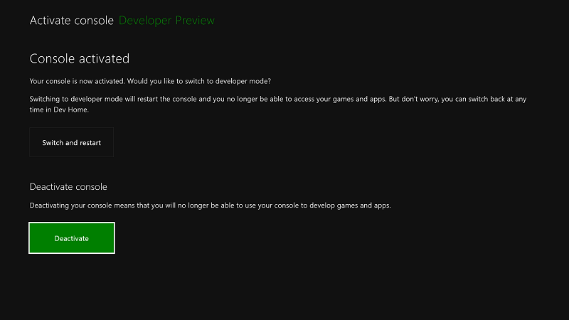

# Xbox One 開発者モードの非アクティブ化Xbox One Developer Mode deactivation

本体を開発用に使うことをやめる場合は、以下の手順を使って開発者モードを非アクティブ化します。If you decide you no longer want to use your console for development, use the following steps to deactivate Developer Mode.

## リテール モードに切り替えるSwitch to Retail Mode

まず、Xbox One 本体をリテール モードに戻します。First, return your Xbox One console to Retail Mode.

1. **Dev Home** を開きます。Open **Dev Home**.

2. **[開発者モードの終了]** を選びます。Select **Leave Dev Mode**.  本体がリテール モードで再起動します。Your console will restart in Retail Mode.  

   

次のいずれかの方法を使って本体を非アクティブ化します。Now deactivate your console by using one of the following methods.

## 開発者モードのアクティブ化用アプリを使って本体を非アクティブ化するDeactivate your console using the Dev Mode Activation app

本体の開発者モードを非アクティブ化するための推奨される方法は、**開発者モードのアクティブ化**用アプリを使うことです。The preferred method of deactivating Developer Mode on your console is to use the **Dev Mode Activation** app. 

1. **[ゲームとアプリ]** > **[アプリ]** に移動します。Navigate to **Games & apps** > **Apps**.
  
       
   
2.  開発者モードのアクティブ化用アプリを開きます。Open the Dev Mode Activation app.

3.  **[非アクティブ化]** を選びます。Select **Deactivate**.
  
    

**開発者モードのアクティブ化**用アプリについて詳しくは、「[Xbox One 開発者モードのアクティブ化](devkit-activation.md)」をご覧ください。See [Xbox One Developer Mode activation](devkit-activation.md) for more information about the **Dev Mode Activation** app. 

## 本体をリセットするReset your console

開発者モードを非アクティブ化するには、本体をリセットする方法を使うこともできます。You can also deactivate Developer Mode by resetting your console.  

> [!NOTE]
> 本体をリセットすると、ローカルに保存されているゲーム データはすべて失われます。When you reset your console, all local save game data will be lost.

本体をリセットするには、次の手順を実行します。To reset your console perform the following steps:

1.  **[マイ コレクション]** に移動します。Go to **My games & apps**.

2.  **[アプリ]** を選択し、**[設定]** を選択します。Select **Apps**, and then select **Settings**.

3.  左ペインの **[システム]** に移動し、右ペインの **[本体の情報]** を選択します。Go to **System** in the left pane, and then select **Console info** in the right pane.   
   
      
    
4.  **[本体のリセット]** を選択します。Select **Reset console**.
    
    
    
5.  次に、**[Reset and remove everything]** (すべてを削除してリセット) を選びます。Next, select **Reset and remove everything**. このオプションは、本体をリセットして元の製品版の状態にします。This option resets the console to its original retail state.  アプリ、ゲーム、ローカルに保存されたデータはすべて削除されます。All of your apps, games, and local save data will be deleted. もう 1 つのオプションである **[Reset and keep my games & apps]** (ゲームとアプリを保持してリセット) を選んだ場合、本体は開発者プログラムから削除されません。Note that choosing the other option, **Reset and keep my games & apps**, will not remove your console from the developer program.  
   
    

## Windows デベロッパー センターを使って本体を非アクティブ化するDeactivate your console using Windows Dev Center

何らかの理由で本体にアクセスできない場合は、Windows デベロッパー センターを使って本体の開発者モードを非アクティブ化できます。If you are unable to access your console for any reason, you can also deactivate Developer Mode on your console by using Windows Dev Center.

1. デベロッパー センターにある [Xbox One 本体の管理](https://partner.microsoft.com/xboxdevices)についてのページに移動します。Navigate to the [Manage Xbox One consoles](https://partner.microsoft.com/xboxdevices) page in Dev Center. デベロッパー センター アカウントへのサインインを求められることがあります。You may be prompted to sign in with your Dev Center account.

2. 本体の一覧で、シリアル番号、本体の ID、またはデバイス ID を照らし合わせて、非アクティブ化する本体を見つけます。Find the console that you want to deactivate in the list of consoles by matching the serial number, console ID, or the device ID.  

3. **[Deactivate]** (非アクティブ化) をクリックします。Click **Deactivate**.  
  

事前に Xbox One 本体をリテール モードに戻していない場合は、「[リテール モードに切り替える](#switch-to-retail-mode)」の説明に従ってここで戻してください。If you didn't previously return your Xbox One console to Retail Mode, do so now, as described in [Switch to Retail Mode](#switch-to-retail-mode).

## 関連項目See also
- [Xbox One 開発者モードのアクティブ化Xbox One Developer Mode activation](devkit-activation.md)
- [Xbox One の UWPUWP on Xbox One](index.md)
