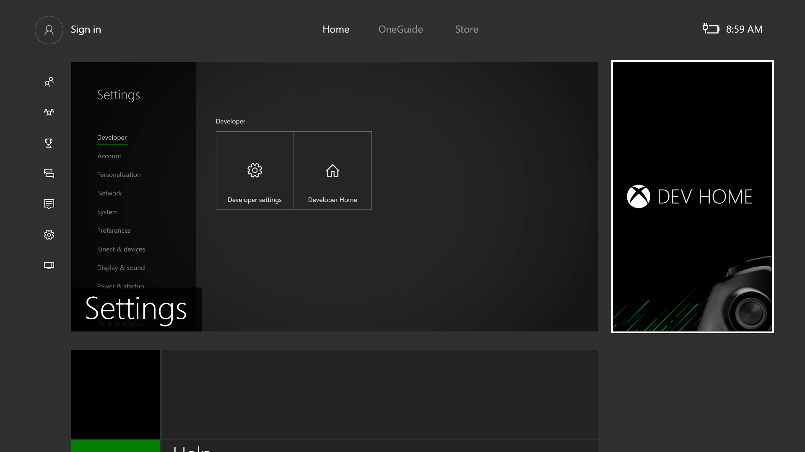
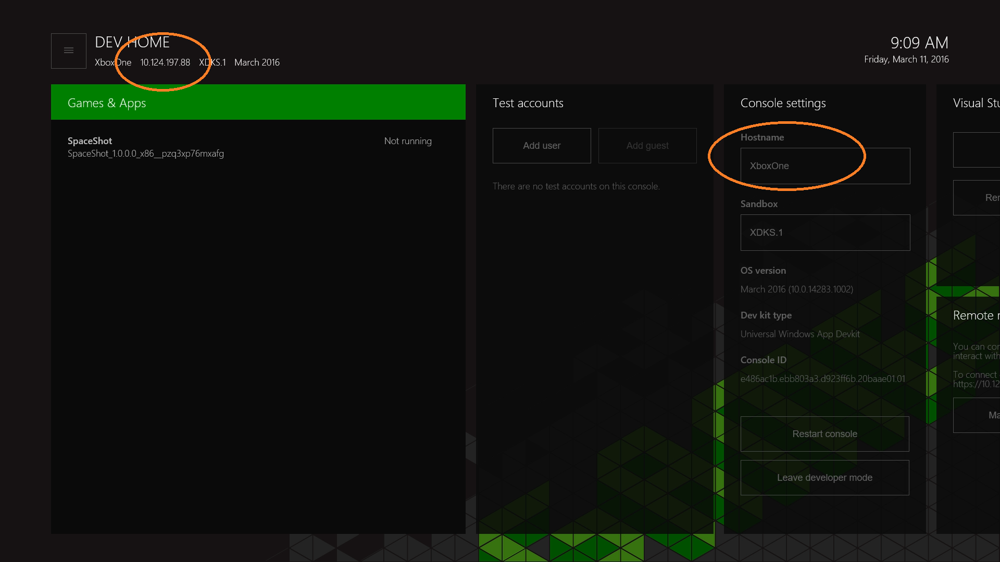
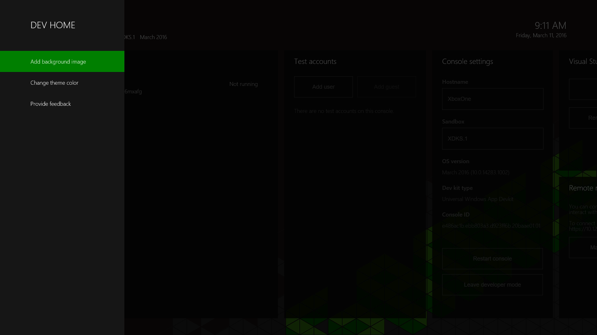
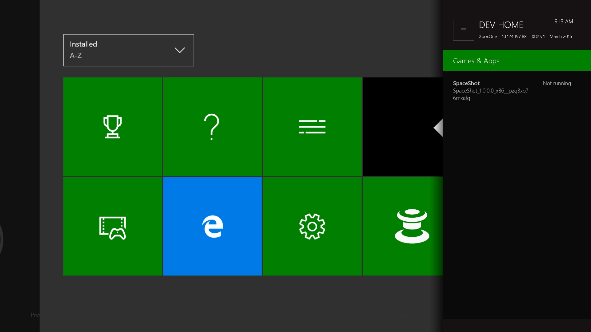
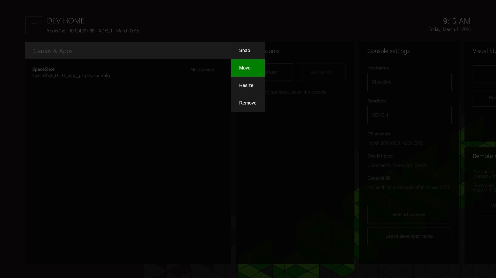
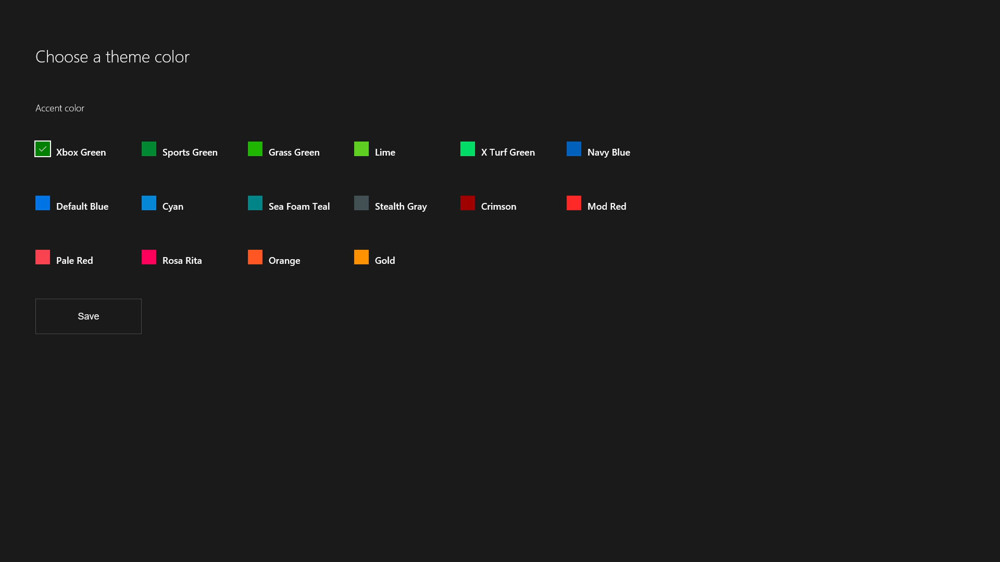
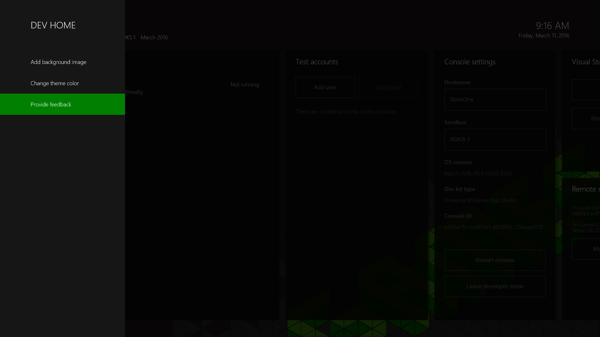
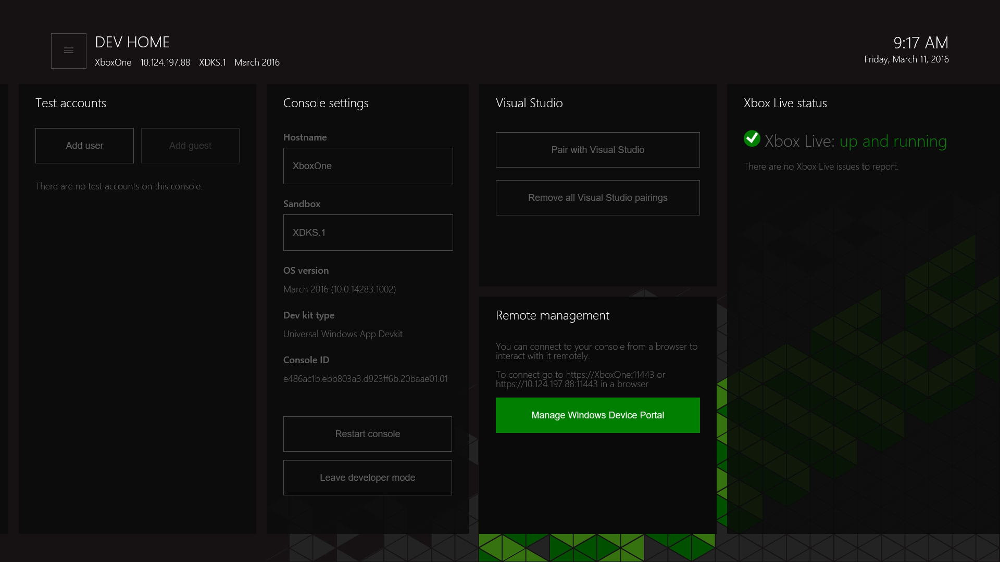

# Xbox One ツールの概要

このセクションでは、Windows Device Portal を使った、Xbox One 固有のツールである _Dev Home_ について説明します。

## Dev Home

_Dev Home_ は、Xbox One 開発キットに含まれ、開発者の生産性をサポートするための 1 つのツール エクスペリエンスです。 Dev Home は、開発キットの管理と構成の機能を提供します。

Dev Home を開くには、ホーム画面の **[Dev Home]** タイルを選択します。 タイルが表示されていない場合は、コンソールが開発者モードに設定されていません。

  

### ユーザー インターフェイス
Dev Home のユーザー インターフェイスは、次のセクションで説明する領域に分割されます。 コンソールの IP アドレスとフレンドリ名がここに表示されます。

  

#### ヘッダー
ヘッダーには、開発キットについての重要な "概要" 情報が含まれています。 これには、コンソール名、IP アドレス、Xbox Live サンド ボックス、実行されているオペレーティング システムのバージョンが含まれます。 ヘッダーの右側に、現在のシステム時刻と日付が表示されます。

#### ツール ウィンドウ
ヘッダーの下のアプリのメイン領域には、構成可能なツールのウィンドウのセットが含まれています。 これらを使って、開発者はさまざまなツールや情報セットにアクセスして、アプリをカスタマイズできます。 ツールについて詳しくは、次の各ツールの説明をご覧ください。 ツール ウィンドウのレイアウトと外観を構成する方法について詳しくは、このページの「[Dev Home のカスタマイズ](#customizing-dev-home)」のセクションをご覧ください。

##### メイン メニュー
コントローラーの **[メニュー]** ボタンを押すか、または画面の左上のメニュー (「ハンバーガー」) ボタンをクリックすると、メイン メニューにアクセスできます。ここでは、アプリのワークスペースのテーマの色と背景画像を構成したり、アプリのフィードバックを提供できます。

  

#### スナップ モード
Dev Home のツールは、タイトルの実行中に、端にスナップできます。これにより、テスト中にツールに容易にアクセスできます。

**スナップ** モードにアクセスするには、適切なツールのタイトルを選択して、コントローラーの **[ビュー]** ボタンを押し、コンテキスト メニューで **[スナップ]** を選択します。

  

Dev Home は右にスナップします。 通常どおり **[連結]** ボタンをダブル タップすると、コンテキストを切り替えることができます。

  

##### ツールの説明
| ツール  | 機能 |
|-------|--------------|
| アプリ+ゲーム  | 開発キットにインストールされているタイトルとアプリの一覧を表示し、それらをすばやく開くことができます。 ゲームやアプリのプロセス ライフタイム管理 (PLM) の状態を表示し、コンテキスト メニューから PLM 状態を変更することもできます。 |
| ユーザー | コンソールに現在登録されているユーザーの一覧を表示します。 ユーザーのワン クリック サインインやサインアウトを有効化したり、ユーザーやゲストを追加したり、ユーザーやゲストの詳細を表示できます。 |
| [コンソールの設定](#console-settings) | "概要" ビューおよびコンソールの設定と情報の編集オプションを提供します。 |
| Visual Studio | 展開のために、コンソールを Visual Studio のインスタンスにペアリングできます。 必要に応じて、ペアリングされた既存の VS インスタンスをクリアして、UWP アプリがキットに展開されないようにできます。 |
| [Windows Device Portal](#windows-device-portal) | キットの WDP (ブラウザー ベースのデバイス管理ツール) を有効にします。 |
| Xbox Live の状態 | Xbox Live サービスの現在の状態を提供します。 |

### 開発者向け記憶域のサイズの割り当てを管理する

開発者向け記憶域として使用されるディスク領域の容量を増やしたり減らしたりするには、メイン メニューの **[Manage dev storage]** (開発者向け記憶域の管理) を選んでください。 **[Dev storage]** (開発者向け記憶域) バーの値を変更してから、**[保存して再起動]** を選んで、コンソールを再起動します。
  

### Dev Home のカスタマイズ

Dev Home は、カスタマイズして個人用に設定できるように設計されています。 背景画像とテーマの色を選んで、Dev Home のエクスペリエンスをカスタマイズできます。 これらのオプションは、メイン メニューに表示されます。

#### サイズの変更とツールの並べ替え
ツールのサイズや位置を変更するには、タイトルにフォーカスがあるときに、コンテキスト メニュー ボタン (コントローラー上の **[ビュー]** ボタン) を使用します。 コンテキスト メニューで **[移動]** または **[サイズ変更] ** を選択します。

  

#### テーマの色と背景画像の変更
メイン メニューで、**[テーマの色の変更]** を選択します。 フォーカスが強調表示されたテーマの色を更新するには、新しい色を選択して、**[保存]** をクリックします。

  

### フィードバックの提供
Dev Home またはいずれかのツールのプロセスでフィードバックを提供するには、メイン メニューの **[フィードバック]** オプションを選択します。

  

## コンソールの設定
コンソールの設定ツールでは、開発キットの設定に簡単にアクセスできます。

### コンソールのホスト名の設定
開発用 PC からコンソールに通信している場合は、Xbox One 開発キットにフレンドリ名 (_ホスト名_と呼ばれます) を設定して、コンソールの IP アドレスの代わりに使用できます。 開発用 PC と開発キットは、ホスト名への接続と同じサブネット上にある必要があります。  

開発キットのホスト名を定義するには、コンソール設定ツールに移動して、__[ホスト名]__ ボックスにホスト名を入力します。  

  > **注**
            &nbsp;&nbsp;ホスト名の作成時に名前の一意性は強制されません。 名前が重複しないように注意する必要があります。 1 つの方法としては、開発用コンピューターの名前からホスト名を取得することにより、通常は組織内で一意となります。

## Windows Device Portal
Windows Device Portal (WDP) は、ブラウザー ベースのデバイス管理エクスペリエンスを実現する、OneCore デバイス管理ツールです。

Xbox One コンソールで WDP を有効にするには、次を実行します。

1. ホーム画面で、Dev Home タイルを選びます。

  

2. Dev Home 内で **[リモート管理]** ツールに移動します。

  

3. __[Windows Device Portal の管理]__ を選択し、__[A]__ を押します。
4. __[Windows Device Portal を有効にする]__ のチェックボックスをオンにします。
5. __[ユーザー名]__ と __[パスワード]__ を入力して、保存します。 これはブラウザーから開発キットへのアクセスの認証に使用されます。
6. __[設定]__ ページを閉じ、_[リモート管理]_ ツールに表示された接続 URL を記録します。
7. その URL をブラウザーに入力し、構成した資格情報でサインインします。
8. 提供された証明書についての、次のスクリーン ショットのような警告が表示されます。これは、Xbox One コンソールによって署名されたセキュリティ証明書が、既知の信頼された発行元とは見なされないためです。 **[このサイトの閲覧を続行する]** をクリックして、Windows Device Portal にアクセスします。

  

## 参照
- [Microsoft 開発者テクノロジ: Windows Device Portal](https://msdn.microsoft.com/en-us/windows/uwp/debug-test-perf/device-portal-xbox)
- [Xbox One の UWP](index.md)

----

<!--HONumber=Jun16_HO4-->

