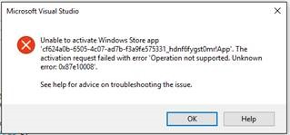

# Xbox Developer Preview の UWP の既知の問題

このトピックでは、Xbox Developer Preview の UWP の既知の問題について説明します。 この開発者プレビューについて詳しくは、「[Xbox One の UWP](index.md)」をご覧ください。 

\[API リファレンス トピックのリンクからこのページを見つけた、ユニバーサル デバイス ファミリの API の情報を探している方は、「[Xbox でまだサポートされていない UWP 機能](http://go.microsoft.com/fwlink/?LinkID=760755)」をご覧ください。\]

Xbox Developer Preview のシステム更新プログラムには、実験的な初期プレリリース版のソフトウェアが含まれています。 このため、一部の人気ゲームやアプリが想定どおりに動作しなかったり、クラッシュやデータの損失が発生する可能性があります。 開発者プレビューへの参加を終了する場合は、本体を出荷時の設定にリセットするため、ゲーム、アプリ、コンテンツをすべて再インストールする必要があります。

つまり、すべての開発者ツールと API が開発者の期待どおりに機能するわけではありません。 また、最終リリース向けのすべての機能が含まれているわけでも、リリース品質に到達しているわけでもありません。 
**特に、このプレビューのシステム パフォーマンスは、最終リリースのシステム パフォーマンスを反映していません。**

以降に、このリリースで発生する可能性のある既知の問題を示していますが、すべての問題は網羅されていません。 


              **お客様からのフィードバックは重要ですので**、問題が見つかりましたら[ユニバーサル Windows アプリの開発](https://social.msdn.microsoft.com/Forums/windowsapps/en-US/home?forum=wpdevelop)フォーラムでご報告ください。 

行き詰まった場合は、このトピックの情報をお読みください。「[よく寄せられる質問](frequently-asked-questions.md)」を利用することも、フォーラムに質問を投稿することもできます。


<!--## Developing games-->

## マウス モードのサポート

このプレビュー以降では、XAML とホストされた Web アプリの両方で、_マウス モード_が既定で有効になっています。 この既定の設定を無効にしていないすべてのアプリケーションは、Xbox の Microsoft Edge ブラウザーの場合と同様に、マウス ポインターを受け入れます。

**開発者はマウス モードを無効にして、コントローラー (X-Y) ナビゲーション向けに最適化することを強くお勧めします。**

XAML でマウス モードを無効にするには、次の例に従ってください。

```code
public App() {
    this.InitializeComponent();
    this.RequiresPointerMode = Windows.UI.Xaml.ApplicationRequiresPointerMode.WhenRequested;
    this.Suspending += OnSuspending;
}
```

HTML/JavaScript アプリでマウス モードを無効にするには、次の例に従ってください。

```code
// Turn off mouse mode
navigator.gamepadInputEmulation = "keyboard";
```

HTML/JavaScript アプリで方向ナビゲーションを有効にする方法などについて詳しくは、「[マウス モードを無効にする方法](how-to-disable-mouse-mode.md#html)」をご覧ください。

> 
              **注**&nbsp;&nbsp;この開発者プレビューでは、マウス モードが有効になっているときにコントローラーの右ジョイスティックを使用してパンすると、本体の停止の原因となる可能性があります。 この問題が発生した場合は、本体を再起動する必要があります。

マウス モードのサポートについては、「[Xbox およびテレビ向け設計](https://msdn.microsoft.com/windows/uwp/input-and-devices/designing-for-tv?f=255&MSPPError=-2147217396#mouse-mode)」のトピックをご覧ください。 このトピックでは、アプリの適切な動作を選ぶことができるようにマウス モードを有効および無効にする方法ついて説明します。

## アプリを展開するために、ユーザーをサインインさせる必要があります (エラー 0x87e10008)

アプリでは、ユーザーはアプリを起動する前にログインする必要があります (VS 2015 でデバッグを開始 (F5) できるようにするには、ユーザーをログインさせる必要があります)。Visual Studio から受け取ったこのエラー メッセージは、直感的には理解できません。
 

 
この問題を回避するには、アプリを展開する前に、Xbox シェルまたは DevHome からユーザーの情報を使用してサインインします。
 
## バックグラウンド アプリのメモリ制限がまだ適用されていません
 
バックグラウンドで実行されているアプリに対する 128 MB の制限が、このプレビューでは適用されていません。 つまり、アプリがバックグラウンドで実行されているときに 128 MB を超過しても、引き続きメモリを割り当てることができます。
 
現時点では、この問題に対する回避策はありません。 状況に応じてメモリ使用量を制御する必要があります。将来のプレビューでは、アプリが 128 MB の制限を超えた場合に、メモリの割り当てエラーをアプリで受け取るようになります。
 
## [保護者による制限] を有効にしたことにより VS からの展開に失敗しました

本体で [設定] の [保護者による制限] を有効にした場合、VS からのアプリの起動が失敗します。

この問題を回避するには、[保護者による制限] を一時的に無効にするか、次の操作を行います。
1. [保護者による制限] を無効にして、本体にアプリを展開します。
2. [保護者による制限] 有効にします。
3. 本体からアプリを起動します。
4. アプリを起動できるように、PIN またはパスワードを入力します。
5. アプリが起動します。
6. アプリを閉じます。
7. F5 キーを使用して VS から起動すると、プロンプトを表示せずにアプリが起動します。

この時点では、アプリのアンインストールと再インストールを行っても、ユーザーをサインアウトさせるまで、アクセス許可は_固定_されます。
 
お子様のアカウントのみで利用できる、不適切なコンテンツの除外方法もあります。 お子様のアカウントでは、保護者がサインインしてアクセス許可を付与する必要がありますが、アクセス許可を付与するときに、保護者は、お子様によるアプリの起動を**常に許可**するように選ぶこともできます。 このような除外の情報はクラウドに保存され、お子様がサインアウトして、もう一度サインインした場合でも、維持されます。   

<!--### x86 vs. x64

By the time we release later this year, we will have great support for both x86 and x64, and we do support x86 in this preview. 
However, x64 has had much more testing to date (the Xbox shell and all of the apps running on the console today are x64), and so we recommend using x64 for your projects. 
This is particularly true for games.

If you decide to use x86, please report any issues you see on the forum.

Also see [Switching build flavors can cause deployment failures](known-issues.md#switching-build-flavors-can-cause-deployment-failures) later on this page.-->

<!--### Game engines

We have tested some popular game engines, but not all of them, and our test coverage for this preview has not been comprehensive. 
Your mileage may vary. 

The following game engines have been confirmed to work:
* [Construct 2](https://www.scirra.com/)

There are likely others that are working too. We would love to get your feedback on what you find. 
Please use the forum to report any issues you see.-->

## DirectX 12 のサポート

Xbox One の UWP は、DirectX 11 の機能レベル 10 をサポートしています。 現時点では DirectX 12 はサポートされていません。 Xbox One は、従来のすべてのゲーム コンソールと同じように、その潜在的な機能を最大限に利用するために特定の SDK を必要とする特殊なハードウェアです。 Xbox One のハードウェアの機能を最大限に利用する必要があるゲームを開発している場合、[ID@XBOX](http://www.xbox.com/Developers/id) プログラムに登録することで、DirectX 12 のサポートを含む SDK にアクセスできます。

<!-- ### Xbox One Developer Preview disables game streaming to Windows 10

Activating the Xbox One Developer Preview on your console will prevent you from streaming games from your Xbox One to the Xbox app on Windows 10, even if your console is set to retail mode. 
To restore the game streaming feature, you must leave the developer preview. -->

## テレビのセーフ エリアに関する既知の問題

既定では、Xbox 上の UWP アプリの表示領域は、テレビのセーフ エリアによって挿入される必要があります。 ただし、Xbox One Developer Preview には、テレビのセーフ エリアが [_offset_, _offset_] ではなく [0, 0] で開始されるという既知のバグがあります。

> 
              **注**&nbsp;&nbsp;これは、JavaScript を使用している UWP アプリにのみ該当します。

この問題に対処するための最も簡単な方法として、次の JavaScript の例に示すように、テレビのセーフ エリアを無効にします。

    var applicationView = Windows.UI.ViewManagement.ApplicationView.getForCurrentView();

    applicationView.setDesiredBoundsMode(Windows.UI.ViewManagement.ApplicationViewBoundsMode.useCoreWindow);

テレビのセーフ エリアについて詳しくは、「[Xbox およびテレビ向け設計](https://msdn.microsoft.com/windows/uwp/input-and-devices/designing-for-tv)」をご覧ください。

<!--## System resources for UWP apps and games on Xbox One

UWP apps and games running on Xbox One share resources with the system and other apps, and so the system governs the resources that are available to any one game or app. 
If you are running into memory or performance issues, this may be why. 
For more details, see [System resources for UWP apps and games on Xbox One](system-resource-allocation.md).-->

<!--
## Networking using traditional sockets

In this developer preview, inbound and outbound network access from the console that uses traditional TCP/UDP sockets (WinSock, Windows.Networking.Sockets) is not available. 
Developers can still use HTTP and WebSockets.
--> 


## UWP API カバレッジ

Xbox では、すべての UWP API がサポートされているわけではありません。 動作しないことが確認されている API の一覧については、「[Xbox でまだサポートされていない UWP 機能](http://go.microsoft.com/fwlink/p/?LinkId=760755)」をご覧ください。 他の API に問題が見つかった場合は、フォーラムでご報告ください。 

<!--## XAML controls do not look like or behave like the controls in the Xbox One shell

In this developer preview, the XAML controls are not in their final form. In particular:
* Gamepad X-Y navigation does not work reliably for all controls.
* Controls do not look like controls in the Xbox shell. This includes the control focus rectangle.
* Navigating between controls does not automatically make “navigation sounds.”

These issues will be addressed in a future developer preview.-->

<!--## Visual Studio and deployment issues

### Switching build flavors can cause deployment failures

Switching between Debug and Release builds, or between x86 and x64, or between Managed and .Net Native builds, can cause deployment failures. 

The simplest way to avoid these issues for this preview is to stick to Debug and one architecture. 

If you do hit this issue, uninstalling your app in the Collections app on your Xbox One will typically resolve it.

> ****&nbsp;&nbsp;Uninstalling your app from Windows Device Portal (WDP) will not resolve the issue.

If your issues persist, uninstall your app or game in the Collections app, leave Developer Mode, restart to Retail Mode and then switch back to Developer Mode.
You may also need to restart Visual Studio and clean your solution.

For more information, see the “Fixing deployment failures” section in [Frequently asked questions](frequently-asked-questions.md).

### Uninstalling an app while you are debugging it in Visual Studio will cause it to fail silently

Attempting to uninstall an app that is running under the debugger via the WDP “Installed Apps” tool will cause it to silently fail. 
The workaround is to stop debugging the app in Visual Studio before attempting to remove it via WDP.

### Visual Studio/Xbox PIN pairing failures

It is possible to get into a state where the PIN pairing between Visual Studio and your Xbox One gets out of sync. 
If PIN pairing fails, use the “Remove all pairings” button in Dev Home, restart Xbox One, restart your development PC, and then try again.--> 


## Windows Device Portal (WDP) プレビュー

<!--### Starting WDP from Dev Home crashes Dev Home

When you start WDP in Dev Home, it will cause Dev Home to crash after you have entered your user name and password and selected **Save**. 
The credentials are saved but WDP is not started. 
You can start WDP by restarting Xbox One.--> 

<!--### Disabling WDP in Dev Home does not work

If you disable WDP in Dev Home, it will be turned off. 
However, when you restart your Xbox One, WDP will be started again. 
You can work around this issue by using **Reset and keep my games & apps** to delete any stored state on your Xbox One. 
Go to Settings > System > Console info & updates > Reset console, and then select the **Reset and keep my games & apps** button.

> **Caution**&nbsp;&nbsp;Doing this will delete all saved settings on your Xbox One including wireless settings, user accounts and any game progress that has not been saved to cloud storage.

> **Caution**&nbsp;&nbsp;DO NOT select the **Reset and remove everything** button.
This will delete all of your games, apps, settings and content, deactivate Developer Mode, and remove you console from the Developer Preview group.

### The columns in the “Running Apps” table do not update predictably. 

Sometimes this is resolved by sorting a column on the table.-->

### Internet Explorer 7 で WDP UI が正しく表示されない 

既定では、Internet Explorer 7 を使用している場合、ブラウザーで WDP UI が正しく表示されません。 WDP で Internet Explorer 7 の互換表示をオフにすると、この問題を解決できます。

### WDP に移動すると証明書の警告が表示される

提供された証明書についての、次のスクリーン ショットのような警告が表示されます。これは、Xbox One コンソールによって署名されたセキュリティ証明書が、既知の信頼された発行元とは見なされないためです。 [このサイトの閲覧を続行する] をクリックして、Windows Device Portal にアクセスします。


<!--## Dev Home

Occasionally, selecting the “Manage Windows Device Portal” option in Dev Home will cause Dev Home to silently exit to the Home screen. 
This is caused by a failure in the WDP infrastructure on the console and can be resolved by restarting the console.-->

## 参照
- [よく寄せられる質問](frequently-asked-questions.md)
- [Xbox One の UWP](index.md)


<!--HONumber=Jul16_HO2-->


